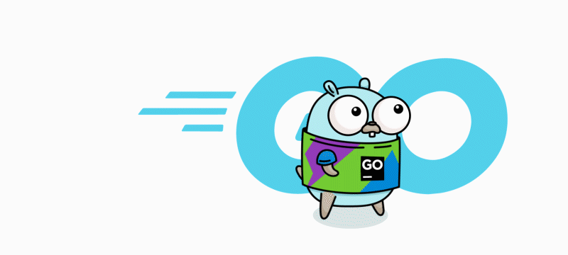

---
<picture>
    
</picture>

- 👋 Hi, 我是 MagicGopher.
- 💻 我目前是一名运维开发工程师.
- 📝 在博客中记录我日常的开发工作.
- 🚀 工作语言选择Go、Java、Python、C++.
- 📫 通过邮件联系我: [gopher997@gmail.com](mailto:gopher997@gmail.com).
---

    
    

## 编程语言

    
    
    
    
    
    
    
    
    

## 后端

    
    
    
    
    
    
    
    
    
    
    
    
    
    
    

## 前端

    
    
    
    
    
    
    
    
    
    
    
    
    
    
    
    

## DevOps

    
    
    
    
    
    
    
    
    
    
    
    
    
    

## 操作系统和常用工具

    
    
    
    
    
    
    
    
    
    
    
    
    
    
    
    
    
    
    
    

## AI

    
    
    
    
    
    
    
    

## 数据库

    
    
    
    
    
    

## 移动端

    
    
    
    

## 社区

    
    
    

## 游戏引擎

    
    

