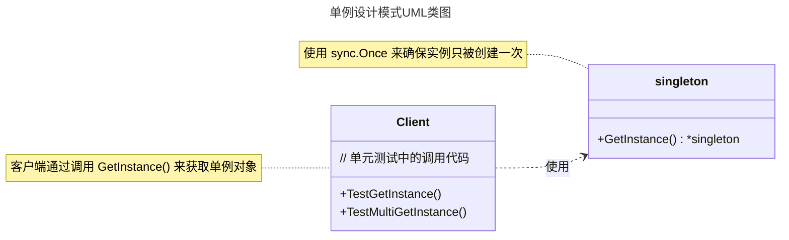

# 单例模式

## 概述

单例模式（Singleton Pattern）是一种创建型设计模式，确保一个类只有一个实例，并提供一个全局访问点。它适用于需要控制资源访问、确保唯一实例的场景，例如日志管理器、数据库连接池或配置文件管理。


## 模式结构

单例模式的主要角色如下：

- **单例类（Singleton）**：包含私有构造函数和静态实例变量的结构体，确保全局只有一个实例存在。在Go中，通过未导出的结构体和导出的获取方法实现。
- **实例变量（Instance Variable）**：存储单例类唯一实例的变量，通常是包级私有变量，在Go中使用小写字母开头的变量名。
- **获取实例方法（GetInstance Method）**：提供全局访问点的导出函数，负责创建（如果不存在）并返回单例实例，通常使用sync.Once确保线程安全。
- **同步控制（Synchronization Control）**：在Go中使用sync.Once或sync.Mutex等同步原语，确保在并发环境下单例实例的创建是线程安全的。
- **客户端（Client）**：通过调用获取实例方法来访问单例对象，无法直接实例化单例类，只能通过提供的全局访问点获取实例。

## 实现

单例模式的UML类图如下所示：



### 无锁实现

下面是不加锁的单例模式实现，代码如下：

```go
package singleton

// 单例设计模式 无锁实现
// 多个 goroutine 获取实例时会有并发安全问题

// singleton指针全局变量
var instance *singleton

// singleton 单例结构体
type singleton struct {
	// 字段...
}

// GetInstance 获取singleton指针实例全局函数
func GetInstance() *singleton {
	if instance == nil {
		instance = &singleton{}
	}
	return instance
}
```

示例说明：

- 这段代码实现了一个不加锁的单例模式，位于 `singleton` 包中。
- 定义了一个 `singleton` 结构体和全局变量 `instance` 指向该结构体的指针，用于存储单例实例。
- `GetInstance()` 函数通过检查 `instance` 是否为 `nil` 来决定是否创建新实例。
- 这种实现方式在多个 `goroutine` 同时调用这个 `GetInstance()` 函数来获取单例实例时会有并发安全问题，需要加锁来解决。

### 加锁实现

通过 `sync.Mutex` 来实现加锁的单例模式，代码如下：

```go
package singleton

import "sync"

// 单粒设计模式 加锁实现
// 解决多个 goroutine 获取单例实例时并发安全问题
// 获取单例实例会有加锁操作，会有损程序性能

// singleton指针全局变量
var instance *singleton

// mutex互斥锁全局变量
var mutex sync.Mutex

// singleton 单例结构体
type singleton struct {
	// 字段...
}

// GetInstance 获取singleton指针实例全局函数
func GetInstance() *singleton {
	mutex.Lock()         // 上锁操作
	defer mutex.Unlock() // 最后释放锁
	if instance == nil {
		instance = &singleton{}
	}
	return instance
}
```

示例说明：

- 这段代码实现了一个不加锁的单例模式，位于 `singleton` 包中。
- 定义了一个 `singleton` 结构体和全局变量 `instance` 指向该结构体的指针，用于存储单例实例，同时使用 `sync.Mutex` 类型的 `mutex` 变量来实现互斥锁。
- `GetInstance()` 函数通过加锁（`mutex.Lock`）和延迟解锁（`defer mutex.Unlock`）确保多 `goroutine` 并发访问时的线程安全，只有当 `instance` 为 `nil` 时才创建新的单例实例。
- 这种写法有个最大的缺点就是每次调用该方法时都需要进行锁操作，在性能上相对不高效。

### 双重检查

创建实例时加锁的单例模式，代码如下：

```go
package singleton

import "sync"

// 单例设计模式 双重检查实现
// 判断实例是否为空，才执行加锁操作

// singleton指针全局变量
var instance *singleton

// mutex互斥锁全局变量
var mutex sync.Mutex

// singleton 单例结构体
type singleton struct {
	// 字段...
}

// GetInstance 获取singleton指针实例全局函数
func GetInstance() *singleton {
	if instance == nil { // 这里 goroutine 同时获取实例还是有并发安全问题
		mutex.Lock()         // 上锁操作
		defer mutex.Unlock() // 最后释放锁
		if instance == nil {
			instance = &singleton{}
		}
	}
	return instance
}
```

示例说明：

- 这段代码尝试实现一个单例模式，位于 `singleton` 包中，但存在并发安全问题。
- 定义了一个 `singleton` 结构体和全局变量 `instance` 指向该结构体的指针，用于存储单例实例，同时使用 `sync.Mutex` 类型的 `mutex` 变量实现互斥锁。
- `GetInstance()` 函数通过检查 `instance == nil` 判断是否需要创建实例，并在加锁（`mutex.Lock`）后直接初始化 `singleton`，使用 `defer mutex.Unlock` 确保解锁。然而，由于缺少第二次检查 `instance == nil`，多个 `goroutine` 可能同时通过第一次检查，导致多次初始化，破坏单例模式的唯一性。

通过双重检查加锁实现的单例模式，代码如下：

```go
package singleton

import "sync"

var (
	instance *singleton // singleton 结构体的指针
	mutex    sync.Mutex // 互斥锁
)

// singleton 是一个单例模式的结构体，用于实现单一实例的对象。
type singleton struct {
	// 字段...
}

// GetInstance 获取单例实例，返回 singleton 结构体的指针
func GetInstance() *singleton {
	if instance == nil { // 第一次检查没有加锁，减少锁的开销
		mutex.Lock() // 加锁
		defer mutex.Unlock() // 最后释放锁
		if instance == nil { // 第二次检查，确保只有一个 goroutine 可以创建实例
			instance = &singleton{}
		}
	}
	return instance
}
```

示例说明：

- 这段代码实现了一个线程安全的单例模式，位于 `singleton` 包中，采用双重检查加锁（`Double-Checked Locking`）机制。
- 定义了一个 `singleton` 结构体和全局变量 `instance` 指向该结构体的指针，用于存储单例实例，同时使用 `sync.Mutex` 类型的 `mutex` 变量实现互斥锁。
- `GetInstance()` 函数通过第一次无锁检查 `instance == nil` 减少已初始化时的锁开销，并在必要时加锁（`mutex.Lock`）并使用 `defer mutex.Unlock` 确保解锁，第二次检查 `instance == nil` 以保证线程安全，仅在实例未创建时初始化 `singleton`，从而确保单一实例和高效并发访问。

### 原子实现

通过 `sync/atomic` 来实现单例模式，代码如下：

```go
package singleton

import (
	"sync"
	"sync/atomic"
)

// 单例设计模式 atomic原子实现
// 原子实现确保在多个 goroutine 同时获取实例时不会产生并发安全问题

// singleton指针全局变量
var instance *singleton

// mutex互斥锁全局变量
var mutex sync.Mutex

// done 标志，用于标记instance实例是否初始化
var done uint32

// singleton 单例结构体
type singleton struct {
	// 字段...
}

// GetInstance 获取singleton指针实例全局函数
func GetInstance() *singleton {
	if atomic.LoadUint32(&done) == 0 {
		mutex.Lock()         // done 标记为0 上锁
		defer mutex.Unlock() // 最后释放锁
		if done == 0 {
			// 初始化实例
			instance = &singleton{}
			// 修改标记done为1
			atomic.StoreUint32(&done, 1)
		}
	}
	return instance
}
```

示例说明：

- `sync/atomic`：提供了原子操作，确保在多个 goroutine 同时获取实例时不会产生并发安全问题。
- `GetInstance`：全局访问点，返回单例实例。

### sync.Once 实现

通过 `sync.Once` 来实现单例模式，代码如下：

```go
package singleton

import (
	"sync"
)

// singleton 是单例模式的结构体
type singleton struct {

}

var (
	instance *singleton // singleton 结构体的指针
	once     sync.Once // 确保 instance 只初始化一次
)

// GetInstance 获取单例实例，返回 singleton 结构体的指针
func GetInstance() *singleton {
	once.Do(func() {
		instance = &singleton{}
	})
	return instance
}
```

示例说明：

- `sync.Once`：确保`instance`只被初始化一次，即使在并发环境下
- `GetInstance`：全局访问点，返回单例实例。

### init函数实现

init函数实现单例模式，代码如下：

```go
package singleton

// singleton 是一个单例模式的结构体，用于实现单一实例的对象。
type singleton struct{

}

// instance 是 singleton 类型的全局变量，用于存储单例实例
var instance *singleton

// init 函数
func init() {
    instance = &singleton{} // 初始化单例
}

// GetInstance 获取单例实例，返回 singleton 结构体的指针
func GetInstance() *singleton {
    return instance
}
```

示例说明：

- 这段代码实现了一个单例模式，位于 `singleton` 包中，使用 `init` 函数来初始化单例实例。
- 定义了一个 `singleton` 结构体和全局变量 `instance` 指向该结构体的指针，用于存储单例实例。
- 在 `init()` 函数中 `instance` 被初始化为 `singleton` 结构体的一个实例，确保包加载时创建单一实例。
- `GetInstance()` 函数直接返回 `instance` 指针，提供全局访问点，无需额外检查或锁机制。

## 使用场景

单例模式适用于以下场景：

- 资源共享：如数据库连接池、线程池，需确保全局唯一实例以避免资源浪费。
- 全局状态管理：如日志管理器、配置管理器，需统一访问点。
- 控制并发访问：如计数器或ID生成器，需确保数据一致性。

示例：日志管理器

```go
package main

import (
	"fmt"
	"sync"
)

// Logger 日志管理器
type Logger struct {
	logLevel string
}

var (
	loggerInstance *Logger // 日志管理器单例
	loggerOnce     sync.Once // 确保日志管理器只被初始化一次
)

// GetLogger 获取日志管理器单例
func GetLogger() *Logger {
	loggerOnce.Do(func() {
		loggerInstance = &Logger{logLevel: "INFO"}
	})
	return loggerInstance
}

// Log 记录日志
func (l *Logger) Log(message string) {
	fmt.Printf("[%s] %s\n", l.logLevel, message)
}

func main() {
	logger1 := GetLogger()
	logger2 := GetLogger()

	logger1.Log("This is a test log")
	logger2.Log("This is another test log")

	fmt.Println(logger1 == logger2) // true，证明是同一实例
}
```

## 优缺点

**优点**

- 控制实例数量：确保全局唯一实例，节省资源。
- 全局访问：提供统一访问点，便于管理。
- 延迟初始化：实例在首次使用时创建，优化性能。

**缺点**

- 全局状态问题：可能导致隐式耦合，难以测试和维护。
- 并发复杂性：需额外处理线程安全问题。
- 单一职责原则冲突：单例类可能承担过多职责。

## 注意事项

- 线程安全：在Go中，推荐使用sync.Once确保初始化安全。
- 测试困难：单例的全局状态可能影响单元测试，建议通过接口解耦。
- 避免滥用：仅在确实需要全局唯一实例时使用，避免不必要的复杂性。

## 参考资料

- [https://lailin.xyz/post/go-design-pattern.html](https://lailin.xyz/post/go-design-pattern.html)
- [https://refactoringguru.cn](https://refactoringguru.cn)