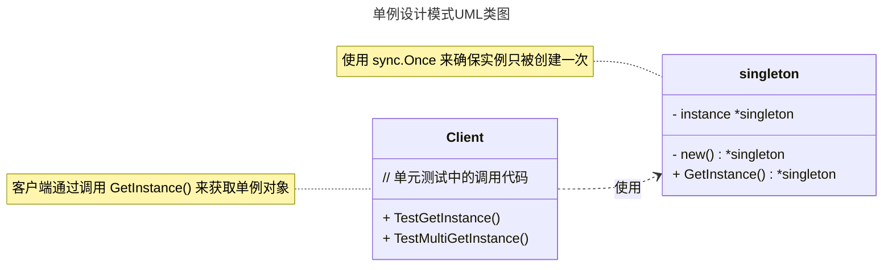

# 单例模式

## 概述

单例模式（Singleton Pattern）是一种创建型设计模式，确保一个类只有一个实例，并提供一个全局访问点。它适用于需要控制资源访问、确保唯一实例的场景，例如日志管理器、数据库连接池、配置文件管理或全局缓存池。


## 模式结构

单例模式的主要角色如下：

- **单例对象（Singleton）**：通过结构体定义单例的结构和数据，通常存储为包级别的变量，确保全局只有一个实例。
- **全局访问点（Global Access Point）**：通过包级别的函数（如 GetInstance）提供对单例对象的访问入口，通常结合 sync.Once 确保线程安全和延迟初始化。
- **客户端（Client）**：通过调用全局访问点获取单例对象并使用其功能，通常是主程序或其他调用单例的代码。

## 实现

单例模式的UML类图如下所示：



### 无锁实现

下面是不加锁的单例模式实现，代码如下：

```go
package singleton

// 单例设计模式 无锁实现
// 多个 goroutine 获取实例时会有并发安全问题

// singleton指针全局变量
var instance *singleton

// singleton 单例结构体
type singleton struct {
	// 字段...
}

// GetInstance 获取singleton指针实例全局函数
func GetInstance() *singleton {
	if instance == nil {
		instance = &singleton{}
	}
	return instance
}
```

示例说明：

- 通过全局变量 `instance` 存储 `singleton` 结构体的指针。
- `GetInstance()` 函数用于获取单例实例，若 `instance` 为 `nil`，则创建新实例并赋值，否则直接返回现有实例。
- 该实现是无锁的单例模式，未使用任何同步机制（如 `sync.Mutex`）来处理并发。
- 在多 `goroutine` 并发调用 `GetInstance()` 时，存在并发安全问题，可能导致多个 `goroutine` 同时创建多个实例，违反单例模式单一实例的保证。
- 适用于单线程或非并发场景，若需在并发环境中使用，应引入锁机制（如双重检查锁定）以确保线程安全。

### 加锁实现

通过 `sync.Mutex` 来实现加锁的单例模式，代码如下：

```go
package singleton

import "sync"

// 单粒设计模式 加锁实现
// 解决多个 goroutine 获取单例实例时并发安全问题
// 获取单例实例会有加锁操作，会有损程序性能

// singleton指针全局变量
var instance *singleton

// mutex互斥锁全局变量
var mutex sync.Mutex

// singleton 单例结构体
type singleton struct {
	// 字段...
}

// GetInstance 获取singleton指针实例全局函数
func GetInstance() *singleton {
	mutex.Lock()         // 上锁操作
	defer mutex.Unlock() // 最后释放锁
	if instance == nil {
		instance = &singleton{}
	}
	return instance
}
```

示例说明：

- 通过全局变量 `instance` 存储 `singleton` 结构体的指针。
- `GetInstance()` 函数用于获取单例实例，若 `instance` 为 `nil`，则创建新实例并赋值，否则直接返回现有实例。
- 使用 `sync.Mutex` 互斥锁确保在多 `goroutine` 并发调用时，只有一个 `goroutine` 能创建或访问实例，解决了并发安全问题。
- 每次调用 `GetInstance()` 时都会执行加锁操作（`mutex.Lock()`），并在函数退出时通过 `defer mutex.Unlock()` 释放锁。
- 由于每次调用都加锁，可能会导致性能开销，特别是在高并发场景下，锁竞争可能影响程序效率。
- 适用于需要严格线程安全的场景，但相比双重检查锁定模式，加锁的范围较大，性能稍逊。

### 双重检查

通过双重检查加锁实现的单例模式，代码如下：

```go
package singleton

import "sync"

// 单例设计模式 双重检查实现
// 判断实例是否为空，才执行加锁操作

// singleton指针全局变量
var instance *singleton

// mutex互斥锁全局变量
var mutex sync.Mutex

// singleton 单例结构体
type singleton struct {
	// 字段...
}

// GetInstance 获取singleton指针实例全局函数
func GetInstance() *singleton {
	if instance == nil { // 这里 goroutine 同时获取实例还是有并发安全问题
		mutex.Lock()         // 上锁操作
		defer mutex.Unlock() // 最后释放锁
		if instance == nil {
			instance = &singleton{}
		}
	}
	return instance
}
```

示例说明：

- 通过全局变量 `instance` 存储 `singleton` 结构体的指针。
- `GetInstance()` 函数用于获取单例实例，若 `instance` 为 `nil`，则创建新实例并赋值，否则直接返回现有实例。
- 采用双重检查锁定模式，第一次检查 `instance == nil`（无锁状态）以减少加锁开销。
- 若第一次检查通过，则使用 `sync.Mutex` 互斥锁（`mutex.Lock()`）确保线程安全，并在函数退出时通过 `defer mutex.Unlock()` 释放锁。
- 在加锁后进行第二次检查 `instance == nil`，确保只有一个 `goroutine` 创建实例，解决多 `goroutine` 并发调用时的并发安全问题。
- 该实现优化了性能，适用于高并发场景，但依赖 Go 内存模型保证线程安全。

### 原子实现

通过 `sync/atomic` 来实现单例模式，代码如下：

```go
package singleton

import (
	"sync"
	"sync/atomic"
)

// 单例设计模式 atomic原子实现
// 原子实现确保在多个 goroutine 同时获取实例时不会产生并发安全问题

// singleton指针全局变量
var instance *singleton

// mutex互斥锁全局变量
var mutex sync.Mutex

// done 标志，用于标记instance实例是否初始化
var done uint32

// singleton 单例结构体
type singleton struct {
	// 字段...
}

// GetInstance 获取singleton指针实例全局函数
func GetInstance() *singleton {
	if atomic.LoadUint32(&done) == 0 {
		mutex.Lock()         // done 标记为0 上锁
		defer mutex.Unlock() // 最后释放锁
		if done == 0 {
			// 初始化实例
			instance = &singleton{}
			// 修改标记done为1
			atomic.StoreUint32(&done, 1)
		}
	}
	return instance
}
```

示例说明：

- 通过全局变量 `instance` 存储 `singleton` 结构体的指针。
- `GetInstance()` 函数用于获取单例实例，若 `instance` 为 `nil`，则创建新实例并赋值，否则直接返回现有实例。
- 使用 `sync/atomic` 包的原子操作通过 `done` 标志（`uint32` 类型）检查实例是否已初始化，减少并发检查的开销。
- 若 `atomic.LoadUint32(&done) == 0`，则使用 `sync.Mutex` 互斥锁（`mutex.Lock()`）确保线程安全，并在函数退出时通过 `defer mutex.Unlock()` 释放锁。
- 在加锁后再次检查 `done == 0`，若未初始化，则创建实例并通过 `atomic.StoreUint32(&done, 1)` 标记为已初始化，确保只有一个 `goroutine` 创建实例。
- 该实现通过原子操作优化了并发性能，适用于高并发场景，且依赖 Go 内存模型保证线程安全。

### sync.Once 实现

通过 `sync.Once` 来实现单例模式，代码如下：

```go
package singleton

import (
	"sync"
)

// singleton 是单例模式的结构体
type singleton struct {

}

var (
	instance *singleton // singleton 结构体的指针
	once     sync.Once // 确保 instance 只初始化一次
)

// GetInstance 获取单例实例，返回 singleton 结构体的指针
func GetInstance() *singleton {
	once.Do(func() {
		instance = &singleton{}
	})
	return instance
}
```

示例说明：

- 通过全局变量 `instance` 存储 `singleton` 结构体的指针。
- `GetInstance()` 函数用于获取单例实例，若 `instance` 为 `nil`，则创建新实例并赋值，否则直接返回现有实例。
- 使用 `sync.Once` 确保 `instance` 只被初始化一次，`once.Do` 方法保证其内部函数在多 `goroutine` 并发调用时仅执行一次。
- 在 `once.Do` 的闭包中，创建 `singleton` 实例并赋值给 `instance`，无需额外的锁机制即可保证线程安全。
- 该实现简洁高效，适用于高并发场景，利用 Go 标准库的 `sync.Once` 提供内置的线程安全保证，性能优于显式加锁方式。

### init函数实现

init函数实现单例模式，代码如下：

```go
package singleton

// singleton 是一个单例模式的结构体，用于实现单一实例的对象。
type singleton struct{

}

// instance 是 singleton 类型的全局变量，用于存储单例实例
var instance *singleton

// init 函数
func init() {
    instance = &singleton{} // 初始化单例
}

// GetInstance 获取单例实例，返回 singleton 结构体的指针
func GetInstance() *singleton {
    return instance
}
```

示例说明：

- 通过全局变量 `instance` 存储 `singleton` 结构体的指针。
- `GetInstance()` 函数用于获取单例实例，直接返回全局变量 `instance`。
- 使用 `init()` 函数在包初始化时创建 `singleton` 实例并赋值给 `instance`，确保在程序启动时完成单例初始化。
- 该实现无需显式加锁或同步机制，依赖 Go 的 `init()` 函数在包加载时执行一次的特性，保证单例的唯一性。
- 适用于非并发或单例实例无需延迟初始化的场景，但在高并发环境中无需额外的线程安全保证，因为实例在程序启动时已完成初始化。

## 使用场景

单例模式适用于以下场景：

- **资源共享**：如数据库连接池、线程池，确保全局唯一实例以避免资源浪费。
- **全局状态管理**：如日志管理器、配置文件管理器，需统一访问点。
- **控制并发访问**：如计数器或 ID 生成器，需确保数据一致性。
- **缓存管理**：如全局缓存池，用于存储频繁访问的数据。
- **全局配置**：如应用程序的配置信息，确保所有模块访问相同的配置对象。

示例：日志管理器

```go
package main

import (
	"fmt"
	"sync"
)

// Logger 日志管理器
type Logger struct {
	logLevel string
}

var (
	loggerInstance *Logger // 日志管理器单例
	loggerOnce     sync.Once // 确保日志管理器只被初始化一次
)

// GetLogger 获取日志管理器单例
func GetLogger() *Logger {
	loggerOnce.Do(func() {
		loggerInstance = &Logger{logLevel: "INFO"}
	})
	return loggerInstance
}

// Log 记录日志
func (l *Logger) Log(message string) {
	fmt.Printf("[%s] %s\n", l.logLevel, message)
}

func main() {
	logger1 := GetLogger()
	logger2 := GetLogger()

	logger1.Log("This is a test log")
	logger2.Log("This is another test log")

	fmt.Println(logger1 == logger2) // true，证明是同一实例
}
```

## 单元测试

以下是单例模式的单元测试代码，验证实例唯一性和并发安全性：

```go
package singleton

import (
	"fmt"
	"sync"
	"testing"
)

// 单元测试
// 模拟客户端调用

// TestGetInstance 模拟client端调用单例（单个goroutine）
func TestGetInstance(t *testing.T) {
	instance1 := GetInstance()
	instance2 := GetInstance()
	if instance1 != instance2 {
		fmt.Println("instance1不等于instance2")
	}
}

// TestMultiGetInstance 模拟client端调用单例（多个goroutine）
func TestMultiGetInstance(t *testing.T) {
	// 定义并发执行的 goroutine 数量
	parCount := 100
	// 创建一个 sync.WaitGroup 用于等待所有 goroutine 完成
	wg := sync.WaitGroup{}
	// 创建一个存储单例实例的数组，用于保存每个 goroutine 获取的单例对象
	instances := make([]*singleton, parCount)

	// 启动并发 goroutines 来获取单例实例
	for i := 0; i < parCount; i++ {
		wg.Add(1) // 每启动一个 goroutine，都增加一个计数
		go func(index int) {
			defer wg.Done()                  // 每个 goroutine 完成后，调用 Done() 来减少计数
			instances[index] = GetInstance() // 获取单例实例并存储在对应位置
		}(i)
	}

	// 等待所有的 goroutines 完成
	wg.Wait() // 阻塞，直到所有 goroutine 调用 Done() 完成

	// 检查所有 goroutine 中获取的单例实例是否相同
	for i := 1; i < parCount; i++ {
		// 如果某个实例不与第一个实例相同，说明单例实现存在问题
		if instances[i] != instances[0] {
			t.Errorf("预期所有实例都相同，但实例 %d 不同。", i)
		}
	}
}
```

## 优点与缺点

**优点**

- 控制实例数量：确保全局唯一实例，节省资源。
- 全局访问：提供统一访问点，便于管理。
- 延迟初始化：实例在首次使用时创建，优化性能（除 `init` 函数实现外）。

**缺点**

- 全局状态问题：可能导致隐式耦合，难以测试和维护。
- 并发复杂性：需额外处理线程安全问题。
- 单一职责原则冲突：单例类可能承担过多职责。

## 注意事项

- 线程安全：在Go中，推荐使用 `sync.Once` 确保初始化安全。
- 测试困难：单例的全局状态可能影响单元测试，建议通过接口解耦。
- 避免滥用：仅在确实需要全局唯一实例时使用，避免不必要的复杂性。

## 参考资料

- [https://lailin.xyz/post/go-design-pattern.html](https://lailin.xyz/post/go-design-pattern.html)
- [https://refactoringguru.cn](https://refactoringguru.cn)