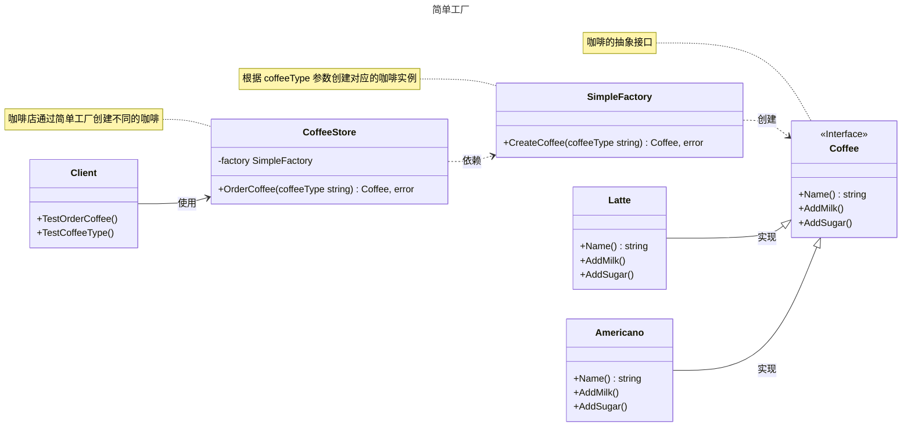

# 简单工厂

## 概述

简单工厂（Simple Factory）通常不被认为是 GoF（Gang of Four）定义的 23 种设计模式之一，而更像是一种编程习惯或简单的对象创建方式。它常被视为工厂方法模式的简化形式，在实际开发中广泛用于封装对象创建逻辑。

## 模式结构

简单工厂的主要角色如下：

- **抽象产品（Abstract Product）**：定义产品的接口，规定了具体产品需要实现的方法。在 Go 中通常使用 `interface` 定义。
- **具体产品（Concrete Product）**：实现抽象产品接口的结构体，表示实际创建的不同类型对象。每个具体产品对应一种产品类型。
- **简单工厂（Simple Factory）**：包含产品创建逻辑的结构体或包级函数，根据传入的参数（如产品类型标识）决定创建哪种具体产品。在 Go 中通常实现为一个导出函数。
- **产品类型标识（Product Type Identifier）**：用于区分不同产品类型的参数，通常是字符串、常量或枚举类型。在 Go 中，推荐使用 `const` 和 `iota` 定义枚举常量，以提高类型安全性和代码可读性。
- **客户端（Client）**：通过调用简单工厂的创建方法，传入产品类型标识来获取所需的产品实例，无需了解具体产品的创建细节。

## 实现

简单工厂的 UML 类图如下所示：



### 抽象接口和具体产品

`coffee.go` 代码如下：

```go
package simplefactory

import "fmt"

// 简单工厂（这是一种创建对象实例的规范，并不是常用23种设计模式）

// 抽象产品

// Coffee 咖啡接口
type Coffee interface {
	// 获取咖啡名称
	Name() string
	// 加奶
	AddMilk()
	// 加糖
	AddSugar()
}

// 具体产品

// Latte 拿铁咖啡
type Latte struct {
}

// NewLatte 创建Latte指针
func NewLatte() *Latte {
	return &Latte{}
}

// Name 获取咖啡名称
func (l *Latte) Name() string {
	return "拿铁咖啡"
}

// AddMilk 加奶
func (l *Latte) AddMilk() {
	fmt.Printf("给%s加奶\n", l.Name())
}

// AddSugar 加糖
func (l *Latte) AddSugar() {
	fmt.Printf("给%s加糖\n", l.Name())
}

// Americano 美式咖啡
type Americano struct {
}

// NewAmericano 创建Americano指针
func NewAmericano() *Americano {
	return &Americano{}
}

// Name 获取咖啡名称
func (a *Americano) Name() string {
	return "美式咖啡"
}

// AddMilk 加奶
func (a *Americano) AddMilk() {
	fmt.Printf("给%s加奶\n", a.Name())
}

// AddSugar 加糖
func (a *Americano) AddSugar() {
	fmt.Printf("给%s加糖\n", a.Name())
}
```

### 简单工厂

`factory.go` 代码如下：

```go
package simplefactory

// 简单工厂 - 工厂

// CoffeeFactory 定义咖啡工厂的行为
type CoffeeFactory interface {
	// 制作咖啡
	// coffeeType 咖啡类型
	CreateCoffee(coffeeType string) Coffee
}

// SimpleFactory 是一个简单的咖啡工厂
type SimpleFactory struct{}

// CreateCoffee 根据指定的类型创建咖啡
func (sf *SimpleFactory) CreateCoffee(coffeeType string) Coffee {
	switch coffeeType {
	case "latte", "Latte":
		return NewLatte()
	case "americano", "Americano":
		return NewAmericano()
	default:
		return nil // 不支持的类型返回 nil
	}
}

// CoffeeStore 咖啡店
type CoffeeStore struct {
	factory *SimpleFactory
}

// NewCoffeeStore 创建一个新的咖啡店
func NewCoffeeStore(factory *SimpleFactory) *CoffeeStore {
	return &CoffeeStore{
		factory: factory,
	}
}

// OrderCoffee 顾客点单
func (cs *CoffeeStore) OrderCoffee(coffeeType string) Coffee {
	coffee := cs.factory.CreateCoffee(coffeeType)
	// 可以在这里添加一些通用的准备步骤
	return coffee
}
```

### 客户端（单元测试）

`client_test.go` 代码如下：

```go
package simplefactory

import (
	"fmt"
	"testing"
)

// 单元测试
// 模拟客户端调用

// TestOrderLatte 模拟点单拿铁咖啡
func TestOrderLatte(t *testing.T) {
	// 创建简单工厂实例
	factory := &SimpleFactory{}
	// 创建咖啡店，传入工厂实例
	store := NewCoffeeStore(factory)

	// 通过咖啡店点单拿铁咖啡
	latte := store.OrderCoffee("latte")
	if latte != nil {
		// 打印点单成功的咖啡名称
		fmt.Printf("点了一杯 %s\n", latte.Name())
		// 为拿铁咖啡加奶
		latte.AddMilk()
		// 为拿铁咖啡加糖
		latte.AddSugar()
	} else {
		// 打印点单失败的信息
		fmt.Println("无法点单：拿铁咖啡")
	}
}

// TestOrderAmericano 模拟点单美式咖啡
func TestOrderAmericano(t *testing.T) {
	// 创建简单工厂实例
	factory := &SimpleFactory{}
	// 创建咖啡店，传入工厂实例
	store := NewCoffeeStore(factory)

	// 通过咖啡店点单美式咖啡
	americano := store.OrderCoffee("Americano")
	if americano != nil {
		// 打印点单成功的咖啡名称
		fmt.Printf("点了一杯 %s\n", americano.Name())
		// 为美式咖啡加奶
		americano.AddMilk()
		// 为美式咖啡加糖
		americano.AddSugar()
	} else {
		// 打印点单失败的信息
		fmt.Println("无法点单：美式咖啡")
	}
}

// TestOrderUnsupported 模拟点单不支持的咖啡类型
func TestOrderUnsupported(t *testing.T) {
	// 创建简单工厂实例
	factory := &SimpleFactory{}
	// 创建咖啡店，传入工厂实例
	store := NewCoffeeStore(factory)

	// 尝试点单不支持的咖啡类型（espresso）
	unknown := store.OrderCoffee("espresso")
	if unknown != nil {
		// 打印点单成功的咖啡名称（理论上不会执行）
		fmt.Printf("点了一杯 %s\n", unknown.Name())
	} else {
		// 打印点单失败的信息，提示不支持的类型
		fmt.Println("无法点单：不支持的咖啡类型 espresso")
	}
}
```

工厂（factory）负责处理创建对象的细节。一旦引入 `SimpleCoffeeFactory`，`CoffeeStore` 就不再直接依赖具体的咖啡实现类（如 `latte`, `americano`），而是作为客户端向工厂请求对象。这实现了创建逻辑和业务逻辑的分离。

这种方式的优点在于将对象的创建过程集中到了一个地方。当 `CoffeeStore` 或其他客户端（例如，一个外卖应用）需要咖啡对象时，都只需与工厂交互。如果创建逻辑需要变更（比如某个咖啡的实例化过程变得复杂），我们只需要修改工厂内部的实现，而所有客户端代码都无需改动，降低了维护成本。

然而，它的缺点也十分明显：当我们需要增加新的咖啡品种时（例如，新增“卡布奇诺”），就必须修改 `SimpleCoffeeFactory` 的 `CreateCoffee` 方法，在 `switch` 语句中增加一个新的 `case`。这违反了“对扩展开放，对修改关闭”的开闭原则，使得工厂类在新增产品时不够稳定。

## 使用场景

简单工厂适用于以下场景：

- **对象创建简单**：当产品类型较少且创建逻辑简单时，使用简单工厂可以有效封装创建过程。
- **格式化工具**：如日志格式化器，根据配置创建不同的格式化器（JSON、Text 等）。
- **数据库驱动**：根据数据库类型（MySQL、PostgreSQL）创建相应的驱动实例。
- **配置管理**：根据配置类型（如 YAML、JSON）创建相应的解析器。

## 优点与缺点

**优点**：
- 封装对象创建逻辑，客户端无需关心具体产品类的实现细节。
- 通过参数控制产品创建，简化客户端调用。
- 集中管理对象创建，便于维护和修改创建逻辑。

**缺点**：
- 违反开闭原则，每次新增产品类型都需要修改工厂类的代码，可能引入错误。
- 工厂类职责单一，扩展复杂产品创建逻辑时可能变得臃肿。

## 注意事项

- **Go 设计哲学**：Go 强调简单性和显式依赖，简单工厂适合小型项目或产品类型较少的场景。对于复杂系统，建议使用工厂方法模式或依赖注入。
- **错误处理**：在 Go 中，工厂方法应返回错误以便客户端处理异常情况。
- **类型安全**：使用常量或枚举类型定义产品类型标识，避免字符串硬编码导致的错误。

## 参考资料

- [https://lailin.xyz/post/go-design-pattern.html](https://lailin.xyz/post/go-design-pattern.html)
- [Refactoring.Guru](https://refactoringguru.cn)