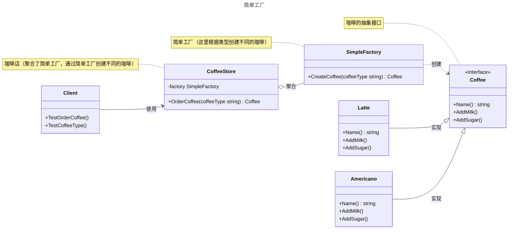

# 简单工厂

## 概述

简单工厂(Simple Factory) 通常不被认为是正式的设计模式，而更像是一种编程习惯或简单的创建对象的方式。它不是GOF (Gang of Four) 定义的23 种设计模式之一。

## 模式结构

简单工厂的主要角色如下：

- **抽象产品（Abstract Product）**：定义产品的接口，规定了具体产品需要实现的方法。在Go中通常使用interface定义。
- **具体产品（Concrete Product）**：实现抽象产品接口的结构体，表示实际创建的不同类型对象。每个具体产品对应一种产品类型。
- **简单工厂（Simple Factory）**：包含产品创建逻辑的结构体或包级函数，根据传入的参数（如产品类型标识）决定创建哪种具体产品。在Go中通常实现为一个导出函数。
- **产品类型标识（Product Type Identifier）**：用于区分不同产品类型的参数，可以是字符串、常量、枚举等。在Go中常使用string类型或自定义类型常量。
- **客户端（Client）**：通过调用简单工厂的创建方法，传入产品类型标识来获取所需的产品实例，无需了解具体产品的创建细节。

## 实现

简单工厂的UML类图如下所示：



简单工厂具体的实现代码如下：

咖啡抽象接口和具体的咖啡类 coffee.go 定义：

```go
package simplefactory

import "fmt"

// 简单工厂（这是一种创建对象实例的规范，并不是常用23种设计模式）

// 抽象产品

// Coffee 咖啡接口
type Coffee interface {
	// 获取咖啡名称
	Name() string
	// 加奶
	AddMilk()
	// 加糖
	AddSugar()
}

// 具体产品

// Latte 拿铁咖啡
type Latte struct {
}

// NewLatte 创建Latte指针
func NewLatte() *Latte {
	return &Latte{}
}

// Name 获取咖啡名称
func (l *Latte) Name() string {
	return "拿铁咖啡"
}

// AddMilk 加奶
func (l *Latte) AddMilk() {
	fmt.Printf("给%s加奶\n", l.Name())
}

// AddSugar 加糖
func (l *Latte) AddSugar() {
	fmt.Printf("给%s加糖\n", l.Name())
}

// Americano 美式咖啡
type Americano struct {
}

// NewAmericano 创建Americano指针
func NewAmericano() *Americano {
	return &Americano{}
}

// Name 获取咖啡名称
func (a *Americano) Name() string {
	return "美式咖啡"
}

// AddMilk 加奶
func (a *Americano) AddMilk() {
	fmt.Printf("给%s加奶\n", a.Name())
}

// AddSugar 加糖
func (a *Americano) AddSugar() {
	fmt.Printf("给%s加糖\n", a.Name())
}
```

简单工厂 factory.go 定义：

```go
package simplefactory

// 简单工厂 - 工厂

// CoffeeFactory 定义咖啡工厂的行为
type CoffeeFactory interface {
	// 制作咖啡
	// coffeeType 咖啡类型
	CreateCoffee(coffeeType string) Coffee
}

// SimpleFactory 是一个简单的咖啡工厂
type SimpleFactory struct{}

// CreateCoffee 根据指定的类型创建咖啡
func (sf *SimpleFactory) CreateCoffee(coffeeType string) Coffee {
	switch coffeeType {
	case "latte", "Latte":
		return NewLatte()
	case "americano", "Americano":
		return NewAmericano()
	default:
		return nil // 不支持的类型返回 nil
	}
}

// CoffeeStore 咖啡店
type CoffeeStore struct {
	factory *SimpleFactory
}

// NewCoffeeStore 创建一个新的咖啡店
func NewCoffeeStore(factory *SimpleFactory) *CoffeeStore {
	return &CoffeeStore{
		factory: factory,
	}
}

// OrderCoffee 顾客点单
func (cs *CoffeeStore) OrderCoffee(coffeeType string) Coffee {
	coffee := cs.factory.CreateCoffee(coffeeType)
	// 可以在这里添加一些通用的准备步骤
	return coffee
}
```

客户端（单元测试）client_test.go 定义：

```go
package simplefactory

import (
	"testing"
)

// 单元测试
// 模拟客户端调用

// TestOrderCoffee 测试咖啡店订购咖啡的功能
func TestOrderCoffee(t *testing.T) {
	// 定义测试用例
	tests := []struct {
		name         string
		coffeeType   string
		expectedName string
		expectNil    bool
	}{
		{
			name:         "TestLatte",
			coffeeType:   "latte",
			expectedName: "拿铁咖啡",
			expectNil:    false,
		},
		{
			name:         "TestAmericano",
			coffeeType:   "americano",
			expectedName: "美式咖啡",
			expectNil:    false,
		},
		{
			name:       "TestInvalidCoffeeType",
			coffeeType: "espresso",
			expectNil:  true,
		},
	}

	// 遍历测试用例
	for _, tt := range tests {
		t.Run(tt.name, func(t *testing.T) {
			// 创建咖啡店，注入简单工厂
			coffeeStore := NewCoffeeStore(&SimpleFactory{})

			// 订购咖啡
			coffee := coffeeStore.OrderCoffee(tt.coffeeType)

			// 检查 nil 情况
			if tt.expectNil {
				if coffee != nil {
					t.Fatalf("期望返回 nil，但得到了咖啡: %v", coffee.Name())
				}
				return
			}

			// 检查非 nil 情况
			if coffee == nil {
				t.Fatalf("期望得到咖啡，但得到 nil")
			}
			if coffee.Name() != tt.expectedName {
				t.Errorf("期望的咖啡是 '%s', 但得到的是 '%s'", tt.expectedName, coffee.Name())
			}

			// 日志输出，供调试
			t.Logf("成功订购: %s", coffee.Name())
		})
	}
}

// TestCoffeeType 测试返回的咖啡对象类型
func TestCoffeeType(t *testing.T) {
	coffeeStore := NewCoffeeStore(&SimpleFactory{})

	// 测试拿铁咖啡类型
	t.Run("TestLatteType", func(t *testing.T) {
		coffee := coffeeStore.OrderCoffee("latte")
		if coffee == nil {
			t.Fatalf("期望得到咖啡，但得到 nil")
		}
		if _, ok := coffee.(*Latte); !ok {
			t.Errorf("期望返回 *Latte 类型，但得到的是 %T", coffee)
		}
	})

	// 测试美式咖啡类型
	t.Run("TestAmericanoType", func(t *testing.T) {
		coffee := coffeeStore.OrderCoffee("americano")
		if coffee == nil {
			t.Fatalf("期望得到咖啡，但得到 nil")
		}
		if _, ok := coffee.(*Americano); !ok {
			t.Errorf("期望返回 *Americano 类型，但得到的是 %T", coffee)
		}
	})
}
```

工厂（factory）负责处理创建对象的细节。一旦引入 `SimpleCoffeeFactory`，`CoffeeStore` 就不再直接依赖具体的咖啡实现类（如 `latte`, `americano`），而是作为客户端向工厂请求对象。这实现了创建逻辑和业务逻辑的分离。

这种方式的优点在于将对象的创建过程集中到了一个地方。当 `CoffeeStore` 或其他客户端（例如，一个外卖应用）需要咖啡对象时，都只需与工厂交互。如果创建逻辑需要变更（比如某个咖啡的实例化过程变得复杂），我们只需要修改工厂内部的实现，而所有客户端代码都无需改动，降低了维护成本。

然而，它的缺点也十分明显：当我们需要增加新的咖啡品种时（例如，新增“卡布奇诺”），就必须修改 `SimpleCoffeeFactory` 的 `CreateCoffee` 方法，在 `switch` 语句中增加一个新的 `case`。这违反了“对扩展开放，对修改关闭”的开闭原则，使得工厂类在新增产品时不够稳定。

## 优点与缺点

**优点**：

- 封装了创建对象的过程，可以通过参数直接获取对象。把对象的创建和业务逻辑层分开，这样以后就避免了修改客户代码，如果要实现新产品直接修改工厂类，而不需要在原代码中修改，这样就降低了客户代码修改的可能性，更加容易扩展。

**缺点**：

- 增加新产品时还是需要修改工厂类的代码，违背了“开闭原则”。

## 参考资料

- [https://lailin.xyz/post/go-design-pattern.html](https://lailin.xyz/post/go-design-pattern.html)
- [Refactoring.Guru](https://refactoringguru.cn)