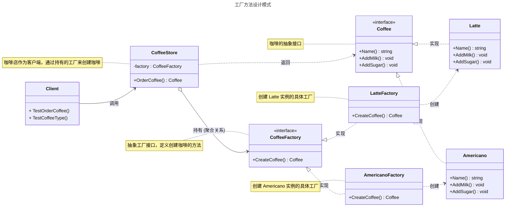

# 工厂方法模式

## 概述

工厂方法模式（Factory Method Pattern）是一种创建型设计模式，用于定义一个创建对象的接口，但让子类决定具体实例化的类。它的核心思想是将对象的创建过程延迟到子类中，从而实现灵活的对象创建机制。


## 模式结构

工厂方法模式的主要角色如下：

- **抽象产品（Abstract Product）**：定义产品的接口，规定了具体产品需要实现的方法。
- **具体产品（Concrete Product）**：实现抽象产品接口的结构体，表示实际创建的对象。
- **抽象创建者（Abstract Creator）**：定义工厂方法的接口，声明创建产品的方法，通常返回抽象产品接口类型。
- **具体创建者（Concrete Creator）**：实现抽象创建者接口的结构体，负责创建具体产品实例。
- **客户端（Client）**：通过抽象创建者接口调用工厂方法来获取产品实例，并使用产品的功能。客户端与抽象创建者和抽象产品交互，无需关心具体实现。

## 实现

工厂方法案例的UML类图如下所示：



抽象产品和具体产品 coffee.go 定义：

```go
package factorymethod

import "fmt"

// 工厂方法模式

// 抽象产品

// Coffee 咖啡接口
type Coffee interface {
	// 获取咖啡名称
	Name() string
	// 加奶
	AddMilk()
	// 加糖
	AddSugar()
}

// 具体产品

// Latte 拿铁咖啡
type Latte struct {
}

// NewLatte 创建Latte指针
func NewLatte() *Latte {
	return &Latte{}
}

// Name 获取咖啡名称
func (l *Latte) Name() string {
	return "拿铁咖啡"
}

// AddMilk 加奶
func (l *Latte) AddMilk() {
	fmt.Printf("%s加奶\n", l.Name())
}

// AddSugar 加糖
func (l *Latte) AddSugar() {
	fmt.Printf("%s加糖\n", l.Name())
}

// Americano 美式咖啡
type Americano struct {
}

// NewAmericano 创建Americano指针
func NewAmericano() *Americano {
	return &Americano{}
}

// Name 获取咖啡名称
func (a *Americano) Name() string {
	return "美式咖啡"
}

// AddMilk 加奶
func (a *Americano) AddMilk() {
	fmt.Printf("给%s加奶\n", a.Name())
}

// AddSugar 加糖
func (a *Americano) AddSugar() {
	fmt.Printf("给%s加糖\n", a.Name())
}
```

抽象工厂和具体工厂 factory.go 定义：

```go
package factorymethod

// 工厂方法模式

// 抽象工厂

// CoffeeFactory 定义咖啡工厂的行为
type CoffeeFactory interface {
	// CreateCoffee 创建特定类型的咖啡
	CreateCoffee() Coffee
}

// 具体工厂

// LatteFactory 生产拿铁咖啡的工厂
type LatteFactory struct{}

// NewLatteFactory 创建LatteFactory拿铁咖啡工厂实例
func NewLatteFactory() *LatteFactory {
	return &LatteFactory{}
}

// CreateCoffee 创建一个拿铁咖啡
func (lf LatteFactory) CreateCoffee() Coffee {
	return NewLatte()
}

// AmericanoFactory 生产美式咖啡的工厂
type AmericanoFactory struct{}

// CreateCoffee 创建一个美式咖啡
func (af AmericanoFactory) CreateCoffee() Coffee {
	return NewAmericano()
}

// CoffeeStore 咖啡店
type CoffeeStore struct {
	factory CoffeeFactory
}

// NewCoffeeStore 创建一个新的咖啡店
func NewCoffeeStore(factory CoffeeFactory) *CoffeeStore {
	return &CoffeeStore{factory: factory}
}

// OrderCoffee 顾客点单，返回特定工厂生产的咖啡
func (cs *CoffeeStore) OrderCoffee() Coffee {
	return cs.factory.CreateCoffee()
}
```

客户端（单元测试）client_test.go 定义：

```go
package factorymethod

import "testing"

// 单元测试
// 模拟客户端调用

// TestOrderCoffee 测试咖啡店订购咖啡的功能
func TestOrderCoffee(t *testing.T) {
	// 定义测试用例
	tests := []struct {
		name         string
		factory      CoffeeFactory
		expectedName string
	}{
		{
			name:         "TestLatte",
			factory:      LatteFactory{},
			expectedName: "拿铁咖啡",
		},
		{
			name:         "TestAmericano",
			factory:      AmericanoFactory{},
			expectedName: "美式咖啡",
		},
	}

	// 遍历测试用例
	for _, tt := range tests {
		t.Run(tt.name, func(t *testing.T) {
			// 创建咖啡店，注入特定工厂
			coffeeStore := NewCoffeeStore(tt.factory)

			// 订购咖啡 (修正：只接收一个返回值)
			coffee := coffeeStore.OrderCoffee()
			if coffee == nil {
				t.Fatalf("期望得到咖啡，但得到 nil")
			}

			// (修正：调用导出的 Name() 方法)
			if coffee.Name() != tt.expectedName {
				t.Errorf("期望的咖啡是 '%s', 但得到的是 '%s'", tt.expectedName, coffee.Name())
			}

			// 日志输出，供调试
			t.Logf("成功订购: %s", coffee.Name())
		})
	}
}

// TestCoffeeType 测试返回的咖啡对象类型
func TestCoffeeType(t *testing.T) {
	// 定义测试用例
	tests := []struct {
		name         string
		factory      CoffeeFactory
		expectedType any
	}{
		{name: "测试Latte类型", factory: LatteFactory{}, expectedType: &Latte{}},
		{name: "测试Americano类型", factory: AmericanoFactory{}, expectedType: &Americano{}},
	}

	// 遍历测试用例
	for _, tt := range tests {
		t.Run(tt.name, func(t *testing.T) {
			coffeeStore := NewCoffeeStore(tt.factory)
			coffee := coffeeStore.OrderCoffee()
			if coffee == nil {
				t.Fatalf("期望得到咖啡，但得到 nil")
			}
			switch tt.expectedType.(type) {
			case *Latte:
				if _, ok := coffee.(*Latte); !ok {
					t.Errorf("期望返回 *Latte 类型，但得到的是 %T", coffee)
				}
			case *Americano:
				if _, ok := coffee.(*Americano); !ok {
					t.Errorf("期望返回 *Americano 类型，但得到的是 %T", coffee)
				}
			}
		})
	}
}
```

从以上的编写的代码可以看到，要增加产品类时也要相应地增加工厂类，不需要修改工厂类的代码了，这样就解决了简单工厂模式的缺点。

工厂方法模式是简单工厂模式的进一步抽象。由于使用了多态性，工厂方法模式保持了简单工厂模式的优点，而且克服了它的缺点。

## 优缺点

**优点**：

- 用户只需要知道具体工厂的名称就可得到所要的产品，无须知道产品的具体创建过程；
- 在系统增加新的产品时只需要添加具体产品类和对应的具体工厂类，无须对原工厂进行任何修改，满足开闭原则；

**缺点**：

- 每增加一个产品就要增加一个具体产品类和一个对应的具体工厂类，这增加了系统的复杂度。

## 参考资料

- [go-patterns](https://github.com/tmrts/go-patterns)
- [Refactoring.Guru](https://refactoringguru.cn/)