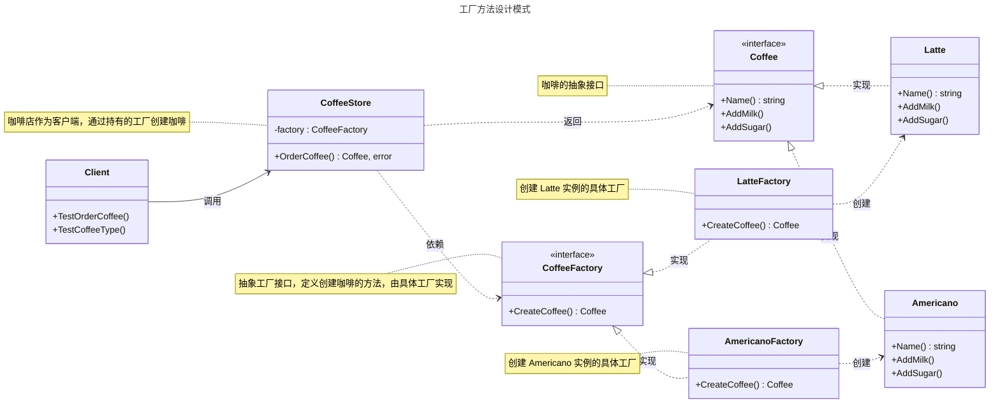

# 工厂方法模式

## 概述

工厂方法模式（Factory Method Pattern）是一种创建型设计模式，用于定义一个创建对象的接口，但让子类决定具体实例化的类。它的核心思想是将对象的创建过程延迟到子类中，从而实现灵活的对象创建机制。与简单工厂模式相比，工厂方法模式通过抽象工厂接口和多态性实现更高的扩展性，符合开闭原则。


## 模式结构

工厂方法模式的主要角色如下：

- **抽象产品（Abstract Product）**：定义产品的接口，规定了具体产品需要实现的方法。在 Go 中通常使用 `interface` 定义。
- **具体产品（Concrete Product）**：实现抽象产品接口的结构体，表示实际创建的对象。
- **抽象创建者（Abstract Creator）**：定义工厂方法的接口，声明创建产品的方法，通常返回抽象产品接口类型。在 Go 中，通常使用 `interface` 定义。
- **具体创建者（Concrete Creator）**：实现抽象创建者接口的结构体，负责创建具体产品实例。
- **客户端（Client）**：通过抽象创建者接口调用工厂方法来获取产品实例，并使用产品的功能。客户端与抽象创建者和抽象产品交互，无需关心具体实现。

## 实现

工厂方法案例的UML类图如下所示：



### 抽象产品和具体产品

`coffee.go` 代码如下：

```go
package factorymethod

import "fmt"

// Coffee 咖啡接口，表示抽象产品
type Coffee interface {
    // Name 获取咖啡名称
    Name() string
    // AddMilk 为咖啡加奶
    AddMilk()
    // AddSugar 为咖啡加糖
    AddSugar()
}

// Latte 表示拿铁咖啡的具体产品
type Latte struct {
    // 字段可根据实际需求定义
}

// Name 获取咖啡名称
func (l *Latte) Name() string {
    return "拿铁咖啡"
}

// AddMilk 加奶
func (l *Latte) AddMilk() {
    fmt.Printf("%s加奶\n", l.Name())
}

// AddSugar 加糖
func (l *Latte) AddSugar() {
    fmt.Printf("%s加糖\n", l.Name())
}

// Americano 表示美式咖啡的具体产品
type Americano struct {
    // 字段可根据实际需求定义
}

// Name 获取咖啡名称
func (a *Americano) Name() string {
    return "美式咖啡"
}

// AddMilk 加奶
func (a *Americano) AddMilk() {
    fmt.Printf("%s加奶\n", a.Name())
}

// AddSugar 加糖
func (a *Americano) AddSugar() {
    fmt.Printf("%s加糖\n", a.Name())
}
```

### 抽象工厂和具体工厂

`factory.go` 代码如下：

```go
package factorymethod

import "fmt"

// CoffeeFactory 抽象工厂接口，定义创建咖啡的方法
type CoffeeFactory interface {
    // CreateCoffee 创建特定类型的咖啡
    CreateCoffee() Coffee
}

// LatteFactory 生产拿铁咖啡的工厂
type LatteFactory struct{}

// CreateCoffee 创建一个拿铁咖啡
func (lf *LatteFactory) CreateCoffee() Coffee {
    return &Latte{}
}

// AmericanoFactory 生产美式咖啡的工厂
type AmericanoFactory struct{}

// CreateCoffee 创建一个美式咖啡
func (af *AmericanoFactory) CreateCoffee() Coffee {
    return &Americano{}
}

// CoffeeStore 咖啡店
type CoffeeStore struct {
    factory CoffeeFactory
}

// NewCoffeeStore 创建一个新的咖啡店
func NewCoffeeStore(factory CoffeeFactory) *CoffeeStore {
    return &CoffeeStore{factory: factory}
}

// OrderCoffee 顾客点单，返回特定工厂生产的咖啡
func (cs *CoffeeStore) OrderCoffee() (Coffee, error) {
    if cs.factory == nil {
        return nil, fmt.Errorf("factory is nil")
    }
    return cs.factory.CreateCoffee(), nil
}
```

### 客户端（单元测试）

`client_test.go` 代码如下：

```go
package factorymethod

import (
    "testing"
)

// TestOrderCoffee 测试咖啡点单功能
func TestOrderCoffee(t *testing.T) {
    // 测试拿铁咖啡工厂
    t.Run("LatteFactory", func(t *testing.T) {
        factory := &LatteFactory{}
        store := NewCoffeeStore(factory)
        coffee, err := store.OrderCoffee()
        if err != nil {
            t.Errorf("expected no error, got %v", err)
        }
        if coffee == nil || coffee.Name() != "拿铁咖啡" {
            t.Errorf("expected Latte, got %v", coffee)
        }
        t.Logf("点了一杯 %s", coffee.Name())
        coffee.AddMilk()
        coffee.AddSugar()
    })

    // 测试美式咖啡工厂
    t.Run("AmericanoFactory", func(t *testing.T) {
        factory := &AmericanoFactory{}
        store := NewCoffeeStore(factory)
        coffee, err := store.OrderCoffee()
        if err != nil {
            t.Errorf("expected no error, got %v", err)
        }
        if coffee == nil || coffee.Name() != "美式咖啡" {
            t.Errorf("expected Americano, got %v", coffee)
        }
        t.Logf("点了一杯 %s", coffee.Name())
        coffee.AddMilk()
        coffee.AddSugar()
    })

    // 测试空工厂
    t.Run("NilFactory", func(t *testing.T) {
        store := NewCoffeeStore(nil)
        coffee, err := store.OrderCoffee()
        if err == nil {
            t.Error("expected error for nil factory, got nil")
        }
        if coffee != nil {
            t.Errorf("expected nil coffee, got %v", coffee)
        }
        t.Logf("无法点单：%v", err)
    })
}
```

### 实现说明

工厂方法模式通过抽象工厂接口（`CoffeeFactory`）和具体工厂（`LatteFactory`、`AmericanoFactory`）实现对象的创建，`CoffeeStore` 作为客户端通过工厂接口获取咖啡实例。相比简单工厂模式，工厂方法模式通过多态性将创建逻辑分散到具体工厂类，新增产品时只需添加新的具体产品类和工厂类，无需修改现有代码，符合开闭原则。

## 使用场景

工厂方法模式适用于以下场景：

- **产品类型动态扩展**：当产品类型需要频繁扩展时，工厂方法模式通过新增工厂类支持新产品，避免修改现有代码。
- **数据库驱动**：为不同数据库（如 MySQL、PostgreSQL）定义工厂接口，创建对应的驱动实例。
- **日志记录器**：根据日志类型（如文件日志、控制台日志）创建不同的日志记录器。
- **UI 组件**：根据平台（如 Windows、Linux）创建不同的界面组件。

## 优点与缺点

**优点**：
- 通过抽象工厂接口降低客户端与具体产品类的耦合。
- 符合开闭原则，新增产品只需添加具体产品类和对应工厂类，无需修改现有代码。
- 提供灵活的扩展机制，适合产品类型动态变化的场景。

**缺点**：
- 每增加一种产品都需要新增具体产品类和具体工厂类，增加代码量和系统复杂度。
- 对于简单场景，工厂方法模式可能显得过于复杂，简单工厂或直接实例化可能更合适。

## 注意事项

- **Go 设计哲学**：Go 强调简单性和显式依赖，工厂方法模式适合产品类型较多且需要动态扩展的场景。对于简单场景，可考虑简单工厂或直接实例化。
- **接口设计**：确保抽象工厂接口简洁，避免过度设计。
- **错误处理**：在 Go 中，工厂方法应返回错误以便客户端处理异常情况。

## 参考资料

- [go-patterns](https://github.com/tmrts/go-patterns)
- [Refactoring.Guru](https://refactoringguru.cn/)