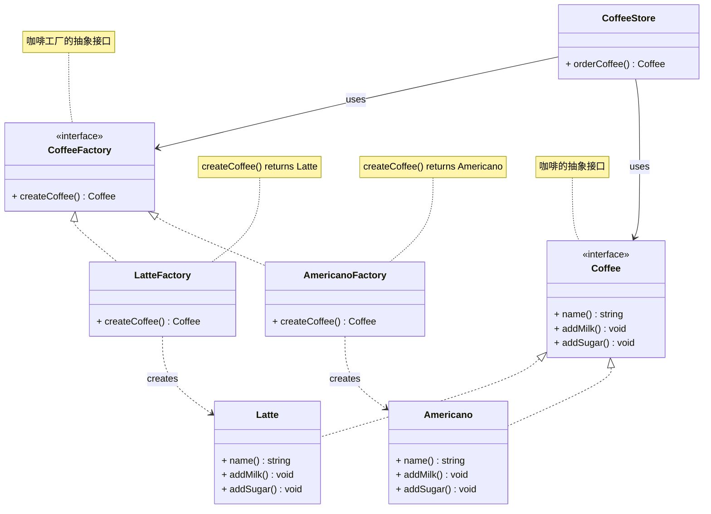

# 工厂方法模式

## 概述

工厂方法模式（Factory Method Pattern）是一种创建型设计模式，用于定义一个创建对象的接口，但让子类决定具体实例化的类。它的核心思想是将对象的创建过程延迟到子类中，从而实现灵活的对象创建机制。

## 模式结构

工厂方法模式的主要角色：

- 抽象工厂（Abstract Factory）：提供了创建产品的接口，调用者通过它访问具体工厂的工厂方法来创建产品。
- 具体工厂（ConcreteFactory）：主要是实现抽象工厂中的抽象方法，完成具体产品的创建。
- 抽象产品（Product）：定义了产品的规范，描述了产品的主要特性和功能。
- 具体产品（ConcreteProduct）：实现了抽象产品角色所定义的接口，由具体工厂来创建，它同具体工厂之间一一对应。

## 实现

工厂方法案例的UML类图如下所示：



抽象产品和具体产品使用 coffee.go 定义：

```go
package factorymethod

import "fmt"

// 抽象产品

// coffee 咖接口
type coffee interface {
	name() string
	addMilk()
	addSugar()
}

// 具体产品

// latte 拿铁咖啡
type latte struct {
}

func (l *latte) name() string {
	return "拿铁咖啡"
}

func (l *latte) addMilk() {
	fmt.Printf("%s加牛奶\n", l.name())
}

func (l *latte) addSugar() {
	fmt.Printf("%s加糖\n", l.name())
}

// americano 美式咖啡
type americano struct {
}

func (a *americano) name() string {
	return "美式咖啡"
}

func (a *americano) addMilk() {
	fmt.Printf("%s加牛奶\n", a.name())
}

func (a *americano) addSugar() {
	fmt.Printf("%s加糖\n", a.name())
}
```

抽象工厂和具体工厂使用 factory.go 定义：

```go
package factorymethod

// 抽象工厂

// coffeeFactory 咖啡工厂接口
type coffeeFactory interface {
	// 制作咖啡
	createCoffee() coffee
}

// 具体工厂

// latteFactory 拿铁咖啡工厂
type latteFactory struct {
}

// NewLatteFactory 创建latteFactory拿铁咖啡工厂实例
func NewLatteFactory() *latteFactory {
	return &latteFactory{}
}

// createCoffee 制作咖啡
func (lf *latteFactory) createCoffee() coffee {
	return &latte{}
}

// americanoFactory 美式咖啡工厂
type americanoFactory struct {
}

// NewAmericanoFactory 创建americanoFactory美式咖啡工厂实例
func NewAmericanoFactory() *americanoFactory {
	return &americanoFactory{}
}

// createCoffee 制作咖啡
func (af *americanoFactory) createCoffee() coffee {
	return &americano{}
}
```

咖啡店使用 store.go 定义：

```go
package factorymethod

import "fmt"

// 商店售卖咖啡

// coffeeStore 咖啡店
type coffeeStore struct {
	factory coffeeFactory
}

// NewCoffeeStore 创建咖啡店实例
func NewCoffeeStore(factory coffeeFactory) *coffeeStore {
	return &coffeeStore{factory: factory}
}

// OrderCoffee 订购咖啡
func (cs *coffeeStore) OrderCoffee() coffee {
	coffee := cs.factory.createCoffee()
	fmt.Printf("订购了%s\n", coffee.name())
	coffee.addMilk()
	coffee.addSugar()
	return coffee
}
```

单元测试使用 store_test.go 定义：

```go
package factorymethod

import (
	"testing"
)

// TestOrderCoffee 下单拿铁咖啡
func TestOrderLatteCoffee(t *testing.T) {
	// 创建拿铁咖啡工厂
	factory := NewLatteFactory()
	// 咖啡店
	store := NewCoffeeStore(factory)
	// 下单咖啡
	coffee := store.OrderCoffee()
	if coffee.name() != "拿铁咖啡" {
		t.Errorf("预期咖啡名称 %s，实际得到 %s", "拿铁咖啡", coffee.name())
	}
}

// TestOrderAmericanoCoffee 下单美式咖啡
func TestOrderAmericanoCoffee(t *testing.T) {
	// 创建拿铁咖啡工厂
	factory := NewAmericanoFactory()
	// 咖啡店
	store := NewCoffeeStore(factory)
	// 下单咖啡
	coffee := store.OrderCoffee()
	if coffee.name() != "美式咖啡" {
		t.Errorf("预期咖啡名称 %s，实际得到 %s", "美式咖啡", coffee.name())
	}
}
```

从以上的编写的代码可以看到，要增加产品类时也要相应地增加工厂类，不需要修改工厂类的代码了，这样就解决了简单工厂模式的缺点。

工厂方法模式是简单工厂模式的进一步抽象。由于使用了多态性，工厂方法模式保持了简单工厂模式的优点，而且克服了它的缺点。

## 优缺点

**优点**：

- 用户只需要知道具体工厂的名称就可得到所要的产品，无须知道产品的具体创建过程；
- 在系统增加新的产品时只需要添加具体产品类和对应的具体工厂类，无须对原工厂进行任何修改，满足开闭原则；

**缺点**：

- 每增加一个产品就要增加一个具体产品类和一个对应的具体工厂类，这增加了系统的复杂度。

## 参考资料

- [go-patterns](https://github.com/tmrts/go-patterns)
- [Refactoring.Guru](https://refactoringguru.cn/)