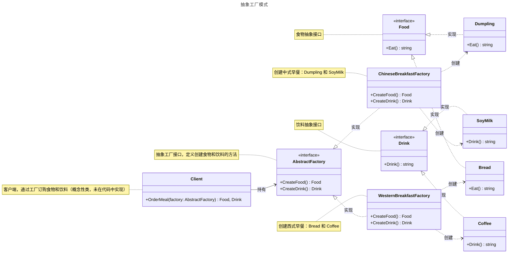

# 抽象工厂模式

## 概述

抽象工厂模式（Abstract Factory Pattern）是一种创建型设计模式，旨在提供一个统一的接口，用于创建一组相关或相互依赖的对象，而无需直接实例化具体类。它通过定义抽象工厂接口和抽象产品接口，允许系统在运行时动态选择具体的产品族，增强代码的灵活性和可扩展性。


## 模式结构

抽象工厂模式的主要角色如下：

- 抽象工厂（Abstract Factory）：提供了创建产品的接口，它包含多个创建产品的方法，可以创建多个不同等级的产品。
- 具体工厂（Concrete Factory）：主要是实现抽象工厂中的多个抽象方法，完成具体产品的创建。
- 抽象产品（Product）：定义了产品的规范，描述了产品的主要特性和功能，抽象工厂模式有多个抽象产品。
- 具体产品（ConcreteProduct）：实现了抽象产品角色所定义的接口，由具体工厂来创建，它 同具体工厂之间是多对一的关系。

## 实现

抽象工厂模式的UML类图如下所示：



抽象工厂和具体工厂使用 factory.go 定义：

```go
package abstractfactory

// 抽象工厂

// AbstractFactory 定义抽象工厂接口，用于创建食品和饮品
type AbstractFactory interface {
	CreateFood() Food   // 创建食品
	CreateDrink() Drink // 创建饮品
}

// 具体工厂

// ChineseBreakfastFactory 中式早餐工厂，创建 Dumpling 和 SoyMilk
type ChineseBreakfastFactory struct{}

// CreateFood 创建食品，返回 Dumpling 实例
func (cbf *ChineseBreakfastFactory) CreateFood() Food {
	// 饺子
	return &Dumpling{}
}

// CreateDrink 创建饮品，返回 SoyMilk 实例
func (cbf *ChineseBreakfastFactory) CreateDrink() Drink {
	// 豆浆
	return &SoyMilk{}
}

// WesternBreakfastFactory 西式早餐工厂，创建 Bread 和 Coffee
type WesternBreakfastFactory struct{}

// CreateFood 创建食品，返回 Bread 实例
func (wbf *WesternBreakfastFactory) CreateFood() Food {
	// 面包
	return &Bread{}
}

// CreateDrink 创建饮品，返回 Coffee 实例
func (wbf *WesternBreakfastFactory) CreateDrink() Drink {
	// 咖啡
	return &Coffee{}
}
```

抽象产品和具体产品 使用 food.go 和 drink.go 定义：

::: code-group
```go [food.go]
package abstractfactory

// 抽象产品

// Food 定义食品接口，包含吃的行为
type Food interface {
	Eat() string // 返回食用食品的描述
}

// 具体产品

// Bread 面包，实现了 Food 接口
type Bread struct{}

// Eat 返回食用面包的描述
func (b *Bread) Eat() string {
	return "面包"
}

// Dumpling 饺子，实现了 Food 接口
type Dumpling struct{}

// Eat 返回食用饺子的描述
func (d *Dumpling) Eat() string {
	return "饺子"
}
```

```go [drink.go]
package abstractfactory

// 抽象产品

// Drink 定义饮品接口，包含喝的行为
type Drink interface {
	Drink() string // 返回饮用饮品的描述
}

// 具体产品

// Coffee 咖啡，实现了 Drink 接口
type Coffee struct{}

// Drink 返回饮用咖啡的描述
func (c *Coffee) Drink() string {
	return "咖啡"
}

// SoyMilk 豆浆，实现了 Drink 接口
type SoyMilk struct{}

// Drink 返回饮用豆浆的描述
func (s *SoyMilk) Drink() string {
	return "豆浆"
}
```
:::

客户端（单元测试）client_test.go 定义：

```go
package abstractfactory

import "testing"

// 单元测试
// 模拟客户端调用

// TestChineseBreakfastFactory 测试中式早餐工厂的创建逻辑
func TestChineseBreakfastFactory(t *testing.T) {
	factory := &ChineseBreakfastFactory{}

	// 测试创建 Food
	food := factory.CreateFood()
	if _, ok := food.(*Dumpling); !ok {
		t.Errorf("Expected food to be *Dumpling, got %T", food)
	}
	if got := food.Eat(); got != "饺子" {
		t.Errorf("Expected food.Eat() to return '饺子', got '%s'", got)
	}

	// 测试创建 Drink
	drink := factory.CreateDrink()
	if _, ok := drink.(*SoyMilk); !ok {
		t.Errorf("Expected drink to be *SoyMilk, got %T", drink)
	}
	if got := drink.Drink(); got != "豆浆" {
		t.Errorf("Drink() = %s; want 豆浆", got)
	}
}

// TestWesternBreakfastFactory 测试西式早餐工厂的创建逻辑
func TestWesternBreakfastFactory(t *testing.T) {
	factory := &WesternBreakfastFactory{}

	// 测试创建 Food
	food := factory.CreateFood()
	if _, ok := food.(*Bread); !ok {
		t.Errorf("Expected food to be *Bread, got %T", food)
	}
	if got := food.Eat(); got != "面包" {
		t.Errorf("Expected food.Eat() to return '面包', got '%s'", got)
	}

	// 测试创建 Drink
	drink := factory.CreateDrink()
	if _, ok := drink.(*Coffee); !ok {
		t.Errorf("Expected drink to be *Coffee, got %T", drink)
	}
	if got := drink.Drink(); got != "咖啡" {
		t.Errorf("Drink() = %s; want 咖啡", got)
	}
}
```

在抽象工厂模式中，如果需要添加一个新的产品族，只需创建一个新的具体工厂结构体并实现 AbstractFactory 接口，定义新的食品和饮品创建逻辑，无需修改现有的工厂或产品代码，保持系统的扩展性和可维护性。

## 优缺点

**优点**：

- 当一个产品族中的多个对象被设计成一起工作时，它能保证客户端始终只使用同一个产品族中的对象。

**缺点**：

- 当产品族中需要增加一个新的产品时，所有的工厂类都需要进行修改。

## 参考资料

- [go-patterns](https://github.com/tmrts/go-patterns)
- [Refactoring.Guru](https://refactoringguru.cn/)