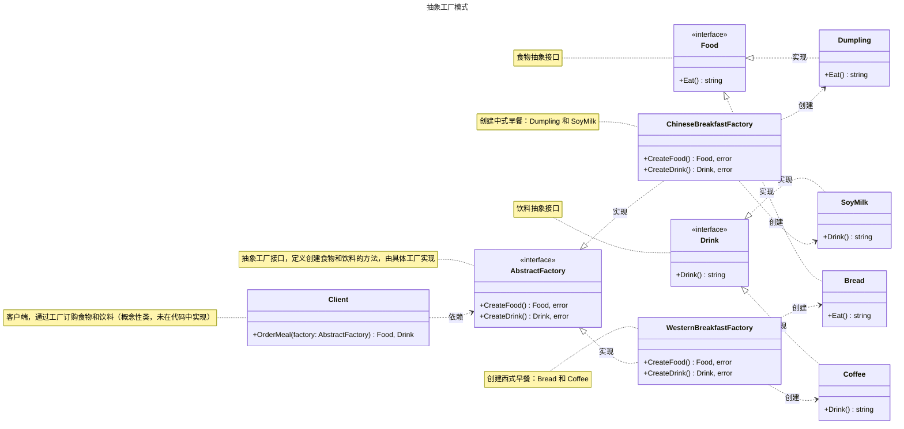

# 抽象工厂模式

## 概述

抽象工厂模式（Abstract Factory Pattern）是一种创建型设计模式，旨在提供一个统一的接口，用于创建一组相关或相互依赖的对象，而无需直接实例化具体类。它通过定义抽象工厂接口和抽象产品接口，允许系统在运行时动态选择具体的产品族，增强代码的灵活性和可扩展性。与工厂方法模式相比，抽象工厂模式关注于创建一组相关或相互依赖的产品族，适合需要统一风格或主题的场景。


## 模式结构

抽象工厂模式的主要角色如下：

- **抽象产品（Abstract Product）**：定义产品族中每个产品的接口，规定了具体产品需要实现的方法。一个产品族通常包含多个抽象产品。在 Go 中，通常使用 `interface` 定义。
- **具体产品（Concrete Product）**：实现抽象产品接口的结构体，表示产品族中的具体产品实例。同一产品族的具体产品通常具有相同的风格或主题。
- **抽象工厂（Abstract Factory）**：定义创建产品族的接口，声明创建每个抽象产品的方法，每个方法对应产品族中的一个产品类型。在 Go 中，通常使用 `interface` 定义。
- **具体工厂（Concrete Factory）**：实现抽象工厂接口的结构体，负责创建一整个产品族的具体产品实例。每个具体工厂对应一个产品族的变体。
- **客户端（Client）**：通过抽象工厂接口调用创建方法来获取产品族中的各个产品实例，并使用产品的功能。客户端只与抽象工厂和抽象产品交互，无需关心具体实现。在 Go 中，客户端可能表现为业务逻辑代码或单元测试代码。

## 实现

抽象工厂模式的 UML 类图如下所示：



### 抽象产品和具体产品

`product.go` 代码如下：

```go
package abstractfactory

// Food 定义食物抽象接口，包含吃的行为
type Food interface {
    // Eat 返回食用食物的描述
    Eat() string
}

// Drink 定义饮料抽象接口，包含喝的行为
type Drink interface {
    // Drink 返回饮用饮料的描述
    Drink() string
}

// Bread 表示面包的具体产品
type Bread struct {
    // 字段可根据实际需求定义
}

// Eat 返回食用面包的描述
func (b Bread) Eat() string {
    return "面包"
}

// Dumpling 表示饺子的具体产品
type Dumpling struct {
    // 字段可根据实际需求定义
}

// Eat 返回食用饺子的描述
func (d Dumpling) Eat() string {
    return "饺子"
}

// Coffee 表示咖啡的具体产品
type Coffee struct {
    // 字段可根据实际需求定义
}

// Drink 返回饮用咖啡的描述
func (c Coffee) Drink() string {
    return "咖啡"
}

// SoyMilk 表示豆浆的具体产品
type SoyMilk struct {
    // 字段可根据实际需求定义
}

// Drink 返回饮用豆浆的描述
func (s SoyMilk) Drink() string {
    return "豆浆"
}
```

### 抽象工厂和具体工厂

`factory.go` 代码如下：

```go
package abstractfactory

import "fmt"

// AbstractFactory 定义抽象工厂接口，用于创建食物和饮料
type AbstractFactory interface {
    // CreateFood 创建食物
    CreateFood() (Food, error)
    // CreateDrink 创建饮料
    CreateDrink() (Drink, error)
}

// ChineseBreakfastFactory 中式早餐工厂，创建 Dumpling 和 SoyMilk
type ChineseBreakfastFactory struct{}

// CreateFood 创建食物，返回 Dumpling 实例
func (cbf ChineseBreakfastFactory) CreateFood() (Food, error) {
    return Dumpling{}, nil
}

// CreateDrink 创建饮料，返回 SoyMilk 实例
func (cbf ChineseBreakfastFactory) CreateDrink() (Drink, error) {
    return SoyMilk{}, nil
}

// WesternBreakfastFactory 西式早餐工厂，创建 Bread 和 Coffee
type WesternBreakfastFactory struct{}

// CreateFood 创建食物，返回 Bread 实例
func (wbf WesternBreakfastFactory) CreateFood() (Food, error) {
    return Bread{}, nil
}

// CreateDrink 创建饮料，返回 Coffee 实例
func (wbf WesternBreakfastFactory) CreateDrink() (Drink, error) {
    return Coffee{}, nil
}
```

### 客户端（单元测试）

`client_test.go` 代码如下：

```go
package abstractfactory

import (
    "testing"
)

// TestBreakfastFactories 测试早餐工厂的创建逻辑
func TestBreakfastFactories(t *testing.T) {
    t.Run("ChineseBreakfast", func(t *testing.T) {
        factory := ChineseBreakfastFactory{}
        // 测试创建 Food
        food, err := factory.CreateFood()
        if err != nil {
            t.Errorf("expected no error, got %v", err)
        }
        if _, ok := food.(Dumpling); !ok {
            t.Errorf("expected food to be Dumpling, got %T", food)
        }
        if got := food.Eat(); got != "饺子" {
            t.Errorf("expected food.Eat() to return '饺子', got '%s'", got)
        }

        // 测试创建 Drink
        drink, err := factory.CreateDrink()
        if err != nil {
            t.Errorf("expected no error, got %v", err)
        }
        if _, ok := drink.(SoyMilk); !ok {
            t.Errorf("expected drink to be SoyMilk, got %T", drink)
        }
        if got := drink.Drink(); got != "豆浆" {
            t.Errorf("expected drink.Drink() to return '豆浆', got '%s'", got)
        }
    })

    t.Run("WesternBreakfast", func(t *testing.T) {
        factory := WesternBreakfastFactory{}
        // 测试创建 Food
        food, err := factory.CreateFood()
        if err != nil {
            t.Errorf("expected no error, got %v", err)
        }
        if _, ok := food.(Bread); !ok {
            t.Errorf("expected food to be Bread, got %T", food)
        }
        if got := food.Eat(); got != "面包" {
            t.Errorf("expected food.Eat() to return '面包', got '%s'", got)
        }

        // 测试创建 Drink
        drink, err := factory.CreateDrink()
        if err != nil {
            t.Errorf("expected no error, got %v", err)
        }
        if _, ok := drink.(Coffee); !ok {
            t.Errorf("expected drink to be Coffee, got %T", drink)
        }
        if got := drink.Drink(); got != "咖啡" {
            t.Errorf("expected drink.Drink() to return '咖啡', got '%s'", got)
        }
    })

    t.Run("NilFactory", func(t *testing.T) {
        var factory AbstractFactory = nil
        if factory != nil {
            t.Error("expected nil factory")
        }
    })
}
```

### 实现说明

抽象工厂模式通过抽象工厂接口（`AbstractFactory`）和具体工厂（`ChineseBreakfastFactory`、`WesternBreakfastFactory`）实现产品族的创建，客户端通过工厂接口获取食物和饮料实例。相比工厂方法模式，抽象工厂模式支持创建多个相关产品，适合需要统一产品族风格的场景。新增产品族只需实现新的具体工厂和产品类，符合开闭原则。

## 使用场景

抽象工厂模式适用于以下场景：

- **产品族一致性**：当需要确保多个对象属于同一产品族（如中式早餐的饺子和豆浆）时。
- **UI 组件**：为不同操作系统（如 Windows、macOS）创建一组一致的界面组件（如按钮、窗口）。
- **文件格式解析器**：为不同文件格式（如 XML、JSON）创建一组相关的解析器和生成器。
- **游戏资源**：为不同主题（如科幻、奇幻）创建一组相关的游戏对象（如角色、武器）。

## 优点与缺点

**优点**：
- 保证产品族的一致性，客户端始终使用同一产品族中的对象，适合需要统一风格的场景。
- 符合开闭原则，新增产品族只需添加新的具体工厂和产品类，无需修改现有代码。
- 降低客户端与具体产品类的耦合，增强代码灵活性。

**缺点**：
- 新增产品类型需要修改抽象工厂接口和所有具体工厂类，违反开闭原则，增加维护成本。
- 产品族较多时，类数量会显著增加，导致系统复杂度上升。

## 注意事项

- **Go 设计哲学**：Go 强调简单性和显式依赖，抽象工厂模式适合产品族较多且需要一致性的场景。对于简单场景，可考虑工厂方法模式或简单工厂。
- **接口设计**：确保抽象工厂接口简洁，避免过度设计。
- **错误处理**：在 Go 中，工厂方法应返回错误以便客户端处理异常情况。

## 参考资料

- [go-patterns](https://github.com/tmrts/go-patterns)
- [Refactoring.Guru](https://refactoringguru.cn/)