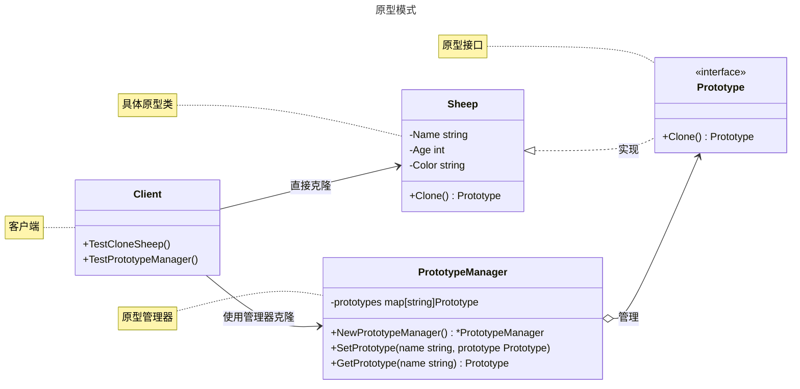

# 原型模式

## 概述

原型模式（Prototype Pattern）是一种创建型设计模式，其核心思想是通过复制（克隆）现有对象来创建新对象，而不是通过构造函数从头创建。它适用于需要创建大量相似对象或对象创建成本较高的场景。


## 模式结构

原型模式的主要角色如下：

- **抽象原型（Abstract Prototype）**：定义克隆方法的接口，规定了具体原型需要实现的克隆功能。在Go中通常使用interface定义Clone方法。
- **具体原型（Concrete Prototype）**：实现抽象原型接口的结构体，提供自身的克隆实现。在Go中需要实现Clone方法，通常进行深拷贝或浅拷贝。
- **原型管理器（Prototype Manager）**：可选角色，管理一系列原型实例的容器，提供根据标识获取和注册原型的功能。在Go中通常使用map存储原型实例。
- **克隆方法（Clone Method）**：核心方法，负责创建当前对象的副本。在Go中需要处理指针字段的深拷贝问题，可能涉及递归克隆。
- **客户端（Client）**：通过调用原型的克隆方法来创建新对象，而不是使用传统的构造函数或工厂方法创建对象。

## 实现

原型模式的UML类图如下所示：



抽象原型和具体原型定义 sheep.go 定义：

```go
package prototype

// 原型模式

// Prototype 接口定义了克隆方法（原型接口）
type Prototype interface {
	Clone() Prototype
}

// Sheep 羊结构体（具体原型）
type Sheep struct {
	Name  string // 名字
	Age   int    // 年龄
	Color string // 颜色
}

// Clone 方法实现 Prototype 接口的克隆逻辑
func (s *Sheep) Clone() Prototype {
	return &Sheep{
		Name:  s.Name,
		Age:   s.Age,
		Color: s.Color,
	}
}
```

原型管理器 manager.go 定义：

```go
package prototype

// 原型模式

// PrototypeManager 结构体（原型管理器角色）
// 用于存储和管理原型对象，提供克隆功能
type PrototypeManager struct {
	prototypes map[string]Prototype
}

// NewPrototypeManager 创建一个新的原型管理器
func NewPrototypeManager() *PrototypeManager {
	return &PrototypeManager{
		prototypes: make(map[string]Prototype),
	}
}

// SetPrototype 添加一个原型到管理器
func (pm *PrototypeManager) SetPrototype(name string, prototype Prototype) {
	pm.prototypes[name] = prototype
}

// GetPrototype 获取指定名称的原型的克隆副本
func (pm *PrototypeManager) GetPrototype(name string) Prototype {
	if prototype, exists := pm.prototypes[name]; exists {
		return prototype.Clone()
	}
	return nil
}
```

客户端（单元测试）client_test.go 定义：

```go
package prototype

import "testing"

// 单元测试
// 模拟客户端调用

// TestCloneSheep 测试羊的克隆功能
func TestCloneSheep(t *testing.T) {
	// 创建一个原型羊
	originalSheep := &Sheep{
		Name:  "Dolly",
		Age:   2,
		Color: "White",
	}

	// 客户端直接调用 Clone 方法（客户端角色）
	clonedSheep := originalSheep.Clone()

	// 验证克隆结果
	if clonedSheep == originalSheep {
		t.Error("克隆的羊与原羊是同一对象，克隆失败")
	}
	sheep, ok := clonedSheep.(*Sheep)
	if !ok {
		t.Error("克隆对象类型错误")
	}
	if sheep.Name != originalSheep.Name || sheep.Age != originalSheep.Age || sheep.Color != originalSheep.Color {
		t.Error("克隆的羊属性不一致")
	}
}

// TestPrototypeManager 测试原型管理器的功能
func TestPrototypeManager(t *testing.T) {
	// 创建原型管理器
	manager := NewPrototypeManager()

	// 创建并注册原型羊
	dolly := &Sheep{
		Name:  "Dolly",
		Age:   2,
		Color: "White",
	}
	manager.SetPrototype("Dolly", dolly)

	// 客户端通过管理器获取克隆羊（客户端角色）
	clonedPrototype := manager.GetPrototype("Dolly")
	if clonedPrototype == nil {
		t.Error("无法获取克隆羊")
	}

	// 验证克隆结果
	clonedSheep, ok := clonedPrototype.(*Sheep)
	if !ok {
		t.Error("克隆对象类型错误")
	}
	if clonedSheep == dolly {
		t.Error("克隆的羊与原羊是同一对象，克隆失败")
	}
	if clonedSheep.Name != dolly.Name || clonedSheep.Age != dolly.Age || clonedSheep.Color != dolly.Color {
		t.Error("克隆的羊属性不一致")
	}
}
```

## 深拷贝和浅拷贝

在原型模式中，拷贝的实现方式分为`浅拷贝（Shallow Copy）`和`深拷贝（Deep Copy）`。

**浅拷贝 (Shallow Copy)**

- 定义：只复制对象本身和其中包含的值类型字段。对于对象中的引用类型（如指针、切片、map），只复制其内存地址。
- 结果：拷贝后，新旧两个对象的引用类型字段将指向同一块内存地址。因此，修改其中一个对象的引用类型字段会影响到另一个对象。

示例：在上面的 `ShallowClone` 方法中 `friends` 切片只被复制了引用。当修改 `shallowClonedSheep.friends` 时，`originalSheep.friends` 也随之改变。

**深拷贝 (Deep Copy)**

- 定义：不仅复制对象本身，还会递归地复制所有引用类型字段所指向的底层数据结构。
- 结果：拷贝后，新旧两个对象完全独立，互不影响。修改任何一个对象都不会对另一个产生副作用。

示例：在上面的 `Clone` (深拷贝) 方法中，我们为 `friends` 切片创建了一个全新的副本并复制了所有元素。因此，修改 `clonedSheep.friends` 不会影响 `originalSheep`。

在原型模式中，通常推荐使用 深拷贝，以确保克隆出的对象是完全独立的，避免出现意外的数据篡改。

## 优点与缺点

**优点**

- 性能提升：当创建一个对象的过程非常耗时（如初始化需要访问数据库、网络等），通过克隆一个已有的对象会快得多。
- 简化对象创建：原型模式可以简化对象的创建过程，特别是当需要一个与现有对象仅有微小差异的新对象时，无需关心复杂的创建细节。
- 动态配置：可以在运行时指定需要克隆的原型对象，动态地改变要创建的对象类型。

**缺点**

- 需要实现克隆方法：每个需要被克隆的类都必须实现 `Clone()` 方法，这可能会给项目增加一些复杂性。
- 深拷贝的复杂性：实现深拷贝时需要特别小心，如果对象间存在复杂的引用关系（如循环引用），代码会变得非常复杂且容易出错。

## 适用场景

**创建成本高昂**：对象的创建需要消耗大量资源，如数据库查询、文件I/O、网络请求等。

**大量相似对象**：需要创建大量相似的对象，它们之间只有部分属性不同。

**隐藏创建细节**：希望向客户端隐藏一个类的实例化过程时，可以使用原型模式。

**框架集成**：在一个框架中，提供一个注册和注销原型对象的功能，使得客户端可以直接克隆这些原型而无需知道它们的具体类型。例如，GUI框架中的组件复制。

## 参考资料

- [go-patterns](https://github.com/tmrts/go-patterns)
- [Refactoring.Guru](https://refactoringguru.cn/)