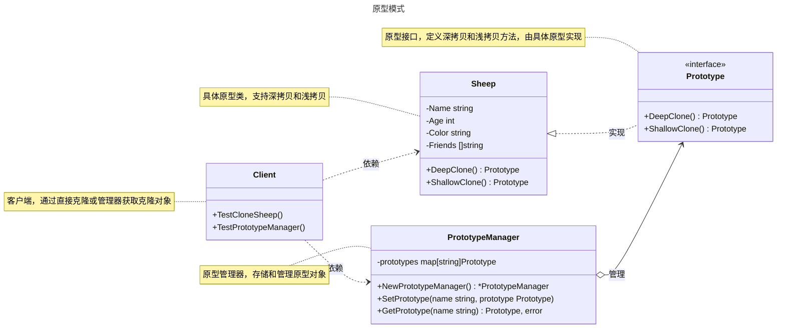

# 原型模式

## 概述

原型模式（Prototype Pattern）是一种创建型设计模式，其核心思想是通过复制（克隆）现有对象来创建新对象，而不是通过构造函数从头创建。它适用于需要创建大量相似对象或对象创建成本较高的场景。与工厂模式相比，原型模式通过克隆现有实例创建对象，避免了复杂的初始化逻辑，特别适合创建成本高或需要大量相似对象的场景。


## 模式结构

原型模式的主要角色如下：

- **抽象原型（Abstract Prototype）**：定义克隆方法的接口，规定了具体原型需要实现的克隆功能。在 Go 中，通常使用 `interface` 定义 `Clone` 方法。
- **具体原型（Concrete Prototype）**：实现抽象原型接口的结构体，提供自身的克隆实现。在 Go 中，需要实现 `Clone` 方法，通常进行深拷贝或浅拷贝。
- **原型管理器（Prototype Manager）**：可选角色，管理一系列原型实例的容器，提供根据标识获取和注册原型的功能。在 Go 中，通常使用 `map[string]Prototype` 存储原型实例，通过键值对实现动态管理。
- **克隆方法（Clone Method）**：核心方法，负责创建当前对象的副本。在 Go 中，需要处理指针字段的深拷贝问题，可能涉及递归克隆。
- **客户端（Client）**：通过调用原型的克隆方法来创建新对象，而不是使用传统的构造函数或工厂方法创建对象。在 Go 中，客户端可能表现为业务逻辑代码或单元测试代码。

## 实现

原型模式的 UML 类图如下所示：



### 抽象原型和具体原型

`sheep.go` 代码如下：

```go
package prototype

// Prototype 定义原型接口，包含深拷贝和浅拷贝方法
type Prototype interface {
    // DeepClone 执行深拷贝，返回独立的对象副本
    DeepClone() Prototype
    // ShallowClone 执行浅拷贝，复制引用类型字段的地址
    ShallowClone() Prototype
}

// Sheep 表示羊的具体原型
type Sheep struct {
    Name    string   // 名字
    Age     int      // 年龄
    Color   string   // 颜色
    Friends []string // 朋友列表（引用类型字段）
}

// DeepClone 实现深拷贝，复制所有字段，包括 Friends 切片
func (s *Sheep) DeepClone() Prototype {
    clonedFriends := make([]string, len(s.Friends))
    copy(clonedFriends, s.Friends)
    return &Sheep{
        Name:    s.Name,
        Age:     s.Age,
        Color:   s.Color,
        Friends: clonedFriends,
    }
}

// ShallowClone 实现浅拷贝，只复制 Friends 切片的引用
func (s *Sheep) ShallowClone() Prototype {
    return &Sheep{
        Name:    s.Name,
        Age:     s.Age,
        Color:   s.Color,
        Friends: s.Friends,
    }
}
```

### 原型管理器

`manager.go` 代码如下：

```go
package prototype

import "fmt"

// PrototypeManager 表示原型管理器，存储和管理原型对象
type PrototypeManager struct {
    prototypes map[string]Prototype
}

// NewPrototypeManager 创建一个新的原型管理器
func NewPrototypeManager() *PrototypeManager {
    return &PrototypeManager{
        prototypes: make(map[string]Prototype),
    }
}

// SetPrototype 添加一个原型到管理器
func (pm *PrototypeManager) SetPrototype(name string, prototype Prototype) {
    pm.prototypes[name] = prototype
}

// GetPrototype 获取指定名称的原型的克隆副本
func (pm *PrototypeManager) GetPrototype(name string) (Prototype, error) {
    if prototype, exists := pm.prototypes[name]; exists {
        return prototype.DeepClone(), nil
    }
    return nil, fmt.Errorf("prototype with name %s not found", name)
}
```

### 客户端（单元测试）

`client_test.go` 代码如下：

```go
package prototype

import (
    "testing"
)

// TestCloneSheep 测试羊的深拷贝和浅拷贝功能
func TestCloneSheep(t *testing.T) {
    originalSheep := &Sheep{
        Name:    "Dolly",
        Age:     2,
        Color:   "White",
        Friends: []string{"Alice", "Bob"},
    }

    t.Run("DeepClone", func(t *testing.T) {
        clonedSheep := originalSheep.DeepClone()
        if clonedSheep == originalSheep {
            t.Error("deep cloned sheep is the same object as original")
        }
        sheep, ok := clonedSheep.(*Sheep)
        if !ok {
            t.Error("cloned object is not of type *Sheep")
        }
        if sheep.Name != originalSheep.Name || sheep.Age != originalSheep.Age || sheep.Color != originalSheep.Color {
            t.Error("cloned sheep attributes do not match")
        }
        // 修改克隆对象的 Friends 切片，验证深拷贝
        sheep.Friends[0] = "Charlie"
        if originalSheep.Friends[0] == "Charlie" {
            t.Error("deep clone modified original sheep's Friends")
        }
    })

    t.Run("ShallowClone", func(t *testing.T) {
        clonedSheep := originalSheep.ShallowClone()
        if clonedSheep == originalSheep {
            t.Error("shallow cloned sheep is the same object as original")
        }
        sheep, ok := clonedSheep.(*Sheep)
        if !ok {
            t.Error("cloned object is not of type *Sheep")
        }
        if sheep.Name != originalSheep.Name || sheep.Age != originalSheep.Age || sheep.Color != originalSheep.Color {
            t.Error("cloned sheep attributes do not match")
        }
        // 修改克隆对象的 Friends 切片，验证浅拷贝
        sheep.Friends[0] = "Charlie"
        if originalSheep.Friends[0] != "Charlie" {
            t.Error("shallow clone did not modify original sheep's Friends")
        }
    })
}

// TestPrototypeManager 测试原型管理器的功能
func TestPrototypeManager(t *testing.T) {
    manager := NewPrototypeManager()
    dolly := &Sheep{
        Name:    "Dolly",
        Age:     2,
        Color:   "White",
        Friends: []string{"Alice", "Bob"},
    }
    manager.SetPrototype("Dolly", dolly)

    t.Run("GetPrototype", func(t *testing.T) {
        clonedPrototype, err := manager.GetPrototype("Dolly")
        if err != nil {
            t.Errorf("expected no error, got %v", err)
        }
        if clonedPrototype == nil {
            t.Error("expected non-nil prototype")
        }
        clonedSheep, ok := clonedPrototype.(*Sheep)
        if !ok {
            t.Error("cloned object is not of type *Sheep")
        }
        if clonedSheep == dolly {
            t.Error("cloned sheep is the same object as original")
        }
        if clonedSheep.Name != dolly.Name || clonedSheep.Age != dolly.Age || clonedSheep.Color != dolly.Color {
            t.Error("cloned sheep attributes do not match")
        }
        // 修改克隆对象的 Friends 切片，验证深拷贝
        clonedSheep.Friends[0] = "Charlie"
        if dolly.Friends[0] == "Charlie" {
            t.Error("deep clone modified original sheep's Friends")
        }
    })

    t.Run("UnknownPrototype", func(t *testing.T) {
        prototype, err := manager.GetPrototype("Unknown")
        if err == nil {
            t.Error("expected error for unknown prototype, got nil")
        }
        if prototype != nil {
            t.Errorf("expected nil prototype, got %v", prototype)
        }
    })
}
```

### 实现说明

原型模式通过 `Prototype` 接口和 `Sheep` 结构体实现对象的克隆，`PrototypeManager` 提供原型的管理功能。`DeepClone` 和 `ShallowClone` 方法分别展示了深拷贝和浅拷贝的实现，测试代码验证了两者的行为差异。新增产品类型只需实现新的具体原型类和 `Clone` 方法，符合开闭原则。

## 深拷贝和浅拷贝

在原型模式中，拷贝的实现方式分为**浅拷贝（Shallow Copy）**和**深拷贝（Deep Copy）**。

**浅拷贝 (Shallow Copy)**

- **定义**：只复制对象本身和其中包含的值类型字段。对于引用类型字段（如指针、切片、map），只复制其内存地址。
- **结果**：新旧两个对象的引用类型字段指向同一块内存地址，修改其中一个对象的引用类型字段会影响另一个对象。
- **示例**：在 `Sheep.ShallowClone` 方法中，`Friends` 切片只复制了引用，修改克隆对象的 `Friends` 会影响原对象的 `Friends`。

**深拷贝 (Deep Copy)**

- **定义**：不仅复制对象本身，还递归复制所有引用类型字段所指向的底层数据结构。
- **结果**：新旧两个对象完全独立，修改一个对象不会影响另一个对象。
- **示例**：在 `Sheep.DeepClone` 方法中，`Friends` 切片被完整复制，修改克隆对象的 `Friends` 不会影响原对象。

在原型模式中，通常推荐使用深拷贝，以确保克隆出的对象是完全独立的，避免意外的数据篡改。实现深拷贝时需注意复杂数据结构（如循环引用），可能需要使用序列化或其他技术。

## 适用场景

原型模式适用于以下场景：

- **创建成本高昂**：对象的创建需要消耗大量资源，如数据库查询、文件 I/O、网络请求等。
- **大量相似对象**：需要创建大量相似的对象，它们之间只有部分属性不同。
- **隐藏创建细节**：希望向客户端隐藏对象的实例化过程，客户端只需调用克隆方法。
- **对象池**：在高并发系统中，通过克隆原型创建对象池（如数据库连接对象），减少初始化开销。
- **GUI 组件复制**：在 GUI 框架中，通过克隆现有组件创建新组件，简化界面元素的动态生成。

## 优点与缺点

**优点**：
- **性能提升**：通过克隆现有对象，避免复杂初始化逻辑（如数据库查询、网络请求），提高创建效率。
- **简化对象创建**：客户端无需关心对象的构造细节，适合创建大量相似对象。
- **动态配置**：在运行时选择原型对象，支持动态创建不同类型的对象。

**缺点**：
- **实现复杂性**：每个具体原型类都需要实现 `Clone` 方法，尤其是深拷贝可能涉及复杂的数据结构（如循环引用）。
- **深拷贝性能开销**：深拷贝需要复制所有引用类型字段，可能影响性能。
- **并发安全**：在并发场景下，原型管理器的访问需要加锁以确保线程安全。

## 注意事项

- **Go 设计哲学**：Go 强调简单性和显式依赖，原型模式适合创建成本高或需要大量相似对象的场景。对于简单对象，传统的构造函数可能更直接。
- **并发安全**：在并发环境中，原型管理器的访问需要加锁（如使用 `sync.RWMutex`）以确保线程安全。
- **深拷贝实现**：实现深拷贝时需注意复杂数据结构（如循环引用），避免性能问题或错误。

## 参考资料

- [go-patterns](https://github.com/tmrts/go-patterns)
- [Refactoring.Guru](https://refactoringguru.cn/)