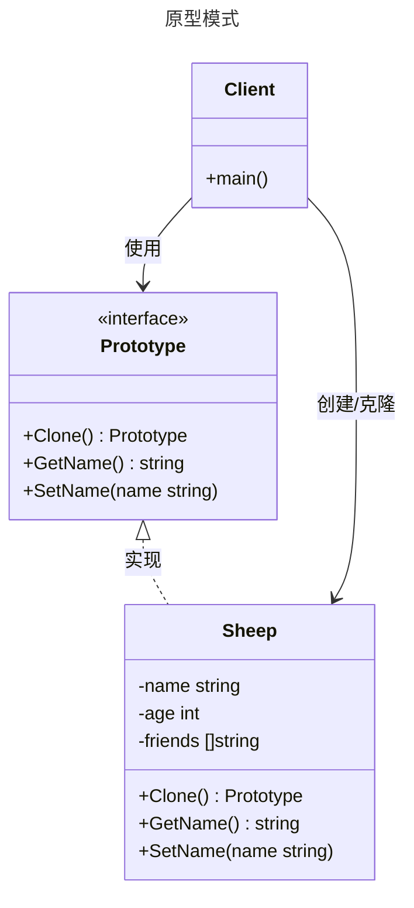

# 原型模式

## 概述

原型模式（Prototype Pattern）是一种创建型设计模式，其核心思想是通过复制（克隆）现有对象来创建新对象，而不是通过构造函数从头创建。它适用于需要创建大量相似对象或对象创建成本较高的场景。


## 模式结构

原型模式的主要角色如下：

- 抽象原型类：规定了具体原型对象必须实现的的 clone() 方法。
- 具体原型类：实现抽象原型类的 clone() 方法，它是可被复制的对象。
- 访问类：使用具体原型类中的 clone() 方法来复制新的对象。

## 实现

原型模式的UML类图如下所示：



抽象原型和具体原型定义 sheep.go 定义：

```go
package prototype

// 原型模式

// Prototype 原型接口，定义了CLone方法
type Prototype interface {
	Clone() Prototype
	GetName() string
	SetName(name string)
}

// Sheep 具体的原型
type Sheep struct {
	name string
	age  uint
}

// GetName 获取羊的名字
func (s *Sheep) GetName() string {
	return s.name
}

// SetName 设置羊的名字
func (s *Sheep) SetName(name string) {
	s.name = name
}

// Clone 实现克隆方法（深拷贝）
func (s *Sheep) Clone() Prototype {
	return &Sheep{
		name: s.name,
		age:  s.age,
	}
}
```

单元测试 sheep_test.go 定义：

```go
package prototype

import (
	"reflect" // 引入 reflect 包用于深度比较切片
	"testing"
)

// TestSheepClone 测试羊的克隆功能（深拷贝）
func TestSheepClone(t *testing.T) {
	// 1. 创建原始羊对象
	originalSheep := &Sheep{
		name:    "Dolly",
		age:     3,
		friends: []string{"Tom", "Jerry"},
	}

	// 2. 克隆羊（深拷贝）
	clonedSheep := originalSheep.Clone().(*Sheep)

	// 3. 修改克隆羊的属性
	clonedSheep.SetName("多利")
	clonedSheep.friends[0] = "Sam" // 修改克隆羊的朋友列表

	// 4. 验证结果
	// 验证原始对象的值没有被修改
	if originalSheep.GetName() != "Dolly" {
		t.Errorf("原始羊的名字不应被修改，期望 'Dolly', 得到 '%s'", originalSheep.GetName())
	}

	expectedOriginalFriends := []string{"Tom", "Jerry"}
	if !reflect.DeepEqual(originalSheep.GetFriends(), expectedOriginalFriends) {
		t.Errorf("深拷贝后，原对象的引用类型字段不应被修改，期望 %v, 得到 %v", expectedOriginalFriends, originalSheep.GetFriends())
	}

	// 验证克隆对象的值是修改后的
	if clonedSheep.GetName() != "多利" {
		t.Errorf("克隆羊的名字应为 '多利', 得到 '%s'", clonedSheep.GetName())
	}
	if clonedSheep.age != 3 {
		t.Errorf("克隆羊的年龄应为 3, 得到 %d", clonedSheep.age)
	}

	expectedClonedFriends := []string{"Sam", "Jerry"}
	if !reflect.DeepEqual(clonedSheep.GetFriends(), expectedClonedFriends) {
		t.Errorf("克隆羊的朋友列表应被修改，期望 %v, 得到 %v", expectedClonedFriends, clonedSheep.GetFriends())
	}
}

// TestSheepShallowClone 测试羊的浅拷贝功能
func TestSheepShallowClone(t *testing.T) {
	// 1. 创建原始羊对象
	originalSheep := &Sheep{
		name:    "Dolly",
		age:     3,
		friends: []string{"Tom", "Jerry"},
	}

	// 2. 浅拷贝羊
	shallowClonedSheep := originalSheep.ShallowClone()

	// 3. 修改克隆羊的属性
	shallowClonedSheep.SetName("多利")
	shallowClonedSheep.friends[0] = "Sam" // 修改克隆羊的朋友列表

	// 4. 验证结果
	// 验证原始对象的值被意外修改了！
	if originalSheep.GetName() != "Dolly" {
		t.Errorf("原始羊的名字不应被修改，期望 'Dolly', 得到 '%s'", originalSheep.GetName())
	}

	expectedFriends := []string{"Sam", "Jerry"}
	if !reflect.DeepEqual(originalSheep.GetFriends(), expectedFriends) {
		t.Errorf("浅拷贝后，原对象的引用类型字段被修改了，期望 %v, 得到 %v", expectedFriends, originalSheep.GetFriends())
	}

	// 验证克隆对象的值
	if shallowClonedSheep.GetName() != "多利" {
		t.Errorf("克隆羊的名字应为 '多利', 得到 '%s'", shallowClonedSheep.GetName())
	}
	if !reflect.DeepEqual(shallowClonedSheep.GetFriends(), expectedFriends) {
		t.Errorf("克隆羊的朋友列表应被修改，期望 %v, 得到 %v", expectedFriends, shallowClonedSheep.GetFriends())
	}
}
```

## 深拷贝和浅拷贝

在原型模式中，拷贝的实现方式分为`浅拷贝（Shallow Copy）`和`深拷贝（Deep Copy）`。

**浅拷贝 (Shallow Copy)**

- 定义：只复制对象本身和其中包含的值类型字段。对于对象中的引用类型（如指针、切片、map），只复制其内存地址。
- 结果：拷贝后，新旧两个对象的引用类型字段将指向同一块内存地址。因此，修改其中一个对象的引用类型字段会影响到另一个对象。

示例：在上面的 `ShallowClone` 方法中 `friends` 切片只被复制了引用。当修改 `shallowClonedSheep.friends` 时，`originalSheep.friends` 也随之改变。

**深拷贝 (Deep Copy)**

- 定义：不仅复制对象本身，还会递归地复制所有引用类型字段所指向的底层数据结构。
- 结果：拷贝后，新旧两个对象完全独立，互不影响。修改任何一个对象都不会对另一个产生副作用。

示例：在上面的 `Clone` (深拷贝) 方法中，我们为 `friends` 切片创建了一个全新的副本并复制了所有元素。因此，修改 `clonedSheep.friends` 不会影响 `originalSheep`。

在原型模式中，通常推荐使用 深拷贝，以确保克隆出的对象是完全独立的，避免出现意外的数据篡改。

## 优缺点

**优点**

- 性能提升：当创建一个对象的过程非常耗时（如初始化需要访问数据库、网络等），通过克隆一个已有的对象会快得多。
- 简化对象创建：原型模式可以简化对象的创建过程，特别是当需要一个与现有对象仅有微小差异的新对象时，无需关心复杂的创建细节。
- 动态配置：可以在运行时指定需要克隆的原型对象，动态地改变要创建的对象类型。

**缺点**

- 需要实现克隆方法：每个需要被克隆的类都必须实现 `Clone()` 方法，这可能会给项目增加一些复杂性。
- 深拷贝的复杂性：实现深拷贝时需要特别小心，如果对象间存在复杂的引用关系（如循环引用），代码会变得非常复杂且容易出错。

## 适用场景

**创建成本高昂**：对象的创建需要消耗大量资源，如数据库查询、文件I/O、网络请求等。

**大量相似对象**：需要创建大量相似的对象，它们之间只有部分属性不同。

**隐藏创建细节**：希望向客户端隐藏一个类的实例化过程时，可以使用原型模式。

**框架集成**：在一个框架中，提供一个注册和注销原型对象的功能，使得客户端可以直接克隆这些原型而无需知道它们的具体类型。例如，GUI框架中的组件复制。

## 参考资料

- [go-patterns](https://github.com/tmrts/go-patterns)
- [Refactoring.Guru](https://refactoringguru.cn/)