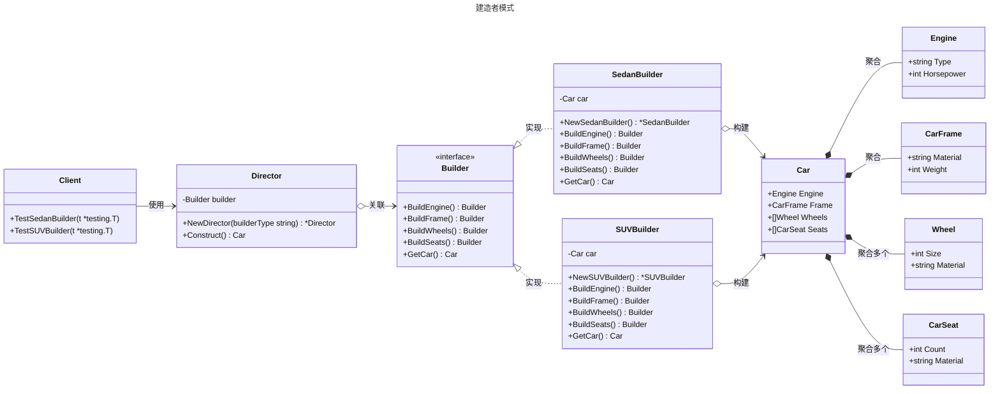

# 建造者模式

## 概述

建造者模式（Builder Pattern）是一种创建型设计模式，用于分步构建复杂对象，允许通过链式调用逐步设置对象的属性，最终生成完整对象。它特别适合需要多种配置组合的对象创建场景。


## 模式结构

建造者模式的主要角色如下：

- **产品（Product）**：被构建的复杂对象，通常包含多个组成部分或属性。在Go中通常是一个结构体，包含多个字段。
- **抽象建造者（Abstract Builder）**：定义构建产品各个部分的接口，规定了建造步骤的方法。在Go中通常使用interface定义，包含各种Build方法和GetResult方法。
- **具体建造者（Concrete Builder）**：实现抽象建造者接口的结构体，负责具体产品的构建过程，维护一个产品实例并逐步构建。
- **指挥者（Director）**：控制建造过程的类，定义构建产品的步骤顺序，通过调用建造者的方法来构建产品。在Go中通常是一个结构体，持有建造者的引用。
- **客户端（Client）**：创建具体建造者和指挥者对象，通过指挥者来获取最终构建的产品。也可以直接使用建造者进行链式调用。

## 实现

建造者模式的UML类图如下所示：



产品 car.go 定义：

```go
package builder

// 建造者模式

// 构建的复杂产品

// Engine 表示汽车的引擎结构体
type Engine struct {
	Type       string // 引擎类型（如汽油、电动）
	Horsepower int    // 马力，单位为马力（hp）
}

// CarFrame 表示汽车的车骨架结构体
type CarFrame struct {
	Material string // 骨架材料（如钢、铝合金）
	Weight   int    // 骨架重量，单位为千克（kg）
}

// Wheel 表示汽车的车轮结构体
type Wheel struct {
	Size     int    // 车轮尺寸，单位为英寸
	Material string // 车轮材料（如铝合金、钢）
}

// CarSeat 表示汽车的座位结构体
type CarSeat struct {
	Count    int    // 座位数量
	Material string // 座椅材料（如皮革、织物）
}

// Car 表示最终的汽车产品结构体，包含引擎、车骨架、车轮和座位
type Car struct {
	Engine Engine    // 汽车的引擎
	Frame  CarFrame  // 汽车的车骨架
	Wheels []Wheel   // 汽车的车轮列表
	Seats  []CarSeat // 汽车的座位列表
}
```

抽象建造者、具体建造者、指挥者 builder.go 定义：

```go
package builder

// 建造者模式

// Builder 定义抽象建造者接口，声明构建汽车各部分的抽象方法
type Builder interface {
	BuildEngine() Builder
	BuildFrame() Builder
	BuildWheels() Builder
	BuildSeats() Builder
	GetCar() Car
}

// SedanBuilder 具体建造者，用于构建轿车
type SedanBuilder struct {
	car Car
}

// NewSedanBuilder 创建一个新的轿车建造者实例
func NewSedanBuilder() *SedanBuilder {
	return &SedanBuilder{car: Car{}}
}

// BuildEngine 构建轿车的引擎，设置为汽油引擎，马力150
func (b *SedanBuilder) BuildEngine() Builder {
	b.car.Engine = Engine{
		Type:       "Gasoline",
		Horsepower: 150,
	}
	return b
}

// BuildFrame 构建轿车的车骨架，材料为钢，重量1200千克
func (b *SedanBuilder) BuildFrame() Builder {
	b.car.Frame = CarFrame{
		Material: "Steel",
		Weight:   1200,
	}
	return b
}

// BuildWheels 构建轿车的四个车轮，尺寸16英寸，材料为铝合金
func (b *SedanBuilder) BuildWheels() Builder {
	b.car.Wheels = []Wheel{
		{Size: 16, Material: "Aluminum"},
		{Size: 16, Material: "Aluminum"},
		{Size: 16, Material: "Aluminum"},
		{Size: 16, Material: "Aluminum"},
	}
	return b
}

// BuildSeats 构建轿车的座位，包括前排2个和后排3个，材料为皮革
func (b *SedanBuilder) BuildSeats() Builder {
	b.car.Seats = []CarSeat{
		{Count: 2, Material: "Leather"},
		{Count: 3, Material: "Leather"},
	}
	return b
}

// GetCar 返回最终构建的轿车对象
func (b *SedanBuilder) GetCar() Car {
	return b.car
}

// SUVBuilder 具体建造者，用于构建SUV
type SUVBuilder struct {
	car Car
}

// NewSUVBuilder 创建一个新的SUV建造者实例
func NewSUVBuilder() *SUVBuilder {
	return &SUVBuilder{car: Car{}}
}

// BuildEngine 构建SUV的引擎，设置为柴油引擎，马力200
func (b *SUVBuilder) BuildEngine() Builder {
	b.car.Engine = Engine{
		Type:       "Diesel",
		Horsepower: 200,
	}
	return b
}

// BuildFrame 构建SUV的车骨架，材料为铝合金，重量1800千克
func (b *SUVBuilder) BuildFrame() Builder {
	b.car.Frame = CarFrame{
		Material: "Aluminum",
		Weight:   1800,
	}
	return b
}

// BuildWheels 构建SUV的四个车轮，尺寸18英寸，材料为铝合金
func (b *SUVBuilder) BuildWheels() Builder {
	b.car.Wheels = []Wheel{
		{Size: 18, Material: "Aluminum"},
		{Size: 18, Material: "Aluminum"},
		{Size: 18, Material: "Aluminum"},
		{Size: 18, Material: "Aluminum"},
	}
	return b
}

// BuildSeats 构建SUV的座位，包括前排2个、后排3个、第三排2个，材料为织物
func (b *SUVBuilder) BuildSeats() Builder {
	b.car.Seats = []CarSeat{
		{Count: 2, Material: "Fabric"},
		{Count: 3, Material: "Fabric"},
		{Count: 2, Material: "Fabric"},
	}
	return b
}

// GetCar 返回最终构建的SUV对象
func (b *SUVBuilder) GetCar() Car {
	return b.car
}

// Director 指挥者，负责协调建造过程
type Director struct {
	builder Builder
}

// NewDirector 创建一个新的指挥者实例，绑定指定的建造者
func NewDirector(builderType string) *Director {
	var builder Builder
	switch builderType {
	case "sedan":
		builder = NewSedanBuilder()
	case "suv":
		builder = NewSUVBuilder()
	default:
		builder = NewSedanBuilder() // 默认使用轿车建造者
	}
	return &Director{builder: builder}
}

// Construct 按照固定顺序调用建造者的方法，构建完整的汽车
func (d *Director) Construct() Car {
	return d.builder.BuildEngine().BuildFrame().BuildWheels().BuildSeats().GetCar()
}
```

客户端（单元测试）client_test.go 定义：

```go
package builder

import (
	"reflect"
	"testing"
)

// 单元测试
// 模拟客户端调用

// TestSedanBuilder 测试轿车建造者的功能
func TestSedanBuilder(t *testing.T) {
	// 创建指挥者，指定轿车类型
	director := NewDirector("sedan")
	// 构建轿车
	car := director.Construct()

	// 验证引擎
	expectedEngine := Engine{Type: "Gasoline", Horsepower: 150}
	if !reflect.DeepEqual(car.Engine, expectedEngine) {
		t.Errorf("期望引擎 %v, 实际得到 %v", expectedEngine, car.Engine)
	}

	// 验证车骨架
	expectedFrame := CarFrame{Material: "Steel", Weight: 1200}
	if !reflect.DeepEqual(car.Frame, expectedFrame) {
		t.Errorf("期望车骨架 %v, 实际得到 %v", expectedFrame, car.Frame)
	}

	// 验证车轮
	expectedWheels := []Wheel{
		{Size: 16, Material: "Aluminum"},
		{Size: 16, Material: "Aluminum"},
		{Size: 16, Material: "Aluminum"},
		{Size: 16, Material: "Aluminum"},
	}
	if !reflect.DeepEqual(car.Wheels, expectedWheels) {
		t.Errorf("期望车轮 %v, 实际得到 %v", expectedWheels, car.Wheels)
	}

	// 验证座位
	expectedSeats := []CarSeat{
		{Count: 2, Material: "Leather"},
		{Count: 3, Material: "Leather"},
	}
	if !reflect.DeepEqual(car.Seats, expectedSeats) {
		t.Errorf("期望座位 %v, 实际得到 %v", expectedSeats, car.Seats)
	}
}

// TestSUVBuilder 测试SUV建造者的功能
func TestSUVBuilder(t *testing.T) {
	// 创建指挥者，指定SUV类型
	director := NewDirector("suv")
	// 构建SUV
	car := director.Construct()

	// 验证引擎
	expectedEngine := Engine{Type: "Diesel", Horsepower: 200}
	if !reflect.DeepEqual(car.Engine, expectedEngine) {
		t.Errorf("期望引擎 %v, 实际得到 %v", expectedEngine, car.Engine)
	}

	// 验证车骨架
	expectedFrame := CarFrame{Material: "Aluminum", Weight: 1800}
	if !reflect.DeepEqual(car.Frame, expectedFrame) {
		t.Errorf("期望车骨架 %v, 实际得到 %v", expectedFrame, car.Frame)
	}

	// 验证车轮
	expectedWheels := []Wheel{
		{Size: 18, Material: "Aluminum"},
		{Size: 18, Material: "Aluminum"},
		{Size: 18, Material: "Aluminum"},
		{Size: 18, Material: "Aluminum"},
	}
	if !reflect.DeepEqual(car.Wheels, expectedWheels) {
		t.Errorf("期望车轮 %v, 实际得到 %v", expectedWheels, car.Wheels)
	}

	// 验证座位
	expectedSeats := []CarSeat{
		{Count: 2, Material: "Fabric"},
		{Count: 3, Material: "Fabric"},
		{Count: 2, Material: "Fabric"},
	}
	if !reflect.DeepEqual(car.Seats, expectedSeats) {
		t.Errorf("期望座位 %v, 实际得到 %v", expectedSeats, car.Seats)
	}
}
```

## 优缺点

**优点**：

- 建造者模式的封装性很好。使用建造者模式可以有效的封装变化，在使用建造者模式的场景中，一般产品类和建造者类是比较稳定的，因此，将主要的业务逻辑封装在指挥者类中对整体而言可以取得比较好的稳定性。
- 在建造者模式中，客户端不必知道产品内部组成的细节，将产品本身与产品的创建过程解耦，使得相同的创建过程可以创建不同的产品对象。
- 可以更加精细地控制产品的创建过程 。将复杂产品的创建步骤分解在不同的方法中，使得创建过程更加清晰，也更方便使用程序来控制创建过程。
- 建造者模式很容易进行扩展。如果有新的需求，通过实现一个新的建造者类就可以完成，基本上不用修改之前已经测试通过的代码，因此也就不会对原有功能引入风险。符合开闭原则。

**缺点**：

- 造者模式所创建的产品一般具有较多的共同点，其组成部分相似，如果产品之间的差异性很大，则不适合使用建造者模式，因此其使用范围受到一定的限制。

## 适用场景

建造者（Builder）模式创建的是复杂对象，其产品的各个部分经常面临着剧烈的变化，但将它们组合在一起的算法却相对稳定，所以它通常在以下场合使用。

- 创建的对象较复杂，由多个部件构成，各部件面临着复杂的变化，但构件间的建造顺序是稳定的。
- 创建复杂对象的算法独立于该对象的组成部分以及它们的装配方式，即产品的构建过程和最终的表示是独立的。

## 参考资料

- [go-patterns](https://github.com/tmrts/go-patterns)
- [Refactoring.Guru](https://refactoringguru.cn/)