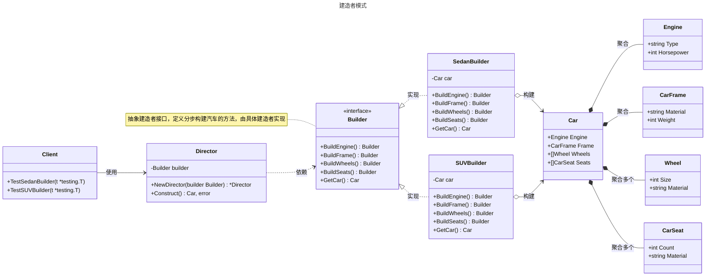

# 建造者模式

## 概述

建造者模式（Builder Pattern）是一种创建型设计模式，用于分步构建复杂对象，允许通过链式调用逐步设置对象的属性，最终生成完整对象。它特别适合需要多种配置组合的对象创建场景。与工厂模式相比，建造者模式更适合分步构建复杂对象，允许灵活配置对象的各个部分，适合需要多种组合的场景。


## 模式结构

建造者模式的主要角色如下：

- **产品（Product）**：被构建的复杂对象，通常包含多个组成部分或属性。在 Go 中，通常是一个结构体，包含多个字段。
- **抽象建造者（Abstract Builder）**：定义构建产品各个部分的接口，规定了建造步骤的方法。在 Go 中，通常使用 `interface` 定义，包含各种 `Build` 方法和 `GetResult` 方法。
- **具体建造者（Concrete Builder）**：实现抽象建造者接口的结构体，负责具体产品的构建过程，维护一个产品实例并逐步构建。
- **指挥者（Director）**：控制建造过程的类，定义构建产品的步骤顺序，通过调用建造者的方法来构建产品。在 Go 中，指挥者是可选的，客户端可以直接调用建造者的方法进行链式构建。
- **客户端（Client）**：创建具体建造者和指挥者对象，通过指挥者或直接调用建造者获取最终构建的产品。

## 实现

建造者模式的 UML 类图如下所示：



### 产品

`car.go` 代码如下：

```go
package builder

// Engine 表示汽车的引擎
type Engine struct {
    Type       string // 引擎类型，例如汽油或电动
    Horsepower int    // 马力，单位为马力（hp）
}

// CarFrame 表示汽车的车骨架
type CarFrame struct {
    Material string // 骨架材料，例如钢或铝合金
    Weight   int    // 骨架重量，单位为千克（kg）
}

// Wheel 表示汽车的车轮
type Wheel struct {
    Size     int    // 车轮尺寸，单位为英寸
    Material string // 车轮材料，例如铝合金或钢
}

// CarSeat 表示汽车的座位
type CarSeat struct {
    Count    int    // 座位数量
    Material string // 座椅材料，例如皮革或织物
}

// Car 表示最终的汽车产品，包含引擎、车骨架、车轮和座位
type Car struct {
    Engine Engine    // 汽车的引擎
    Frame  CarFrame  // 汽车的车骨架
    Wheels []Wheel   // 汽车的车轮列表
    Seats  []CarSeat // 汽车的座位列表
}
```

### 抽象建造者、具体建造者和指挥者

`builder.go` 代码如下：

```go
package builder

import "fmt"

// Builder 定义抽象建造者接口，声明构建汽车各部分的抽象方法
type Builder interface {
    BuildEngine() Builder
    BuildFrame() Builder
    BuildWheels() Builder
    BuildSeats() Builder
    GetCar() Car
}

// SedanBuilder 具体建造者，用于构建轿车
type SedanBuilder struct {
    car Car
}

// BuildEngine 构建轿车的引擎，设置为汽油引擎，马力150
func (b *SedanBuilder) BuildEngine() Builder {
    b.car.Engine = Engine{
        Type:       "Gasoline",
        Horsepower: 150,
    }
    return b
}

// BuildFrame 构建轿车的车骨架，材料为钢，重量1200千克
func (b *SedanBuilder) BuildFrame() Builder {
    b.car.Frame = CarFrame{
        Material: "Steel",
        Weight:   1200,
    }
    return b
}

// BuildWheels 构建轿车的四个车轮，尺寸16英寸，材料为铝合金
func (b *SedanBuilder) BuildWheels() Builder {
    b.car.Wheels = []Wheel{
        {Size: 16, Material: "Aluminum"},
        {Size: 16, Material: "Aluminum"},
        {Size: 16, Material: "Aluminum"},
        {Size: 16, Material: "Aluminum"},
    }
    return b
}

// BuildSeats 构建轿车的座位，包括前排2个和后排3个，材料为皮革
func (b *SedanBuilder) BuildSeats() Builder {
    b.car.Seats = []CarSeat{
        {Count: 2, Material: "Leather"},
        {Count: 3, Material: "Leather"},
    }
    return b
}

// GetCar 返回最终构建的轿车对象
func (b *SedanBuilder) GetCar() Car {
    return b.car
}

// SUVBuilder 具体建造者，用于构建SUV
type SUVBuilder struct {
    car Car
}

// BuildEngine 构建SUV的引擎，设置为柴油引擎，马力200
func (b *SUVBuilder) BuildEngine() Builder {
    b.car.Engine = Engine{
        Type:       "Diesel",
        Horsepower: 200,
    }
    return b
}

// BuildFrame 构建SUV的车骨架，材料为铝合金，重量1800千克
func (b *SUVBuilder) BuildFrame() Builder {
    b.car.Frame = CarFrame{
        Material: "Aluminum",
        Weight:   1800,
    }
    return b
}

// BuildWheels 构建SUV的四个车轮，尺寸18英寸，材料为铝合金
func (b *SUVBuilder) BuildWheels() Builder {
    b.car.Wheels = []Wheel{
        {Size: 18, Material: "Aluminum"},
        {Size: 18, Material: "Aluminum"},
        {Size: 18, Material: "Aluminum"},
        {Size: 18, Material: "Aluminum"},
    }
    return b
}

// BuildSeats 构建SUV的座位，包括前排2个、后排3个、第三排2个，材料为织物
func (b *SUVBuilder) BuildSeats() Builder {
    b.car.Seats = []CarSeat{
        {Count: 2, Material: "Fabric"},
        {Count: 3, Material: "Fabric"},
        {Count: 2, Material: "Fabric"},
    }
    return b
}

// GetCar 返回最终构建的SUV对象
func (b *SUVBuilder) GetCar() Car {
    return b.car
}

// Director 指挥者，负责协调建造过程
type Director struct {
    builder Builder
}

// NewDirector 创建一个新的指挥者实例，绑定指定的建造者
func NewDirector(builder Builder) *Director {
    return &Director{builder: builder}
}

// Construct 按照固定顺序调用建造者的方法，构建完整的汽车
func (d *Director) Construct() (Car, error) {
    if d.builder == nil {
        return Car{}, fmt.Errorf("builder is nil")
    }
    return d.builder.BuildEngine().BuildFrame().BuildWheels().BuildSeats().GetCar(), nil
}
```

### 客户端（单元测试）

`client_test.go` 代码如下：

```go
package builder

import (
    "reflect"
    "testing"
)

// TestBuilder 测试建造者模式的功能
func TestBuilder(t *testing.T) {
    t.Run("SedanBuilder", func(t *testing.T) {
        builder := &SedanBuilder{}
        director := NewDirector(builder)
        car, err := director.Construct()
        if err != nil {
            t.Errorf("expected no error, got %v", err)
        }

        // 验证引擎
        expectedEngine := Engine{Type: "Gasoline", Horsepower: 150}
        if !reflect.DeepEqual(car.Engine, expectedEngine) {
            t.Errorf("expected engine %v, got %v", expectedEngine, car.Engine)
        }

        // 验证车骨架
        expectedFrame := CarFrame{Material: "Steel", Weight: 1200}
        if !reflect.DeepEqual(car.Frame, expectedFrame) {
            t.Errorf("expected frame %v, got %v", expectedFrame, car.Frame)
        }

        // 验证车轮
        expectedWheels := []Wheel{
            {Size: 16, Material: "Aluminum"},
            {Size: 16, Material: "Aluminum"},
            {Size: 16, Material: "Aluminum"},
            {Size: 16, Material: "Aluminum"},
        }
        if !reflect.DeepEqual(car.Wheels, expectedWheels) {
            t.Errorf("expected wheels %v, got %v", expectedWheels, car.Wheels)
        }

        // 验证座位
        expectedSeats := []CarSeat{
            {Count: 2, Material: "Leather"},
            {Count: 3, Material: "Leather"},
        }
        if !reflect.DeepEqual(car.Seats, expectedSeats) {
            t.Errorf("expected seats %v, got %v", expectedSeats, car.Seats)
        }
    })

    t.Run("SUVBuilder", func(t *testing.T) {
        builder := &SUVBuilder{}
        director := NewDirector(builder)
        car, err := director.Construct()
        if err != nil {
            t.Errorf("expected no error, got %v", err)
        }

        // 验证引擎
        expectedEngine := Engine{Type: "Diesel", Horsepower: 200}
        if !reflect.DeepEqual(car.Engine, expectedEngine) {
            t.Errorf("expected engine %v, got %v", expectedEngine, car.Engine)
        }

        // 验证车骨架
        expectedFrame := CarFrame{Material: "Aluminum", Weight: 1800}
        if !reflect.DeepEqual(car.Frame, expectedFrame) {
            t.Errorf("expected frame %v, got %v", expectedFrame, car.Frame)
        }

        // 验证车轮
        expectedWheels := []Wheel{
            {Size: 18, Material: "Aluminum"},
            {Size: 18, Material: "Aluminum"},
            {Size: 18, Material: "Aluminum"},
            {Size: 18, Material: "Aluminum"},
        }
        if !reflect.DeepEqual(car.Wheels, expectedWheels) {
            t.Errorf("expected wheels %v, got %v", expectedWheels, car.Wheels)
        }

        // 验证座位
        expectedSeats := []CarSeat{
            {Count: 2, Material: "Fabric"},
            {Count: 3, Material: "Fabric"},
            {Count: 2, Material: "Fabric"},
        }
        if !reflect.DeepEqual(car.Seats, expectedSeats) {
            t.Errorf("expected seats %v, got %v", expectedSeats, car.Seats)
        }
    })

    t.Run("NilBuilder", func(t *testing.T) {
        director := NewDirector(nil)
        car, err := director.Construct()
        if err == nil {
            t.Error("expected error for nil builder, got nil")
        }
        if car != (Car{}) {
            t.Errorf("expected empty car, got %v", car)
        }
    })

    t.Run("DirectBuilder", func(t *testing.T) {
        builder := &SedanBuilder{}
        car := builder.BuildEngine().BuildFrame().BuildWheels().BuildSeats().GetCar()

        // 验证引擎
        expectedEngine := Engine{Type: "Gasoline", Horsepower: 150}
        if !reflect.DeepEqual(car.Engine, expectedEngine) {
            t.Errorf("expected engine %v, got %v", expectedEngine, car.Engine)
        }
    })
}
```

### 实现说明

建造者模式通过 `Builder` 接口和具体建造者（`SedanBuilder`、`SUVBuilder`）实现汽车的分步构建，`Director` 协调构建步骤的顺序，客户端可以通过指挥者或直接调用建造者的方法获取产品。链式调用提高了代码可读性，新增产品类型只需实现新的建造者类，符合开闭原则。

### 链式调用示例

在 Go 中，客户端可以直接调用建造者的方法进行链式构建，无需使用指挥者。例如：

```go
builder := &SedanBuilder{}
car := builder.BuildEngine().BuildFrame().BuildWheels().BuildSeats().GetCar()
```

这种方式简化了构建过程，适合需要灵活配置的场景。

## 适用场景

建造者模式适用于以下场景：

- **复杂对象构建**：创建的对象较复杂，由多个部件构成，各部件面临复杂的变化，但构建顺序稳定。
- **多种配置组合**：需要支持多种配置组合，如不同类型的汽车（轿车、SUV）或复杂配置对象。
- **复杂配置对象**：如 HTTP 客户端配置，允许分步设置超时、重试策略等参数。
- **数据模型构建**：如构建复杂的 JSON 或数据库记录对象，需逐步设置多个字段。

## 优点与缺点

**优点**：
- **封装性强**：将复杂对象的构建过程封装在建造者中，客户端无需关心内部细节。
- **分步构建**：通过链式调用分步构建对象，提高代码可读性和灵活性。
- **符合开闭原则**：新增产品类型只需添加新的建造者类，无需修改现有代码。
- **复用构建逻辑**：相同的构建步骤可用于不同产品，减少重复代码。

**缺点**：
- **产品差异性限制**：建造者模式适合组成部分相似的对象，如果产品差异较大，需定义多个建造者，增加复杂度。
- **实现复杂性**：需要为每种产品定义具体建造者类，增加代码量。

## 注意事项

- **Go 设计哲学**：Go 强调简单性和显式依赖，建造者模式适合构建复杂对象或需要灵活配置的场景。对于简单对象，直接构造可能更简洁。
- **链式调用**：在 Go 中，建造者模式的链式调用可以通过返回接口类型实现，提高代码可读性。
- **错误处理**：在 Go 中，建造者方法应返回错误以便客户端处理异常情况。

## 参考资料

- [go-patterns](https://github.com/tmrts/go-patterns)
- [Refactoring.Guru](https://refactoringguru.cn/)