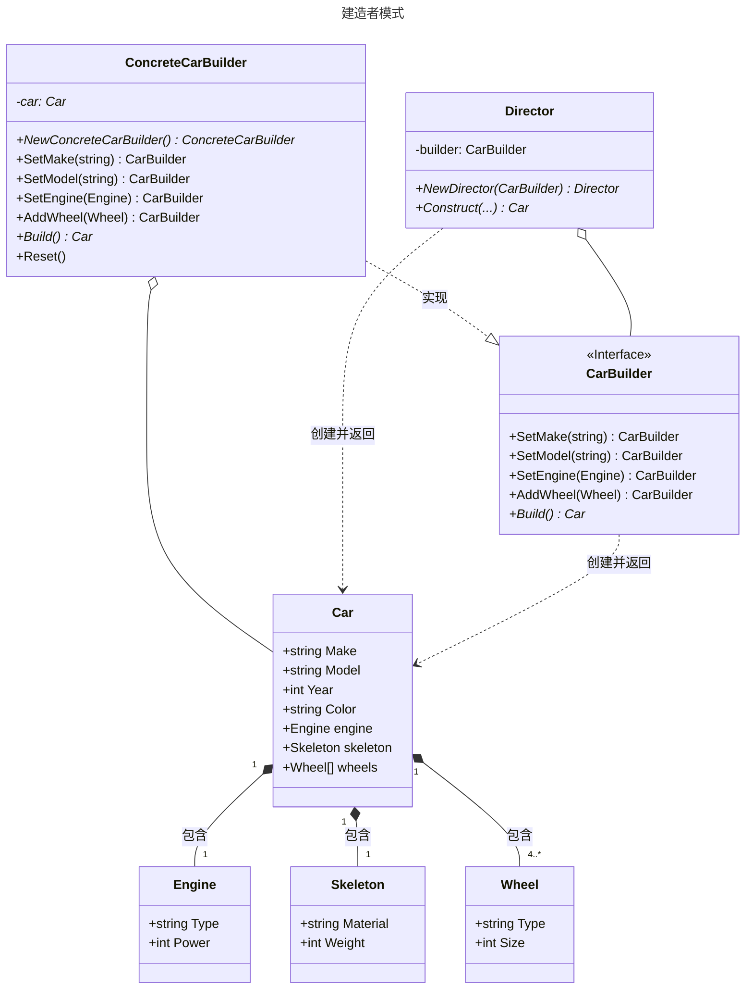

# 建造者模式

## 概述

建造者模式（Builder Pattern）是一种创建型设计模式，用于分步构建复杂对象，允许通过链式调用逐步设置对象的属性，最终生成完整对象。它特别适合需要多种配置组合的对象创建场景。


## 模式结构

建造者模式的主要角色如下：

- 抽象建造者类（Builder）：这个接口规定要实现复杂对象的那些部分的创建，并不涉及具体的部件对象的创建。
- 具体建造者类（ConcreteBuilder）：实现 Builder 接口，完成复杂产品的各个部件的具体创建方法。在构造过程完成后，提供产品的实例。
- 产品类（Product）：要创建的复杂对象。
- 指挥者类（Director）：调用具体建造者来创建复杂对象的各个部分，在指导者中不涉及具体产品的信息，只负责保证对象各部分完整创建或按某种顺序创建。

## 实现

建造者模式的UML类图如下所示：



产品类 car.go 定义：

```go
package builder

// 定义汽车相关结构体

// Engine 引擎
type Engine struct {
	Type  string // 引擎类型
	Power int    // 马力
}

// Skeleton 车身骨架
type Skeleton struct {
	Material string // 材料
	Weight   int    // 重量
}

// Wheel 车轮
type Wheel struct {
	Type string // 车轮类型
	Size int    // 直径大小
}

// Car 车 表示我们需要通过建造者 builder 建造的对象
type Car struct {
	Make     string   // 制作商
	Model    string   // 型号
	Year     int      // 年份
	Color    string   // 颜色
	Engine   Engine   // 引擎
	Skeleton Skeleton // 车骨架
	Wheels   []Wheel  // 车轮
}
```

建造者类 builder.go 定义：

```go
package builder

// 建造者 builder

// CarBuilder 是构建汽车的接口
type CarBuilder interface {
	// SetMake 设置汽车的制造商
	SetMake(string) CarBuilder
	// SetModel 设置汽车的型号
	SetModel(string) CarBuilder
	// SetYear 设置汽车的年份
	SetYear(int) CarBuilder
	// SetColor 设置汽车的颜色
	SetColor(string) CarBuilder
	// SetEngine 设置汽车的引擎
	SetEngine(Engine) CarBuilder
	// SetSkeleton 设置汽车的车身骨架
	SetSkeleton(Skeleton) CarBuilder
	// AddWheel 添加车轮
	AddWheel(Wheel) CarBuilder
	// Build 返回构建好的汽车
	Build() *Car
}

// ConcreteCarBuilder 是具体的汽车构建器实现
type ConcreteCarBuilder struct {
	car *Car // 汽车结构体指针
}

// NewConcreteCarBuilder 创建一个新的具体汽车构建器
func NewConcreteCarBuilder() *ConcreteCarBuilder {
	return &ConcreteCarBuilder{car: &Car{Wheels: []Wheel{}}}
}

// SetMake 设置汽车的制造商
func (b *ConcreteCarBuilder) SetMake(make string) CarBuilder {
	b.car.Make = make
	return b
}

// SetModel 设置汽车的型号
func (b *ConcreteCarBuilder) SetModel(model string) CarBuilder {
	b.car.Model = model
	return b
}

// SetYear 设置汽车的年份
func (b *ConcreteCarBuilder) SetYear(year int) CarBuilder {
	b.car.Year = year
	return b
}

// SetColor 设置汽车的颜色
func (b *ConcreteCarBuilder) SetColor(color string) CarBuilder {
	b.car.Color = color
	return b
}

// SetEngine 设置汽车的引擎
func (b *ConcreteCarBuilder) SetEngine(engine Engine) CarBuilder {
	b.car.Engine = engine
	return b
}

// SetSkeleton 设置汽车的车身骨架
func (b *ConcreteCarBuilder) SetSkeleton(skeleton Skeleton) CarBuilder {
	b.car.Skeleton = skeleton
	return b
}

// AddWheel 添加车轮
func (b *ConcreteCarBuilder) AddWheel(wheel Wheel) CarBuilder {
	b.car.Wheels = append(b.car.Wheels, wheel)
	return b
}

// Build 返回构建好的汽车
//func (b *ConcreteCarBuilder) Build() *Car {
//	return b.car
//}

// Build 返回构建好的汽车
func (b *ConcreteCarBuilder) Build() *Car {
	car := *b.car // 复制 Car
	car.Wheels = make([]Wheel, len(b.car.Wheels))
	copy(car.Wheels, b.car.Wheels) // 复制 Wheels 切片
	return &car
}

// Director 用于管理汽车的构建过程
type Director struct {
	builder CarBuilder
}

// NewDirector 创建一个新的导向器
func NewDirector(builder CarBuilder) *Director {
	return &Director{builder: builder}
}

// Construct 指导构建汽车的过程
// 该方法接收汽车的各个组成部分作为参数，并返回构建好的汽车对象
func (d *Director) Construct(make, model string, year int, color string, engine Engine, skeleton Skeleton, wheels []Wheel) *Car {
	// 设置汽车的基本属性
	d.builder.SetMake(make).
		SetModel(model).
		SetYear(year).
		SetColor(color).
		SetEngine(engine).
		SetSkeleton(skeleton)

	// 设置车轮
	for _, wheel := range wheels {
		d.builder.AddWheel(wheel)
	}

	// 返回构建好的汽车
	return d.builder.Build()
}

// Reset 重置建造者
func (b *ConcreteCarBuilder) Reset() {
	b.car = &Car{Wheels: []Wheel{}}
}
```

单元测试 builder_test.go 定义：

```go
package builder

import (
	"reflect" // 引入 reflect 包，用于深度比较两个对象是否相等
	"testing" // 引入 Go 的测试框架
)

// TestConcreteCarBuilder 测试直接使用 ConcreteCarBuilder 来构建汽车
func TestConcreteCarBuilder(t *testing.T) {
	// --- 1. 准备阶段 (Arrange) ---

	// 创建一个新的具体汽车建造者
	builder := NewConcreteCarBuilder()

	// 定义我们期望构建出的汽车的各个部分
	expectedEngine := Engine{Type: "V8", Power: 450}
	expectedSkeleton := Skeleton{Material: "碳纤维", Weight: 800}
	expectedWheels := []Wheel{
		{Type: "性能胎", Size: 20},
		{Type: "性能胎", Size: 20},
		{Type: "性能胎", Size: 20},
		{Type: "性能胎", Size: 20},
	}

	// 定义我们期望通过建造者最终得到的完整汽车对象
	expectedCar := &Car{
		Make:     "福特",
		Model:    "野马",
		Year:     2025,
		Color:    "赛道红",
		Engine:   expectedEngine,
		Skeleton: expectedSkeleton,
		Wheels:   expectedWheels,
	}

	// --- 2. 操作阶段 (Act) ---

	// 使用链式调用的方式，一步步设置汽车的属性
	builtCar := builder.SetMake("福特").
		SetModel("野马").
		SetYear(2025).
		SetColor("赛道红").
		SetEngine(expectedEngine).
		SetSkeleton(expectedSkeleton).
		AddWheel(expectedWheels[0]).
		AddWheel(expectedWheels[1]).
		AddWheel(expectedWheels[2]).
		AddWheel(expectedWheels[3]).
		Build()

	// --- 3. 断言阶段 (Assert) ---

	// 使用 reflect.DeepEqual 来深度比较期望的汽车和实际构建出的汽车是否完全一致
	// 对于包含切片或其他结构体的复杂对象，DeepEqual 是最可靠的比较方式
	if !reflect.DeepEqual(expectedCar, builtCar) {
		// 如果不一致，测试失败，并打印错误信息
		// t.Errorf 会标记当前测试为失败，但会继续执行后续代码
		t.Errorf("构建出的汽车与期望不符\n期望: %+v\n实际: %+v", expectedCar, builtCar)
	}
}

// TestDirector_Construct 测试使用 Director 来指导构建汽车的过程
func TestDirector_Construct(t *testing.T) {
	// --- 1. 准备阶段 (Arrange) ---

	// 创建一个具体的建造者实例
	builder := NewConcreteCarBuilder()
	// 用这个建造者创建一个指挥者
	director := NewDirector(builder)

	// 准备好构建汽车所需要的所有原材料
	make := "特斯拉"
	model := "Model S"
	year := 2024
	color := "珍珠白"
	engine := Engine{Type: "电动机", Power: 1020}
	skeleton := Skeleton{Material: "铝合金", Weight: 1200}
	wheels := []Wheel{
		{Type: "节能胎", Size: 19},
		{Type: "节能胎", Size: 19},
		{Type: "节能胎", Size: 19},
		{Type: "节能胎", Size: 19},
	}

	// 定义我们期望指挥者构建出的完整汽车对象
	expectedCar := &Car{
		Make:     make,
		Model:    model,
		Year:     year,
		Color:    color,
		Engine:   engine,
		Skeleton: skeleton,
		Wheels:   wheels,
	}

	// --- 2. 操作阶段 (Act) ---

	// 调用指挥者的 Construct 方法，传入所有原材料，让它来负责具体的构建流程
	builtCar := director.Construct(make, model, year, color, engine, skeleton, wheels)

	// --- 3. 断言阶段 (Assert) ---

	// 同样使用 reflect.DeepEqual 来比较结果
	if !reflect.DeepEqual(expectedCar, builtCar) {
		t.Errorf("Director 构建出的汽车与期望不符\n期望: %+v\n实际: %+v", expectedCar, builtCar)
	}
}

// TestConcreteCarBuilder_Reset 测试建造者的重置功能
func TestConcreteCarBuilder_Reset(t *testing.T) {
	// --- 1. 准备阶段 (Arrange) ---

	// 创建一个建造者
	builder := NewConcreteCarBuilder()

	// --- 2. 操作阶段 (Act) & 断言阶段 (Assert) ---

	// 第一步：构建第一辆车
	t.Log("开始构建第一辆车 (跑车)")
	porsche := builder.SetMake("保时捷").SetModel("911").SetColor("银色").Build()

	// 验证第一辆车的数据是否正确
	if porsche.Make != "保时捷" || porsche.Model != "911" {
		t.Errorf("第一辆车构建失败，Make 应该是 '保时捷'，实际是 '%s'", porsche.Make)
	}

	// 第二步：重置建造者
	t.Log("重置建造者")
	builder.Reset()

	// 第三步：构建第二辆车
	t.Log("开始构建第二辆车 (SUV)")
	suv := builder.SetMake("路虎").SetModel("卫士").Build()

	// 验证第二辆车的数据是否正确
	if suv.Make != "路虎" || suv.Model != "卫士" {
		t.Errorf("第二辆车构建失败，Make 应该是 '路虎'，实际是 '%s'", suv.Make)
	}

	// 关键验证：检查第二辆车是否还残留着第一辆车的信息
	// 因为重置后，Color 字段应该是其零值（空字符串 ""）
	if suv.Color != "" {
		t.Errorf("Reset 方法没有成功清除所有字段，Color 字段残留了旧数据: '%s'", suv.Color)
	}

	// 验证重置后，原始的 builder 内部 car 指针是否已经指向了一个新的地址
	// 这确保了后续对 builder 的操作不会影响到已经 build 好的 porsche 对象
	// 这是对你健壮的 Build 方法的补充验证
	porsche.Color = "已售出，改为灰色" // 修改已经构建好的汽车
	if builder.Build().Color == "已售出，改为灰色" {
		t.Errorf("Build 方法返回的不是副本，修改已构建对象影响了建造者的内部状态")
	}

	t.Log("Reset 功能测试通过")
}
```

## 优缺点

**优点**：

- 建造者模式的封装性很好。使用建造者模式可以有效的封装变化，在使用建造者模式的场景中，一般产品类和建造者类是比较稳定的，因此，将主要的业务逻辑封装在指挥者类中对整体而言可以取得比较好的稳定性。
- 在建造者模式中，客户端不必知道产品内部组成的细节，将产品本身与产品的创建过程解耦，使得相同的创建过程可以创建不同的产品对象。
- 可以更加精细地控制产品的创建过程 。将复杂产品的创建步骤分解在不同的方法中，使得创建过程更加清晰，也更方便使用程序来控制创建过程。
- 建造者模式很容易进行扩展。如果有新的需求，通过实现一个新的建造者类就可以完成，基本上不用修改之前已经测试通过的代码，因此也就不会对原有功能引入风险。符合开闭原则。

**缺点**：

- 造者模式所创建的产品一般具有较多的共同点，其组成部分相似，如果产品之间的差异性很大，则不适合使用建造者模式，因此其使用范围受到一定的限制。

## 适用场景

建造者（Builder）模式创建的是复杂对象，其产品的各个部分经常面临着剧烈的变化，但将它们组合在一起的算法却相对稳定，所以它通常在以下场合使用。

- 创建的对象较复杂，由多个部件构成，各部件面临着复杂的变化，但构件间的建造顺序是稳定的。
- 创建复杂对象的算法独立于该对象的组成部分以及它们的装配方式，即产品的构建过程和最终的表示是独立的。

## 参考资料

- [go-patterns](https://github.com/tmrts/go-patterns)
- [Refactoring.Guru](https://refactoringguru.cn/)