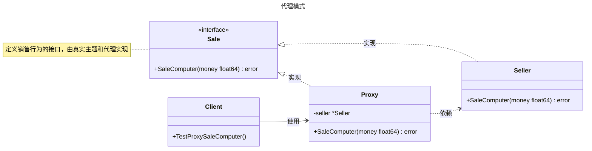

# 代理模式

## 概述

代理模式（Proxy Pattern）是一种结构型设计模式，它通过一个代理对象控制对另一个对象（实际对象）的访问。代理对象充当客户端与实际对象之间的中介，可以在不直接访问实际对象的情况下，提供额外的功能，例如访问控制、延迟加载、日志记录、缓存等。代理模式的核心思想是“控制访问”。与装饰者模式相比，代理模式更注重控制对对象的访问（如权限验证、延迟加载），而装饰者模式专注于动态增强对象功能。


## 模式结构

代理模式的主要角色如下：

- **抽象主题（Abstract Subject）**：定义代理和真实主题的公共接口，确保代理可以在任何使用真实主题的地方被使用。在 Go 中，通常使用 `interface` 定义。
- **真实主题（Real Subject）**：实现抽象主题接口的结构体，定义了代理所代表的真实对象，包含实际的业务逻辑。
- **代理（Proxy）**：实现抽象主题接口的结构体，持有真实主题的引用，控制对真实主题的访问，并可在调用前后添加额外的处理逻辑。代理可以完全替代真实主题，也可以部分代理特定方法。
- **客户端（Client）**：通过抽象主题接口与代理交互，无需知道是在与代理还是真实主题打交道，保持代码的透明性。

## 实现

代理模式的 UML 类图如下所示：



### 抽象主题（销售接口）

`sale.go` 代码如下：

```go
package proxy

// Sale 定义销售接口，规定销售行为的抽象方法
type Sale interface {
    // SaleComputer 销售电脑，接收客户支付的金额
    SaleComputer(money float64) error
}
```

### 真实主题（经销商）

`seller.go` 代码如下：

```go
package proxy

import "fmt"

// Seller 表示经销商，真实主题角色
type Seller struct {
}

// SaleComputer 实现销售电脑的具体逻辑
func (s *Seller) SaleComputer(money float64) error {
    fmt.Printf("销售电脑, 并拿到钱: %.2f\n", money)
    return nil
}
```

### 代理（代理经销商）

`proxy.go` 代码如下：

```go
package proxy

import "fmt"

// Proxy 表示代理经销商，代理角色
type Proxy struct {
    seller *Seller // 持有对真实主题（Seller）的引用
}

// SaleComputer 代理销售电脑，增加20%利润
func (p *Proxy) SaleComputer(money float64) error {
    if p.seller == nil {
        return fmt.Errorf("seller is nil")
    }
    profit := money * 0.2
    total := money + profit
    fmt.Printf("经销商代理销售电脑，原始价格: %.2f，增加20%%利润: %.2f，总价: %.2f\n", money, profit, total)
    return p.seller.SaleComputer(money)
}
```

### 客户端（单元测试）

`client_test.go` 代码如下：

```go
package proxy

import (
    "bytes"
    "fmt"
    "testing"
)

// TestProxySaleComputer 测试代理模式的 SaleComputer 方法
func TestProxySaleComputer(t *testing.T) {
    tests := []struct {
        name     string
        money    float64
        expected string
        err      error
    }{
        {
            name:     "Price 10000",
            money:    10000.0,
            expected: "经销商代理销售电脑，原始价格: 10000.00，增加20%利润: 2000.00，总价: 12000.00\n销售电脑, 并拿到钱: 10000.00\n",
            err:      nil,
        },
        {
            name:     "Price 5000",
            money:    5000.0,
            expected: "经销商代理销售电脑，原始价格: 5000.00，增加20%利润: 1000.00，总价: 6000.00\n销售电脑, 并拿到钱: 5000.00\n",
            err:      nil,
        },
        {
            name:     "Price 0",
            money:    0.0,
            expected: "经销商代理销售电脑，原始价格: 0.00，增加20%利润: 0.00，总价: 0.00\n销售电脑, 并拿到钱: 0.00\n",
            err:      nil,
        },
    }

    for _, tt := range tests {
        t.Run(tt.name, func(t *testing.T) {
            proxy := &Proxy{seller: &Seller{}}
            var buf bytes.Buffer
            out := buf.Writer()
            fmt.SetOutput(out)
            defer fmt.SetOutput(nil)

            err := proxy.SaleComputer(tt.money)
            output := buf.String()

            if err != tt.err {
                t.Errorf("expected error %v, got %v", tt.err, err)
            }
            if output != tt.expected {
                t.Errorf("expected output %q, got %q", tt.expected, output)
            }
        })
    }

    t.Run("NilSeller", func(t *testing.T) {
        proxy := &Proxy{seller: nil}
        err := proxy.SaleComputer(10000.0)
        if err == nil {
            t.Error("expected error for nil seller, got nil")
        }
    })
}
```

### 实现说明

代理模式通过 `Sale` 接口、`Seller` 真实主题和 `Proxy` 代理实现对电脑销售的访问控制。`Proxy` 在调用 `Seller` 的销售逻辑前后添加了利润计算逻辑，客户端通过 `Sale` 接口与代理交互，无需直接访问真实主题。新增代理功能只需实现新的代理类，符合开闭原则。

## 适用场景

代理模式适用于以下场景：

- **延迟加载**：延迟加载大对象，如延迟初始化数据库连接。
- **访问控制**：控制访问权限，如在微服务中验证 API 请求的认证信息。
- **日志与监控**：记录方法调用次数、执行时间等。
- **缓存**：缓存频繁访问的数据，减少对真实对象的调用。
- **远程调用**：封装远程服务调用，如 gRPC 客户端代理。
- **数据库连接池**：通过代理控制数据库连接的获取和释放，实现连接池的延迟初始化和资源管理。

## 代理类型

- **虚拟代理**：延迟加载大对象，如延迟初始化数据库连接。
- **保护代理**：控制访问权限，如验证 API 请求的认证信息。
- **远程代理**：封装远程服务调用，如 gRPC 客户端代理。

## 注意事项

- **Go 设计哲学**：Go 强调简单性和显式依赖，代理模式适合需要访问控制或额外逻辑的场景。对于简单场景，直接调用可能更简洁。
- **并发安全**：在并发环境中，代理对象的访问可能需要加锁（如使用 `sync.RWMutex`）以确保线程安全。
- **错误处理**：在 Go 中，代理方法应返回错误以便客户端处理异常情况。

## 参考资料

- [go-patterns](https://github.com/tmrts/go-patterns)
- [Refactoring.Guru](https://refactoringguru.cn/)