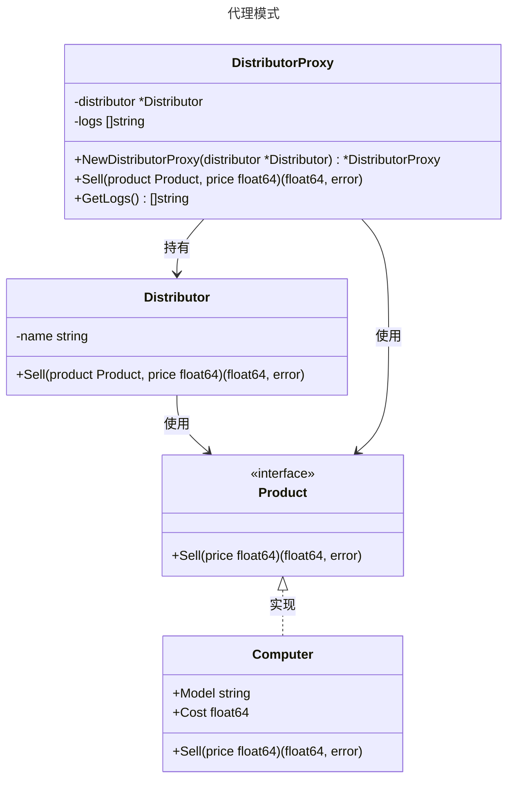

# 代理模式

## 概述

代理模式（Proxy Pattern）是一种结构型设计模式，它通过一个代理对象来控制对另一个对象（实际对象）的访问。代理对象充当客户端与实际对象之间的中介，可以在不直接访问实际对象的情况下，提供额外的功能，例如访问控制、延迟加载、日志记录、缓存等。代理模式的核心思想是“控制访问”。

## 模式结构

代理（Proxy）模式通常有以下角色：

- 抽象主题（Subject）：定义了实际对象和代理对象的公共接口，客户端通过该接口与代理或实际对象交互。
- 真实主题（RealSubject）：实际执行具体业务的类，代理模式的目标是控制对它的访问。
- 代理（Proxy）：通过代理对象间接访问真实主题。

## 实现

代理模式的UML类图如下所示：

## 适用场景

**延迟加载**：例如延迟加载数据库连接或大文件。

**访问控制**：在微服务中，代理可以验证 API 请求的权限。

**日志与监控**：记录方法调用次数、执行时间等。

**缓存**：代理可以缓存频繁访问的数据，减少对真实对象的调用。

**远程调用**：在分布式系统中，代理可以封装网络通信逻辑。

## 参考资料

- [go-patterns](https://github.com/tmrts/go-patterns)
- [Refactoring.Guru](https://refactoringguru.cn/)

::: tip 提示
文档正在更新中...
:::