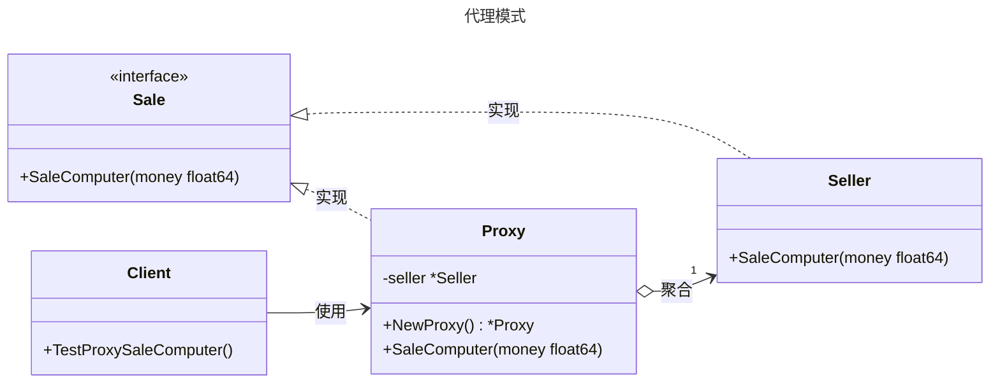

# 代理模式

## 概述

代理模式（Proxy Pattern）是一种结构型设计模式，它通过一个代理对象来控制对另一个对象（实际对象）的访问。代理对象充当客户端与实际对象之间的中介，可以在不直接访问实际对象的情况下，提供额外的功能，例如访问控制、延迟加载、日志记录、缓存等。代理模式的核心思想是“控制访问”。


## 模式结构

代理（Proxy）模式通常有以下角色：

- 抽象主题（Subject）：定义了实际对象和代理对象的公共接口，客户端通过该接口与代理或实际对象交互。
- 真实主题（RealSubject）：实际执行具体业务的类，代理模式的目标是控制对它的访问。
- 代理（Proxy）：通过代理对象间接访问真实主题。

## 实现

代理模式的UML类图如下所示：



抽象主题（销售接口） sale.go 定义：

```go
package proxy

// 代理模式 - 抽象主题

// Sale 销售接口
type Sale interface {
	// SaleComputer 销售电脑
	// money 价格
	SaleComputer(money float64)
}
```

真实主题（经销商） seller.go 定义：

```go
package proxy

import "fmt"

// 代理模式 - 真实主题

// Seller 经销商
// 真实主题角色，实现了 Sale 接口，负责实际的销售电脑逻辑
type Seller struct {
}

// SaleComputer 实现销售电脑的具体逻辑
// money 价格，表示客户支付的金额
func (s Seller) SaleComputer(money float64) {
	fmt.Printf("销售电脑, 并拿到钱:%.2f", money)
}
```

代理（代理经销商） proxy.go 定义：

```go
package proxy

import "fmt"

// 代理模式 - 代理

// Proxy 代理
// 代理角色，实现了 Sale 接口，控制对 Seller 的访问并添加额外逻辑
type Proxy struct {
	seller *Seller // 持有对真实主题（Seller）的引用
}

// NewProxy 创建新的代理实例
// 返回一个初始化了 Seller 的 Proxy 实例
func NewProxy() *Proxy {
	return &Proxy{
		seller: &Seller{}, // 初始化真实主题
	}
}

// SaleComputer 代理销售电脑，增加20%利润
// money 原始价格，代理会在此基础上计算利润并调用真实主题的逻辑
func (p *Proxy) SaleComputer(money float64) {
	// 计算20%的利润
	profit := money * 0.2
	// 计算总价（原始价格 + 利润）
	total := money + profit
	// 打印代理的销售信息，包括原始价格、利润和总价
	fmt.Printf("经销商代理销售电脑，原始价格: %.2f，增加20%%利润: %.2f，总价: %.2f\n", money, profit, total)
	// 调用真实主题的销售逻辑
	p.seller.SaleComputer(money)
}
```

客户端（单元测试） client_test.go 定义：

```go
package proxy

import (
	"bytes"
	"io"
	"os"
	"testing"
)

// 单元测试
// 模拟客户端调用

// TestProxySaleComputer 测试代理模式的 SaleComputer 方法
func TestProxySaleComputer(t *testing.T) {
	// 定义测试用例结构，包含测试名称、输入价格和预期输出
	tests := []struct {
		name     string  // 测试用例名称
		money    float64 // 输入价格
		expected string  // 预期输出
	}{
		{
			name:     "Test with price 10000", // 测试用例1：输入价格10000
			money:    10000.0,
			expected: "经销商代理销售电脑，原始价格: 10000.00，增加20%利润: 2000.00，总价: 12000.00\n销售电脑, 并拿到钱:10000.00",
		},
		{
			name:     "Test with price 5000", // 测试用例2：输入价格5000
			money:    5000.0,
			expected: "经销商代理销售电脑，原始价格: 5000.00，增加20%利润: 1000.00，总价: 6000.00\n销售电脑, 并拿到钱:5000.00",
		},
		{
			name:     "Test with price 0", // 测试用例3：输入价格0
			money:    0.0,
			expected: "经销商代理销售电脑，原始价格: 0.00，增加20%利润: 0.00，总价: 0.00\n销售电脑, 并拿到钱:0.00",
		},
	}

	// 创建代理实例
	proxy := NewProxy()

	// 遍历所有测试用例
	for _, tt := range tests {
		// 使用 t.Run 运行子测试，tt.name 为子测试名称
		t.Run(tt.name, func(t *testing.T) {
			// 创建管道以捕获标准输出
			r, w, _ := os.Pipe()
			// 保存原始标准输出
			old := os.Stdout
			// 将标准输出重定向到管道
			os.Stdout = w
			// 确保测试结束后恢复标准输出
			defer func() {
				os.Stdout = old
			}()

			// 调用代理的 SaleComputer 方法
			proxy.SaleComputer(tt.money)

			// 关闭管道写入端
			w.Close()
			// 创建缓冲区以读取管道输出
			var buf bytes.Buffer
			// 将管道内容复制到缓冲区
			io.Copy(&buf, r)
			// 获取实际输出
			output := buf.String()

			// 格式化预期输出
			expected := tt.expected
			// 比较实际输出与预期输出
			if output != expected {
				t.Errorf("SaleComputer(%.2f) output = %q; want %q", tt.money, output, expected)
			}
		})
	}
}
```

## 适用场景

**延迟加载**：例如延迟加载数据库连接或大文件。

**访问控制**：在微服务中，代理可以验证 API 请求的权限。

**日志与监控**：记录方法调用次数、执行时间等。

**缓存**：代理可以缓存频繁访问的数据，减少对真实对象的调用。

**远程调用**：在分布式系统中，代理可以封装网络通信逻辑。

## 参考资料

- [go-patterns](https://github.com/tmrts/go-patterns)
- [Refactoring.Guru](https://refactoringguru.cn/)

::: tip 提示
文档正在更新中...
:::