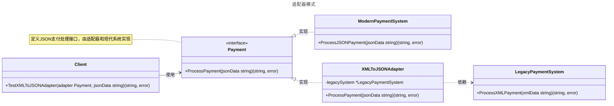

# 适配器模式

## 概述

适配器模式（Adapter Pattern）是一种结构型设计模式，用于将一个接口转换为另一个接口，以满足客户端的期望。它主要用于解决接口不兼容的问题，使原本不兼容的类能够协同工作。与装饰者模式相比，适配器模式旨在桥接接口不兼容问题，而装饰者模式专注于动态增强对象功能。


## 模式结构

适配器模式的主要角色如下：

- **目标接口（Target Interface）**：客户端期望使用的接口，定义了客户端所需的方法规范。在 Go 中，通常使用 `interface` 定义。
- **被适配者（Adaptee）**：已经存在但接口不兼容的类或结构体，包含有用的功能但无法直接被客户端使用。通常是第三方库或遗留代码。
- **适配器（Adapter）**：实现目标接口的结构体，内部持有被适配者的实例，负责将目标接口的调用转换为对被适配者的调用。在 Go 中，适配通常通过组合实现，因为 Go 不支持继承。
- **客户端（Client）**：通过目标接口与适配器交互，无需了解被适配者的具体实现，只需按照目标接口的规范调用方法。

## 实现

适配器模式的 UML 类图如下所示：



### 目标接口

`payment.go` 代码如下：

```go
package adapter

// Payment 定义目标接口，客户端期望使用此接口处理JSON支付
type Payment interface {
    // ProcessPayment 处理JSON格式的支付请求，返回处理结果和错误
    ProcessPayment(jsonData string) (string, error)
}
```

### 旧版支付系统（被适配者）

`legacy_payment.go` 代码如下：

```go
package adapter

import "fmt"

// LegacyPaymentSystem 模拟旧版支付系统，处理XML格式的支付请求
type LegacyPaymentSystem struct{}

// ProcessXMLPayment 处理XML格式的支付请求
func (l *LegacyPaymentSystem) ProcessXMLPayment(xmlData string) (string, error) {
    if xmlData == "" {
        return "", fmt.Errorf("invalid XML data")
    }
    return fmt.Sprintf("Processed XML payment: %s", xmlData), nil
}
```

### 新版支付系统

`modern_payment.go` 代码如下：

```go
package adapter

import "fmt"

// ModernPaymentSystem 模拟新版支付系统，处理JSON格式的支付请求
type ModernPaymentSystem struct{}

// ProcessJSONPayment 处理JSON格式的支付请求
func (m *ModernPaymentSystem) ProcessJSONPayment(jsonData string) (string, error) {
    if jsonData == "" {
        return "", fmt.Errorf("invalid JSON data")
    }
    return fmt.Sprintf("Processed JSON payment: %s", jsonData), nil
}
```

### 适配器

`adapter.go` 代码如下：

```go
package adapter

import (
    "fmt"
    "strings"
)

// XMLToJSONAdapter 适配器，将旧版XML支付系统适配为JSON支付接口
type XMLToJSONAdapter struct {
    legacySystem *LegacyPaymentSystem
}

// ProcessPayment 实现Payment接口，将JSON数据转换为XML并调用旧版系统
func (a *XMLToJSONAdapter) ProcessPayment(jsonData string) (string, error) {
    if a.legacySystem == nil {
        return "", fmt.Errorf("legacy system is nil")
    }
    // 模拟JSON到XML的转换（简化为字符串替换，仅用于演示）
    // 在实际应用中，应使用encoding/xml和encoding/json包进行转换
    xmlData := strings.Replace(jsonData, "json", "xml", -1)

    // 调用旧版支付系统的XML接口
    result, err := a.legacySystem.ProcessXMLPayment(xmlData)
    if err != nil {
        return "", fmt.Errorf("adapter failed to process payment: %v", err)
    }

    // 模拟将XML结果转换回JSON格式
    jsonResult := strings.Replace(result, "XML", "JSON", -1)
    return jsonResult, nil
}
```

### 客户端（单元测试）

文件：`client_test.go`

```go
package adapter

import (
    "testing"
)

// TestXMLToJSONAdapter 测试适配器模式的功能
func TestXMLToJSONAdapter(t *testing.T) {
    tests := []struct {
        name        string
        adapter     Payment
        inputJSON   string
        expected    string
        expectError bool
    }{
        {
            name:        "Valid JSON input",
            adapter:     &XMLToJSONAdapter{legacySystem: &LegacyPaymentSystem{}},
            inputJSON:   `{"payment":"json data"}`,
            expected:    `Processed JSON payment: {"payment":"xml data"}`,
            expectError: false,
        },
        {
            name:        "Another JSON input",
            adapter:     &XMLToJSONAdapter{legacySystem: &LegacyPaymentSystem{}},
            inputJSON:   `{"payment":"another json data"}`,
            expected:    `Processed JSON payment: {"payment":"another xml data"}`,
            expectError: false,
        },
        {
            name:        "Invalid XML input",
            adapter:     &XMLToJSONAdapter{legacySystem: &LegacyPaymentSystem{}},
            inputJSON:   "",
            expected:    "",
            expectError: true,
        },
        {
            name:        "Nil legacy system",
            adapter:     &XMLToJSONAdapter{legacySystem: nil},
            inputJSON:   `{"payment":"json data"}`,
            expected:    "",
            expectError: true,
        },
        {
            name:        "Modern payment system",
            adapter:     &ModernPaymentSystem{},
            inputJSON:   `{"payment":"json data"}`,
            expected:    `Processed JSON payment: {"payment":"json data"}`,
            expectError: false,
        },
    }

    for _, tt := range tests {
        t.Run(tt.name, func(t *testing.T) {
            result, err := tt.adapter.ProcessPayment(tt.inputJSON)
            if (err != nil) != tt.expectError {
                t.Errorf("expected error: %v, got: %v", tt.expectError, err)
            }
            if result != tt.expected {
                t.Errorf("expected: %q, got: %q", tt.expected, result)
            }
        })
    }
}
```

### 实现说明

适配器模式通过 `Payment` 接口、`LegacyPaymentSystem`（被适配者）、`ModernPaymentSystem`（直接实现目标接口）和 `XMLToJSONAdapter`（适配器）实现接口转换。`XMLToJSONAdapter` 将客户端的 JSON 请求转换为 XML，调用旧版系统的 `ProcessXMLPayment` 方法，并将结果转换回 JSON。`ModernPaymentSystem` 直接实现 `Payment` 接口，展示目标接口的直接使用。JSON-to-XML 转换在示例中简化为字符串替换，实际应用中应使用 `encoding/json` 和 `encoding/xml` 包进行转换。新增适配器只需实现新的适配器类，符合开闭原则。

## 优点与缺点

**优点**：
- **增强复用性**：复用接口不兼容的现有类，无需修改其源代码。
- **提高灵活性**：客户端代码与具体实现解耦，新增被适配者只需增加新适配器类，符合开闭原则。
- **单一职责**：将接口转换逻辑封装在适配器中，使客户端和被适配者的职责更清晰。

**缺点**：
- **增加复杂性**：每适配一个类需增加一个适配器，类数量增加可能提高维护成本。
- **性能开销**：数据转换（如 JSON 到 XML）可能引入计算开销，需在性能敏感场景中优化。
- **过度适配风险**：适配链过长或适配多个接口可能导致系统复杂和难以调试。

## 适用场景

适配器模式适用于以下场景：

- **集成第三方库或遗留系统**：当现有系统接口与第三方库或遗留系统不兼容时。
- **接口统一与复用**：为多个不同接口的类（如日志库 logrus、zap）创建统一接口适配器。
- **兼容不同数据格式**：处理新旧数据格式（如 XML 到 JSON 的转换）以支持系统升级。
- **数据库驱动适配**：将不同数据库驱动（如 MySQL、PostgreSQL）适配为统一接口。
- **HTTP 客户端兼容**：将旧版 HTTP 客户端库适配为应用期望的现代接口。

## 注意事项

- **Go 设计哲学**：Go 强调简单性和显式依赖，适配器模式适合整合第三方库或遗留代码，但应避免用于简单转换。
- **错误处理**：适配器方法应返回错误，以便客户端处理失败情况。
- **并发安全**：在并发环境中，适配器对被适配者的访问可能需要加锁（如 `sync.RWMutex`）以确保线程安全。
- **数据转换**：实际应用中，JSON-to-XML 转换应使用标准库（如 `encoding/json` 和 `encoding/xml`）以确保正确性和性能。

## 参考资料

- [go-patterns](https://github.com/tmrts/go-patterns)
- [Refactoring.Guru](https://refactoringguru.cn/)