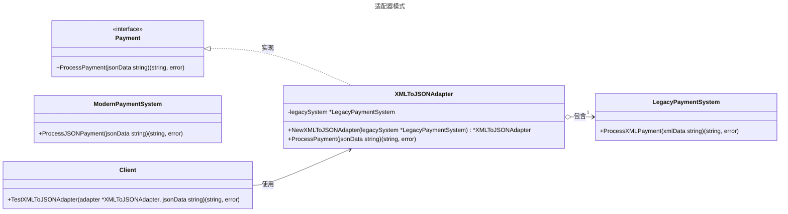

# 适配器模式

## 概述

适配器模式（Adpter Pattern）是一种结构型设计模式，用于将一个接口转换为另一个接口，以满足客户端的期望。它主要用于解决接口不兼容的问题，使原本不兼容的类能够协同工作。


## 模式结构

适配器模式的主要角色如下：

- **目标接口（Target Interface）**：客户端期望使用的接口，定义了客户端所需要的方法规范。在Go中通常使用interface定义。
- **被适配者（Adaptee）**：已经存在但接口不兼容的类或结构体，包含有用的功能但无法直接被客户端使用。通常是第三方库或遗留代码。
- **适配器（Adapter）**：实现目标接口的结构体，内部持有被适配者的实例，负责将目标接口的调用转换为对被适配者的调用，起到桥接作用。
- **客户端（Client）**：通过目标接口与适配器交互，无需了解被适配者的具体实现，只需要按照目标接口的规范调用方法。

## 实现

适配器模式的UML类图如下所示：



目标接口 payment.go 定义：

```go
package adapter

// 适配器模式 - 目标接口

// Payment 定义目标接口，客户端期望使用此接口
type Payment interface {
	ProcessPayment(jsonData string) (string, error)
}
```

旧版支付系统（被适配者），专门处理XML格式的数据 legacy_payment.go 定义：

```go
package adapter

import "fmt"

// 适配器模式 - 旧版支付系统（XML）

// LegacyPaymentSystem 模拟旧版支付系统，处理XML数据
type LegacyPaymentSystem struct{}

// ProcessXMLPayment 处理XML格式的支付请求
func (l *LegacyPaymentSystem) ProcessXMLPayment(xmlData string) (string, error) {
	return fmt.Sprintf("Processed XML payment: %s", xmlData), nil
}
```

新版支付系统，处理JSON格式数据 modern_payment.go 定义：

```go
package adapter

import "fmt"

// 适配器模式 - 新版支付系统（JSON）

// ModernPaymentSystem 模拟新版支付系统，处理JSON数据
type ModernPaymentSystem struct{}

// ProcessJSONPayment 处理JSON格式的支付请求
func (m *ModernPaymentSystem) ProcessJSONPayment(jsonData string) (string, error) {
	return fmt.Sprintf("Processed JSON payment: %s", jsonData), nil
}
```

适配器（JSONToXMLAdapter），将新版JSON支付系统适配为XML支付接口 adapter.go 定义：

```go
package adapter

import (
	"fmt"
	"strings"
)

// 适配器模式 - 适配器

// XMLToJSONAdapter 适配器，将XML支付系统适配为JSON支付接口
type XMLToJSONAdapter struct {
	legacySystem *LegacyPaymentSystem
}

// NewXMLToJSONAdapter 创建适配器实例
func NewXMLToJSONAdapter(legacySystem *LegacyPaymentSystem) *XMLToJSONAdapter {
	return &XMLToJSONAdapter{legacySystem: legacySystem}
}

// ProcessPayment 实现Payment接口，将JSON数据转换为XML并调用旧版系统
func (a *XMLToJSONAdapter) ProcessPayment(jsonData string) (string, error) {
	// 模拟JSON到XML的转换（简化为字符串替换）
	xmlData := strings.Replace(jsonData, "json", "xml", -1)

	// 调用旧版支付系统的XML接口
	result, err := a.legacySystem.ProcessXMLPayment(xmlData)
	if err != nil {
		return "", fmt.Errorf("adapter failed to process payment: %v", err)
	}

	// 模拟将XML结果转换回JSON格式
	jsonResult := strings.Replace(result, "XML", "JSON", -1)
	return jsonResult, nil
}
```

客户端（单元测试） client_test.go 定义：

```go
package adapter

import "testing"

// 单元测试
// 模拟客户端调用

// TestXMLToJSONAdapter 测试适配器是否能正确将JSON请求适配为XML并返回预期的JSON结果
func TestXMLToJSONAdapter(t *testing.T) {
	// 创建旧版支付系统实例
	legacySystem := &LegacyPaymentSystem{}

	// 创建适配器实例，将旧版支付系统传入
	adapter := NewXMLToJSONAdapter(legacySystem)

	// 定义测试用例，包含输入的JSON数据、期望的输出结果和是否期望错误
	tests := []struct {
		inputJSON   string // 输入的JSON格式数据
		expected    string // 期望的输出结果（JSON格式）
		expectError bool   // 是否期望发生错误
	}{
		{
			inputJSON:   `{"payment":"json data"}`,                         // 测试用例1：输入JSON数据
			expected:    `Processed JSON payment: {"payment":"xml data"}`, // 期望的JSON输出
			expectError: false,                                             // 不期望发生错误
		},
		{
			inputJSON:   `{"payment":"another json data"}`,                         // 测试用例2：输入另一组JSON数据
			expected:    `Processed JSON payment: {"payment":"another xml data"}`, // 期望的JSON输出
			expectError: false,                                                     // 不期望发生错误
		},
	}

	// 遍历测试用例，执行测试
	for _, test := range tests {
		t.Run(test.inputJSON, func(t *testing.T) {
			// 调用适配器的ProcessPayment方法，处理JSON输入
			result, err := adapter.ProcessPayment(test.inputJSON)

			// 检查错误是否符合预期
			if (err != nil) != test.expectError {
				t.Errorf("Expected error: %v, got: %v", test.expectError, err)
			}

			// 检查输出结果是否符合预期
			if result != test.expected {
				t.Errorf("Expected: %s, got: %s", test.expected, result)
			}
		})
	}
}
```

## 优点与缺点

优点：

- 增强了类的复用性：可以复用那些接口不兼容的已有类，而无需修改其源代码。
- 提高了代码的灵活性和扩展性：客户端代码与具体实现解耦。当需要引入新的被适配者时，只需增加一个新的适配器类，无需修改原有代码，符合开闭原则（Open/Closed Principle）。
- 单一职责原则：将接口转换的复杂逻辑封装在适配器中，使得客户端和被适配者的职责更加单一。

缺点：

- 增加了系统复杂性：每适配一个类都需要增加一个适配器，可能会导致系统中类的数量增加，增加理解和维护的成本。
- 可能引入性能损耗：适配器在转换接口和数据时会引入额外的计算开销。对于性能敏感的应用，需要评估这种开销。
- 可能造成过度适配：如果一个适配器需要适配过多的接口，或者适配链过长（适配器又去适配另一个适配器），会让系统变得非常复杂和难以调试。

## 适用场景

适配器模式通常在以下几种情况下使用：

- 集成第三方库或遗留系统：当您需要使用的类库或系统的接口与您现有系统的接口不兼容时。这是最经典的使用场景，正如您示例中的旧支付系统一样。
- 接口统一与复用：当您需要创建一个可复用的类，该类需要与多个具有不同接口但功能相似的类协同工作时。例如，您可以为多种不同的日志库（如 logrus, zap）创建统一的 Logger 接口适配器，使上层业务代码无需关心底层日志库的实现。
- 兼容不同版本的数据格式：当系统升级，需要兼容处理新旧两种或多种数据格式时。例如，一个应用从 XML 配置迁移到 YAML 配置，在过渡期可以创建一个适配器来让旧的 XML 解析模块能够读取 YAML 数据（通过内部转换）。

## 参考资料

- [go-patterns](https://github.com/tmrts/go-patterns)
- [Refactoring.Guru](https://refactoringguru.cn/)