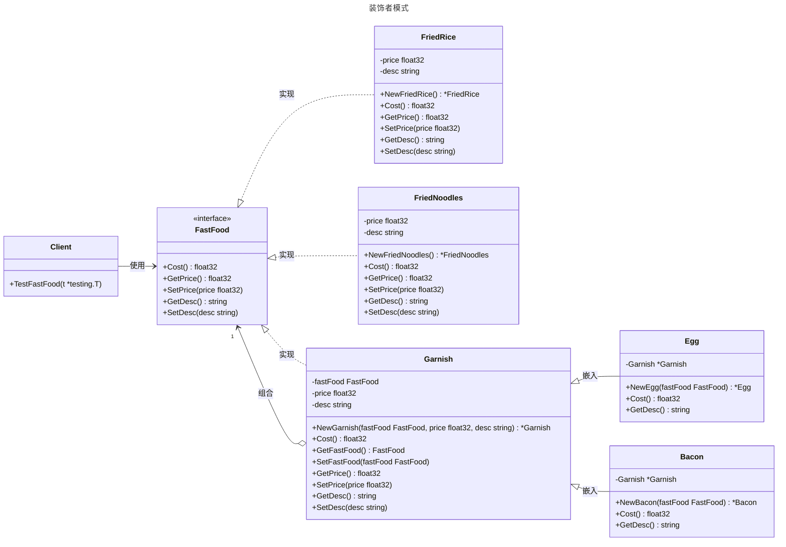

# 装饰者模式

## 概述

装饰者模式（Decorator Pattern）是一种结构型设计模式，允许在不修改现有对象结构的情况下，动态地为对象添加额外的职责。它遵循“开放-封闭原则”，即对扩展开放，对修改封闭。装饰者模式通常用于在运行时为对象添加功能，而无需通过继承来扩展类的行为。


## 模式结构

装饰者模式的主要角色如下：

- **抽象组件（Component）**：定义了一个对象的接口，表示被装饰的对象。
- **具体组件（Concrete Component）**：实现了抽象组件的接口，表示需要被装饰的对象。
- **抽象装饰（Decorator）**：定义了装饰者的接口，包含一个指向被装饰对象的引用。
- **具体装饰（Concrete Decorator）**：实现了抽象装饰的接口，包含一个指向被装饰对象的引用，并提供了额外的职责。

## 实现

装饰者模式示例的UML类图如下所示：



抽象组件和具体组件 components.go 定义：

```go
package decorator

// 装饰者模式

// FastFood 是装饰者模式的抽象组件（Component）接口，
// 定义了快餐的基本行为，包括计算价格和获取/设置描述和价格。
type FastFood interface {
	Cost() float32          // 计算总价格
	GetPrice() float32      // 获取价格
	SetPrice(price float32) // 设置价格
	GetDesc() string        // 获取描述
	SetDesc(desc string)    // 设置描述
}

// FriedRice 是装饰者模式的具体组件（Concrete Component），
// 表示一种具体的快餐——炒饭。
type FriedRice struct {
	price float32 // 价格
	desc  string  // 描述
}

// NewFriedRice 是 FriedRice 的构造函数，
// 初始化炒饭的价格为 10 元，描述为“炒饭”。
func NewFriedRice() *FriedRice {
	return &FriedRice{
		price: 10.0,
		desc:  "炒饭",
	}
}

// Cost 返回炒饭的价格，
// 实现 FastFood 接口的 Cost 方法。
func (f *FriedRice) Cost() float32 {
	return f.price
}

// GetPrice 获取炒饭的价格。
func (f *FriedRice) GetPrice() float32 {
	return f.price
}

// SetPrice 设置炒饭的价格。
func (f *FriedRice) SetPrice(price float32) {
	f.price = price
}

// GetDesc 获取炒饭的描述。
func (f *FriedRice) GetDesc() string {
	return f.desc
}

// SetDesc 设置炒饭的描述。
func (f *FriedRice) SetDesc(desc string) {
	f.desc = desc
}

// FriedNoodles 是装饰者模式的具体组件（Concrete Component），
// 表示一种具体的快餐——炒面。
type FriedNoodles struct {
	price float32 // 价格
	desc  string  // 描述
}

// NewFriedNoodles 是 FriedNoodles 的构造函数，
// 初始化炒面的价格为 12 元，描述为“炒面”。
func NewFriedNoodles() *FriedNoodles {
	return &FriedNoodles{
		price: 12.0,
		desc:  "炒面",
	}
}

// Cost 返回炒面的价格，
// 实现 FastFood 接口的 Cost 方法。
func (f *FriedNoodles) Cost() float32 {
	return f.price
}

// GetPrice 获取炒面的价格。
func (f *FriedNoodles) GetPrice() float32 {
	return f.price
}

// SetPrice 设置炒面的价格。
func (f *FriedNoodles) SetPrice(price float32) {
	f.price = price
}

// GetDesc 获取炒面的描述。
func (f *FriedNoodles) GetDesc() string {
	return f.desc
}

// SetDesc 设置炒面的描述。
func (f *FriedNoodles) SetDesc(desc string) {
	f.desc = desc
}
```

抽象装饰和具体装饰 decorator.go 定义：

```go
package decorator

// 装饰者模式

// Garnish 是装饰者模式的抽象装饰者（Decorator），
// 实现 FastFood 接口并持有一个 FastFood 对象的引用，
// 为具体装饰者提供通用逻辑。
type Garnish struct {
	fastFood FastFood // 被装饰的 FastFood 对象
	price    float32  // 装饰者自身的价格
	desc     string   // 装饰者自身的描述
}

// NewGarnish 是 Garnish 的构造函数，
// 初始化被装饰的 FastFood 对象、价格和描述。
func NewGarnish(fastFood FastFood, price float32, desc string) *Garnish {
	return &Garnish{
		fastFood: fastFood,
		price:    price,
		desc:     desc,
	}
}

// GetFastFood 获取被装饰的 FastFood 对象。
func (g *Garnish) GetFastFood() FastFood {
	return g.fastFood
}

// SetFastFood 设置被装饰的 FastFood 对象。
func (g *Garnish) SetFastFood(fastFood FastFood) {
	g.fastFood = fastFood
}

// GetPrice 获取装饰者的价格。
func (g *Garnish) GetPrice() float32 {
	return g.price
}

// SetPrice 设置装饰者的价格。
func (g *Garnish) SetPrice(price float32) {
	g.price = price
}

// GetDesc 获取装饰者的描述。
func (g *Garnish) GetDesc() string {
	return g.desc
}

// SetDesc 设置装饰者的描述。
func (g *Garnish) SetDesc(desc string) {
	g.desc = desc
}

// Cost 提供默认的 Cost 实现，
// 计算装饰者自身价格与被装饰对象价格之和，
// 具体装饰者可以覆盖此方法。
func (g *Garnish) Cost() float32 {
	return g.GetPrice() + g.GetFastFood().Cost()
}

// Egg 是装饰者模式的具体装饰者（Concrete Decorator），
// 为快餐添加鸡蛋配料，扩展价格和描述。
type Egg struct {
	*Garnish // 嵌入 Garnish 以复用其功能
}

// NewEgg 是 Egg 的构造函数，
// 初始化鸡蛋装饰者，价格为 1 元，描述为“鸡蛋”。
func NewEgg(fastFood FastFood) *Egg {
	return &Egg{
		Garnish: NewGarnish(fastFood, 1.0, "鸡蛋"),
	}
}

// Cost 返回鸡蛋装饰后的总价格，
// 即鸡蛋价格加上被装饰对象的价格。
func (e *Egg) Cost() float32 {
	return e.GetPrice() + e.GetFastFood().Cost()
}

// GetDesc 返回鸡蛋装饰后的描述，
// 格式为“原描述+加鸡蛋”。
func (e *Egg) GetDesc() string {
	return e.Garnish.GetFastFood().GetDesc() + "加" + e.Garnish.GetDesc()
}

// Bacon 是装饰者模式的具体装饰者（Concrete Decorator），
// 为快餐添加培根配料，扩展价格和描述。
type Bacon struct {
	*Garnish // 嵌入 Garnish 以复用其功能
}

// NewBacon 是 Bacon 的构造函数，
// 初始化培根装饰者，价格为 2 元，描述为“培根”。
func NewBacon(fastFood FastFood) *Bacon {
	return &Bacon{
		Garnish: NewGarnish(fastFood, 2.0, "培根"),
	}
}

// Cost 返回培根装饰后的总价格，
// 即培根价格加上被装饰对象的价格。
func (b *Bacon) Cost() float32 {
	return b.GetPrice() + b.GetFastFood().Cost()
}

// GetDesc 返回培根装饰后的描述，
// 格式为“原描述+加培根”。
func (b *Bacon) GetDesc() string {
	return b.Garnish.GetFastFood().GetDesc() + "加" + b.Garnish.GetDesc()
}
```

客户端（单元测试） client_test.go 定义：

```go
package decorator

import (
	"testing"
)

// 单元测试
// 模拟客户端调用

// TestFastFood 测试装饰者模式的各种场景
func TestFastFood(t *testing.T) {
	// 定义测试用例，包含测试名称、快餐对象、预期描述和预期价格
	tests := []struct {
		name         string   // 测试用例名称
		food         FastFood // 快餐对象
		expectedDesc string   // 预期描述
		expectedCost float32  // 预期价格
	}{
		{
			name:         "FriedRice", // 测试基础炒饭
			food:         NewFriedRice(),
			expectedDesc: "炒饭",
			expectedCost: 10.0,
		},
		{
			name:         "FriedRice with Egg", // 测试加鸡蛋的炒饭
			food:         NewEgg(NewFriedRice()),
			expectedDesc: "炒饭加鸡蛋",
			expectedCost: 11.0,
		},
		{
			name:         "FriedNoodles with Bacon", // 测试加培根的炒面
			food:         NewBacon(NewFriedNoodles()),
			expectedDesc: "炒面加培根",
			expectedCost: 14.0,
		},
		{
			name:         "FriedRice with Egg and Bacon", // 测试加鸡蛋和培根的炒饭
			food:         NewBacon(NewEgg(NewFriedRice())),
			expectedDesc: "炒饭加鸡蛋加培根",
			expectedCost: 13.0,
		},
	}

	// 遍历测试用例
	for _, tt := range tests {
		t.Run(tt.name, func(t *testing.T) {
			// 获取实际的描述和价格
			desc := tt.food.GetDesc()
			cost := tt.food.Cost()

			// 验证描述是否符合预期
			if desc != tt.expectedDesc {
				t.Errorf("expected desc %q, got %q", tt.expectedDesc, desc)
			}
			// 验证价格是否符合预期
			if cost != tt.expectedCost {
				t.Errorf("expected cost %.1f, got %.1f", tt.expectedCost, cost)
			}

			// 输出测试结果，便于调试
			t.Logf("%s %.1f元", desc, cost)
		})
	}
}
```

## 优点与缺点

**优点**：

- **灵活的扩展性**：装饰者模式允许在运行时动态为对象添加新功能，无需修改原有代码，符合开闭原则（对扩展开放，对修改关闭）。
- **接口一致性**：装饰器和被装饰对象实现相同的接口，保证装饰后的对象可以无缝替换原对象，易于集成和替换。
- **功能组合性**：支持通过多个装饰器自由组合功能，形成灵活的功能叠加，例如日志、认证、限流等功能的任意组合。
- **代码复用**：装饰器可以将通用功能（如日志记录、性能监控）抽取为独立模块，在多个场景下复用。
- **避免类爆炸**：相比通过继承实现功能扩展，装饰者模式避免了因功能组合而导致的子类数量激增问题。

**缺点**：

- **增加复杂性**：多个装饰器的嵌套可能导致代码结构复杂，调试和维护难度增加，尤其是在装饰器层级较多时。
- **性能开销**：每增加一层装饰器都会引入额外的调用层级，可能在高性能场景下带来轻微的开销。
- **调试困难**：当装饰器链较长时，定位问题可能变得困难，因为调用栈会包含多个装饰器的逻辑。
- **状态管理复杂**：如果装饰器需要管理被装饰对象的状态，可能会导致实现复杂化，特别是在 Go 语言中缺乏传统继承机制的情况下。
- **不适合静态需求**：如果功能扩展是固定的且无需动态变化，直接修改代码或使用组合可能比装饰者模式更简单。

## 适用场景

1. **动态功能扩展**  
   当需要在运行时为对象动态添加职责或行为，而不希望修改其核心代码时。例如：
   - 为 HTTP 请求处理函数添加日志记录、认证、限流等功能。
   - 在数据流处理中动态添加加密、压缩或格式转换。
2. **保持接口一致性**  
   当需要扩展功能但希望保持与原对象的接口一致，以便装饰后的对象可以无缝替换原对象。例如：
   - 在 Go 的 Web 开发中，通过中间件为 `http.Handler` 添加功能（如认证、CORS 支持）。
   - 对 `io.Reader` 或 `io.Writer` 进行包装，提供缓冲、压缩等功能（如 `bufio.NewReader` 或 `gzip.NewReader`）。
3. **功能组合与复用**  
   当需要将多个功能以灵活的方式组合起来，装饰者模式适合实现功能的叠加。例如：
   - 在微服务中为业务逻辑添加监控、超时控制或重试机制。
   - 为函数添加性能分析或日志记录功能。
4. **避免类爆炸**  
   当通过继承扩展功能会导致子类数量激增时，装饰者模式通过组合提供更优雅的解决方案。例如：
   - 在咖啡店订单系统中，动态为咖啡添加奶、糖、焦糖等配料，避免为每种组合创建新类型。
5. **临时或可选功能**  
   当某些功能只是临时或可选的，装饰者模式可以在运行时动态添加或移除。例如：
   - 在开发环境中为函数添加调试日志或性能分析，而在生产环境中移除这些功能。
   - 为数据流临时添加数据校验或转换逻辑。

## 参考资料

- [go-patterns](https://github.com/tmrts/go-patterns)
- [Refactoring.Guru](https://refactoringguru.cn/)