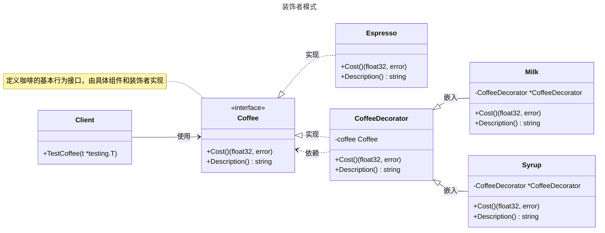

# 装饰者模式

## 概述

装饰者模式（Decorator Pattern）是一种结构型设计模式，允许在不修改现有对象结构的情况下，动态地为对象添加额外的职责。它遵循“开放-封闭原则”，即对扩展开放，对修改封闭。装饰者模式通常用于在运行时为对象添加功能，而无需通过继承来扩展类的行为。与代理模式相比，装饰者模式更注重动态增强对象的功能，而代理模式专注于控制对对象的访问（如权限验证、延迟加载）。


## 模式结构

装饰者模式的主要角色如下：

- **抽象组件（Component）**：定义了一个对象的接口，表示被装饰的对象。
- **具体组件（Concrete Component）**：实现了抽象组件的接口，表示需要被装饰的对象。
- **抽象装饰（Decorator）**：定义了装饰者的接口，包含一个指向被装饰对象的引用。在 Go 中，通常通过嵌入组件接口实现，以复用组件的方法。
- **具体装饰（Concrete Decorator）**：实现了抽象装饰的接口，包含一个指向被装饰对象的引用，并提供了额外的职责。

## 实现

装饰者模式的 UML 类图如下所示：



### 咖啡与配料

文件：`coffee.go`

```go
package decorator

import "fmt"

// Coffee 是装饰者模式的抽象组件接口，定义咖啡的基本行为
type Coffee interface {
    // Cost 计算总价格，返回价格和错误
    Cost() (float32, error)
    // Description 返回咖啡的描述
    Description() string
}

// Espresso 表示美式咖啡的具体组件
type Espresso struct{}

// Cost 返回美式咖啡的价格
func (e *Espresso) Cost() (float32, error) {
    return 5.0, nil
}

// Description 返回美式咖啡的描述
func (e *Espresso) Description() string {
    return "美式咖啡"
}

// CoffeeDecorator 是装饰者模式的抽象装饰者，用于为咖啡添加配料
type CoffeeDecorator struct {
    coffee Coffee // 被装饰的咖啡对象
    price  float32 // 配料价格
    desc   string  // 配料描述
}

// Cost 返回配料装饰后的总价格
func (d *CoffeeDecorator) Cost() (float32, error) {
    if d.coffee == nil {
        return 0, fmt.Errorf("coffee is nil")
    }
    baseCost, err := d.coffee.Cost()
    if err != nil {
        return 0, err
    }
    return d.price + baseCost, nil
}

// Description 返回配料装饰后的描述
func (d *CoffeeDecorator) Description() string {
    if d.coffee == nil {
        return d.desc
    }
    return d.coffee.Description() + " + " + d.desc
}

// Milk 是具体装饰者，为咖啡添加牛奶配料
type Milk struct {
    *CoffeeDecorator // 嵌入 CoffeeDecorator 以复用其功能
}

// Cost 返回牛奶装饰后的总价格
func (m *Milk) Cost() (float32, error) {
    return m.CoffeeDecorator.Cost()
}

// Description 返回牛奶装饰后的描述
func (m *Milk) Description() string {
    return m.CoffeeDecorator.Description()
}

// Syrup 是具体装饰者，为咖啡添加糖浆配料
type Syrup struct {
    *CoffeeDecorator // 嵌入 CoffeeDecorator 以复用其功能
}

// Cost 返回糖浆装饰后的总价格
func (s *Syrup) Cost() (float32, error) {
    return s.CoffeeDecorator.Cost()
}

// Description 返回糖浆装饰后的描述
func (s *Syrup) Description() string {
    return s.CoffeeDecorator.Description()
}
```

### 客户端（单元测试）

文件：`client_test.go`

```go
package decorator

import (
    "fmt"
    "testing"
)

// TestCoffee 测试装饰者模式的各种场景
func TestCoffee(t *testing.T) {
	// 定义测试用例
    tests := []struct {
        name         string
        coffee       Coffee
        expectedDesc string
        expectedCost float32
    }{
        {
            name:         "Espresso",
            coffee:       &Espresso{},
            expectedDesc: "美式咖啡",
            expectedCost: 5.0,
        },
        {
            name:         "Espresso with Milk",
            coffee:       &Milk{CoffeeDecorator: &CoffeeDecorator{coffee: &Espresso{}, price: 1.5, desc: "牛奶"}},
            expectedDesc: "美式咖啡 + 牛奶",
            expectedCost: 6.5,
        },
        {
            name:         "Espresso with Syrup",
            coffee:       &Syrup{CoffeeDecorator: &CoffeeDecorator{coffee: &Espresso{}, price: 1.0, desc: "糖浆"}},
            expectedDesc: "美式咖啡 + 糖浆",
            expectedCost: 6.0,
        },
        {
            name:         "Espresso with Milk and Syrup",
            coffee:       &Syrup{CoffeeDecorator: &CoffeeDecorator{coffee: &Milk{CoffeeDecorator: &CoffeeDecorator{coffee: &Espresso{}, price: 1.5, desc: "牛奶"}}, price: 1.0, desc: "糖浆"}},
            expectedDesc: "美式咖啡 + 牛奶 + 糖浆",
            expectedCost: 7.5,
        },
    }

	// 测试咖啡
    for _, tt := range tests {
        t.Run(tt.name, func(t *testing.T) {
            desc := tt.coffee.Description()
            cost, err := tt.coffee.Cost()
            if err != nil {
                t.Errorf("意外错误: %v", err)
            }
            if desc != tt.expectedDesc {
                t.Errorf("预期 desc %q，实际为 %q\n", tt.expectedDesc, desc)
            }
            if cost != tt.expectedCost {
                t.Errorf("预期成本 %.1f，实际收益 %.1f\n", tt.expectedCost, cost)
            }
            t.Logf("%s %.1f元", desc, cost)
        })
    }

	// 测试 nil 咖啡
    t.Run("NilCoffee", func(t *testing.T) {
        decorator := &CoffeeDecorator{coffee: nil, price: 1.5, desc: "牛奶"}
        _, err := decorator.Cost()
        if err == nil {
            t.Error("nil咖啡的预期误差，结果为nil")
        }
    })
}
```

### 实现说明

装饰者模式通过 `Coffee` 接口、`Espresso` 具体组件、`CoffeeDecorator` 抽象装饰者以及 `Milk` 和 `Syrup` 具体装饰者实现动态功能增强。装饰者嵌入 `Coffee` 接口，实现价格和描述的叠加。测试代码验证了不同配料组合的描述和价格，新增装饰者只需实现新的具体装饰类，符合开闭原则。

## 优点与缺点

**优点**：
- **灵活扩展**：运行时动态添加功能，无需修改原有代码，符合开闭原则。
- **接口一致**：装饰后对象可替换原对象，易于集成。
- **功能组合**：支持任意组合装饰者，形成灵活功能叠加。
- **代码复用**：通用装饰者可在多场景复用。
- **避免类爆炸**：比继承更优雅，避免子类激增。

**缺点**：
- **增加复杂性**：多层装饰者嵌套可能导致代码难懂和调试困难。
- **性能开销**：每层装饰者引入额外调用，可能在高性能场景下影响效率。
- **调试困难**：长装饰链导致调用栈复杂，问题定位难。
- **状态管理复杂**：在 Go 中，嵌入组件需小心管理状态。
- **不适合静态需求**：固定功能扩展时，直接修改或组合可能更简单。

## 适用场景

装饰者模式适用于以下场景：

- **动态功能扩展**：需要在运行时为对象动态添加职责或行为，而不修改核心代码。例如，为 HTTP 请求处理函数添加日志记录、认证、限流等功能。
- **保持接口一致性**：需要扩展功能但保持与原对象的接口一致。例如，在 Go 的 Web 开发中，通过中间件为 `http.Handler` 添加功能（如认证、CORS 支持）。
- **功能组合与复用**：将多个功能灵活组合。例如，在微服务中为业务逻辑添加监控、超时控制或重试机制。
- **避免类爆炸**：通过继承扩展会导致子类数量激增时，使用装饰者通过组合提供解决方案。例如，在咖啡店订单系统中，动态为咖啡添加牛奶、糖浆等配料。
- **临时或可选功能**：某些功能是临时或可选的，可以在运行时动态添加或移除。例如，在开发环境中为函数添加调试日志，而在生产环境中移除。
- **HTTP 中间件**：为 `http.Handler` 添加日志、认证等功能，如 Go 的 Web 框架中的中间件链。
- **数据流包装**：对 `io.Reader` 或 `io.Writer` 添加缓冲、压缩等功能（如 `bufio.NewReader` 或 `gzip.NewReader`）。

## 注意事项

- **Go 设计哲学**：Go 强调简单性和显式依赖，装饰者模式适合动态功能增强的场景。对于静态需求，直接组合可能更简洁。
- **错误处理**：在 Go 中，装饰者方法应返回错误以便客户端处理异常情况。
- **并发安全**：在并发环境中，装饰者对被装饰对象的访问可能需要加锁（如 `sync.RWMutex`）以确保线程安全。
- **嵌套顺序**：装饰者的嵌套顺序会影响最终行为，需小心设计。

## 参考资料

- [go-patterns](https://github.com/tmrts/go-patterns)
- [Refactoring.Guru](https://refactoringguru.cn/)