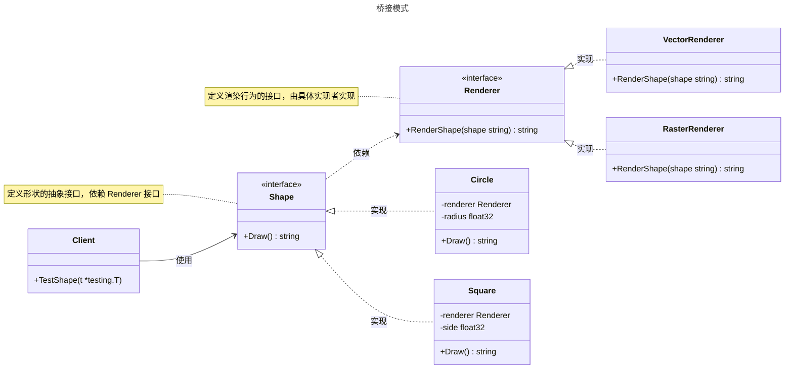

# 桥接模式

## 概述

桥接模式（Bridge Pattern）是一种结构型设计模式，旨在将抽象部分与实现部分分离，使它们可以独立变化。它通过将抽象和实现解耦，允许两者独立扩展，而无需修改对方代码。桥接模式遵循“开放-封闭原则”，适用于需要将接口与实现分离、或需要动态切换实现的场景。与适配器模式不同，桥接模式关注设计初期就分离抽象与实现，而适配器模式更侧重于已有接口的兼容。


## 模式结构

桥接模式的主要角色如下：

- **抽象部分（Abstraction）**：定义了抽象接口，通常包含对实现部分的引用，负责高层逻辑。
- **扩展抽象（Refined Abstraction）**：扩展抽象部分，提供具体的业务逻辑。
- **实现部分（Implementor）**：定义实现的接口，抽象部分依赖此接口完成具体功能。
- **具体实现（Concrete Implementor）**：实现部分的具体实现，提供底层功能。

## 实现

桥接模式的 UML 类图如下所示：



### 形状与渲染

`renderer.go` 代码如下：

```go
package bridge

import "fmt"

// Renderer 是桥接模式的实现部分接口，定义渲染行为
type Renderer interface {
    RenderShape(shape string) string
}

// VectorRenderer 是具体实现，表示矢量渲染
type VectorRenderer struct{}

// RenderShape 返回矢量渲染的描述
func (v *VectorRenderer) RenderShape(shape string) string {
    return fmt.Sprintf("矢量渲染 %s", shape)
}

// RasterRenderer 是具体实现，表示光栅渲染
type RasterRenderer struct{}

// RenderShape 返回光栅渲染的描述
func (r *RasterRenderer) RenderShape(shape string) string {
    return fmt.Sprintf("光栅渲染 %s", shape)
}
```

`shape.go` 代码如下：

```go
package bridge

import "fmt"

// Shape 是桥接模式的抽象部分接口，定义形状行为
type Shape interface {
    Draw() string
}

// Circle 是扩展抽象，表示圆形
type Circle struct {
    renderer Renderer
    radius   float32
}

// NewCircle 创建新的圆形实例
func NewCircle(renderer Renderer, radius float32) *Circle {
    return &Circle{renderer: renderer, radius: radius}
}

// Draw 返回圆形的渲染描述
func (c *Circle) Draw() string {
    return c.renderer.RenderShape(fmt.Sprintf("圆形（半径: %.1f）", c.radius))
}

// Square 是扩展抽象，表示正方形
type Square struct {
    renderer Renderer
    side     float32
}

// NewSquare 创建新的正方形实例
func NewSquare(renderer Renderer, side float32) *Square {
    return &Square{renderer: renderer, side: side}
}

// Draw 返回正方形的渲染描述
func (s *Square) Draw() string {
    return s.renderer.RenderShape(fmt.Sprintf("正方形（边长: %.1f）", s.side))
}
```

### 客户端（单元测试）

`client_test.go` 代码如下：

```go
package bridge

import (
    "testing"
)

// TestShape 测试桥接模式的各种场景
func TestShape(t *testing.T) {
    // 定义测试数据
    tests := []struct {
        name         string
        shape        Shape
        expectedDesc string
    }{
        {
            name:         "Circle with VectorRenderer",
            shape:        NewCircle(&VectorRenderer{}, 5.0),
            expectedDesc: "矢量渲染 圆形（半径: 5.0）",
        },
        {
            name:         "Circle with RasterRenderer",
            shape:        NewCircle(&RasterRenderer{}, 5.0),
            expectedDesc: "光栅渲染 圆形（半径: 5.0）",
        },
        {
            name:         "Square with VectorRenderer",
            shape:        NewSquare(&VectorRenderer{}, 4.0),
            expectedDesc: "矢量渲染 正方形（边长: 4.0）",
        },
        {
            name:         "Square with RasterRenderer",
            shape:        NewSquare(&RasterRenderer{}, 4.0),
            expectedDesc: "光栅渲染 正方形（边长: 4.0）",
        },
    }

    // 执行测试
    for _, tt := range tests {
        t.Run(tt.name, func(t *testing.T) {
            desc := tt.shape.Draw()
            if desc != tt.expectedDesc {
                t.Errorf("expected desc %q, got %q", tt.expectedDesc, desc)
            }
            t.Logf("Rendered: %s", desc)
        })
    }
}
```

### 实现说明

桥接模式通过 `Renderer` 接口（实现部分）和 `Shape` 接口（抽象部分）分离了形状的逻辑与渲染方式。`Circle` 和 `Square` 作为扩展抽象，依赖 `Renderer` 接口的具体实现（如 `VectorRenderer` 和 `RasterRenderer`）。这种设计允许形状和渲染方式独立扩展，例如新增三角形或新的渲染方式（如 3D 渲染）无需修改现有代码，符合开闭原则。测试代码验证了不同形状与渲染方式的组合。

## 优点与缺点

**优点**：
- **解耦抽象与实现**：抽象和实现独立变化，增加系统灵活性。
- **符合开闭原则**：支持动态扩展抽象或实现部分。
- **提高扩展性**：可轻松添加新的抽象或实现类。
- **代码复用**：实现部分可在多个抽象中复用。
- **动态切换**：运行时可切换实现方式（如切换渲染器）。

**缺点**：
- **增加复杂性**：分离抽象与实现可能导致设计复杂，增加理解成本。
- **接口设计难度**：需要提前设计合理的抽象和实现接口。
- **潜在性能开销**：桥接调用可能引入额外开销，特别是在高性能场景。
- **不适合简单场景**：如果抽象和实现变化较少，直接组合可能更简单。

## 适用场景

桥接模式适用于以下场景：

- **抽象与实现需独立变化**：当抽象和实现可能各自扩展时。例如，图形系统中形状（如圆形、正方形）与渲染方式（矢量、光栅）的分离。
- **动态切换实现**：需要在运行时切换底层实现。例如，数据库驱动程序支持多种数据库（如 MySQL、PostgreSQL）。
- **跨平台开发**：将平台无关逻辑与平台特定实现分离。例如，GUI 框架中窗口与操作系统绘图 API 的桥接。
- **避免类爆炸**：通过继承会导致类数量激增时，使用桥接模式通过组合解决问题。例如，设备驱动程序支持多种设备和协议。
- **功能解耦**：将业务逻辑与底层实现分离。例如，日志系统中日志记录器与输出方式（如文件、控制台）的分离。
- **测试与维护**：通过桥接隔离实现，便于单元测试和替换实现。

## 注意事项

- **Go 设计哲学**：Go 强调简单性和显式接口，桥接模式适合需要动态切换实现的场景。对于固定实现，直接组合可能更简洁。
- **接口清晰性**：抽象和实现接口需设计清晰，避免过于复杂的依赖关系。
- **并发安全**：在并发环境中，需确保实现部分的状态管理线程安全（如使用 `sync.RWMutex`）。
- **性能考虑**：桥接模式可能引入额外调用，需评估是否适合高性能场景。

## 参考资料

- [go-patterns](https://github.com/tmrts/go-patterns)
- [Refactoring.Guru](https://refactoringguru.cn/)