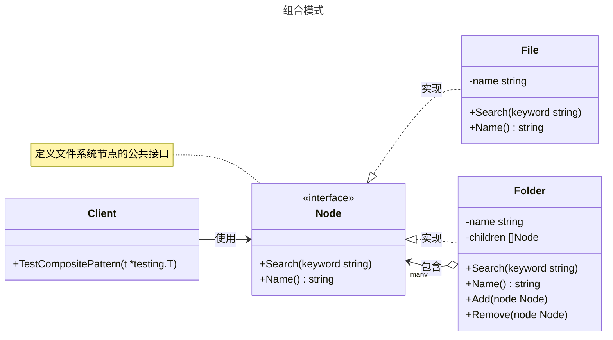

# 组合模式

## 概述

组合模式（Composite Pattern）是一种结构型设计模式，用于构建树形结构以表示“部分-整体”的层次关系。它允许客户端通过统一的接口处理单个对象（叶子节点）和对象集合（组合节点），遵循“单一职责原则”和“开放-封闭原则”。组合模式适用于需要表示层次结构并统一操作的场景，如文件系统、组织架构或图形编辑器中的对象管理。与装饰器模式不同，组合模式关注部分与整体的统一处理，而装饰器模式侧重于动态扩展功能。


## 模式结构

组合模式的主要角色如下：

- **抽象组件（Component）**：定义叶子节点和组合节点的公共接口，包含统一的操作方法。
- **叶子节点（Leaf）**：表示树形结构中的基本元素，无子节点，实现组件接口。
- **组合节点（Composite）**：包含子节点的容器节点，实现组件接口并管理子节点。
- **客户端（Client）**：通过组件接口统一操作叶子节点和组合节点。

## 实现

组合模式的 UML 类图如下所示：



### 文件系统示例

`filesystem.go` 代码如下：

```go
package composite

import (
    "fmt"
    "strings"
)

// Node 是文件和文件夹的通用接口 (Component)
type Node interface {
    Search(keyword string)
    Name() string
}

// File 代表叶子节点 (Leaf)
type File struct {
    name string
}

// NewFile 创建一个文件实例
func NewFile(name string) *File {
    return &File{name: name}
}

// Name 返回文件名
func (f *File) Name() string {
    return f.name
}

// Search 在文件中搜索关键字
// 对于文件，只检查它自己的名字
func (f *File) Search(keyword string) {
    fmt.Printf("在文件 '%s' 中搜索关键字...\n", f.Name())
    if strings.Contains(f.Name(), keyword) {
        fmt.Printf(">>> 在文件 '%s' 中找到关键字 '%s'\n", f.Name(), keyword)
    }
}
```

`folder.go` 代码如下：

```go
package composite

import "fmt"

// Folder 代表组合节点 (Composite)
type Folder struct {
    name     string
    children []Node // 可以包含其他Node（文件或文件夹）
}

// NewFolder 创建一个文件夹实例
func NewFolder(name string) *Folder {
    return &Folder{
        name:     name,
        children: make([]Node, 0),
    }
}

// Name 返回文件夹名
func (f *Folder) Name() string {
    return f.name
}

// Add 向文件夹中添加一个节点（文件或子文件夹）
func (f *Folder) Add(node Node) {
    f.children = append(f.children, node)
}

// Remove 从文件夹中移除一个节点
func (f *Folder) Remove(node Node) {
    for i, child := range f.children {
        if child.Name() == node.Name() {
            f.children = append(f.children[:i], f.children[i+1:]...)
            return
        }
    }
}

// Search 在文件夹中搜索关键字
// 对于文件夹，它会递归地在其所有子节点上执行搜索操作
func (f *Folder) Search(keyword string) {
    fmt.Printf("在文件夹 '%s' 中递归搜索关键字...\n", f.Name())
    // 组合模式的核心：遍历所有子节点，并调用它们自己的Search方法
    for _, child := range f.children {
        child.Search(keyword)
    }
}
```

### 客户端（单元测试）

`client_test.go` 代码如下：

```go
package composite

import (
    "fmt"
    "testing"
)

// TestCompositePattern 测试组合模式的场景
func TestCompositePattern(t *testing.T) {
    // --- 1. 创建叶子节点（文件） ---
    file1 := NewFile("Go设计模式.pdf")
    file2 := NewFile("代码大全.pdf")
    file3 := NewFile("个人简历.docx")

    // --- 2. 创建组合节点（文件夹） ---
    folder1 := NewFolder("技术书籍")
    folder2 := NewFolder("个人文档")
    rootFolder := NewFolder("根目录")

    // --- 3. 构建树形结构 ---
    folder1.Add(file1)
    folder1.Add(file2)

    folder2.Add(file3)

    rootFolder.Add(folder1)
    rootFolder.Add(folder2)

    // --- 4. 客户端统一操作 ---
    // 客户端不需要区分操作的是文件还是文件夹，统一调用Search方法

    fmt.Println("--- 场景1: 在整个文件系统中搜索 '设计' ---")
    // 在根目录上执行搜索，会递归地在所有子节点上执行
    rootFolder.Search("设计")

    fmt.Println("\n--- 场景2: 在 '技术书籍' 文件夹中搜索 '代码' ---")
    // 也可以在子树上执行搜索
    folder1.Search("代码")

    fmt.Println("\n--- 场景3: 在单个文件上搜索 '简历' ---")
    // 也可以直接在叶子节点上执行操作
    file3.Search("简历")
}
```

### 实现说明

组合模式通过 `Node` 接口定义了文件和文件夹的公共行为，`File`（叶子节点）和 `Folder`（组合节点）分别实现了该接口。`Folder` 可以包含多个子节点（文件或文件夹），并通过 `Add` 和 `Remove` 方法管理子节点列表。`Search` 方法是组合模式的核心，允许客户端统一调用以在文件或文件夹中搜索关键字。`Folder` 递归调用子节点的 `Search` 方法，而 `File` 只检查自身名称。测试代码展示了如何构建树形结构并执行搜索操作，验证了组合模式的统一性和灵活性。

## 优点与缺点

**优点**：
- **统一接口**：客户端可以通过单一接口操作叶子节点和组合节点，简化代码。
- **符合开闭原则**：支持动态添加或移除节点，易于扩展新节点类型。
- **层次清晰**：树形结构清晰表示部分-整体关系，便于管理复杂层次。
- **递归操作**：适合需要递归遍历的场景，如搜索或计算总大小。
- **代码复用**：通过接口复用操作逻辑，减少重复代码。

**缺点**：
- **设计复杂性**：统一接口可能导致设计过于通用，增加理解成本。
- **空实现问题**：叶子节点可能需要实现不必要的接口方法（如 `File` 不需要 `Add` 或 `Remove`）。
- **性能开销**：递归操作在大型树形结构中可能导致性能问题。
- **类型安全**：Go 中需手动检查节点类型（如 `File` 或 `Folder`），可能增加代码复杂性。

## 适用场景

组合模式适用于以下场景：

- **树形结构表示**：需要表示部分-整体层次关系，如文件系统、组织架构或菜单结构。
- **统一操作接口**：希望客户端以相同方式处理单个对象和组合对象，如文件和文件夹的搜索功能。
- **递归操作**：需要递归遍历层次结构，如搜索文件或计算文件夹大小。
- **动态管理**：需要动态添加或移除节点，如动态文件系统或 DOM 树管理。
- **跨层级操作**：需要在不同层级执行统一操作，如批量更新节点属性。

## 注意事项

- **Go 设计哲学**：Go 强调简洁性和显式接口，组合模式适合需要统一操作的场景。对于简单层次，直接递归可能更简洁。
- **类型安全**：Go 没有运行时类型检查，需在必要时使用类型断言区分 `File` 和 `Folder`。
- **并发安全**：在并发环境中，需确保 `Folder` 的子节点列表线程安全，可使用 `sync.RWMutex`。
- **性能优化**：对于大型树形结构，需优化递归操作以避免性能瓶颈或栈溢出。
- **接口精简**：抽象组件接口应尽量精简，避免包含不必要的操作。

## 参考资料

- [go-patterns](https://github.com/tmrts/go-patterns)
- [Refactoring.Guru](https://refactoringguru.cn/)