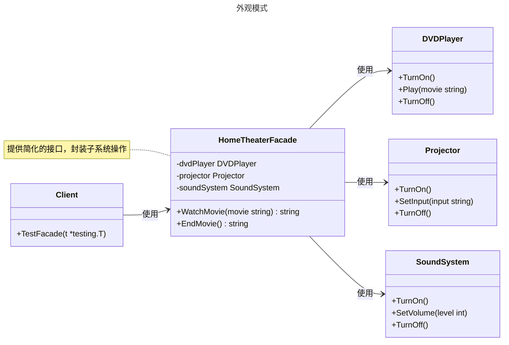

---
title:
author: MagicGopher
keywords: 
description: 
editLink: false
---

# 外观模式

## 概述

外观模式（Facade Pattern）是一种结构型设计模式，旨在为复杂的子系统提供一个简化的统一接口，降低客户端与子系统之间的耦合度。它通过封装子系统的复杂性，使客户端可以更方便地使用子系统功能，同时遵循“迪米特法则”（最少知识原则）。外观模式适用于需要简化复杂系统接口、隔离客户端与子系统实现、或提高代码可维护性的场景。与适配器模式不同，外观模式关注提供简化的新接口，而适配器模式侧重于兼容已有接口。


## 模式结构

外观模式的主要角色如下：

- **外观（Facade）**：提供简化的接口，封装子系统的复杂操作，客户端通过该接口访问子系统。
- **子系统（Subsystem）**：包含一组类或模块，完成特定功能，彼此可能存在复杂依赖关系。
- **客户端（Client）**：通过外观接口调用子系统功能，无需直接与子系统交互。

## 实现

外观模式的 UML 类图如下所示：



### 家庭影院示例

`facade.go` 代码如下：

```go
package facade

import "fmt"

// DVDPlayer 是子系统组件，负责 DVD 播放
type DVDPlayer struct{}

func (d *DVDPlayer) TurnOn() {
    fmt.Println("DVD 播放器已开启")
}

func (d *DVDPlayer) Play(movie string) {
    fmt.Printf("正在播放电影: %s\n", movie)
}

func (d *DVDPlayer) TurnOff() {
    fmt.Println("DVD 播放器已关闭")
}

// Projector 是子系统组件，负责投影仪操作
type Projector struct{}

func (p *Projector) TurnOn() {
    fmt.Println("投影仪已开启")
}

func (p *Projector) SetInput(input string) {
    fmt.Printf("投影仪输入设置为: %s\n", input)
}

func (p *Projector) TurnOff() {
    fmt.Println("投影仪已关闭")
}

// SoundSystem 是子系统组件，负责音响系统
type SoundSystem struct{}

func (s *SoundSystem) TurnOn() {
    fmt.Println("音响系统已开启")
}

func (s *SoundSystem) SetVolume(level int) {
    fmt.Printf("音响音量设置为: %d\n", level)
}

func (s *SoundSystem) TurnOff() {
    fmt.Println("音响系统已关闭")
}

// HomeTheaterFacade 是外观类，提供简化的接口
type HomeTheaterFacade struct {
    dvdPlayer   *DVDPlayer
    projector   *Projector
    soundSystem *SoundSystem
}

// NewHomeTheaterFacade 创建外观实例
func NewHomeTheaterFacade() *HomeTheaterFacade {
    return &HomeTheaterFacade{
        dvdPlayer:   &DVDPlayer{},
        projector:   &Projector{},
        soundSystem: &SoundSystem{},
    }
}

// WatchMovie 封装启动家庭影院的操作
func (h *HomeTheaterFacade) WatchMovie(movie string) string {
    result := "开始观看电影...\n"
    h.dvdPlayer.TurnOn()
    h.projector.TurnOn()
    h.projector.SetInput("DVD")
    h.soundSystem.TurnOn()
    h.soundSystem.SetVolume(10)
    h.dvdPlayer.Play(movie)
    return result
}

// EndMovie 封装关闭家庭影院的操作
func (h *HomeTheaterFacade) EndMovie() string {
    result := "结束电影播放...\n"
    h.dvdPlayer.TurnOff()
    h.projector.TurnOff()
    h.soundSystem.TurnOff()
    return result
}
```

### 客户端（单元测试）

`client_test.go` 代码如下：

```go
package facade

import (
    "strings"
    "testing"
)

// TestFacade 测试外观模式的场景
func TestFacade(t *testing.T) {
    facade := NewHomeTheaterFacade()

    tests := []struct {
        name         string
        action       func() string
        expectedDesc string
    }{
        {
            name:         "WatchMovie",
            action:       func() string { return facade.WatchMovie("Inception") },
            expectedDesc: "开始观看电影...\n",
        },
        {
            name:         "EndMovie",
            action:       func() string { return facade.EndMovie() },
            expectedDesc: "结束电影播放...\n",
        },
    }

    for _, tt := range tests {
        t.Run(tt.name, func(t *testing.T) {
            result := tt.action()
            if result != tt.expectedDesc {
                t.Errorf("expected desc %q, got %q", tt.expectedDesc, result)
            }
            t.Logf("Action result: %s", result)
        })
    }
}
```

### 实现说明

外观模式通过 `HomeTheaterFacade` 类为复杂的家庭影院子系统（`DVDPlayer`、`Projector`、`SoundSystem`）提供了一个简化的接口。客户端只需调用 `WatchMovie` 和 `EndMovie` 方法，即可完成启动和关闭家庭影院的复杂操作，无需直接与子系统交互。`HomeTheaterFacade` 封装了子系统的初始化、配置和关闭逻辑，降低了客户端的使用复杂度。测试代码验证了外观模式的正确性，展示了如何通过简化接口操作复杂系统。

## 优点与缺点

**优点**：
- **简化接口**：为复杂子系统提供统一的简洁接口，降低客户端学习成本。
- **降低耦合**：客户端与子系统解耦，子系统内部变化不影响客户端。
- **符合迪米特法则**：客户端只需与外观交互，减少对子系统细节的了解。
- **提高可维护性**：子系统逻辑集中于外观，便于修改和维护。
- **支持分层设计**：外观可作为系统分层的中介，提升代码结构化。

**缺点**：
- **单一入口风险**：外观可能成为“上帝对象”，承担过多职责。
- **限制灵活性**：客户端无法直接访问子系统，可能限制高级功能的使用。
- **维护成本**：子系统变化频繁时，外观需要频繁更新接口。
- **潜在性能开销**：外观的封装可能引入额外的调用层。

## 适用场景

外观模式适用于以下场景：

- **复杂子系统简化**：需要为复杂子系统提供简单接口，如家庭影院系统或复杂的 API 封装。
- **解耦客户端与子系统**：希望隔离客户端与子系统实现，如数据库访问层或第三方库封装。
- **分层架构**：在多层架构中，外观作为层间接口，如前端与后端服务之间的 API 网关。
- **统一访问入口**：需要为多个子系统提供统一访问点，如日志系统或配置管理。
- **简化遗留系统**：为老旧或复杂的遗留系统提供现代化接口，方便集成。

## 注意事项

- **Go 设计哲学**：Go 强调简单性和显式性，外观模式适合需要隐藏复杂子系统逻辑的场景。对于简单系统，直接调用可能更直观。
- **接口设计**：外观接口应尽量精简，仅暴露必要功能，避免成为过于复杂的“上帝对象”。
- **并发安全**：在并发环境中，需确保子系统组件的状态管理线程安全（如使用 `sync.RWMutex`）。
- **性能考虑**：外观的封装可能引入额外调用，需评估是否适合高性能场景。
- **扩展性**：设计外观时，应考虑子系统可能的扩展，确保接口灵活性。

## 参考资料

- [go-patterns](https://github.com/tmrts/go-patterns)
- [Refactoring.Guru](https://refactoringguru.cn/)