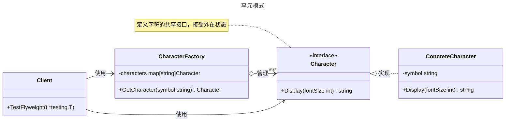

---
title:
author: MagicGopher
keywords: 
description: 
editLink: false
---

# 享元模式

## 概述

享元模式（Flyweight Pattern）是一种结构型设计模式，旨在通过共享对象来减少内存使用和提高性能。它将对象的状态分为内在状态（共享、不随环境变化）和外在状态（不共享、依赖环境），通过复用内在状态相同的对象来优化资源占用。享元模式遵循“单一职责原则”，适用于需要创建大量相似对象且内存开销较大的场景，如文本编辑器中的字符管理或游戏中的重复对象。与单例模式不同，享元模式关注多个共享对象的复用，而单例模式只确保单一实例。


## 模式结构

享元模式的主要角色如下：

- **享元接口（Flyweight）**：定义共享对象的接口，包含操作方法，通常接受外在状态。
- **具体享元（Concrete Flyweight）**：实现享元接口，存储内在状态，提供共享逻辑。
- **享元工厂（Flyweight Factory）**：管理享元对象的创建和共享，确保相同内在状态的对象只创建一次。
- **客户端（Client）**：维护外在状态，通过享元工厂获取共享对象并调用其操作。

## 实现

享元模式的 UML 类图如下所示：



### 文本编辑器字符示例

`flyweight.go` 代码如下：

```go
package flyweight

import "fmt"

// Character 是享元接口，定义字符显示行为
type Character interface {
    Display(fontSize int) string
}

// ConcreteCharacter 是具体享元，存储字符的内在状态
type ConcreteCharacter struct {
    symbol string // 内在状态：字符本身
}

// NewConcreteCharacter 创建具体享元实例
func NewConcreteCharacter(symbol string) *ConcreteCharacter {
    return &ConcreteCharacter{symbol: symbol}
}

// Display 显示字符，接受外在状态（字体大小）
func (c *ConcreteCharacter) Display(fontSize int) string {
    return fmt.Sprintf("字符: %s, 字体大小: %d", c.symbol, fontSize)
}

// CharacterFactory 是享元工厂，管理共享的字符对象
type CharacterFactory struct {
    characters map[string]Character
}

// NewCharacterFactory 创建享元工厂实例
func NewCharacterFactory() *CharacterFactory {
    return &CharacterFactory{
        characters: make(map[string]Character),
    }
}

// GetCharacter 获取或创建共享的字符对象
func (f *CharacterFactory) GetCharacter(symbol string) Character {
    if char, exists := f.characters[symbol]; exists {
        return char
    }
    char := NewConcreteCharacter(symbol)
    f.characters[symbol] = char
    return char
}
```

### 客户端（单元测试）

`client_test.go` 代码如下：

```go
package flyweight

import (
    "testing"
)

// TestFlyweight 测试享元模式的场景
func TestFlyweight(t *testing.T) {
    factory := NewCharacterFactory()

    tests := []struct {
        name         string
        symbol       string
        fontSize     int
        expectedDesc string
    }{
        {
            name:         "Character A with size 12",
            symbol:       "A",
            fontSize:     12,
            expectedDesc: "字符: A, 字体大小: 12",
        },
        {
            name:         "Character A with size 16",
            symbol:       "A",
            fontSize:     16,
            expectedDesc: "字符: A, 字体大小: 16",
        },
        {
            name:         "Character B with size 14",
            symbol:       "B",
            fontSize:     14,
            expectedDesc: "字符: B, 字体大小: 14",
        },
    }

    for _, tt := range tests {
        t.Run(tt.name, func(t *testing.T) {
            char := factory.GetCharacter(tt.symbol)
            result := char.Display(tt.fontSize)
            if result != tt.expectedDesc {
                t.Errorf("expected desc %q, got %q", tt.expectedDesc, result)
            }
            t.Logf("Rendered: %s", result)
        })
    }

    // 验证共享性：相同字符的享元对象应为同一个实例
    char1 := factory.GetCharacter("A")
    char2 := factory.GetCharacter("A")
    if char1 != char2 {
        t.Errorf("expected same Character instance for symbol 'A'")
    }
}
```

### 实现说明

享元模式通过 `Character` 接口定义了字符的共享行为，`ConcreteCharacter` 存储内在状态（字符符号），而外在状态（字体大小）由客户端通过 `Display` 方法传递。`CharacterFactory` 负责管理共享的字符对象，确保相同符号的字符只创建一次，减少内存占用。测试代码验证了享元对象的共享性和正确性，展示了如何通过工厂获取共享对象并应用不同的外在状态。

## 优点与缺点

**优点**：
- **减少内存占用**：通过共享内在状态相同的对象，显著降低内存使用。
- **提高性能**：减少对象创建开销，适合大量相似对象的场景。
- **集中管理**：享元工厂统一管理共享对象，简化对象生命周期。
- **支持动态状态**：外在状态的分离允许灵活配置对象行为。
- **符合单一职责原则**：内在状态和外在状态分离，职责清晰。

**缺点**：
- **增加复杂性**：需要区分内在和外在状态，增加设计和维护成本。
- **线程安全问题**：共享对象在并发环境中需确保线程安全（如使用锁）。
- **状态管理复杂**：外在状态需由客户端维护，可能增加代码复杂度。
- **不适合单一对象**：如果对象数量少或无共享需求，享元模式可能显得多余。

## 适用场景

享元模式适用于以下场景：

- **大量相似对象**：系统需要创建大量相似对象，如文本编辑器中的字符或游戏中的重复精灵。
- **内存优化**：需要减少内存占用，如移动设备或嵌入式系统中的对象管理。
- **内在状态共享**：对象的部分状态可以共享，且外在状态可独立管理。
- **重复对象创建**：对象创建成本高，且可以复用，如图形渲染中的纹理或字体。
- **缓存管理**：需要集中管理共享对象，如数据库连接池或线程池。

## 注意事项

- **Go 设计哲学**：Go 强调简单性和性能，享元模式适合内存敏感场景。对于简单场景，直接创建对象可能更直观。
- **线程安全**：共享对象（如 `CharacterFactory.characters`）在并发环境中需加锁（如 `sync.RWMutex`）。
- **状态分离**：内在状态和外在状态需明确划分，避免混淆职责。
- **性能权衡**：享元模式减少内存占用，但可能增加查找和管理的开销，需评估适用性。
- **工厂设计**：享元工厂应高效管理对象，避免成为性能瓶颈。

## 参考资料

- [go-patterns](https://github.com/tmrts/go-patterns)
- [Refactoring.Guru](https://refactoringguru.cn/)