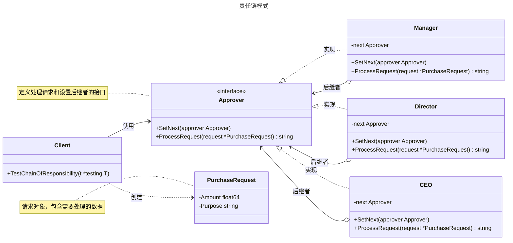

# 责任链模式

## 概述

责任链模式（Chain of Responsibility Pattern）是一种行为设计模式，它允许你将请求沿着处理者链进行发送。收到请求后，每个处理者都有机会处理该请求或者将其传递给链中的下一个处理者。这种模式将请求的发送者和接收者解耦，使得多个对象都有机会处理这个请求，同时避免了请求发送者与接收者之间的强耦合关系。责任链模式遵循“单一职责原则”，每个处理者只需要关注自己的处理逻辑。它适用于需要动态组织处理单元或处理顺序不固定的场景，如 Web 框架中的中间件、审批流程或日志系统。


## 模式结构

责任链模式的主要角色如下：

- **处理者接口（Handler）**：定义处理请求的接口，通常包含一个处理方法和一个设置下一个处理者的方法。
- **具体处理者（Concrete Handler）**：实现处理者接口。它会判断自己是否能处理当前请求，如果能，则进行处理；否则，将请求转发给它的后继者。
- **客户端（Client）**：创建处理者链，并向链的第一个处理者发起请求。客户端通常不知道哪个具体处理者会处理该请求。

## 实现

责任链模式的 UML 类图如下所示：



### 采购审批流程示例

`approver.go` 代码如下：

```go
package chain

// PurchaseRequest 结构体定义了采购请求的内容
type PurchaseRequest struct {
	Amount  float64
	Purpose string
}

// Approver 是处理者接口，定义了审批行为
type Approver interface {
	SetNext(approver Approver)
	ProcessRequest(request *PurchaseRequest) string
}
```

`concrete_approver.go` 代码如下：

```go
package chain

import "fmt"

// Manager 是具体处理者，处理 1000 元以下的采购
type Manager struct {
	next Approver
}

// SetNext 设置下一个审批者
func (m *Manager) SetNext(approver Approver) {
	m.next = approver
}

// ProcessRequest 处理采购请求，若金额小于 1000 元则批准，否则传递给下一个审批者
func (m *Manager) ProcessRequest(request *PurchaseRequest) string {
	if request.Amount < 1000 {
		return fmt.Sprintf("经理批准了采购 '%s'，金额：%f", request.Purpose, request.Amount)
	}
	if m.next != nil {
		return m.next.ProcessRequest(request)
	}
	return "无人能处理此采购请求"
}

// Director 是具体处理者，处理 10000 元以下的采购
type Director struct {
	next Approver
}

// SetNext 设置下一个审批者
func (d *Director) SetNext(approver Approver) {
	d.next = approver
}

// ProcessRequest 处理采购请求，若金额小于 10000 元则批准，否则传递给下一个审批者
func (d *Director) ProcessRequest(request *PurchaseRequest) string {
	if request.Amount < 10000 {
		return fmt.Sprintf("总监批准了采购 '%s'，金额：%f", request.Purpose, request.Amount)
	}
	if d.next != nil {
		return d.next.ProcessRequest(request)
	}
	return "无人能处理此采购请求"
}

// CEO 是具体处理者，处理所有金额的采购
type CEO struct {
	next Approver
}

// SetNext 设置下一个审批者
func (c *CEO) SetNext(approver Approver) {
	c.next = approver
}

// ProcessRequest 处理采购请求，CEO 批准所有采购请求
func (c *CEO) ProcessRequest(request *PurchaseRequest) string {
	return fmt.Sprintf("CEO 批准了采购 '%s'，金额：%f", request.Purpose, request.Amount)
}
```

### 客户端（单元测试）

`client_test.go` 代码如下：

```go
package chain

import (
	"fmt"
	"testing"
)

// 单元测试
// 模拟客户端调用

// TestManagerApproval 测试 Manager 是否能正确处理金额小于 1000 的采购请求
func TestManagerApproval(t *testing.T) {
	manager := &Manager{}
	request := &PurchaseRequest{Amount: 500, Purpose: "办公用品"}
	expected := fmt.Sprintf("经理批准了采购 '%s'，金额：%f", request.Purpose, request.Amount)
	result := manager.ProcessRequest(request)
	if result != expected {
		t.Errorf("预期结果: %s, 实际结果: %s", expected, result)
	}
	t.Logf("Manager 成功处理金额 %f 的采购请求，用途: %s", request.Amount, request.Purpose)
}

// TestDirectorApproval 测试 Director 是否能正确处理金额在 1000 到 10000 之间的采购请求
func TestDirectorApproval(t *testing.T) {
	manager := &Manager{}
	director := &Director{}
	manager.SetNext(director)
	request := &PurchaseRequest{Amount: 5000, Purpose: "设备采购"}
	expected := fmt.Sprintf("总监批准了采购 '%s'，金额：%f", request.Purpose, request.Amount)
	result := manager.ProcessRequest(request)
	if result != expected {
		t.Errorf("预期结果: %s, 实际结果: %s", expected, result)
	}
	t.Logf("Director 成功处理金额 %f 的采购请求，用途: %s", request.Amount, request.Purpose)
}

// TestCEOApproval 测试 CEO 是否能正确处理金额大于 10000 的采购请求
func TestCEOApproval(t *testing.T) {
	manager := &Manager{}
	director := &Director{}
	ceo := &CEO{}
	manager.SetNext(director)
	director.SetNext(ceo)
	request := &PurchaseRequest{Amount: 15000, Purpose: "大型项目投资"}
	expected := fmt.Sprintf("CEO 批准了采购 '%s'，金额：%f", request.Purpose, request.Amount)
	result := manager.ProcessRequest(request)
	if result != expected {
		t.Errorf("预期结果: %s, 实际结果: %s", expected, result)
	}
	t.Logf("CEO 成功处理金额 %f 的采购请求，用途: %s", request.Amount, request.Purpose)
}

// TestNoHandler 测试当链中没有合适的处理者时是否返回正确提示
func TestNoHandler(t *testing.T) {
	manager := &Manager{}
	request := &PurchaseRequest{Amount: 15000, Purpose: "超额采购"}
	expected := "无人能处理此采购请求"
	result := manager.ProcessRequest(request)
	if result != expected {
		t.Errorf("预期结果: %s, 实际结果: %s", expected, result)
	}
	t.Logf("无合适处理者，金额 %f 的采购请求被拒绝，用途: %s", request.Amount, request.Purpose)
}

// TestChainOfResponsibility 测试请求是否能正确沿责任链传递
func TestChainOfResponsibility(t *testing.T) {
	manager := &Manager{}
	director := &Director{}
	ceo := &CEO{}
	manager.SetNext(director)
	director.SetNext(ceo)

	tests := []struct {
		amount   float64
		purpose  string
		expected string
	}{
		{500, "办公用品", fmt.Sprintf("经理批准了采购 '办公用品'，金额：%f", 500.0)},
		{5000, "设备采购", fmt.Sprintf("总监批准了采购 '设备采购'，金额：%f", 5000.0)},
		{15000, "大型项目投资", fmt.Sprintf("CEO 批准了采购 '大型项目投资'，金额：%f", 15000.0)},
	}

	for _, test := range tests {
		request := &PurchaseRequest{Amount: test.amount, Purpose: test.purpose}
		result := manager.ProcessRequest(request)
		if result != test.expected {
			t.Errorf("金额: %f, 用途: %s, 预期结果: %s, 实际结果: %s", test.amount, test.purpose, test.expected, result)
		}
		t.Logf("责任链成功处理金额 %f 的采购请求，用途: %s", test.amount, test.purpose)
	}
}
```

### 实现说明

责任链模式通过 `Approver` 接口定义了处理者的通用行为：`ProcessRequest` 和 `SetNext`。`Manager`、`Director` 和 `CEO` 作为具体处理者，各自实现了自己的处理逻辑。客户端通过 `createApprovalChain` 函数构建了一个处理链：`Manager` -> `Director` -> `CEO`。当请求发出后，它会从链的头部（`Manager`）开始传递，直到找到能够处理它的对象为止。测试代码验证了不同金额的采购请求被正确地传递到相应的审批者并得到处理。

## 优点与缺点

**优点**：

- **降低耦合度**：请求的发送者和接收者解耦，发送者无需知道请求由哪个对象处理。
- **增强灵活性**：可以随时增加、删除或重新排列处理者，动态地修改责任链。
- **符合单一职责原则**：每个处理者只需关注自己的处理逻辑，职责清晰。
- **增强可扩展性**：符合开放/封闭原则，新增处理者无需修改现有代码。

**缺点**：

- **请求不保证被处理**：请求可能到达链的末尾也未被任何处理者处理。
- **性能影响**：请求需要从链头开始遍历，在链条较长时可能会影响性能。
- **调试困难**：由于请求在链中动态传递，可能不容易追踪其处理过程，增加了调试的复杂性。

## 适用场景

责任链模式适用于以下场景：

- **多个对象可处理同一请求**：当有多个对象可以处理一个请求，但具体由哪个对象处理在运行时动态确定。
- **处理顺序敏感**：当需要以特定的顺序执行一系列处理逻辑时，如 Web 框架的中间件（日志、认证、授权）。
- **解耦请求与处理**：希望向多个对象发出请求，但不想明确指定接收者时。
- **审批工作流**：企业中的报销、请假等审批流程，请求需要经过多个级别的审批。
- **事件处理系统**：图形界面中的事件冒泡或捕获机制。

## 注意事项

- Go 设计哲学：Go 的 net/http 包中的 Handler 和中间件就是责任链模式的经典实现。通过接口和函数式编程可以优雅地构建处理链。
- 避免链条过长：过长的责任链会影响性能，应保持链的简洁和高效。
- 处理请求的完整性：应确保请求在链中总能被处理，可以设置一个默认的“兜底”处理者在链的末尾，用于处理所有未被处理的请求。
- 避免循环引用：在构建链时，要确保不会形成循环，否则可能导致无限递归和栈溢出。
- 线程安全：如果处理者是有状态的并且在并发环境中使用，必须确保其线程安全。

## 参考资料

- [go-patterns](https://github.com/tmrts/go-patterns)
- [Refactoring.Guru](https://refactoringguru.cn/)