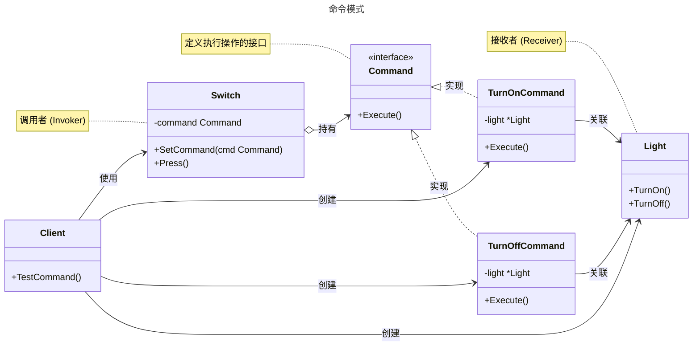

# 命令模式

## 概述

命令模式（Command Pattern）是一种行为设计模式，它可将请求转换为一个包含与请求相关的所有信息的独立对象。该转换让你能根据不同的请求将方法参数化、延迟请求执行或将其放入队列中，且能实现可撤销操作。通过将请求封装成对象，命令模式将发出请求的对象和执行请求的对象解耦。这使得请求的发送者（调用者）无需了解接收者的任何接口信息，只需要知道如何发送命令即可。


## 模式结构

命令模式的主要角色如下：

- **命令接口（Command）**：定义一个执行操作的接口，通常只有一个 `Execute` 方法。
- **具体命令（Concrete Command）**：实现命令接口，并绑定一个接收者（Receiver）。当 Execute 方法被调用时，它会调用接收者的相应方法来执行具体操作。
- **接收者（Receiver）**：知道如何执行与请求相关的操作。任何类都可以作为一个接收者。
- **调用者（Invoker）**：持有一个命令对象，并要求该命令执行请求。调用者不直接与接收者通信。
- **客户端（Client）**：创建具体命令对象，并设置其接收者。然后，客户端将命令对象与调用者关联起来。

## 实现

命令模式的 UML 类图如下所示：



### 电灯开关示例

`command.go` 代码如下：

```go
package command

// 命令模式

// Command 是命令接口
type Command interface {
	Execute()
}
```

`receiver.go` 代码如下：

```go
package command

import "fmt"

// 命令模式

// Light 是接收者，知道如何执行具体操作
type Light struct {
	Name string
}

// TurnOn 打开灯
func (l *Light) TurnOn() {
	fmt.Printf("%s 灯已打开\n", l.Name)
}

// TurnOff 关闭灯
func (l *Light) TurnOff() {
	fmt.Printf("%s 灯已关闭\n", l.Name)
}
```

`concrete_command.go` 代码如下：

```go
package command

// 命令模式

// TurnOnCommand 是一个具体的命令，用于开灯
type TurnOnCommand struct {
	light *Light
}

// NewTurnOnCommand 创建 TurnOnCommand
func NewTurnOnCommand(light *Light) *TurnOnCommand {
	return &TurnOnCommand{light: light}
}

// Execute 执行命令
func (c *TurnOnCommand) Execute() {
	c.light.TurnOn()
}

// TurnOffCommand 是一个具体的命令，用于关灯
type TurnOffCommand struct {
	light *Light
}

// NewTurnOffCommand 创建 TurnOffCommand
func NewTurnOffCommand(light *Light) *TurnOffCommand {
	return &TurnOffCommand{light: light}
}

// Execute 执行命令
func (c *TurnOffCommand) Execute() {
	c.light.TurnOff()
}
```

`invoker.go` 代码如下：

```go
package command

// 命令模式

// Switch 是调用者，它持有一个命令并触发它
type Switch struct {
	command Command
}

// SetCommand 设置命令
func (s *Switch) SetCommand(cmd Command) {
	s.command = cmd
}

// Press 模拟按钮按下，执行命令
func (s *Switch) Press() {
	s.command.Execute()
}
```

### 客户端（单元测试）

`client_test.go` 代码如下：

```go
package command

import "testing"

// 单元测试
// 模拟客户端调用

// TestCommand 测试命令模式的功能
func TestCommand(t *testing.T) {
	// 创建接收者（客厅的灯）
	livingRoomLight := &Light{Name: "客厅"}

	// 创建具体命令并绑定接收者
	turnOn := NewTurnOnCommand(livingRoomLight)   // 创建开灯命令
	turnOff := NewTurnOffCommand(livingRoomLight) // 创建关灯命令

	// 创建调用者（开关）
	lightSwitch := &Switch{}

	t.Run("Turn On Light", func(t *testing.T) {
		// 配置调用者和开灯命令
		lightSwitch.SetCommand(turnOn)
		// 按下开关，执行开灯命令
		lightSwitch.Press()
	})

	t.Run("Turn Off Light", func(t *testing.T) {
		// 重新配置调用者和关灯命令
		lightSwitch.SetCommand(turnOff)
		// 按下开关，执行关灯命令
		lightSwitch.Press()
	})
}
```

### 实现说明

在该示例中 `Light` 是接收者，它包含了开灯和关灯的实际逻辑。`Command` 接口定义了 `Execute` 方法。`TurnOnCommand` 和 `TurnOffCommand` 是具体命令，它们封装了对 `Light` 对象的操作。`Switch` 是调用者，它不关心具体执行的是什么命令，只负责在 `Press` 方法被调用时执行 `command.Execute()`。客户端负责组装这一切：创建接收者、创建命令、并将命令设置给调用者。这种方式实现了调用者 (`Switch`) 与接收者 (`Light`) 之间的完全解耦。

## 优点与缺点

**优点**：

- **解耦调用者和接收者**：调用者和接收者之间没有直接依赖关系，调用者只需与命令接口交互。
- **命令是头等对象**：命令可以像其他对象一样被存储、传递和返回，这为实现队列、日志和事务等高级功能提供了基础。
- **易于扩展**：可以轻松添加新的具体命令类，而无需修改现有代码，符合开闭原则。
- **支持撤销和重做**：命令模式是实现撤销（`Undo`）和重做（`Redo`）操作的理想选择，只需在命令接口中增加一个 `Undo` 方法即可。
- **支持宏命令**：可以方便地将多个命令组合成一个宏命令（Composite Command）。

**缺点**：

- **类（结构体）数量增加**：为每一个具体操作都创建一个命令类，可能会导致系统中类的数量急剧增加。
- **逻辑分散**：一个操作的实现逻辑可能会分散在具体命令和接收者中，增加了代码的理解难度。

## 适用场景

命令模式适用于以下场景：

- **参数化对象**：需要用操作来参数化对象时。例如，将一个回调函数注册到某个UI按钮上。
- **请求排队或记录**：需要将请求放入队列、记录日志或进行序列化时。
- **实现撤销和重做**：当系统需要支持撤销（Undo）和重做（Redo）功能时。
- **GUI 交互**：图形界面的按钮和菜单项通常使用命令模式来响应用户操作。
- **任务调度**：在系统中实现任务队列，其中工作线程从队列中取出命令对象并执行。

## 注意事项

- **Go 设计哲学**：在 Go 语言中，对于简单的场景，可以直接使用函数作为一等公民（闭包）来替代具体的命令对象，这样可以使代码更简洁。但对于需要支持撤销、重做或宏命令等复杂场景，完整的命令模式结构仍然非常有用。
- **接收者的选择**：接收者应该包含核心的业务逻辑。命令对象应保持轻量，主要负责将请求从调用者转发给接收者。
- **实现撤销操作**：若要支持撤销，命令对象需要在执行前保存接收者的状态，以便在撤销时恢复。
- **无接收者的命令**：命令也可以不依赖于接收者，而是自己实现所有逻辑。这在需要将简单操作或函数参数化时很有用。

## 参考资料

- [go-patterns](https://github.com/tmrts/go-patterns)
- [Refactoring.Guru](https://refactoringguru.cn/)