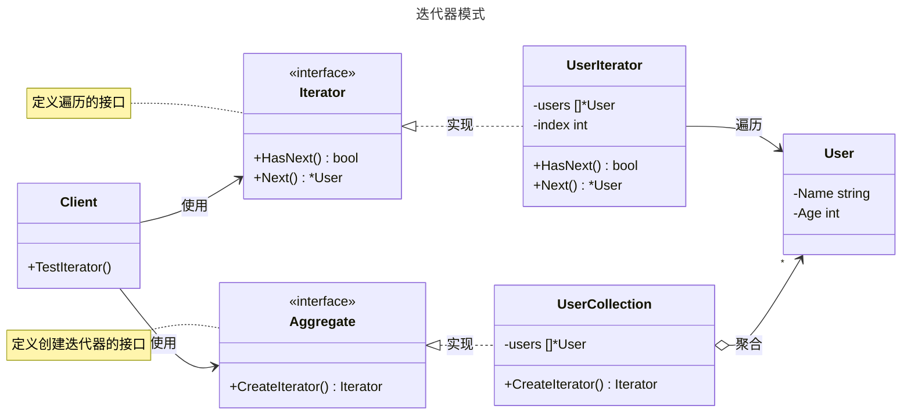

# 迭代器模式

## 概述

迭代器模式（Iterator Pattern）是一种行为设计模式，它能让你在不暴露集合底层表现形式（列表、栈、树等）的情况下，遍历集合中的所有元素。通过将遍历算法从集合中分离出来，迭代器模式使得你可以拥有多种遍历方式，同时也简化了集合的接口。这种模式遵循“单一职责原则”，将数据存储的职责和数据遍历的职责分离开来。


## 模式结构

迭代器模式的主要角色如下：

- **迭代器接口（Iterator）**：定义遍历元素所需的操作接口，通常包括获取下一个元素、判断是否还有下一个元素等方法。
- **具体迭代器（Concrete Iterator）**：实现迭代器接口，并负责管理遍历过程中的当前状态（例如当前位置索引）。
- **聚合接口（Aggregate）**：定义创建迭代器对象的接口，通常包含一个返回迭代器的方法。
- **具体聚合（Concrete Aggregate）**：实现聚合接口，负责创建具体的迭代器实例。它持有实际的数据集合。
- **客户端（Client）**：通过聚合对象获取迭代器实例，并使用迭代器来遍历集合，无需关心集合的内部结构。

## 实现

迭代器模式的 UML 类图如下所示：



### 用户集合遍历示例

`interfaces.go` 代码如下：

```go
package iterator

// 迭代器模式

// User 结构体
type User struct {
	Name string
	Age  int
}

// Iterator 是迭代器接口
type Iterator interface {
	HasNext() bool
	Next() *User
}

// Aggregate 是聚合接口
type Aggregate interface {
	CreateIterator() Iterator
}
```

`concrete_aggregate.go` 代码如下：

```go
package iterator

// 迭代器模式

// UserCollection 是具体聚合
type UserCollection struct {
	users []*User
}

// CreateIterator 创建迭代器
func (u *UserCollection) CreateIterator() Iterator {
	return &UserIterator{
		users: u.users,
	}
}

// Add 添加用户
func (u *UserCollection) Add(user *User) {
	u.users = append(u.users, user)
}
```

`concrete_iterator.go` 代码如下：

```go
package iterator

// 迭代器模式

// UserIterator 是具体迭代器
type UserIterator struct {
	users []*User
	index int
}

// HasNext 检查是否有下一个元素
func (u *UserIterator) HasNext() bool {
	return u.index < len(u.users)
}

// Next 获取下一个元素
func (u *UserIterator) Next() *User {
	if u.HasNext() {
		user := u.users[u.index]
		u.index++
		return user
	}
	return nil
}
```

### 客户端（单元测试）

`client_test.go` 代码如下：

```go
package iterator

import (
	"testing"
)

// 单元测试
// 模拟客户端调用

// TestIterator 测试迭代器模式的功能
func TestIterator(t *testing.T) {
	// 创建具体聚合对象
	userCollection := &UserCollection{}
	userCollection.Add(&User{Name: "Alice", Age: 30})
	userCollection.Add(&User{Name: "Bob", Age: 25})
	userCollection.Add(&User{Name: "Charlie", Age: 35})

	// 从聚合对象获取迭代器
	iterator := userCollection.CreateIterator()

	// 使用迭代器遍历集合
	for iterator.HasNext() {
		user := iterator.Next()
		if user != nil {
			t.Logf("User:{Name %s, Age: %d}", user.Name, user.Age)
		}
	}
}
```

### 实现说明

在这个例子中，客户端代码 (`client_test.go`) 首先创建了一个 `UserCollection` 对象并添加了几个 `User`。然后，它调用 `CreateIterator()` 方法来获取一个迭代器实例。客户端通过一个 `for` 循环，使用迭代器的 `HasNext()` 和 `Next()` 方法来遍历集合中的所有用户，而完全不需要知道 `UserCollection` 内部是如何存储这些用户的（在这个例子中是切片 `[]*User`）。这成功地将遍历逻辑与数据结构解耦。

## 优点与缺点

**优点**：

- **封装性**：隐藏了集合的内部实现细节，客户端无需关心其数据结构。
- **单一职责原则**：遍历算法的逻辑被移出集合类，放到了迭代器类中，使两者职责更清晰。
- **支持多种遍历方式**：可以为同一个集合提供多种不同的迭代器实现（如正序、倒序）。
- **并行遍历**：可以同时在同一个集合上创建多个迭代器，它们可以独立地进行遍历而互不干扰。
- **简化客户端代码**：客户端可以用同样的方式遍历不同的集合，只要它们都提供了迭代器。

**缺点**：

- **增加复杂性**：对于简单的集合，直接遍历可能比引入迭代器模式更简单直接。
- **可能会暴露不必要的接口**：有时为了实现特定的迭代器，可能需要在集合类中添加一些原本不希望公开的方法。

## 适用场景

迭代器模式适用于以下场景：

- **复杂的集合结构**：当你的集合有复杂的内部结构，但你希望向客户端隐藏其复杂性时。
- **需要多种遍历方式**：当需要为集合提供多种遍历方式（如正序、倒序、跳跃等）时。
- **统一遍历接口**：当你希望为不同类型的集合提供一个统一的遍历接口时。
- **Go 语言的 `for...range`**：实际上，Go 语言内置的 `for...range` 循环就是迭代器模式的一种体现，它为数组、切片、字符串、map 和通道提供了统一的遍历方式。

## 注意事项

- Go 语言的惯例：在 Go 中，对于标准的数据结构，`for...range` 是最惯用和高效的迭代方式。只有在创建自定义的、复杂的数据结构时，才有必要手动实现完整的迭代器模式。
- 迭代器失效问题：如果在遍历过程中，集合的结构发生了修改（例如添加或删除元素），可能会导致迭代器失效或产生不可预料的结果。需要明确迭代期间修改集合的策略（例如，允许修改或直接 panic）。
- 并发安全：在并发环境中使用时，必须确保迭代器和集合的线程安全。
- 资源管理：如果迭代器在遍历时占用了系统资源（如文件句柄、网络连接），需要考虑提供一个 `Close()` 或 `Release()` 方法来释放资源。

## 参考资料

- [go-patterns](https://github.com/tmrts/go-patterns)
- [Refactoring.Guru](https://refactoringguru.cn/)