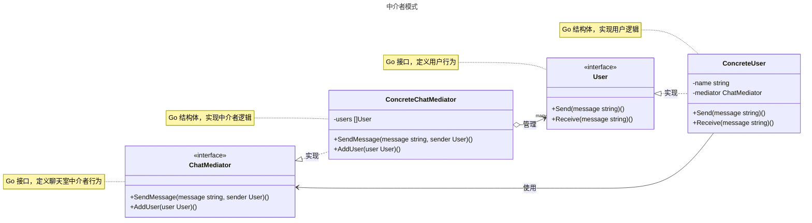

# 中介者模式

## 概述

中介者模式（Mediator Pattern）是一种行为设计模式，它提供了一个中介对象来封装一系列对象之间的交互。该模式通过让对象不直接相互引用，而是通过中介者进行通信，从而降低多个对象和类之间的通信复杂性。这种方式将对象之间复杂的网状通信结构变为简单的星型结构，使得对象间的耦合松散，能够独立地改变它们之间的交互。


## 模式结构

中介者模式的主要角色如下：

- **中介者接口（Mediator）**：定义对象间通信的接口，声明交互方法，通常为接口类型（interface）。
- **具体中介者（Concrete Mediator）**：实现中介者接口的结构体，协调各同事对象的交互，维护同事对象的引用。
- **同事接口（Colleague）**：定义参与交互的对象的行为接口，声明与中介者通信的方法。
- **具体同事（Concrete Colleague）**：实现同事接口的结构体，处理自身逻辑并通过中介者与其他同事交互。
- **客户端（Client）**：创建中介者和同事对象，设置它们之间的关系，通常为调用代码或测试代码。

## 实现

中介者模式的 UML 类图如下所示：



### 聊天室示例

`mediator.go` 代码如下：

```go
package mediator

// 中介者模式

// 中介者接口

// ChatMediator 定义聊天室中介者接口
type ChatMediator interface {
	SendMessage(message string, sender User)
	AddUser(user User)
}
```

`concrete_mediator.go` 代码如下：

```go
package mediator

// 中介者模式

// 具体中介者

// ConcreteChatMediator 是具体中介者，管理用户并协调消息发送
type ConcreteChatMediator struct {
	users []User
}

// NewConcreteChatMediator 创建具体中介者实例
func NewConcreteChatMediator() *ConcreteChatMediator {
	return &ConcreteChatMediator{
		users: make([]User, 0),
	}
}

// AddUser 添加用户到聊天室
func (m *ConcreteChatMediator) AddUser(user User) {
	m.users = append(m.users, user)
}

// SendMessage 广播消息给除发送者外的所有用户
func (m *ConcreteChatMediator) SendMessage(message string, sender User) {
	for _, user := range m.users {
		if user != sender {
			user.Receive(message)
		}
	}
}
```

`user.go` 代码如下：

```go
package mediator

// 中介者模式

// 同事类

// User 是同事类接口，定义用户行为
type User interface {
	Send(message string)
	Receive(message string)
}
```

`concrete_user.go` 代码如下：

```go
package mediator

import "fmt"

// 中介者模式

// 具体同事类

// ConcreteUser 是具体用户，参与聊天室通信
type ConcreteUser struct {
	name     string
	mediator ChatMediator
}

// NewConcreteUser 创建具体用户实例
func NewConcreteUser(name string, mediator ChatMediator) *ConcreteUser {
	return &ConcreteUser{
		name:     name,
		mediator: mediator,
	}
}

// Send 发送消息，通过中介者广播
func (u *ConcreteUser) Send(message string) {
	fmt.Printf("%s 发送消息: %s\n", u.name, message)
	u.mediator.SendMessage(message, u)
}

// Receive 接收消息
func (u *ConcreteUser) Receive(message string) {
	fmt.Printf("%s 收到消息: %s\n", u.name, message)
}
```

### 客户端（单元测试）

`client_test.go` 代码如下：

```go
package mediator

import "testing"

// 单元测试
// 模拟客户端调用

// TestMediator 测试中介者模式的场景
func TestMediator(t *testing.T) {
	mediator := NewConcreteChatMediator()

	// 创建用户
	user1 := NewConcreteUser("Alice", mediator)
	user2 := NewConcreteUser("Bob", mediator)
	user3 := NewConcreteUser("Charlie", mediator)

	// 添加用户到聊天室
	mediator.AddUser(user1)
	mediator.AddUser(user2)
	mediator.AddUser(user3)

	// 用户发送消息，通过中介者进行通信
	t.Run("Alice sends a message", func(t *testing.T) {
		t.Log("--- Alice 发送消息 ---")
		user1.Send("大家好！")
		// 预期：Bob 和 Charlie 会收到消息
	})

	t.Run("Bob sends a message", func(t *testing.T) {
		t.Log("\n--- Bob 发送消息 ---")
		user2.Send("你好, Alice！")
		// 预期：Alice 和 Charlie 会收到消息
	})
}
```

### 实现说明

中介者模式通过 `ChatMediator` 接口定义了用户间通信的行为，`ConcreteChatMediator` 负责协调消息的广播，管理所有参与者（用户）。`ConcreteUser` 作为参与者，通过中介者发送和接收消息，避免直接与其他用户交互。测试代码模拟了一个聊天室场景，验证了消息通过中介者正确广播到其他用户，同时通过日志捕获确保输出符合预期。

## 优点与缺点

**优点**：

- **降低耦合**：对象间通过中介者通信，减少直接依赖，提升模块化。
- **集中控制**：中介者统一管理交互逻辑，便于修改和扩展。
- **简化交互**：将多对多交互简化为通过中介者的一对多交互。
- **提高可维护性**：交互逻辑集中于中介者，易于调试和优化。
- **符合迪米特法则**：对象只需了解中介者，降低对其他对象的了解。

**缺点**：

- **中介者复杂性**：中介者可能因管理过多交互逻辑而变得复杂，难以维护。
- **单点故障风险**：中介者作为核心组件，故障可能影响整个系统。
- **性能开销**：所有通信需通过中介者，可能增加延迟。
- **扩展性问题**：中介者需为新参与者添加支持，可能违反开闭原则。

## 适用场景

中介者模式适用于以下场景：

- **复杂对象交互**：多个对象间存在复杂的多对多交互，如聊天室或事件总线。
- **低耦合需求**：需要降低对象间的直接依赖，如 GUI 控件或微服务通信。
- **集中管理**：需要统一协调对象行为，如工作流引擎或消息分发系统。
- **动态交互**：对象间的交互关系可能动态变化，如多人协作系统。
- **事件驱动系统**：需要集中处理事件分发，如游戏中的事件管理。

## 注意事项

- **Go 设计哲学**：Go 强调简单性和并发，中介者模式适合集中管理复杂交互，但需注意中介者的复杂度。对于简单场景，可考虑直接通信或 Go 的通道机制。
- **线程安全**：在并发环境中，中介者（如 `ConcreteChatMediator.users`）需加锁（如 `sync.RWMutex`）以确保线程安全。
- **职责划分**：中介者应仅负责协调通信，避免承担过多业务逻辑。
- **性能权衡**：中介者集中管理可能引入性能瓶颈，需优化通信逻辑。
- **可扩展性**：设计中介者时，应考虑新参与者的加入，尽量遵循开闭原则。

## 参考资料

- [go-patterns](https://github.com/tmrts/go-patterns)
- [Refactoring.Guru](https://refactoringguru.cn/)

