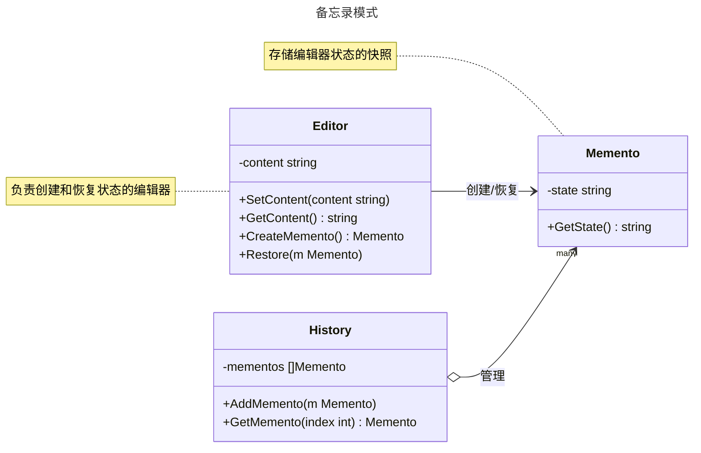

# 备忘录模式

## 概述

备忘录模式（Memento Pattern）是一种行为型设计模式，旨在保存对象的状态快照，以便在需要时恢复到该状态，而不破坏对象的封装性。它通过将对象的状态存储到外部“备忘录”对象中，并在适当时候恢复状态，常用于实现撤销（Undo）或回滚功能。备忘录模式遵循“单一职责原则”和“开闭原则”，适用于需要记录对象历史状态的场景，如文本编辑器的撤销操作、游戏中的存档功能等。与命令模式不同，备忘录模式专注于状态的保存与恢复，而命令模式更关注行为的封装。


## 模式结构

备忘录模式的主要角色如下：

- **发起人（Originator）**：需要保存和恢复状态的对象，负责创建和使用备忘录。
- **备忘录（Memento）**：存储发起人状态的快照，通常只允许发起人访问其内部状态。
- **管理者（Caretaker）**：负责存储和管理备忘录对象，但不修改其内容。
- **客户端（Client）**：通过发起人和管理者操作备忘录，执行保存和恢复逻辑。

## 实现

备忘录模式的 UML 类图如下所示：



### 文本编辑器示例

`editor.go` 代码如下：

```go
package memento

// 备忘录模式

// 发起人

// Editor 是发起人，负责管理内容并创建/恢复备忘录
type Editor struct {
	content string // 状态：编辑器内容
}

// SetContent 设置编辑器内容
func (e *Editor) SetContent(content string) {
	e.content = content
}

// GetContent 获取编辑器内容
func (e *Editor) GetContent() string {
	return e.content
}

// CreateMemento 创建备忘录，保存当前状态
func (e *Editor) CreateMemento() *Memento {
	return &Memento{state: e.content}
}

// Restore 从备忘录恢复状态
func (e *Editor) Restore(m *Memento) {
	e.content = m.GetState()
}
```

`memento.go` 代码如下：

```go
package memento

// 备忘录模式

// 备忘录

// Memento 是备忘录，存储编辑器的状态
type Memento struct {
	state string // 状态：编辑器内容的快照
}

// GetState 获取备忘录中的状态
func (m *Memento) GetState() string {
	return m.state
}
```

`history.go` 代码如下：

```go
package memento

// 备忘录模式

// 管理者

// History 是管理者，负责存储和管理备忘录
type History struct {
	mementos []*Memento
}

// AddMemento 添加备忘录到历史记录
func (h *History) AddMemento(m *Memento) {
	h.mementos = append(h.mementos, m)
}

// GetMemento 获取指定索引的备忘录
func (h *History) GetMemento(index int) *Memento {
	if index < 0 || index >= len(h.mementos) {
		return nil
	}
	return h.mementos[index]
}
```

### 客户端（单元测试）

`client_test.go` 代码如下：

```go
package memento

import (
	"testing"
)

// 单元测试
// 模拟客户端调用

// TestMemento 测试备忘录模式的场景
func TestMemento(t *testing.T) {
	// 创建发起人、备忘录和管理者
	editor := &Editor{}
	history := &History{}

	// 定义测试用例
	tests := []struct {
		name         string
		content      string
		restoreIndex int
		expected     string
	}{
		{
			name:         "保存并恢复第一个状态",
			content:      "第一个内容",
			restoreIndex: 0,
			expected:     "第一个内容",
		},
		{
			name:         "保存并恢复第二个状态",
			content:      "第二个内容",
			restoreIndex: 1,
			expected:     "第二个内容",
		},
		{
			name:         "恢复到第一个状态",
			content:      "第三个内容",
			restoreIndex: 0,
			expected:     "第一个内容",
		},
	}

	// 执行测试
	for _, tt := range tests {
		t.Run(tt.name, func(t *testing.T) {
			// 设置内容并保存状态
			editor.SetContent(tt.content)
			history.AddMemento(editor.CreateMemento())

			// 恢复到指定状态
			memento := history.GetMemento(tt.restoreIndex)
			if memento == nil {
				t.Fatalf("无法获取索引 %d 处的备忘录", tt.restoreIndex)
			}
			editor.Restore(memento)

			// 验证恢复结果
			result := editor.GetContent()
			if result != tt.expected {
				t.Errorf("期望内容 %q，实际得到 %q", tt.expected, result)
			}
			t.Logf("恢复的内容: %s", result)
		})
	}
}
```

### 实现说明

备忘录模式通过 `Editor`（发起人）管理文本内容，并通过 `CreateMemento` 方法生成状态快照存储在 `Memento`（备忘录）中。`History`（管理者）负责存储和管理多个备忘录对象，客户端通过 `History` 获取备忘录并调用 `Editor` 的 `Restore` 方法恢复状态。测试代码验证了状态的保存和恢复功能，展示了如何通过备忘录实现撤销操作。`Memento` 的状态只对 `Editor` 可见，保护了封装性。

## 优点与缺点

**优点**：
- **状态恢复**：支持撤销和回滚功能，适合需要历史记录的场景。
- **封装性**：备忘录隐藏了对象的内部状态，保护发起人的封装性。
- **灵活性**：支持保存多个状态快照，允许恢复到任意历史状态。
- **符合单一职责原则**：发起人、备忘录和管理者职责清晰。
- **易于扩展**：可扩展为支持复杂状态的序列化或持久化。

**缺点**：
- **内存开销**：保存大量状态快照可能占用较多内存。
- **管理复杂性**：需要额外管理者来维护备忘录，增加系统复杂性。
- **性能影响**：频繁创建和恢复状态可能影响性能。
- **状态泄露风险**：若备忘录未正确封装，可能导致状态泄露。

## 适用场景

备忘录模式适用于以下场景：

- **撤销操作**：需要支持撤销或回滚的场景，如文本编辑器、图形编辑软件。
- **状态快照**：需要保存对象某一时刻的状态快照，如游戏存档、数据库事务回滚。
- **历史记录**：需要记录和恢复对象的历史状态，如浏览器后退功能。
- **状态隔离**：状态需独立存储，且不能直接访问对象内部状态。
- **事务管理**：需要在事务失败时恢复到初始状态，如数据库或工作流系统。

## 注意事项

- **Go 设计哲学**：Go 强调简单性和性能，备忘录模式适合需要状态管理的场景，但应避免过度设计。
- **封装性保护**：确保备忘录的状态只能由发起人访问，避免通过管理者直接修改。
- **内存管理**：在内存敏感场景中，需限制备忘录数量或实现状态压缩。
- **线程安全**：在并发环境中，`History` 的备忘录存储需加锁（如 `sync.Mutex`）以确保线程安全。
- **状态序列化**：若状态复杂，可结合序列化技术（如 JSON）保存备忘录。

## 参考资料

- [go-patterns](https://github.com/tmrts/go-patterns)
- [Refactoring.Guru](https://refactoringguru.cn/)