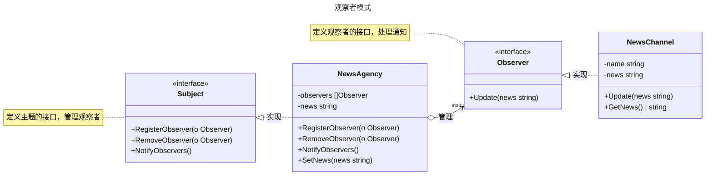

# 观察者模式

## 概述

观察者模式（Observer Pattern）是一种行为型设计模式，定义了对象间一对多的依赖关系，当一个对象的状态发生变化时，所有依赖它的对象都会收到通知并自动更新。它通过将主题（Subject）和观察者（Observer）解耦，允许动态添加或移除观察者，广泛应用于事件驱动系统。观察者模式遵循“开闭原则”和“依赖倒置原则”，适用于需要动态响应状态变化的场景，如用户界面更新、消息通知系统等。与发布-订阅模式类似，但观察者模式通常更直接，主题直接管理观察者，而发布-订阅模式通过中间件（如消息队列）解耦。


## 模式结构

观察者模式的主要角色如下：

- **主题接口（Subject）**：定义注册、移除和通知观察者的接口。
- **具体主题（Concrete Subject）**：维护观察者列表，管理状态并在状态变化时通知观察者。
- **观察者接口（Observer）**：定义更新方法，接收主题状态变化的通知。
- **具体观察者（Concrete Observer）**：实现观察者接口，根据通知更新自身状态。
- **客户端（Client）**：创建主题和观察者，触发状态变化和通知。

## 实现

观察者模式的 UML 类图如下所示：



### 新闻发布示例

`subject.go` 代码如下：

```go
package observer

// 观察者模式

// 主题接口

// Subject 定义主题接口，管理观察者
type Subject interface {
	RegisterObserver(o Observer)
	RemoveObserver(o Observer)
	NotifyObservers()
}
```

`news_agency.go` 代码如下：

```go
package observer

// 观察者模式

// 具体主题

// NewsAgency 是具体主题，管理新闻和观察者
type NewsAgency struct {
	observers []Observer
	news      string
}

// RegisterObserver 添加观察者
func (n *NewsAgency) RegisterObserver(o Observer) {
	n.observers = append(n.observers, o)
}

// RemoveObserver 移除观察者
func (n *NewsAgency) RemoveObserver(o Observer) {
	for i, observer := range n.observers {
		if observer == o {
			n.observers = append(n.observers[:i], n.observers[i+1:]...)
			break
		}
	}
}

// NotifyObservers 通知所有观察者
func (n *NewsAgency) NotifyObservers() {
	for _, observer := range n.observers {
		observer.Update(n.news)
	}
}

// SetNews 设置新闻并通知观察者
func (n *NewsAgency) SetNews(news string) {
	n.news = news
	n.NotifyObservers()
}
```

`observer.go` 代码如下：

```go
package observer

// 观察者模式

// 观察者接口

// Observer 定义观察者接口，处理通知
type Observer interface {
	Update(news string)
}
```

`news_channel.go` 代码如下：

```go
package observer

// 观察者模式

// 具体观察者

// NewsChannel 是具体观察者，接收和存储新闻
type NewsChannel struct {
	name string
	news string
}

// NewNewsChannel 创建具体观察者实例
func NewNewsChannel(name string) *NewsChannel {
	return &NewsChannel{name: name}
}

// Update 更新观察者的新闻内容
func (n *NewsChannel) Update(news string) {
	n.news = news
}

// GetNews 获取观察者的新闻内容
func (n *NewsChannel) GetNews() string {
	return n.news
}
```

### 客户端（单元测试）

`client_test.go` 代码如下：

```go
package observer

import (
	"testing"
)

// 单元测试
// 模拟客户端调用

// TestObserver 测试观察者模式的场景
func TestObserver(t *testing.T) {
	agency := &NewsAgency{}
	channel1 := NewNewsChannel("频道1")
	channel2 := NewNewsChannel("频道2")

	tests := []struct {
		name         string
		news         string
		expectedNews string
	}{
		{
			name:         "发布第一条新闻",
			news:         "突发新闻：事件A",
			expectedNews: "突发新闻：事件A",
		},
		{
			name:         "发布第二条新闻",
			news:         "最新报道：事件B",
			expectedNews: "最新报道：事件B",
		},
	}

	// 注册观察者
	agency.RegisterObserver(channel1)
	agency.RegisterObserver(channel2)

	for _, tt := range tests {
		t.Run(tt.name, func(t *testing.T) {
			// 发布新闻
			agency.SetNews(tt.news)

			// 验证观察者接收的新闻
			if result := channel1.GetNews(); result != tt.expectedNews {
				t.Errorf("频道1 期望新闻 %q，实际得到 %q", tt.expectedNews, result)
			}
			if result := channel2.GetNews(); result != tt.expectedNews {
				t.Errorf("频道2 期望新闻 %q，实际得到 %q", tt.expectedNews, result)
			}
			t.Logf("新闻发布: %s", tt.expectedNews)
		})
	}

	// 测试移除观察者
	agency.RemoveObserver(channel2)
	agency.SetNews("新事件：事件C")
	if channel2.GetNews() != "最新报道：事件B" {
		t.Errorf("频道2 不应接收新新闻，期望 %q，实际得到 %q", "最新报道：事件B", channel2.GetNews())
	}
	if channel1.GetNews() != "新事件：事件C" {
		t.Errorf("频道1 期望新闻 %q，实际得到 %q", "新事件：事件C", channel1.GetNews())
	}
}
```

### 实现说明

观察者模式通过 `Subject` 接口定义了主题的行为，`NewsAgency`（具体主题）维护观察者列表并在新闻更新时通知所有观察者。`Observer` 接口定义了观察者的更新方法，`NewsChannel`（具体观察者）接收并存储新闻内容。客户端通过注册和移除观察者、设置新闻内容来触发通知。测试代码验证了观察者模式的动态注册、通知和移除功能，展示了主题与观察者的解耦以及状态更新的正确性。

## 优点与缺点

**优点**：
- **松耦合**：主题和观察者解耦，观察者可动态添加或移除。
- **支持广播**：一个主题状态变化可通知多个观察者，适合一对多通信。
- **符合开闭原则**：易于扩展新的观察者，无需修改主题代码。
- **动态管理**：观察者可在运行时注册或取消注册，灵活性高。
- **事件驱动**：适合事件驱动系统，如 GUI 事件处理或消息通知。

**缺点**：
- **内存泄漏风险**：未移除的观察者可能导致内存泄漏。
- **通知开销**：大量观察者可能导致通知性能下降。
- **复杂性增加**：需要维护观察者列表，增加设计和维护成本。
- **通知顺序不定**：观察者通知顺序不可控，可能影响某些场景。
- **线程安全问题**：并发环境中需确保观察者列表和通知的线程安全。

## 适用场景

观察者模式适用于以下场景：

- **状态变化通知**：一个对象状态变化需通知多个相关对象，如 UI 组件更新。
- **事件驱动系统**：需要响应事件或触发回调，如按钮点击、传感器数据更新。
- **消息广播**：需要将消息广播给多个订阅者，如新闻发布或消息队列。
- **解耦模块**：模块间需松耦合通信，如 MVC 架构中的视图和模型。
- **实时更新**：需要实时同步状态，如股票价格监控或聊天应用。

## 注意事项

- **Go 设计哲学**：Go 强调简单性和性能，观察者模式适合事件驱动场景，但应避免过度复杂的设计。
- **线程安全**：在并发环境中，`NewsAgency` 的观察者列表需加锁（如 `sync.RWMutex`）以确保线程安全。
- **内存管理**：及时移除不再需要的观察者，避免内存泄漏。
- **通知优化**：若观察者数量多，可考虑异步通知或批量更新以提高性能。
- **与发布-订阅模式区分**：观察者模式中主题直接管理观察者，而发布-订阅模式通常通过中间件（如消息代理）解耦。

## 参考资料

- [go-patterns](https://github.com/tmrts/go-patterns)
- [Refactoring.Guru](https://refactoringguru.cn/)