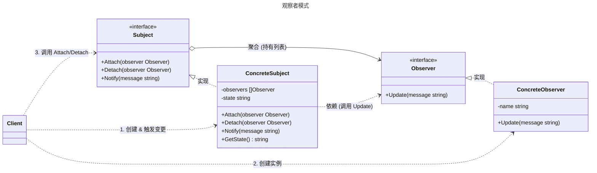

# 观察者模式

## 概述

观察者模式（Observer Pattern）是一种行为型设计模式，定义了对象间一对多的依赖关系，当一个对象的状态发生变化时，所有依赖它的对象都会收到通知并自动更新。它通过将主题（Subject）和观察者（Observer）解耦，允许动态添加或移除观察者，广泛应用于事件驱动系统。观察者模式遵循“开闭原则”和“依赖倒置原则”，适用于需要动态响应状态变化的场景，如用户界面更新、消息通知系统等。与发布-订阅模式类似，但观察者模式通常更直接，主题直接管理观察者，而发布-订阅模式通过中间件（如消息队列）解耦。


## 模式结构

观察者模式的主要角色如下：

- **主题接口（Subject）**：定义注册、移除和通知观察者的接口。
- **具体主题（Concrete Subject）**：维护观察者列表，管理状态并在状态变化时通知观察者。
- **观察者接口（Observer）**：定义更新方法，接收主题状态变化的通知。
- **具体观察者（Concrete Observer）**：实现观察者接口，根据通知更新自身状态。
- **客户端（Client）**：创建主题和观察者，触发状态变化和通知。

## 实现

观察者模式的 UML 类图如下所示：



### 新闻发布示例

`observer.go` 代码如下：

```go
package observer

import "fmt"

// 观察者模式（观察者接口与具体实现）

// Observer 定义观察者接口
// 所有具体的观察者都必须实现这个方法，当主题状态改变时会被调用
type Observer interface {
	// Update 当主题状态发生变化时，主题会调用此方法通知观察者
	// 参数 message 是主题传递过来的最新状态信息
	Update(message string)
}

// ConcreteObserver 具体观察者实现
type ConcreteObserver struct {
	name string // 观察者名称，用于区分不同的观察者
}

// NewConcreteObserver 创建一个具体的观察者实例
func NewConcreteObserver(name string) *ConcreteObserver {
	return &ConcreteObserver{name: name}
}

// Update 实现 Observer 接口，接收主题的通知并打印
func (o *ConcreteObserver) Update(message string) {
	fmt.Printf("[观察者: %s] 收到状态更新通知 → %s\n", o.name, message)
}
```

`subject.go` 代码如下：	

```go
package observer

// 观察者模式（主题接口与具体实现）

// Subject 定义主题（被观察者）接口
type Subject interface {
	// Attach 注册/添加一个观察者
	Attach(observer Observer)

	// Detach 注销/移除一个观察者
	Detach(observer Observer)

	// Notify 通知所有已注册的观察者状态已变更
	Notify(message string)
}

// ConcreteSubject 具体的主题实现（被观察的对象）
type ConcreteSubject struct {
	observers []Observer // 保存所有注册的观察者
	state     string     // 主题当前的状态（可选，用于业务扩展）
}

// NewConcreteSubject 创建一个具体的主题实例
func NewConcreteSubject() *ConcreteSubject {
	return &ConcreteSubject{
		observers: make([]Observer, 0),
	}
}

// Attach 添加观察者到列表中
func (s *ConcreteSubject) Attach(observer Observer) {
	s.observers = append(s.observers, observer)
}

// Detach 从列表中移除指定的观察者
func (s *ConcreteSubject) Detach(observer Observer) {
	for i, obs := range s.observers {
		if obs == observer { // 引用相同即认为相等
			s.observers = append(s.observers[:i], s.observers[i+1:]...)
			return
		}
	}
}

// Notify 遍历所有观察者，调用它们的 Update 方法进行通知
func (s *ConcreteSubject) Notify(message string) {
	s.state = message // 更新主题状态（实际项目中可能有更多字段）
	for _, observer := range s.observers {
		observer.Update(message)
	}
}

// GetState （可选）获取当前状态，用于观察者主动拉取（拉模型扩展）
func (s *ConcreteSubject) GetState() string {
	return s.state
}
```

### 客户端（单元测试）

`client_test.go` 代码如下：

```go
package observer

import "testing"

// 单元测试
// 模拟客户端调用

// TestObserverPattern 模拟真实客户端使用观察者模式的完整流程
func TestObserverPattern(t *testing.T) {
	// 1. 创建被观察者（主题）
	newsAgency := NewConcreteSubject()

	// 2. 创建多个具体观察者（比如不同的新闻订阅者）
	tvStation := NewConcreteObserver("电视台")
	wechatUser := NewConcreteObserver("微信用户")
	appUser := NewConcreteObserver("手机APP用户")

	// 3. 订阅（注册观察者）
	newsAgency.Attach(tvStation)
	newsAgency.Attach(wechatUser)
	newsAgency.Attach(appUser)

	t.Log("第一次发布新闻，所有人都能收到...")
	// 4. 主题状态改变 → 自动通知所有观察者（推模型）
	newsAgency.Notify("紧急：最新天气预报发布！")

	t.Log("\n微信用户取关了...")
	// 5. 某个观察者取消订阅
	newsAgency.Detach(wechatUser)

	t.Log("第二次发布新闻，只有剩余订阅者收到...")
	newsAgency.Notify("股市大涨，指数突破14000点！")
}
```

### 实现说明

**接口解耦：**

- 通过 `Subject` 和 `Observer` 接口定义交互契约，实现了发布者与订阅者的松耦合。`Subject` 只知道观察者实现了 `Update` 方法，而不关心具体的业务逻辑。
- `Observer` 接口仅包含 `Update(message string)` 方法，这是一种推模型（`Push Model`）的实现，主题在通知时直接将数据（`message`）推送给观察者。

**主题（Subject）管理机制：**

- `ConcreteSubject` 使用切片 `[]Observer` 来存储所有活跃的观察者列表。
- 注册（Attach）：使用 Go 的内建函数 `append` 将新的观察者加入切片。
- 注销（Detach）：遍历切片，通过对比接口对象的引用地址找到目标观察者，并利用切片操作 `append(s.observers[:i], s.observers[i+1:]...)` 将其移除。这是 Go 语言中删除切片元素的标准做法。
- 通知（Notify）：遍历 `observers` 切片，逐一调用观察者的 `Update` 方法。这里是同步调用，意味着如果某个观察者处理耗时较长，会阻塞后续观察者的通知。

**观察者（Observer）响应：**

- `ConcreteObserver` 内部维护了 `name` 字段用于区分身份。
- 收到 `Update` 调用时，直接打印消息，模拟业务响应。

**客户端流程：**

- 客户端首先创建 `ConcreteSubject`，然后实例化多个 `ConcreteObserver`。
- 通过 `Attach` 方法建立订阅关系。
- 当调用 `Notify` 触发事件时，所有在列表中的观察者都会收到通知。
- 演示了 `Detach` 后，被移除的观察者不再收到后续通知的逻辑。

## 优点与缺点

**优点**：
- **松耦合**：主题和观察者解耦，观察者可动态添加或移除。
- **支持广播**：一个主题状态变化可通知多个观察者，适合一对多通信。
- **符合开闭原则**：易于扩展新的观察者，无需修改主题代码。
- **动态管理**：观察者可在运行时注册或取消注册，灵活性高。
- **事件驱动**：适合事件驱动系统，如 GUI 事件处理或消息通知。

**缺点**：
- **内存泄漏风险**：未移除的观察者可能导致内存泄漏。
- **通知开销**：大量观察者可能导致通知性能下降。
- **复杂性增加**：需要维护观察者列表，增加设计和维护成本。
- **通知顺序不定**：观察者通知顺序不可控，可能影响某些场景。
- **线程安全问题**：并发环境中需确保观察者列表和通知的线程安全。

## 适用场景

观察者模式适用于以下场景：

- **状态变化通知**：一个对象状态变化需通知多个相关对象，如 UI 组件更新。
- **事件驱动系统**：需要响应事件或触发回调，如按钮点击、传感器数据更新。
- **消息广播**：需要将消息广播给多个订阅者，如新闻发布或消息队列。
- **解耦模块**：模块间需松耦合通信，如 MVC 架构中的视图和模型。
- **实时更新**：需要实时同步状态，如股票价格监控或聊天应用。

## 注意事项

- **Go 设计哲学**：Go 强调简单性和性能，观察者模式适合事件驱动场景，但应避免过度复杂的设计。
- **线程安全**：在并发环境中，`NewsAgency` 的观察者列表需加锁（如 `sync.RWMutex`）以确保线程安全。
- **内存管理**：及时移除不再需要的观察者，避免内存泄漏。
- **通知优化**：若观察者数量多，可考虑异步通知或批量更新以提高性能。
- **与发布-订阅模式区分**：观察者模式中主题直接管理观察者，而发布-订阅模式通常通过中间件（如消息代理）解耦。

## 参考资料

- [go-patterns](https://github.com/tmrts/go-patterns)
- [Refactoring.Guru](https://refactoringguru.cn/)