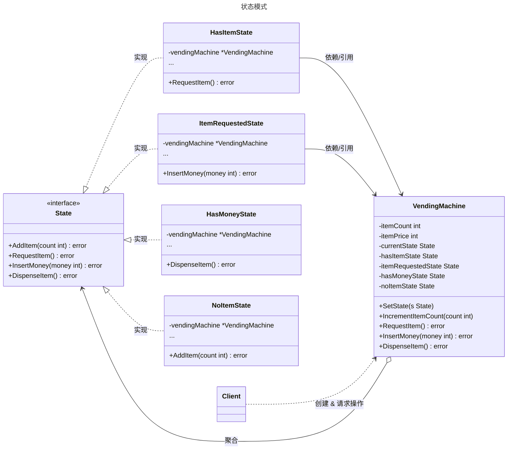

# 状态模式

## 概述

状态模式（State Pattern）是一种行为型设计模式，它允许一个对象在其内部状态改变时改变它的行为，对象看起来似乎修改了它的类。该模式将与特定状态相关的行为封装到独立的状态类中，并将“状态的切换”逻辑与“状态的行为”逻辑分离。状态模式的核心思想是将复杂的 `if-else` 或 `switch-case` 状态判断逻辑消除，通过多态性来处理不同状态下的行为差异。它符合“单一职责原则”和“开闭原则”。


## 模式结构

状态模式的主要角色如下：

- **环境类（Context）**：维护一个当前状态实例（State），并将与状态相关的操作委托给当前状态对象处理。它定义了客户端需要的接口。
- **抽象状态（State）**：定义一个接口，用于封装与环境类的一个特定状态相关的行为。
- **具体状态（Concrete State）**：实现抽象状态接口，定义该状态下具体的行为逻辑。每个具体状态类对应环境的一个状态。

## 实现

以 **自动售货机（Vending Machine）** 为例。售货机有不同的状态（如：有商品、无商品、已投币、售出商品），在不同状态下，用户的操作（如：请求商品、投币、出货）会产生不同的反馈或触发状态流转。

状态模式的 UML 类图如下所示：



### 状态接口

`state.go` 代码如下：

```go
package state

// State 定义状态接口
// 包含售货机所有可能触发的动作
type State interface {
	// AddItem 添加商品
	AddItem(count int) error
	
	// RequestItem 请求购买商品
	RequestItem() error
	
	// InsertMoney 投入货币
	InsertMoney(money int) error
	
	// DispenseItem 发放商品
	DispenseItem() error
}
```

### 环境类

`vending_machine.go` 代码如下：

```go
package state

import "fmt"

// VendingMachine 环境类：自动售货机
// 它维护当前状态，并将操作委托给当前状态处理
type VendingMachine struct {
	hasItemState       State
	itemRequestedState State
	hasMoneyState      State
	noItemState        State

	currentState State // 当前状态

	itemCount int // 商品数量
	itemPrice int // 商品价格
}

// NewVendingMachine 创建一个新的售货机实例
func NewVendingMachine(itemCount, itemPrice int) *VendingMachine {
	v := &VendingMachine{
		itemCount: itemCount,
		itemPrice: itemPrice,
	}

	// 初始化所有具体状态，并将当前实例注入到状态中，以便状态能修改 Context
	v.hasItemState = &HasItemState{vendingMachine: v}
	v.itemRequestedState = &ItemRequestedState{vendingMachine: v}
	v.hasMoneyState = &HasMoneyState{vendingMachine: v}
	v.noItemState = &NoItemState{vendingMachine: v}

	// 设置初始状态
	if itemCount > 0 {
		v.currentState = v.hasItemState
	} else {
		v.currentState = v.noItemState
	}

	return v
}

// SetState 改变当前状态
func (v *VendingMachine) SetState(s State) {
	v.currentState = s
}

// 委托方法：将具体请求委托给当前状态处理

func (v *VendingMachine) RequestItem() error {
	return v.currentState.RequestItem()
}

func (v *VendingMachine) AddItem(count int) error {
	return v.currentState.AddItem(count)
}

func (v *VendingMachine) InsertMoney(money int) error {
	return v.currentState.InsertMoney(money)
}

func (v *VendingMachine) DispenseItem() error {
	return v.currentState.DispenseItem()
}

// IncrementItemCount 增加商品库存（辅助方法）
func (v *VendingMachine) IncrementItemCount(count int) {
	fmt.Printf("增加商品 %d 个\n", count)
	v.itemCount += count
}
```

### 具体状态实现

`concrete_states.go` 代码如下：

```go
package state

import (
	"fmt"
	"errors"
)

// --- 1. NoItemState (无货状态) ---
type NoItemState struct {
	vendingMachine *VendingMachine
}

func (i *NoItemState) RequestItem() error {
	return errors.New("缺货中，请勿选择")
}
func (i *NoItemState) AddItem(count int) error {
	i.vendingMachine.IncrementItemCount(count)
	// 状态流转：无货 -> 有货
	i.vendingMachine.SetState(i.vendingMachine.hasItemState)
	return nil
}
func (i *NoItemState) InsertMoney(money int) error {
	return errors.New("缺货中，无法投币")
}
func (i *NoItemState) DispenseItem() error {
	return errors.New("缺货中，无法出货")
}

// --- 2. HasItemState (有货/空闲状态) ---
type HasItemState struct {
	vendingMachine *VendingMachine
}

func (i *HasItemState) RequestItem() error {
	if i.vendingMachine.itemCount == 0 {
		i.vendingMachine.SetState(i.vendingMachine.noItemState)
		return errors.New("商品已售罄")
	}
	fmt.Println("商品已选中")
	// 状态流转：有货 -> 请求中
	i.vendingMachine.SetState(i.vendingMachine.itemRequestedState)
	return nil
}
func (i *HasItemState) AddItem(count int) error {
	fmt.Printf("增加商品 %d 个\n", count)
	i.vendingMachine.IncrementItemCount(count)
	return nil
}
func (i *HasItemState) InsertMoney(money int) error {
	return errors.New("请先选择商品")
}
func (i *HasItemState) DispenseItem() error {
	return errors.New("请先选择商品并支付")
}

// --- 3. ItemRequestedState (商品请求/等待支付状态) ---
type ItemRequestedState struct {
	vendingMachine *VendingMachine
}

func (i *ItemRequestedState) RequestItem() error {
	return errors.New("已经选择商品，请支付")
}
func (i *ItemRequestedState) AddItem(count int) error {
	return errors.New("正在交易中，无法补货")
}
func (i *ItemRequestedState) InsertMoney(money int) error {
	if money < i.vendingMachine.itemPrice {
		return fmt.Errorf("金额不足，需要 %d", i.vendingMachine.itemPrice)
	}
	fmt.Println("投币成功")
	// 状态流转：请求中 -> 已付款
	i.vendingMachine.SetState(i.vendingMachine.hasMoneyState)
	return nil
}
func (i *ItemRequestedState) DispenseItem() error {
	return errors.New("请先支付")
}

// --- 4. HasMoneyState (已付款/出货状态) ---
type HasMoneyState struct {
	vendingMachine *VendingMachine
}

func (i *HasMoneyState) RequestItem() error {
	return errors.New("正在出货中")
}
func (i *HasMoneyState) AddItem(count int) error {
	return errors.New("正在出货中，无法补货")
}
func (i *HasMoneyState) InsertMoney(money int) error {
	return errors.New("已经支付，请等待出货")
}
func (i *HasMoneyState) DispenseItem() error {
	fmt.Println("正在发放商品...")
	i.vendingMachine.itemCount = i.vendingMachine.itemCount - 1
	
	// 状态流转：根据剩余库存决定回到 有货 还是 无货
	if i.vendingMachine.itemCount > 0 {
		i.vendingMachine.SetState(i.vendingMachine.hasItemState)
	} else {
		i.vendingMachine.SetState(i.vendingMachine.noItemState)
	}
	return nil
}
```

### 客户端（单元测试）

`client_test.go` 代码如下：

```go
package state

import (
	"testing"
	"log"
)

// TestStatePattern 模拟客户端操作自动售货机
func TestStatePattern(t *testing.T) {
	// 1. 初始化售货机，只有 1 件商品，价格 10 元
	vendingMachine := NewVendingMachine(1, 10)

	// 2. 正常购买流程
	t.Log("--- 第一次购买 ---")
	
	err := vendingMachine.RequestItem() // 选中商品
	if err != nil { log.Fatal(err) }

	err = vendingMachine.InsertMoney(10) // 投币
	if err != nil { log.Fatal(err) }

	err = vendingMachine.DispenseItem() // 出货
	if err != nil { log.Fatal(err) }

	t.Log("第一次购买完成")

	// 3. 尝试购买空售货机
	t.Log("\n--- 第二次购买（缺货）---")
	
	err = vendingMachine.RequestItem() // 尝试选中
	if err != nil {
		t.Logf("预期错误: %s", err.Error())
	}

	// 4. 补货
	t.Log("\n--- 补货 ---")
	err = vendingMachine.AddItem(2)
	if err != nil { log.Fatal(err) }

	t.Log("补货完成，可以继续购买")
	
	// 验证状态是否恢复
	err = vendingMachine.RequestItem()
	if err == nil {
		t.Log("成功再次选中商品")
	}
}
```

### 实现说明

1. Context 持有 State：VendingMachine 结构体持有所有可能的状态实例（如 hasItemState 等），并在 currentState 字段中记录当前激活的状态。

2. 委托机制：VendingMachine 的操作方法（如 RequestItem）并不直接执行业务逻辑，而是直接调用 currentState.RequestItem()，实现了行为的动态切换。

3. 循环依赖处理：在 Go 语言中，具体状态类（如 HasItemState）通常需要持有 VendingMachine 的引用以便调用 SetState 触发状态流转。为了避免包的循环导入（import cycle），通常将 Context 和 State 接口定义在同一个包中。

4. 状态流转：状态的切换逻辑被封装在具体状态类的方法中（例如 HasMoneyState.DispenseItem 执行完后，根据库存判断是切换回 HasItemState 还是 NoItemState）。这使得状态流转逻辑局部化，便于阅读。

## 优点与缺点

**优点：**

- 封装性强：将与特定状态相关的行为局部化到一个类中，并且将不同状态的行为分割开来。
- 消除条件语句：避免了在 Context 类中出现大量的 if-else 或 switch-case 语句，代码更清晰。
- 显式转换：状态转换在代码中是显式的（通过 SetState），而不是通过修改某些变量值（如 status = 1）隐式实现。
- 符合开闭原则：新增状态只需增加新的具体状态类，无需修改 Context 源码。

**缺点：**

- 类爆炸：如果状态很多，会产生大量的具体状态类，增加系统复杂度。
- 依赖耦合：具体状态类通常需要依赖 Context 类来执行状态切换，导致耦合度较高。
- 逻辑分散：状态流转逻辑分散在各个具体状态类中，不如集中在一个地方（如状态机表）容易总览全局。

## 适用场景

状态模式适用于以下场景：

- 行为随状态改变：对象的行为依赖于其状态（属性），并且必须在运行时根据状态改变其行为。
- 条件语句复杂：代码中包含大量与对象状态有关的条件语句，导致代码难以维护。
- 工作流/订单系统：如订单状态（待支付、已支付、发货、收货、取消），审批流（草稿、待审批、驳回、通过）等场景。
- TCP 连接：如 TCP 连接的不同状态（Established, Listening, Closed）对应不同的行为。

## 注意事项

- Go 语言特性：Go 不支持类继承，状态模式通过接口（Interface）和组合（Composition）实现。
- 并发安全：在并发环境下，如果多个 Goroutine 同时操作 Context，需要在 Context（如 VendingMachine）的方法中加锁（sync.Mutex），以防止状态切换时出现数据竞争。
- 状态复用：如果具体状态类没有内部成员变量（无状态的对象），可以设计为单例模式，在多个 Context 实例间共享，以节省内存。
- 与策略模式的区别：策略模式通常由客户端指定使用哪种策略，且策略之间通常相互独立；而状态模式的状态由 Context 或 状态自身管理，且状态之间存在流转关系。

## 参考资料

- [go-patterns](https://github.com/tmrts/go-patterns)
- [Refactoring.Guru](https://refactoringguru.cn/)

::: tip 提示
文档正在更新中...
:::