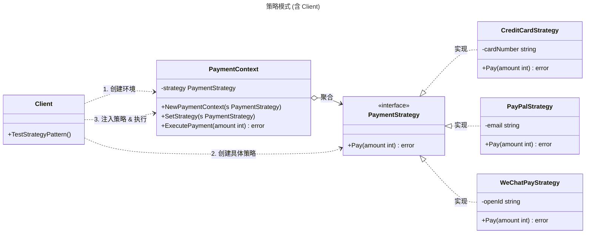

# 策略模式

## 概述

策略模式（Strategy Pattern）是一种行为型设计模式，它定义了一系列算法，并将每种算法封装在独立的类中，使它们可以互换。策略模式让算法的变化独立于使用算法的客户。该模式的核心在于将“做什么”（业务逻辑）与“怎么做”（具体算法）分离。它符合“开闭原则”，可以在不修改原有代码的情况下引入新的策略。


## 模式结构

策略模式的主要角色如下：

- **策略接口（Strategy）**：定义所有支持的算法的公共接口。环境类使用该接口调用具体策略定义的算法。
- **具体策略（Concrete Strategy）**：实现了策略接口，提供具体的算法实现。
- **环境类（Context）**：持有一个策略对象的引用，仅通过策略接口与策略对象交互。它通常提供一个设置策略的方法，以便客户端动态切换策略。
- **客户端（Client）**：创建具体的策略对象，并将其传递给环境类。

## 实现

以 **支付系统（Payment System）** 为例。电商系统支持多种支付方式（如：信用卡支付、PayPal 支付、微信支付）。不同的支付方式对应不同的处理逻辑（算法），用户可以在下单时选择具体的支付方式。

策略模式的 UML 类图如下所示：



### 策略接口

`strategy.go` 代码如下：

```go
package strategy

// PaymentStrategy 定义支付策略接口
// 所有具体的支付方式都必须实现该接口
type PaymentStrategy interface {
	// Pay 执行支付逻辑
	Pay(amount float64) error
}
```

### 具体策略实现

`concrete_strategies.go` 代码如下：

```go
package strategy

import "fmt"

// CreditCardStrategy 信用卡支付
type CreditCardStrategy struct {
	cardNumber string
	cvv        string
}

// NewCreditCardStrategy 创建信用卡支付策略
func NewCreditCardStrategy(cardNumber, cvv string) *CreditCardStrategy {
	return &CreditCardStrategy{
		cardNumber: cardNumber,
		cvv:        cvv,
	}
}

// Pay 执行支付逻辑
func (c *CreditCardStrategy) Pay(amount float64) error {
	// 模拟信用卡支付逻辑
	fmt.Printf("已使用信用卡 %s 支付 %02.f 元\n", c.cardNumber, amount)
	return nil
}

// PayPalStrategy PayPal支付
type PayPalStrategy struct {
	email    string
	password string
}

// NewPayPalStrategy 创建PayPal支付策略
func NewPayPalStrategy(email, password string) *PayPalStrategy {
	return &PayPalStrategy{
		email:    email,
		password: password,
	}
}

// Pay 执行支付逻辑
func (p *PayPalStrategy) Pay(amount float64) error {
	// 模拟 PayPal 支付逻辑
	fmt.Printf("已使用 PayPal 账号 %s 支付 %02.f 元\n", p.email, amount)
	return nil
}

// WeChatPayStrategy 微信支付
type WeChatPayStrategy struct {
	openId string
}

// NewWeChatPayStrategy 创建微信支付策略
func NewWeChatPayStrategy(openId string) *WeChatPayStrategy {
	return &WeChatPayStrategy{openId: openId}
}

// Pay 执行支付逻辑
func (w *WeChatPayStrategy) Pay(amount float64) error {
	fmt.Printf("已使用微信支付 (OpenID: %s) 支付 %02.f 元\n", w.openId, amount)
	return nil
}
```

### 环境类

`payment_context.go` 代码如下：

```go
package strategy

import "errors"

// PaymentContext 支付环境类
// 它持有当前的支付策略，并提供执行支付的方法
type PaymentContext struct {
	strategy PaymentStrategy
}

// NewPaymentContext 创建一个新的支付环境，需指定初始策略
func NewPaymentContext(strategy PaymentStrategy) *PaymentContext {
	return &PaymentContext{
		strategy: strategy,
	}
}

// SetStrategy 允许在运行时动态切换支付策略
func (p *PaymentContext) SetStrategy(strategy PaymentStrategy) {
	p.strategy = strategy
}

// ExecutePayment 委托当前策略执行支付
func (p *PaymentContext) ExecutePayment(amount float64) error {
	if p.strategy == nil {
		return errors.New("未设置支付策略")
	}
	return p.strategy.Pay(amount)
}
```

### 客户端（单元测试）

`client_test.go` 代码如下：

```go
package strategy

import "testing"

// TestStrategyPattern 模拟客户端选择不同的支付方式进行支付
func TestStrategyPattern(t *testing.T) {
	// 1. 模拟订单金额
	var amount float64 = 100

	// 2. 场景一：用户选择信用卡支付
	t.Run("PayWithCreditCard", func(t *testing.T) {
		// 创建具体策略
		ccStrategy := NewCreditCardStrategy("1234-5678-9012-3456", "123")

		// 创建 Context 并注入策略
		ctx := NewPaymentContext(ccStrategy)

		// 执行支付
		err := ctx.ExecutePayment(amount)
		if err != nil {
			t.Errorf("信用卡支付失败: %v", err)
		}
	})

	// 3. 场景二：用户切换为 PayPal 支付
	t.Run("SwitchToPayPal", func(t *testing.T) {
		// 创建初始 Context (假设默认是信用卡)
		ctx := NewPaymentContext(NewCreditCardStrategy("0000", "000"))

		// 用户决定改用 PayPal
		payPalStrategy := NewPayPalStrategy("user@example.com", "secret")

		// 动态切换策略
		ctx.SetStrategy(payPalStrategy)

		// 执行支付
		err := ctx.ExecutePayment(200)
		if err != nil {
			t.Errorf("PayPal 支付失败: %v", err)
		}
	})

	// 4. 场景三：未设置策略
	t.Run("NoStrategySet", func(t *testing.T) {
		// 创建一个空的 Context (Go 允许这样，虽然构造函数规避了，但直接初始化可能会发生)
		ctx := &PaymentContext{}

		err := ctx.ExecutePayment(100)
		if err == nil {
			t.Error("预期报错'未设置支付策略'，但未报错")
		}
	})
}
```

### 实现说明

1. 接口隔离：`PaymentStrategy` 接口非常简单，仅包含 `Pay` 方法。这使得新增支付方式非常容易，只需实现该接口即可，无需修改现有的 `Context` 或其他策略代码。
2. Context 的作用：`PaymentContext` 充当了客户端和具体算法之间的适配器或屏蔽层。客户端不需要直接调用 `strategy.Pay()`，而是调用 `ctx.ExecutePayment()`。在复杂场景下，`Context` 还可以负责传递一些全局数据给策略，或者在调用策略前后执行日志记录、统计等公共逻辑。
3. 动态切换：通过 `SetStrategy` 方法，系统可以在运行时根据用户的选择（例如在 UI 下拉框中选择了不同的支付方式）实时改变对象的行为，而不需要重新创建对象。

## 优点和缺点

优点：

- 符合开闭原则：可以在不修改 Context 代码的情况下引入新的策略。
- 避免多重条件判断：消除了代码中大量的 if-else 或 switch-case 语句，这些语句通常用于选择不同的算法。
- 算法复用：不同的 Context 可以共享同一个策略实例（如果策略是无状态的）。
- 关注点分离：将算法的实现细节从使用它的业务逻辑中剥离出来。

缺点：

- 客户端需知晓策略：客户端必须知道所有的策略类，并理解它们之间的区别，以便选择合适的策略。
- 类数量增加：每个新的策略都需要创建一个新的类，会导致类的数量增加。
- 通信开销：如果策略接口定义了复杂的数据传递机制（例如通过 Context 传递参数），可能会造成一定的调用开销，或者导致某些简单策略被迫接收无用的参数。

## 适用场景

策略模式适用于以下场景：

- 算法多版本：一个系统需要动态地在几种算法中选择一种（如：排序算法、加密算法、压缩算法）。
- 行为切换：对象需要根据不同的情况表现出不同的行为，且这些行为需要在运行时切换。
- 消除条件语句：代码中存在复杂的条件判断逻辑，用于在不同算法间分支。
- 隐藏细节：需要屏蔽算法的具体实现细节，只暴露接口。

## 注意事项

- Go 语言特性：Go 中的函数也是一等公民（First-class citizen）。在简单的策略模式中，如果策略只包含一个方法（如只有 Pay），甚至不需要定义接口和结构体，直接将函数作为策略传递给 Context 也是一种常见的 Go 风格写法（Functional Options Pattern 或直接传 func）。
- 无状态策略：如果具体策略类没有成员变量（即无状态），建议作为单例使用，避免重复创建对象，节省内存。
- 与状态模式的区别：
  - 策略模式：客户端通常主动指定要使用的策略。策略之间通常是独立的，不知道彼此的存在。
  - 状态模式：状态之间的切换通常由状态对象自己或 Context 自动触发。客户端通常不直接指定下一个状态。

## 参考资料

- [go-patterns](https://github.com/tmrts/go-patterns)
- [Refactoring.Guru](https://refactoringguru.cn/)