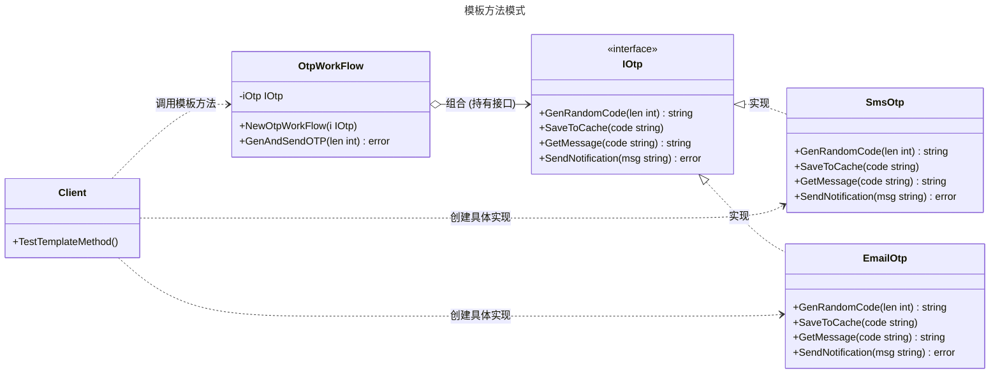

# 模版方法模式

## 概述

模板方法模式（Template Method Pattern）是一种行为型设计模式，它在父类（或核心结构体）中定义了一个算法的骨架，将一些步骤延迟到子类（或具体实现者）中实现。模板方法使得子类可以在不改变算法结构的情况下，重新定义算法的某些特定步骤。

在 Go 语言中，由于没有继承机制，通常通过 **组合（Composition）** 和 **接口（Interface）** 来实现该模式：定义一个包含接口成员的核心结构体，核心结构体实现“模板方法”（固定流程），而具体步骤由接口的实现者完成。


## 模式结构

模板方法模式的主要角色如下：

- **抽象接口（Abstract Interface）**：定义算法中需要定制的抽象步骤（原语操作）。
- **具体实现（Concrete Implementation）**：实现抽象接口，完成算法中特定步骤的具体逻辑。
- **模板类（Template Context）**：持有一个抽象接口的引用，并定义了 **模板方法**。模板方法中编排了算法的执行顺序（骨架），并调用接口中的方法。
- **客户端（Client）**：创建具体的实现对象，将其注入到模板类中，并调用模板方法。

## 实现

以 **OTP（One-Time Password）验证码发送系统** 为例。发送验证码的流程（算法骨架）通常是固定的：
1.  生成随机验证码 (GenerateRandomCode)
2.  保存验证码到缓存 (SaveToCache)
3.  获取具体消息内容 (GetMessage)
4.  发送通知 (SendNotification)

其中，步骤 1 和 2 可能是通用的，但步骤 3 和 4 对于 **SMS 短信** 和 **Email 邮件** 是不同的。

模板方法模式的 UML 类图如下所示：



### 抽象接口与模版方法

`otp.go` 代码如下：

```go
package template

import "fmt"

// IOtp 定义 OTP 流程中需要实现的具体步骤接口
type IOtp interface {
	GenRandomCode(len int) string
	SaveToCache(code string)
	GetMessage(code string) string
	SendNotification(msg string) error
}

// OtpWorkFlow 模板结构体
// 它持有 IOtp 接口，并定义了固定的执行流程
type OtpWorkFlow struct {
	iOtp IOtp
}

// NewOtpWorkFlow 构造函数
func NewOtpWorkFlow(i IOtp) *OtpWorkFlow {
	return &OtpWorkFlow{iOtp: i}
}

// GenAndSendOTP 模板方法 (Template Method)
// 这里定义了算法的骨架：生成 -> 缓存 -> 组装消息 -> 发送
// 这个流程是固定的，但具体的实现委托给了 iOtp
func (o *OtpWorkFlow) GenAndSendOTP(otpLength int) error {
	// 步骤 1: 生成
	code := o.iOtp.GenRandomCode(otpLength)
	
	// 步骤 2: 缓存
	o.iOtp.SaveToCache(code)
	
	// 步骤 3: 组装
	msg := o.iOtp.GetMessage(code)
	
	// 步骤 4: 发送
	err := o.iOtp.SendNotification(msg)
	if err != nil {
		return err
	}
	
	fmt.Println("流程结束：发送成功")
	return nil
}
```

### 具体实现

`concrete_otp.go` 代码如下：

```go
package template

import (
	"fmt"
	"strings"
)

// SmsOtp 短信验证码实现
type SmsOtp struct {
	// 用于测试验证数据的字段
	LastCode string
	LastMsg  string
}

// GenRandomCode 生成随机验证码
func (s *SmsOtp) GenRandomCode(len int) string {
	// 简单模拟生成数字
	code := strings.Repeat("1", len) 
	fmt.Printf("[SMS] 生成验证码: %s\n", code)
	s.LastCode = code
	return code
}

// SaveToCache 将验证码保存到缓存
func (s *SmsOtp) SaveToCache(code string) {
	fmt.Printf("[SMS] 缓存验证码 %s 到 Redis\n", code)
}

// GetMessage 组装短信消息
func (s *SmsOtp) GetMessage(code string) string {
	return fmt.Sprintf("【云服务】您的验证码是%s，5分钟内有效。", code)
}

// SendNotification 发送短信
func (s *SmsOtp) SendNotification(msg string) error {
	fmt.Printf("[SMS] 发送短信: %s\n", msg)
	s.LastMsg = msg
	return nil
}

// EmailOtp 邮件验证码实现
type EmailOtp struct {
	SenderEmail string
	LastMsg     string
}

// GenRandomCode 生成随机验证码
func (e *EmailOtp) GenRandomCode(len int) string {
	// 简单模拟生成字母
	code := strings.Repeat("A", len)
	fmt.Printf("[Email] 生成验证码: %s\n", code)
	return code
}

// SaveToCache 将验证码保存到缓存
func (e *EmailOtp) SaveToCache(code string) {
	fmt.Printf("[Email] 缓存验证码 %s 到 Memcached\n", code)
}

// GetMessage 组装邮件消息
func (e *EmailOtp) GetMessage(code string) string {
	return fmt.Sprintf("Subject: Login Code\nContent: Your code is %s", code)
}

// SendNotification 发送邮件
func (e *EmailOtp) SendNotification(msg string) error {
	fmt.Printf("[Email] 发送邮件 from %s: \n%s\n", e.SenderEmail, msg)
	e.LastMsg = msg
	return nil
}
```

### 客户端（单元测试）

`client_test.go` 代码如下：

```go
package template

import (
	"strings"
	"testing"
)

// 单元测试
// 模拟客户端调用

// TestTemplateMethod 单元测试
// 验证通过模板方法调用不同实现时的行为是否正确
func TestTemplateMethod(t *testing.T) {

	// 场景一：测试 SMS 流程
	t.Run("SMS_Flow", func(t *testing.T) {
		// Arrange
		smsOtp := &SmsOtp{}
		workflow := NewOtpWorkFlow(smsOtp)

		// Act
		err := workflow.GenAndSendOTP(4)

		// Assert
		if err != nil {
			t.Fatalf("SMS 流程执行失败: %v", err)
		}

		// 验证具体步骤是否被正确调用（检查副作用）
		expectedCode := "1111"
		if smsOtp.LastCode != expectedCode {
			t.Errorf("SMS 验证码生成错误。期望: %s, 实际: %s", expectedCode, smsOtp.LastCode)
		}

		if !strings.Contains(smsOtp.LastMsg, "【云服务】") {
			t.Errorf("SMS 消息格式错误。实际内容: %s", smsOtp.LastMsg)
		}
	})

	// 场景二：测试 Email 流程
	t.Run("Email_Flow", func(t *testing.T) {
		// Arrange
		emailOtp := &EmailOtp{SenderEmail: "admin@test.com"}
		workflow := NewOtpWorkFlow(emailOtp)

		// Act
		err := workflow.GenAndSendOTP(6)

		// Assert
		if err != nil {
			t.Fatalf("Email 流程执行失败: %v", err)
		}

		// 验证 Email 特有的逻辑
		expectedContent := "Your code is AAAAAA"
		if !strings.Contains(emailOtp.LastMsg, expectedContent) {
			t.Errorf("Email 内容错误。期望包含: %s, 实际: %s", expectedContent, emailOtp.LastMsg)
		}
	})
}
```

### 实现说明

1. 组合优于继承：Go 语言通过将接口（IOtp）嵌入到结构体（OtpWorkFlow）中来模拟传统 OOP 中的抽象类继承。OtpWorkFlow 充当基类，控制整体逻辑；IOtp 的实现类充当子类，提供具体实现。
2. 控制反转：GenAndSendOTP 方法控制了流程的执行顺序。具体的实现类（SmsOtp）不需要知道何时调用 SaveToCache，它只需要提供实现，由模板方法来调用它。这就是著名的“好莱坞原则”（Don't call us, we'll call you）。
3. 接口设计：IOtp 接口定义了算法中所有变化的步骤。如果某些步骤在所有实现中都是一样的（例如 SaveToCache 的逻辑完全一致），在 Go 中可以考虑将其直接实现在 OtpWorkFlow 中，或者定义一个基础实现类让具体类去组合，但通过接口强制实现通常更清晰。

## 优点与缺点

**优点：**

- 代码复用：将公共的代码（算法结构、公共步骤）提取到模板类中，避免了重复代码。
- 扩展性好：符合开闭原则。可以通过新增具体的实现类来扩展新的行为，而无需修改模板方法的代码。
- 行为控制：父类（模板类）控制了算法的流程，子类只需要关注细节实现，逻辑更清晰。

**缺点：**

- 受限于 Go 语法：Go 没有继承，无法像 Java 那样在父类定义 final 方法防止子类篡改流程，只能依靠约定或封装（不暴露 IOtp 供外部直接调用）来保证流程安全。
- 接口约束：如果算法骨架需要修改（例如增加一个步骤），需要修改接口及所有的具体实现类。
- 灵活性降低：模板方法固定了执行流程，如果某个子类需要完全不同的流程，则不适用此模式。

## 适用场景

模板方法模式适用于以下场景：

- 固定流程：多个子类（或实现）拥有相同的算法结构，但某些特定步骤的实现细节不同。
- 代码复用：希望将公共的行为提取到父类中，避免代码重复。
- 控制扩展：只允许子类扩展算法的特定点，而不是改变整个算法结构。
- 钩子方法：在算法中包含一些可选步骤（Hook），子类可以选择是否实现这些步骤（例如：BeforeSave, AfterSend）。

## 注意事项

- 钩子方法 (Hooks)：在 Go 中，可以通过在接口中定义一些可选方法（或者检查接口类型转换）来实现钩子。例如，模板方法可以检查 iOtp 是否实现了 IOtpHook 接口，如果实现了，则在特定时间点调用。
- 并发安全：如果 OtpWorkFlow 是单例且被并发调用，需要确保注入的 IOtp 实现是线程安全的，或者每次请求都创建新的 OtpWorkFlow 实例。

## 参考资料

- [go-patterns](https://github.com/tmrts/go-patterns)
- [Refactoring.Guru](https://refactoringguru.cn/)