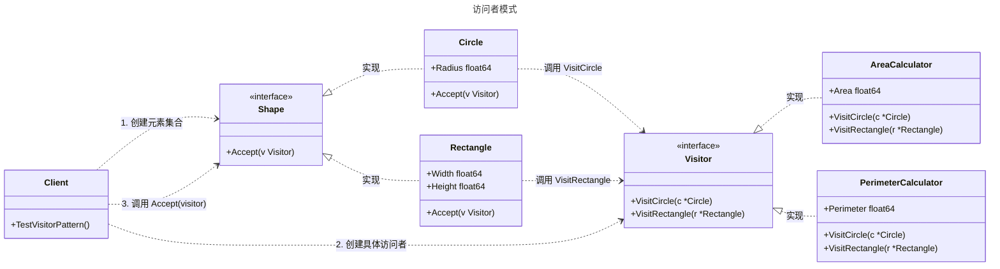

# 访问者模式

## 概述

访问者模式（Visitor Pattern）是一种行为型设计模式，它允许你在不改变对象结构的前提下，向这些对象添加新的操作（行为）。该模式的核心思想是将数据结构（元素）与作用于结构之上的操作（访问者）分离。通过这种方式，新增操作只需要增加一个新的访问者类，而无需修改现有的元素类，符合“开闭原则”。

在 Go 语言中，访问者模式通常用于处理异构的对象集合（例如一个列表中包含不同类型的 Struct），并对这些对象执行不同的操作（如计算、导出、验证）。


## 模式结构

访问者模式的主要角色如下：

- **访问者接口（Visitor）**：声明了一组访问方法，每个方法对应一种具体的元素类型（如 `VisitConcreteElementA`）。
- **具体访问者（Concrete Visitor）**：实现了访问者接口，定义了作用于具体元素的操作逻辑。
- **元素接口（Element）**：声明了一个 `Accept` 方法，该方法接收一个访问者对象作为参数。
- **具体元素（Concrete Element）**：实现了 `Accept` 方法，通常通过调用访问者的对应方法（如 `visitor.VisitElementA(self)`）来实现“双重分发”。
- **对象结构（Object Structure）**：通常是一个包含多个元素的集合（如列表或树），用于遍历元素并调用它们的 `Accept` 方法。
- **客户端（Client）**：创建元素集合和具体访问者，并发起操作。

## 实现

以 **图形面积与周长计算器** 为例。我们需要处理不同的形状（圆形 `Circle`、矩形 `Rectangle`）。我们希望在不修改形状结构体的前提下，能够随时添加新的计算逻辑（如：计算面积、计算周长、导出 XML 描述）。

访问者模式的 UML 类图如下所示：



### 定义接口

`visitor.go` 代码如下：

```go
package visitor

// Shape 元素接口
// 定义 Accept 方法，允许访问者访问自己
type Shape interface {
	Accept(v Visitor)
}

// Visitor 访问者接口
// Go 不支持方法重载，因此必须为每种具体的 Element 定义明确的 Visit 方法
type Visitor interface {
	VisitCircle(c *Circle)
	VisitRectangle(r *Rectangle)
}
```

### 具体元素实现

`elements.go` 代码如下：

```go
package visitor

// Circle 具体元素：圆形
type Circle struct {
	Radius float64
}

// Accept 实现 Shape 接口
// 核心逻辑：将自身（*Circle）传递给访问者的 VisitCircle 方法
func (c *Circle) Accept(v Visitor) {
	v.VisitCircle(c)
}

// Rectangle 具体元素：矩形
type Rectangle struct {
	Width  float64
	Height float64
}

// Accept 实现 Shape 接口
func (r *Rectangle) Accept(v Visitor) {
	v.VisitRectangle(r)
}
```

### 具体访问者实现

`concrete_visitors.go` 代码如下：

```go
package visitor

import "math"

// AreaCalculator 计算面积
type AreaCalculator struct {
	TotalArea float64 // 用于累加计算结果
}

// VisitCircle 计算圆形面积
func (a *AreaCalculator) VisitCircle(c *Circle) {
	area := math.Pi * c.Radius * c.Radius
	a.TotalArea += area
}

// VisitRectangle 计算矩形面积
func (a *AreaCalculator) VisitRectangle(r *Rectangle) {
	area := r.Width * r.Height
	a.TotalArea += area
}

// PerimeterCalculator 计算周长
type PerimeterCalculator struct {
	TotalPerimeter float64
}

// VisitCircle 计算圆形周长
func (p *PerimeterCalculator) VisitCircle(c *Circle) {
	perimeter := 2 * math.Pi * c.Radius
	p.TotalPerimeter += perimeter
}

// VisitRectangle 计算矩形周长
func (p *PerimeterCalculator) VisitRectangle(r *Rectangle) {
	perimeter := 2 * (r.Width + r.Height)
	p.TotalPerimeter += perimeter
}
```

### 客户端（单元测试）

`client_test.go` 代码如下：

```go
package visitor

import (
	"math"
	"testing"
)

// ObjectStructure 对象结构
// 在实际应用中，这可能是一个复杂的组合结构或列表
type ShapeCollection struct {
	shapes []Shape
}

// Add 添加元素
func (sc *ShapeCollection) Add(s Shape) {
	sc.shapes = append(sc.shapes, s)
}

// Accept 遍历元素并调用它们的 Accept 方法
func (sc *ShapeCollection) Accept(v Visitor) {
	for _, shape := range sc.shapes {
		shape.Accept(v)
	}
}

// TestVisitorPattern 单元测试
func TestVisitorPattern(t *testing.T) {
	// 1. Arrange: 准备对象结构 (Elements)
	collection := &ShapeCollection{}
	collection.Add(&Circle{Radius: 10})             // Area ≈ 314.159, Perimeter ≈ 62.83
	collection.Add(&Rectangle{Width: 2, Height: 3}) // Area = 6, Perimeter = 10

	// 2. Act & Assert: 使用“面积计算”访问者
	t.Run("CalculateArea", func(t *testing.T) {
		areaVisitor := &AreaCalculator{}

		// 触发访问
		collection.Accept(areaVisitor)

		expectedArea := (math.Pi * 10 * 10) + (2 * 3)
		if math.Abs(areaVisitor.TotalArea-expectedArea) > 0.001 {
			t.Errorf("面积计算错误。期望: %.2f, 实际: %.2f", expectedArea, areaVisitor.TotalArea)
		}
	})

	// 3. Act & Assert: 使用“周长计算”访问者
	t.Run("CalculatePerimeter", func(t *testing.T) {
		perimeterVisitor := &PerimeterCalculator{}

		// 触发访问
		collection.Accept(perimeterVisitor)

		expectedPerimeter := (2 * math.Pi * 10) + (2 * (2 + 3))
		if math.Abs(perimeterVisitor.TotalPerimeter-expectedPerimeter) > 0.001 {
			t.Errorf("周长计算错误。期望: %.2f, 实际: %.2f", expectedPerimeter, perimeterVisitor.TotalPerimeter)
		}
	})
}
```

### 实现说明

1. 双重分发 (Double Dispatch)：
   - 第一次分发：客户端调用 `element.Accept(visitor)`。程序根据 `element` 的实际类型（是 `Circle` 还是 `Rectangle`）决定执行哪个 `Accept` 方法。
   - 第二次分发：`Accept` 方法内部调用 `visitor.VisitXxx(self)`。程序根据 `visitor` 的实际类型（是 `AreaCalculator` 还是 `PerimeterCalculator`）决定执行具体的计算逻辑。
   - Go 语言原生只支持单分发（根据接收者类型动态派发），访问者模式通过这两次调用模拟了双重分发的效果。
2. 方法命名：由于 Go 语言不支持方法重载（Overloading），我们不能定义多个名为 `Visit` 但参数不同的方法。因此，必须在接口中显式命名为 `VisitCircle`, `VisitRectangle` 等。
3. 状态分离：计算的结果（如 `TotalArea`）保存在 `Visitor` 结构体中，而不是保存在 `Element` 中。这意味着 `Element` 保持纯净，不包含业务计算状态。

## 优点与缺点

**优点：**

- 扩展性好（针对操作）：增加新的操作（例如新增“导出 JSON 访问者”）非常容易，只需要增加一个新的访问者类，不需要修改任何 `Shape` 的代码。
- 单一职责原则：将有关的行为集中到一个访问者对象中，而不是分散在各个元素类里。
- 状态积累：访问者对象可以在遍历过程中累积状态（如计算总面积），而在遍历完所有对象后一次性获取结果。

**缺点：**

- 扩展性差（针对元素）：如果需要增加一个新的元素（例如 `Triangle`），则需要修改 `Visitor` 接口及其所有具体实现类（`AreaCalculator`, `PerimeterCalculator` 等），违反了开闭原则。
- 破坏封装：访问者通常需要访问元素对象的内部状态（如 `Circle` 的 `Radius`），这可能迫使元素公开一些本应私有的属性。
- 代码复杂度：对于简单的对象结构，引入访问者模式会增加大量接口和类的定义，导致代码变得冗余

## 适用场景

访问者模式适用于以下场景：

- 对象结构稳定，操作频繁变化：对象结构（如 AST 语法树、DOM 树、固定的业务模型）很少改变，但经常需要在此结构上定义新的操作。
- 需要对不同类型的对象执行不相关的操作：避免让这些操作“污染”对象类本身。
- 编译器设计：在编译器前端，AST（抽象语法树）节点类型是固定的，但需要进行语法检查、代码生成、优化等多种不同的处理

## 注意事项

- Go 的替代方案：在 Go 语言中，如果元素类型数量不确定，或者不想使用繁琐的访问者模式，可以使用 Type Switch (类型断言) 来实现类似的功能。例如编写一个函数接收 `interface{}`，然后在 `switch case` 中判断是 `*Circle` 还是 `*Rectangle`。这种方式代码更少，但牺牲了编译期类型检查（如果漏掉某个类型，编译器不会报错）。
- 返回值处理：标准的访问者模式 `Visit` 方法通常不返回值（void）。如果在遍历过程中需要收集结果，通常将结果存储在 `Visitor` 的成员变量中，遍历结束后再提取。

## 参考资料

- [go-patterns](https://github.com/tmrts/go-patterns)
- [Refactoring.Guru](https://refactoringguru.cn/)