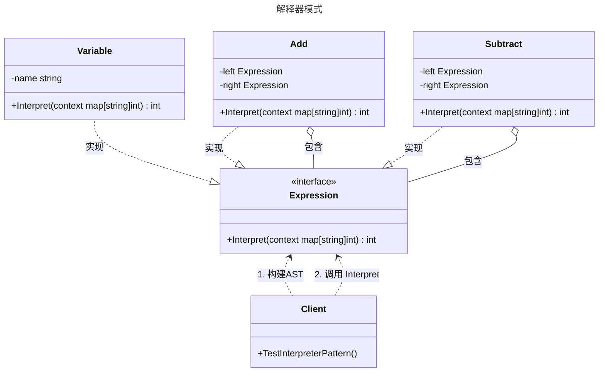

# 解释器模式

## 概述

解释器模式（Interpreter Pattern）是一种行为型设计模式，它给定一个语言，定义它的文法表示，并定义一个解释器，这个解释器使用该标识来解释语言中的句子。

简单来说，如果一种特定类型的问题发生的频率足够高，那么可能值得将该问题的各个实例表述为一个简单语言中的句子。这样就可以构建一个解释器，该解释器通过解释这些句子来解决该问题。

在 Go 语言中，解释器模式常用于构建简单的规则引擎、数学表达式计算器、SQL 解析或配置文件解析等场景。

## 模式结构

解释器模式的主要角色如下：

- 抽象表达式（Abstract Expression）：声明一个抽象的解释操作，这个接口为抽象语法树（AST）中所有的节点共享。通常包含一个 Interpret 方法。
- 终结符表达式（Terminal Expression）：实现了抽象表达式接口，代表文法中的叶子节点（例如变量、常量）。它不再包含其他表达式。
- 非终结符表达式（Non-terminal Expression）：实现了抽象表达式接口，代表文法中的复杂规则（例如加法、减法）。它通常包含对其他表达式（终结符或非终结符）的引用。
- 环境/上下文（Context）：包含解释器之外的一些全局信息，例如变量的当前值映射表。
- 客户端（Client）：构建（或接收）抽象语法树，并调用解释操作。

## 实现

以 自定义加减法计算器 为例。我们需要解析并计算形如 a + b - c 的表达式。在这个场景中，变量（a, b, c）是终结符，而加号（+）和减号（-）是非终结符。

解释器模式的 UML 类图如下所示：



### 定义接口

expression.go 代码如下：

```go
package interpreter

// Expression 抽象表达式接口
// 定义了解释操作，Context 在这里体现为一个简单的 map，用于存储变量值
type Expression interface {
	Interpret(context map[string]int) int
}
```

### 终结符表达式实现

terminal_expression.go 代码如下：

```go
package interpreter

// Variable 终结符表达式：变量
// 它代表语法树的叶子节点
type Variable struct {
	name string
}

// NewVariable 构造函数
func NewVariable(name string) *Variable {
	return &Variable{name: name}
}

// Interpret 从上下文中获取变量的值
func (v *Variable) Interpret(context map[string]int) int {
	if val, ok := context[v.name]; ok {
		return val
	}
	return 0 // 默认值或错误处理
}
```

### 非终结符表达式实现

non_terminal_expression.go 代码如下：

```go
package interpreter

// Add 非终结符表达式：加法
// 它包含左右两个子表达式
type Add struct {
	left  Expression
	right Expression
}

// NewAdd 构造函数
func NewAdd(left, right Expression) *Add {
	return &Add{left: left, right: right}
}

// Interpret 递归计算左右表达式并相加
func (a *Add) Interpret(context map[string]int) int {
	return a.left.Interpret(context) + a.right.Interpret(context)
}

// Subtract 非终结符表达式：减法
type Subtract struct {
	left  Expression
	right Expression
}

// NewSubtract 构造函数
func NewSubtract(left, right Expression) *Subtract {
	return &Subtract{left: left, right: right}
}

// Interpret 递归计算左右表达式并相减
func (s *Subtract) Interpret(context map[string]int) int {
	return s.left.Interpret(context) - s.right.Interpret(context)
}
```

### 客户端（单元测试）

`client_test.go` 代码如下：

```go
package interpreter

import "testing"

// 客户端
// 单元测试

// TestInterpreterPattern 解释器模式单元测试
func TestInterpreterPattern(t *testing.T) {
	// 1. Arrange: 构建抽象语法树 (AST)
	// 目标表达式: a + b - c

	// 定义变量节点
	varA := NewVariable("a")
	varB := NewVariable("b")
	varC := NewVariable("c")

	// 构建运算树：(a + b) - c
	// 首先构建 (a + b)
	addExpr := NewAdd(varA, varB)
	// 然后构建 结果 - c
	finalExpr := NewSubtract(addExpr, varC)

	// 2. Arrange: 准备上下文环境 (Context)
	context := map[string]int{
		"a": 10,
		"b": 5,
		"c": 2,
	}

	// 3. Act: 执行解释
	result := finalExpr.Interpret(context)

	// 4. Assert: 验证结果
	// 10 + 5 - 2 = 13
	expected := 13
	if result != expected {
		t.Errorf("计算错误。期望: %d, 实际: %d", expected, result)
	}

	// 测试不同的上下文
	t.Run("DifferentContext", func(t *testing.T) {
		ctx2 := map[string]int{"a": 100, "b": 20, "c": 50}
		res2 := finalExpr.Interpret(ctx2) // 100 + 20 - 50 = 70
		if res2 != 70 {
			t.Errorf("Context2 计算错误。期望: 70, 实际: %d", res2)
		}
	})
}
```

### 实现说明

1. 递归调用：非终结符（如 `Add`, `Subtract`）不仅实现了 `Expression` 接口，内部还持有了 `Expression` 类型的成员变量。这使得 `Interpret` 方法会沿着树结构向下递归，直到遇到终结符（`Variable`）。
2. 上下文隔离：具体的计算逻辑依赖于传入的 `context`。这意味着同一个 AST 对象结构（`finalExpr`）可以被复用，只需要传入不同的变量值即可得到不同的结果，这体现了算法与数据的分离。
3. AST 构建：在上述示例中，AST 是在 Client 中手动构建的。在实际复杂的应用中，通常会有一个专门的 Parser（解析器）模块，负责将字符串形式的表达式（如 `"a + b - c"`）转换为这里的 AST 对象结构。

## 优点与缺点

**优点**：

- 易于改变和扩展文法：由于在解释器模式中，每条规则都表示为一个类，因此可以通过继承或组合来改变或扩展文法。例如，增加一个“乘法”规则只需增加一个 `Multiply` 类，无需修改现有代码。
- 实现简单文法容易：对于规则较为简单的语言，定义对应的类结构非常直观，易于理解和实现。

**缺点**：

- 复杂文法难以维护：如果文法规则非常多，会导致类爆炸（Class Explosion）。每个规则对应一个类，管理成百上千个类会非常困难。
- 执行效率较低：解释器模式通常使用递归调用，对于复杂的句子，递归层级过深会导致调试困难，且大量的对象创建和函数调用会带来性能损耗。
- 应用场景受限：它不适合处理复杂的编程语言或大规模的数据解析，此时通常使用编译器生成器（如 Yacc, ANTLR）或专门的解析技术。

## 适用场景

解释器模式适用于以下场景：

- 简单的语法解析：当有一个语言需要解释执行，且你可以将该语言中的句子表示为一个抽象语法树时。
- 重复发生的问题：某些特定的问题（如日志格式分析、简单的数学公式计算、特定领域的规则校验）频繁出现，且可以用一种简单的语言来表述时。
- 不追求极致性能：文法相对简单，且执行效率不是最关键的瓶颈。

## 注意事项

- 不要滥用：在 Go 语言中，如果逻辑非常简单，直接使用 func 类型或者 Strategy 模式可能更高效。解释器模式引入了完整的类层级结构，属于“重型”解决方案。
- 替代方案：如果需要解析复杂的 JSON、XML 或 SQL，Go 标准库（encoding/json, text/template）或第三方成熟的 Parser 库通常是更好的选择，不要尝试用解释器模式去重新发明轮子。
- Go 的实现细节：Go 的接口机制（Implicit Interface）使得实现解释器模式非常自然。Expression 接口可以定义得非常简单，任何实现了该接口的 Struct 都可以无缝组合。