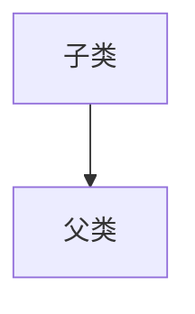

# 面向对象编程-上篇

## 概述

Java语言是一种面向对象的程序设计语言，而面向对象思想是一种程序设计思想，我们在面向对象思想的指引下使用Java语言去设计、开发计算机程序。这里的对象泛指现实中一切事物，每种事物都具备自己的属性和行为。面向对象思想就是在计算机程序设计过程中，参照现实中事物，将事物的属性特征、行为特征抽象出来，描述成计算机事件的设计思想。它区别于面向过程思想，强调的是通过调用对象的行为来实现功能，而不是自己一步一步的去操作实现。

举例：洗衣服

- 面向过程：把衣服脱下来 -> 找一个盆 -> 放点洗衣粉 -> 加点水 -> 浸泡10分钟 -> 开始清洗衣服 -> 拧干衣服 -> 晾起来
- 面向过程：把衣服脱下来 -> 丢进全自动洗衣机 -> 等待洗衣 -> 晾起来

区别：

- 面向过程：强调步骤。
- 面向对象：强调对象，这里的对象就是全自动洗衣机。

## 三大基本特征

面向对象的三大基本特征：封装、继承、多态。

| 特征 | 说明 |
| --- | --- |
| 封装 | 将对象的“属性”和“行为”抽象出来包装到类中，通过访问控制符隐藏内部实现细节，只暴露必要的接口。 |
| 继承 | 将具有相同”属性“和“行为”的对象抽象出来并包装成一个父类，子类继承父类的非私有属性和方法，实现代码复用。支持单继承（一个类只能继承一个直接父类） |
| 多态 | 多种形态，相同的“属性”和“行为”却有不同的表现方式，同一接口（方法名）在不同对象上有不同实现。<br/> 主要分为：<br/>1. 编译时多态（方法重载）<br/>2. 运行时多态（方法重写 + 父类引用子类对象） |

## 类和对象

**类**：是一组相关属性和行为的集合。可以看成是一类事物的模版，使用事物的属性特征和行为特征来描述该类事物。

**对象**：是一类事物的具体体现，对象是类的一个实例，必然具备该类事物的属性和行为。

类和对象的关系：

- 类是对一类事物的描述，是抽象的。
- 对象是一类事物的实例，是具体的。
- 类是对象的模版，对象是类的实体。

### 类的定义

类的定义语法格式如下：

```java
访问修饰符 class 类名 [extends 父类] [implements 接口列表] {
    // 成员变量
    // 构造器
    // 方法[成员方法]
    // [代码块]
    // [内部类]
}
```

示例：

```java
public class Student {
    // 成员变量
    String name;
    int age;

    // 方法
    // 学习
    public void study() {
        System.out.println("学习中...");
    }

    // 吃饭
    public void eat() {
        System.out.println("吃饭中...");
    }
}
```

### 对象创建和使用

对象创建的语法格式如下：

```text
类名 对象名 = new 类名();
```

使用对象访问类中的成员变量和方法。

```text
对象名.成员变量名;
对象名.方法名(); 
```

示例：

```java
public class Test01Student {
    public static void main(String[] args) {
        // 创建对象格式：类名 对象名 = new 类名()
        Student s = new Student();
        System.out.println("s：" + s);

        // 直接输出成员变量值
        System.out.println("姓名：" + s.name);
        System.out.println("年龄：" + s.age);
        System.out.println("================");

        // 给成员变量赋上新的值
        s.name = "MagicGopher";
        s.age = 18;

        // 再次输出成员变量的值
        System.out.println("姓名：" + s.name); // MagicGopher
        System.out.println("年龄：" + s.age); // 18
        System.out.println("================");

        // 调用成员方法
        s.study(); // 学习中...
        s.eat(); // 吃饭中...
    }
}
```

### 成员变量的默认值

|  | 数据类型 | 默认值 |
| --- | --- | --- |
| 基本类型 | 整数（byte, short, int, long） | 0 |
|  | 浮点数（float, double） | 0.0 |
|  | 字符（char） | '\u0000' |
|  | 布尔值（boolean） | false |
| 引用类型 | 数组（Array）, 类（Class）, 接口（interface） | null |

### 成员变量和局部变量

成员变量和局部变量的区别，以下示例所示：

```java
public class Car {
    // 成员变量
    String color;
    public void drive() {
        int speed = 100; // 局部变量
        System.out.println("速度：" + speed);
    }
} 
```

- 在类的位置不同
  - 成员变量：类中，方法外
  - 局部变量：方法中或者方法声明上（形式参数）
- 作用范围不一样
  - 成员变量：类中
  - 局部变量：方法中
- 初始化值的不同
  - 成员变量：有默认值
  - 局部变量：没有默认值，必须先定义，赋值，最后使用。
- 在内存的位置不同
  - 成员变量：堆内存
  - 局部变量：栈内存
- 生命周期不同
  - 成员变量：随着对象的创建而诞生，随着对象的销毁而消失。
  - 局部变量：随着方法的调用而诞生，随着方法的调用结束而消失。

## 封装

封装是面向对象编程中的一个重要概念，它的目的是将对象的属性（成员变量）隐藏起来，若需要访问某个属性，则需要通过提供的公共方法进行访问。

1. 使用 `private` 关键字来修饰成员变量，达到将对象的属性（成员变量）隐藏起来的目的。
2. 对需要访问的对象属性（成员变量），提供公共的访问方法（`getXxx()`方法、`setXxx()`方法）

### private 关键字

*private* 关键字的含义

1. *private* 关键字是一个权限修饰符，代表最小权限。
2. 可以修饰成员变量和成员方法。
3. 被 *private* 修饰的成员变量和成员方法，只能在当前类中访问。

*private* 关键字的使用格式，如下：

```java
private 数据类型 变量名称;
```

示例：

Student.java

```java
public class Student {
    private String name;
    private int age;

    public void setName(String n) {
        // 将传入的参数n赋值给成员变量name
        name = n;
    }

    public String getName() {
        return name;
    }

    public void setAge(int a) {
        // 将传入的参数a赋值给成员变量age
        age = a;
    }

    public int getAge() {
        return age;
    }
}
```

TestStudent.java

```java
public class TestStudent {
    public static void main(String[] args) {
        // 创建Student对象
        Student s1 = new Student();
        System.out.println("设置成员变量之前");
        // 获取name、age属性（成员变量）
        System.out.println(s1.getName());
        System.out.println(s1.getAge());
        System.out.println("================");

        // 通过setXxx()方法设置成员变量
        s1.setName("MagicGopher");
        s1.setAge(19);
        System.out.println("设置成员变量之后");
        // 获取name、age属性（成员变量）
        System.out.println(s1.getName());
        System.out.println(s1.getAge());
        System.out.println("================");
    }
}
```

控制台输出结果：

```text
设置成员变量之前
null
0
================
设置成员变量之后
MagicGopher
19
================
```

### this 关键字

在上述案例中的 `setName()` 方法和 `setAge()` 方法中传入的形式参数的名字并不符合规范（见名知意），那么将参数改成和成员变量名一致，是否就见名知意了呢？代码如下：

```java
public class Student {
    private String name;
    private int age;

    public void setName(String name) {
        name = name;
    }

    public String getName() {
        return name;
    }

    public void setAge(int age) {
        age = age;
    }

    public int getAge() {
        return age;
    }
}
```

TestStudent.java

```java
public class TestStudent {
    public static void main(String[] args) {
        // 创建Student对象
        Student s1 = new Student();
        System.out.println("设置成员变量之前");
        // 获取name、age属性（成员变量）
        System.out.println(s1.getName());
        System.out.println(s1.getAge());
        System.out.println("================");

        // 通过setXxx()方法设置成员变量
        s1.setName("MagicGopher");
        s1.setAge(19);
        System.out.println("设置成员变量之后");
        // 获取name、age属性（成员变量）
        System.out.println(s1.getName());
        System.out.println(s1.getAge());
        System.out.println("================");
    }
}
```

控制台输出结果：

```text
设置成员变量之前
null
0
================
设置成员变量之后
null
0
================
```

将 `setXxx()` 方法的参数名称改成和成员变量名一致之后，经过运行测试，发现了新的问题，成员变量的赋值失败了。也就是说，在修改了 `setXxx()` 方法的形式参数名后，方法并没有给成员变量赋值，这是由于形式参数名和成员变量名重名，导致成员变量名给被隐藏，方法中的变量名，无法访问到成员变量，从而赋值失败。因此，可以使用 `this` 关键字来解决这个问题。

`this` 关键字含义：代表所在类的当前对象的引用（地址值），即对象自己的引用。

`this` 使用格式如下：

```java
this.成员变量名;
```

使用 `this` 关键字来修饰 `setXxx()` 方法中的变量，解决成员变量被隐藏的问题，代码如下：

```java
public class Student {
    private String name;
    private int age;

    public void setName(String name) {
        // 将传入的参数name赋值给this.name（this表示所在类的当前对象也就是Student）
        this.name = name;
    }

    public String getName() {
        return name;
    }

    public void setAge(int age) {
        // 将传入的参数age赋值给this.age（this表示所在类的当前对象也就是Student）
        this.age = age;
    }

    public int getAge() {
        return age;
    }
}
```

::: tip 提示
方法中只有一个变量名时，默认也是使用 `this` 修饰，可以省略不写。
:::

## 构造方法

构造方法是一种在类实例化（new）时自动被调用，用于给对象成员变量赋初始值的特殊成员方法。

::: tip 提示
无论你是否自定义构造方法，所有的类都有构造方法，因为 `Java` 自动提供了一个无参数的构造方法，一旦自己定义了构造方法，`Java` 自动提供的默认无参数的构造方法就会失效。
:::

**构造方法的定义格式**：

```java
// 构造方法的方法名称必须要和类名称一致（一摸一样）
访问修饰符 构造方法名(形式参数列表) {
    // 方法体
}
```

示例：

```java
// 这是一个学生类
public class Student {
    // 成员变量 name 和 age
    private String name;
    private int age;

    // 没有参数构造方法
    public Student() {
        // 默认的构造方法
    }

    // 有参数的构造方法
    public Student(String name, int age) {
        this.name = name;
        this.age = age;
    }
}
```

::: warning 构造方法的注意事项
1. 如果不提供构造方法，系统会自动提供一个无参数的构造方法。
2. 如果提供了构造方法，系统不再自动提供无参数的构造方法。
3. 构造方法是可以方法重载的，既可以定义参数，也可以不定义参数。
:::

## 匿名对象

创建对象的标准格式如下：

```java
类名称 对象名 = new 类名称();
```

每次 `new` 都相当于开辟了一个新的对象，并开辟了一个新的物理内存空间。如果一个对象只需要使用唯一的一次，就可以使用匿名对象，匿名对象还可以作为实际参数传递。

匿名对象就是没有明确的给出名字的对象，是对象的一种简写形式。一般匿名对象只使用一次，而且匿名对象只在堆内存中开辟空间，而不存在栈内存的引用。

示例：

```java
public class TestStudent {
    public static void main(String[] args) {
        new Student("MagicGopher", 19).tell(); // 匿名对象
    }
}

// 学生类
class Student {
    // 成员变量
    private String name;
    private int age;

    // 有参数构造方法
    public Student(String name, int age) {
        this.name = name;
        this.age = age;
    }

    // 成员方法
    public void tell() {
        System.out.println("姓名：" + name + "，年龄：" + age);
    }
}
```

输出结果：

```text
姓名：MagicGopher，年龄：19
```

## 继承

继承是面向对象编程中重要的组成部分，几乎是所有面向对象语言中不可缺少的部分。在面向对象的软件开发过程中，继承能够有效地实现代码的复用，大大缩短程序开发的周期，提高软件的可扩展性和可维护性。

在 `Java` 程序设计中，类的继承是基于已存在的一个类构建一个新的类的机制。新类吸收已有类的属性和方法，并且能在此基础上扩展新的属性和方法。将现有的类称为父类或超类，构建的新类称为子类，如下图所示。



通过继承的方式，子类不仅可以自动拥有父类的属性和方法，还能扩展新的属性和方法，达到代码重用，以及提高软件结构层次的目的。

### 继承的定义格式

通过 `extends` 关键字，可以声明一个子类继承另外一个父类，定义格式如下：

```java
class 父类 {
    ...
}

class 子类 extends 父类 {
    ...
}
```

示例：

```java
public class ExtendDemo01 {
    public static void main(String[] args) {
        // 创建狗对象
        Dog dog = new Dog("小黑");

        // 调用继承自父类的方法
        dog.eat();   // 重写后的方法
        dog.sleep(); // 父类的方法

        // 调用子类特有的方法
        dog.bark();
    }
}

// 父类：动物
class Animal {
    String name;

    // 构造方法
    public Animal(String name) {
        this.name = name;
    }

    // 父类方法：吃东西
    public void eat() {
        System.out.println(name + " 正在吃东西...");
    }

    // 父类方法：睡觉
    public void sleep() {
        System.out.println(name + " 正在睡觉...");
    }
}

// 子类：狗（继承自动物类）
class Dog extends Animal {

    // 子类构造方法，调用父类构造方法
    public Dog(String name) {
        super(name);  // 调用父类的构造方法
    }

    // 子类特有方法：叫
    public void bark() {
        System.out.println(name + " 汪汪汪！在叫...");
    }

    // 重写父类方法（可选）
    @Override
    public void eat() {
        System.out.println(name + " 正在啃骨头...");
    }
}
```

### 继承后的特点～成员变量

当类之间产生了关系后，其中各类中的成员变量，又产生了哪些影响呢？

**成员变量没有重名**：如果子类父类中出现不重名的成员变量，这时的访问获取成员变量是没有影响的。

示例：

```java
public class ExtendDemo02 {
    public static void main(String[] args) {
        // 创建子类对象
        Zi z = new Zi();
        // 调用子类的成员方法show
        z.show();
    }
}

class Fu {
    // 父类中的num变量
    int num1 = 100;
}

class Zi extends Fu {
    // 子类中的num变量
    int num2 = 200;

    // 子类中的成员方法
    public void show() {
        // 方法父类中的成员变量num1
        System.out.println("Fu num1=" + num1); // 继承而来，所以可以直接访问
        // 访问子类中的成员变量num2
        System.out.println("Zi num2=" + num2);
    }
}
```

输出结果：

```text
Fu num1=100
Zi num2=200
```

**成员变量重名**：如果子类父类出现重名的成员变量，这时的访问是有影响的。

示例：

```java
public class ExtendsDemo03 {
    public static void main(String[] args) {
        // 创建子类对象
        Zi z = new Zi();
        // 调用子类对象的成员方法
        z.show();
    }
}

// 父类
class Fu {
    // 父类的成员变量num
    int num = 10;
}

// 子类
class Zi extends Fu {
    // 子类的成员变量num
    int num = 20;

    public void show() {
        // 理想：访问父类的成员变量num
        System.out.println("Fu num=" + num); // num=20
        // 理想：访问子类的成员变量num
        System.out.println("Zi num=" + num); // num=20
    }
}
```

输出结果：

```text
Fu num=20
Zi num=20
```

### 继承后的特点～成员方法

**成员方法不重名**：如果子类父类中出现不重名的成员方法，这时的调用是没有影响的。调用时会根据对象的实际类型从子类开始向上查找，找到即执行，子类有优先于父类。

示例：

```java
public class ExtendsDemo04 {
    public static void main(String[] args) {
        // 创建子类对象
        Zi z = new Zi();
        // 子类中没有show1()方法，但是可以找到父类方法去执行
        z.show1();
        z.show2();
    }
}

// 父类
class Fu {
    public void show1() {
        System.out.println("Fu类中的show1()方法");
    }
}

// 子类
class Zi extends Fu {
    public void show2() {
        System.out.println("Zi类中的show2()方法");
    }
}
```

输出结果：

```text
Fu类中的show1()方法
Zi类中的show2()方法
```

**成员方法重名**：这里涉及到重写子类方法，在后续[重写](#重写)中讲述。

### 继承后的特点～构造函数

当子类继承父类后，构造函数又有哪些变化呢？首先我们需要回忆两个事情，构造方法的定义和作用。

- 构造方法的名字是与类名一致的。所以子类是无法继承父类的构造方法的。
- 构造方法的作用是初始化成员变量的，所以子类的初始化过程中，必须先执行父类的初始化动作。子类的构造方法中默认有一个 `super()`，表示调用父类成员变量初始化后，才可以给子类使用。

示例：

```java
public class ExtendsDemo05 {
    public static void main(String[] args) {
        Zi z = new Zi();
    }
}

// 父类
class Fu {
    private int n;

    // Fu类构造方法
    Fu() {
        System.out.println("Fu()");
    }
}

// 子类
class Zi {

    // Zi类构造方法
    Zi() {
        // 调用父类构造方法
        super();
        System.out.println("Zi()");
    }
}
```

## super 关键字

`super` 是 Java 中的一个关键字，主要用于在子类中访问或调用父类的成员（包括变量、方法和构造函数）。它帮助实现继承时的代码复用和多态。

| 用法 | 语法 | 作用 |
| :-- | :-- | :-- |
| 调用父类构造函数 | `super(参数列表);` | 在子类构造函数的第一行调用父类的构造函数 |
| 访问父类成员变量 | `super.变量名` | 当子类和父类有同名变量时，明确访问父类的变量 |
| 调用父类方法 | `super.方法名(参数);` | 调用父类被子类覆盖（override）的方法 |

示例1：

```java
// 调用父类构造函数
public class SuperTest01 {
    public static void main(String[] args) {
        Dog dog = new Dog("旺财");
    }
}

class Animal {
    String name;

    public Animal(String name) {
        this.name = name;
        System.out.println("Animal 构造函数: " + name);
    }
}

class Dog extends Animal {
    public Dog(String name) {
        super(name);  // 必须是第一行
        System.out.println("Dog 构造函数");
    }
}
```

输出结果：

```text
Animal 构造函数: 旺财
Dog 构造函数
```

::: warning 注意
- `super()` 必须是子类构造函数的第一条语句。
- 如果不显式调用，编译器会自动插入 `super();`（调用父类无参数构造）。
:::

示例2：

```java
public class SuperTest02 {
    public static void main(String[] args) {
        Child c = new Child();
        c.printColor();
    }
}

class Parent {
    String color = "白色";
}

class Child extends Parent {
    String color = "黑色";

    void printColor() {
        System.out.println(color);        // 黑色（子类）
        System.out.println(super.color);  // 白色（父类）
    }
}
```

输出结果：

```text
黑色
白色
```

示例3：

```java
public class SuperTest03 {
    public static void main(String[] args) {
        Cat cat = new Cat();
        cat.showEat();
    }
}

class Animal {
    void eat() {
        System.out.println("动物吃东西");
    }
}

class Cat extends Animal {
    @Override
    void eat() {
        System.out.println("猫吃鱼");
    }

    void showEat() {
        eat();           // 调用子类方法 → 猫吃鱼
        super.eat();     // 调用父类方法 → 动物吃东西
    }
}
```

输出结果：

```text
猫吃鱼
动物吃东西
```

`super` 关键字常见注意事项，如下：

| ⚠️注意点 | 说明 |
| :-- | :-- |
| `super` 不能用于 `static` 上下文 | 只能在实例方法、构造函数、实例初始化块中使用 ｜
| `super()` 必须是构造函数第一行 | 否则编译错误 |
| 不能在非继承类中使用 | 只有子类才能用 `super` |
| `super.super.xxx` 语法不支持 | Java 不允许跳级访问祖类成员 |

## 重写

Java中的重写（Override）是指子类通过重新定义与父类具有相同方法签名（方法名、参数列表和返回类型）的方法，来覆盖父类的方法实现。

在重写方法时，需要遵循下面的规则：

- 参数列表必须完全与被重写的方法参数列表相同。
- 返回的类型必须与被重写的方法的返回类型相同（Java1.5 版本之前返回值类型必须一样，之后的 Java 版本放宽了限制，返回值类型必须小于或者等于父类方法的返回值类型）。
- 访问权限不能比父类中被重写方法的访问权限更低（public > protected > default > private）。
- 重写方法一定不能抛出新的检査异常或者比被重写方法声明更加宽泛的检査型异常。例如，父类的一个方法声明了一个检査异常 IOException，在重写这个方法时就不能抛出 Exception，只能拋出 IOException 的子类异常，可以抛出非检査异常。

示例：

```java
public class OverrideTest01 {
    public static void main(String[] args) {
        Zi z = new Zi();
        z.show(); // Zi show
    }
}

// 父类
class Fu {

    // 父类的show方法
    public void show() {
        System.out.println("Fu show");
    }
}

// 子类
class Zi extends Fu {

    // 子类的show方法
    public void show() {
        System.out.println("Zi show");
    }
}
```

输出结果：

```text
Zi show
```

子类可以根据需要，定义特定于自己的行为。既沿袭了父类的功能名称，又根据子类的需要重新实现父类方法，从而进行扩展增强。

示例：

```java
public class OverrideTest03 {
    public static void main(String[] args) {
        // 创建子类
        NewPhone np = new NewPhone();

        // 调用继承父类的call()方法
        np.call();

        // 调用子类重写父类的showNum()方法
        np.showNum();
    }
}

// 手机类
class Phone {
    public void sendMessage() {
        System.out.println("发信息");
    }

    public void call() {
        System.out.println("打电话");
    }

    public void showNum() {
        System.out.println("来电显示号码");
    }
}

// 智能手机
class NewPhone extends Phone {

    public void showNum() {
        // 使用super关键字调用父类已经存在的功能使用
        super.showNum();
        // 增加子类特有需求，显示姓名和图片功能
        System.out.println("显示来电姓名");
        System.out.println("显示头像");
    }
}
```

::: warning 注意事项
- 子类方法覆盖父类方法，必须要保证权限大于等于父类权限。
- 子类方法覆盖父类方法，返回值类型、函数名和参数列表都要一模一样。
:::

## 抽象类

Java抽象类是一种使用 abstract 关键字修饰的特殊类，它不能被实例化。抽象类的主要作用是定义一组共同特征的类结构，并被其他类继承以实现其方法。抽象类可以包含普通方法、抽象方法（无方法体）、构造方法、成员变量等，但必须至少包含一个抽象方法，否则就没有定义抽象类的必要。

### abstract 关键字

使用 `abstract` 关键字修饰方法，该方法就成了抽象方法，抽象方法只包含一个方法名，而没有方法体。

定义格式：

```java
访问修饰符 abstract 返回值类型 方法名(参数列表);
```

示例：

```java
public abstract void show();
```

如果一个类中包含抽象方法，那么这个类必须是抽象类，否则会报错。

定义格式：

```java
abstract class 类名 {

}
```

示例：

```java
abstract class Animal {
    public abstract void eat();
}
```

### 抽象类的使用

继承抽象类的子类必须重写父类所有抽象方法。否则，该子类也必须声明位抽象类。最终，必须有子类实现该父类的抽象方法，否则，从最初的父类到最终的子类都不创建对象。

示例：

::: code-group
```java [AbstractTest01]
public class AbstractTest01 {
    public static void main(String[] args) {
        // 创建子类对象
        Cat c = new Cat();

        // 调用run方法
        c.run();
    }
}
```

```java [Animal]
// 抽象类
public abstract class Animal {
    public abstract void run();
}
```

```java [Cat]
// 子类，继承抽象类
public class Cat extends Animal {

    @Override
    public void run() {
        System.out.println("猫在跑...");
    }
}
```
:::

输出结果：

```text
猫在跑...
```

::: warning 注意事项
1. 抽象类不能创建对象，如果创建，编译无法通过而报错，只能创建其非抽象子类的对象。
2. 抽象类中，可以有构造方法，是供子类创建对象时，初始化父类成员使用的。
3. 抽象类中，不一定包含抽象方法，但是有抽象方法的类必定是抽象类。
4. 抽象类的子类，必须重写抽象父类中的所有抽象方法，否则，编译无法通过而报错。除非子类也是抽象类。
:::

## 参考资料

- [菜鸟教程](https://www.runoob.com)