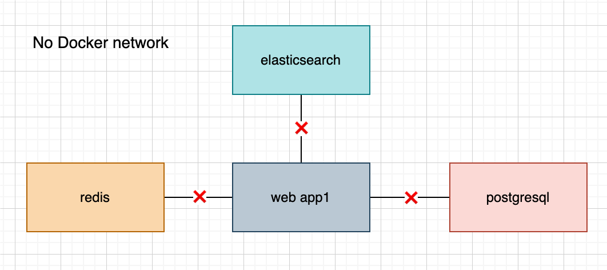
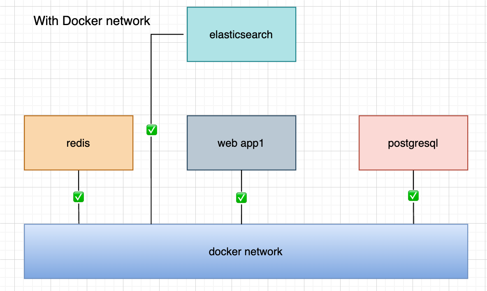
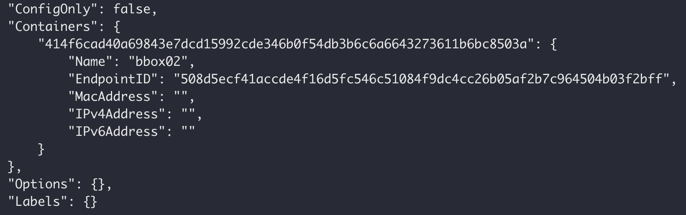
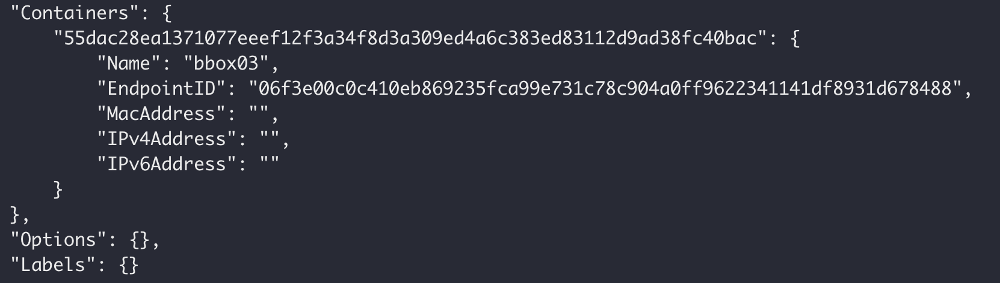
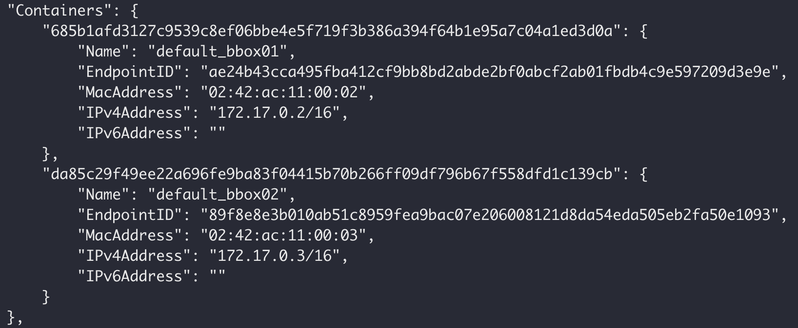
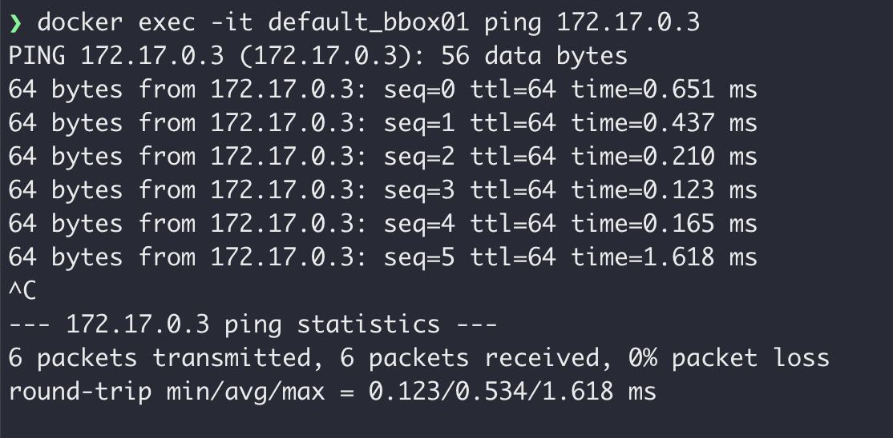
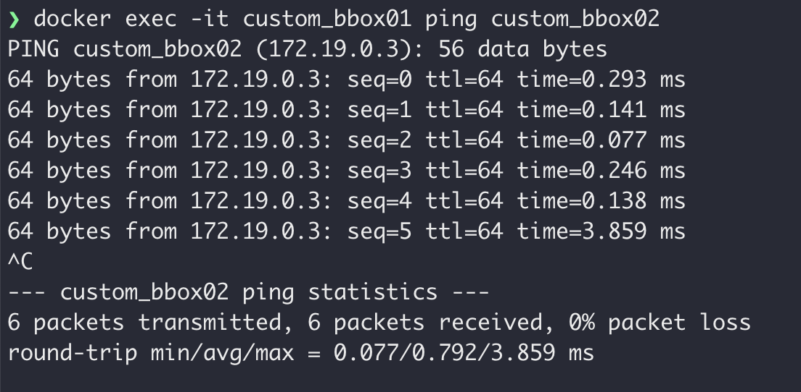

# Docker网络配置

## 容器通信问题

> 当项目大规模使用 Docker 容器时，容器之间通信的问题也就产生了，要解决容器通信问题，必须先了解很多关于网络的知识，我们需要了解Docker 的网络知识，以满足更高的网络需求。



Docker 容器需要网络来实现以下功能：

- 容器间通信：不同容器之间需要通过网络进行通信，比如一个容器提供服务，其他容器需要访问该服务。
- 容器与外部通信：容器还需要能够访问外部资源，如数据库、缓存服务等，这也需要容器具有网络连接能力。
- 容器暴露服务：容器内部运行的应用程序需要通过网络暴露给外部访问，比如 web 服务。
- 容器IP寻址：容器需要有自己的 IP 地址，这样其他容器或外部设备才能通过 IP 找到并访问该容器。
- 网络隔离和安全性：Docker 的网络模型支持容器之间的隔离，以及容器与宿主机之间的隔离，提高了整体的安全性。



总之 Docker 容器需要网络来实现容器间通信、容器与外部通信、服务暴露、IP 寻址以及网络隔离等基本功能。这些网络功能对于 Docker 容器的运行和应用部署都是非常关键的。

## 默认网络

> 装 Docker 以后，会默认创建三种网络，可以通过 `docker network ls` 查看。

```sh
docker network ls

# 输出如下
NETWORK ID     NAME      DRIVER    SCOPE
c80575410e67   bridge    bridge    local
b15021bed953   host      host      local
37f387479e18   none      null      local
```

| 网络模式  | 简介                                                         |
| :-------- | :----------------------------------------------------------- |
| bridge    | 为每一个容器分配、设置 IP 等，并将容器连接到一个 `docker0` 虚拟网桥，默认为该模式。 |
| host      | 容器将不会虚拟出自己的网卡，配置自己的 IP 等，而是使用宿主机的 IP 和端口。 |
| none      | 容器有独立的 Network namespace，但并没有对其进行任何网络设置，如分配 veth pair 和网桥连接，IP 等。 |
| container | 新创建的容器不会创建自己的网卡和配置自己的 IP，而是和一个指定的容器共享 IP、端口范围等。 |

### bridge 网络模式

> 在该模式中，Docker 守护进程创建了一个虚拟以太网桥 `docker0`，新建的容器会自动桥接到这个接口，附加在其上的任何网卡之间都能自动转发数据包。

默认情况下，守护进程会创建一对对等虚拟设备接口 `veth pair`，将其中一个接口设置为容器的 `eth0` 接口（容器的网卡），另一个接口放置在宿主机的命名空间中，以类似 `vethxxx` 这样的名字命名，从而将宿主机上的所有容器都连接到这个内部网络上。

veth是linux的一种虚拟网络设备，它有点类似于两张网卡中间用一条网线连着，veth设备总是成对出现，通常用来连接不同网络命名空间（下面开始简称NS），一端连着NS1的内核协议栈，另一端连着NS2的内核协议栈，一端发送的数据会立刻被另一端接收。


比如我运行一个基于 `busybox` 镜像构建的容器 `bbox01`，查看 `ip addr`：

然后宿主机通过 `ip addr` 查看信息如下：


然后宿主机通过 `ip addr` 查看信息如下：


通过以上的比较可以发现，证实了之前所说的：守护进程会创建一对对等虚拟设备接口 `veth pair`，将其中一个接口设置为容器的 `eth0` 接口（容器的网卡），另一个接口放置在宿主机的命名空间中，以类似 `vethxxx` 这样的名字命名。

同时，守护进程还会从网桥 `docker0` 的私有地址空间中分配一个 IP 地址和子网给该容器，并设置 docker0 的 IP 地址为容器的默认网关。也可以安装 `apt-get install -y bridge-utils` 以后，通过 `brctl show` 命令查看网桥信息。


对于每个容器的 IP 地址和 Gateway 信息，我们可以通过 `docker inspect 容器名称|ID` 进行查看，在 `NetworkSettings` 节点中可以看到详细信息。


我们可以通过 `docker network inspect bridge` 查看所有 `bridge` 网络模式下的容器，在 `Containers` 节点中可以看到容器名称。


关于 `bridge` 网络模式的使用，只需要在创建容器时通过参数 `--net bridge` 或者 `--network bridge` 指定即可，当然这也是创建容器默认使用的网络模式，也就是说这个参数是可以省略的。


bridge 桥接模式的实现步骤主要如下：
- Docker Daemon 利用 veth pair 技术，在宿主机上创建一对对等虚拟网络接口设备，假设为 veth0 和 veth1。而 veth pair 技术的特性可以保证无论哪一个 veth 接收到网络报文，都会将报文传输给另一方。
- Docker Daemon 将 veth0 附加到 Docker Daemon 创建的 docker0 网桥上。保证宿主机的网络报文可以发往 veth0。
- Docker Daemon 将 veth1 添加到 Docker Container 所属的 namespace 下，并被改名为 eth0。如此一来，宿主机的网络报文若发往 veth0，则立即会被 Container 的 eth0 接收，实现宿主机到 Docker Container 网络的联通性；同时，也保证 Docker Container 单独使用 eth0，实现容器网络环境的隔离性。

### host 网络模式


host 网络模式的实现步骤主要如下：
- host 网络模式需要在创建容器时通过参数 `--net host` 或者 `--network host` 指定；
- 采用 host 网络模式的 Docker Container，可以直接使用宿主机的 IP 地址与外界进行通信，若宿主机的 eth0 是一个公有 IP，那么容器也拥有这个公有 IP。同时容器内服务的端口也可以使用宿主机的端口，无需额外进行 NAT 转换；
- host 网络模式可以让容器共享宿主机网络栈，这样的好处是外部主机与容器直接通信，但是容器的网络缺少隔离性。

比如我基于 `host` 网络模式创建了一个基于 `busybox` 镜像构建的容器 `bbox02`，查看 `ip addr`：


然后宿主机通过 `ip addr` 查看信息如下：


我们可以通过 `docker network inspect host` 查看所有 `host` 网络模式下的容器，在 `Containers` 节点中可以看到容器名称。



### none 网络模式

none 网络模式的实现步骤主要如下：
- none 网络模式是指禁用网络功能，只有 lo 接口( local 的简写)，代表 127.0.0.1，即 localhost 本地环回接口。在创建容器时通过参数 `--net none` 或者 `--network none` 指定；
- none 网络模式即不为 Docker Container 创建任何的网络环境，容器内部就只能使用 loopback 网络设备，不会再有其他的网络资源。可以说 none 模式为 Docke Container 做了极少的网络设定，但是俗话说得好“少即是多”，在没有网络配置的情况下，作为 Docker 开发者，才能在这基础做其他无限多可能的网络定制开发。这也恰巧体现了 Docker 设计理念的开放。

比如我基于 `none` 网络模式创建了一个基于 `busybox` 镜像构建的容器 `bbox03`，查看 `ip addr`：


我们可以通过 `docker network inspect none` 查看所有 `none` 网络模式下的容器，在 `Containers` 节点中可以看到容器名称。



### container 网络模式


container 网络模式的实现步骤主要如下：
- Container 网络模式是 Docker 中一种较为特别的网络的模式。在创建容器时通过参数 `--net container:已运行的容器名称|ID` 或者 `--network container:已运行的容器名称|ID` 指定；
- 处于这个模式下的 Docker 容器会共享一个网络栈，这样两个容器之间可以使用 localhost 高效快速通信。

**Container 网络模式即新创建的容器不会创建自己的网卡，配置自己的 IP，而是和一个指定的容器共享 IP、端口范围等**。同样两个容器除了网络方面相同之外，其他的如文件系统、进程列表等还是隔离的。

比如我基于容器 `bbox01` 创建了 `container` 网络模式的容器 `bbox04`，查看 `ip addr`：


宿主机的 `ip addr` 信息如下：


通过以上测试可以发现，Docker 守护进程只创建了一对对等虚拟设备接口用于连接 bbox01 容器和宿主机，而 bbox04 容器则直接使用了 bbox01 容器的网卡信息。

这个时候如果将 bbox01 容器停止，会发现 bbox04 容器就只剩下 lo 接口了。


然后 bbox01 容器重启以后，bbox04 容器也重启一下，就又可以获取到网卡信息了。


## link

`docker run --link` 可以用来链接两个容器，使得源容器（被链接的容器）和接收容器（主动去链接的容器）之间可以互相通信，并且接收容器可以获取源容器的一些数据，如源容器的环境变量。

这种方式**官方已不推荐使用**，并且在未来版本可能会被移除，所以这里不作为重点讲解，感兴趣可自行了解。

官网警告信息：[https://docs.docker.com/network/links/](https://docs.docker.com/network/links/)

## 自定义网络

虽然 Docker 提供的默认网络使用比较简单，但是为了保证各容器中应用的安全性，在实际开发中更推荐使用自定义的网络进行容器管理，以及启用容器名称到 IP 地址的自动 DNS 解析。

从 Docker 1.10 版本开始，docker daemon 实现了一个内嵌的 DNS server，使容器可以直接通过容器名称通信。方法很简单，只要在创建容器时使用 `--name` 为容器命名即可。

但是使用 Docker DNS 有个限制：**只能在 user-defined 网络中使用**。也就是说，默认的 bridge 网络是无法使用 DNS 的，所以我们就需要自定义网络。

### 创建网络

> 通过 `docker network create` 命令可以创建自定义网络模式，命令提示如下：

```sh
docker network create --help

# OPTIONS：选项
# NETWORK：网络名称
Usage:  docker network create [OPTIONS] NETWORK

Create a network

# OPTIONS：选项详细说明
# --attachable：允许容器连接到网络，但是不创建容器的默认网桥
# --aux-address map：网络驱动程序使用的辅助 IPv4 或 IPv6 地址（默认 map[]）
# --config-from string：从中复制配置的网络
# --config-only：创建仅配置网络
# --driver string【简写：-d】：管理网络的驱动程序（默认 bridge）
# --gateway strings：容器连接到网络时使用的网关
# --ingress：创建 swarm 路由网状网络
# --internal：将网络标记为内部网络，仅允许连接到该网络的容器
# --ip-range strings：分配 IPv4 地址的 IP 地址范围
# --ipam-driver string：IP 地址分配驱动程序（默认 default）
# --ipam-opt map：IP 地址分配驱动程序的选项
# --ipv6：启用或禁用 IPv6 网络
# --label list：设置网络元数据标签
# --opt map【简写：-o】：网络驱动程序选项
#  --scope string：网络作用域（默认 global）
# --subnet strings：CIDR 格式的子网，表示网络段
```

创建一个基于 `bridge` 网络模式的自定义网络模式 `custom_network`，完整命令如下：

```sh
docker network create custom_network
# 输出如下
bdc1d04d6ec5076857a3fd9269baf122be1942fa722586106ed30d56a9dfb13f
```

通过 `docker network ls` 查看网络模式：

```sh
docker network ls
# 输出如下
NETWORK ID     NAME             DRIVER    SCOPE
141a1d2af138   bridge           bridge    local
bdc1d04d6ec5   custom_network   bridge    local
b15021bed953   host             host      local
37f387479e18   none             null      local
```

通过自定义网络模式 `custom_network` 创建容器：

```sh
docker run -di --name bbox05 --net custom_network busybox
```

通过 `docker inspect 容器名称|ID` 查看容器的网络信息，在 `NetworkSettings` 节点中可以看到详细信息。


### 连接网络

> 通过 `docker network connect` 为容器连接新的网络模式。

```sh
docker network connect --help

# OPTIONS：选项
# NETWORK：网络名称
# CONTAINER：容器名称
Usage:  docker network connect [OPTIONS] NETWORK CONTAINER

Connect a container to a network

# OPTIONS：选项详细说明
# --alias strings：为容器添加别名
# --driver-opt strings：网络驱动程序选项
# --ip string：分配给容器的 IPv4 地址（例如："172.30.100.104"）
# --ip6 string：分配给容器的 IPv6 地址（例如："2001:db8::33"）
# --link list：添加指向另一个容器的链接
# --link-local-ip strings：为容器添加链接本地地址
```

将容器 `bbox05` 连接到默认的 `bridge` 网络模式：

```sh
docker network connect bridge bbox05
```

通过 `docker inspect 容器名称|ID` 再次查看容器的网络信息，多增加了默认的 `bridge`。


### 断开网络

> 通过 `docker network disconnect` 命令断开网络。

```sh
docker network disconnect --help

# OPTIONS：选项
# NETWORK：网络名称
# CONTAINER：容器名称
Usage:  docker network disconnect [OPTIONS] NETWORK CONTAINER

Disconnect a container from a network

# OPTIONS：选项详细说明
# --force【简写：-f】：强制断开网络
```

将容器 bbox05 从 custom_network 网络上断开连接。

```sh
docker network disconnect custom_network bbox05
```

通过 `docker inspect 容器名称|ID` 再次查看容器的网络信息，发现只剩下默认的 `bridge`。


### 移除网络

> 可以通过 `docker network rm` 命令移除自定义网络模式，网络模式移除成功会返回网络模式名称。

```sh
docker network rm --help

# NETWORK：网络名称
# [NETWORK...]：可以同时删除多个网络
Usage:  docker network rm NETWORK [NETWORK...]

Remove one or more networks

# OPTIONS：选项详细说明
# --force【简写：-f】：强制移除，如果网络不存在则不报错
```

删除名为 custom_network 的 Docker 网络。

```sh
> docker network ls
NETWORK ID     NAME             DRIVER    SCOPE
141a1d2af138   bridge           bridge    local
bdc1d04d6ec5   custom_network   bridge    local
b15021bed953   host             host      local
37f387479e18   none             null      local

> docker network rm custom_network
custom_network

> docker network ls
NETWORK ID     NAME      DRIVER    SCOPE
141a1d2af138   bridge    bridge    local
b15021bed953   host      host      local
37f387479e18   none      null      local
```

**注意：如果通过某个自定义网络模式创建了容器，则该网络模式无法删除。**

## 容器间网络通信

> 首先明确一点，容器之间要互相通信，必须要有属于同一个网络的网卡。

我们先创建两个基于默认的 `bridge` 网络模式的容器。

```sh
docker run -di --name default_bbox01 busybox
docker run -di --name default_bbox02 busybox
```

通过 `docker network inspect bridge` 查看两容器的具体 IP 信息。



然后测试两容器间是否可以进行网络通信。



经过测试，从结果得知两个属于同一个网络的容器是可以进行网络通信的，但是 IP 地址可能是不固定的，有被更改的情况发生，那容器内所有通信的 IP 地址也需要进行更改，能否使用容器名称进行网络通信？继续测试。


经过测试，从结果得知使用容器进行网络通信是不行的，那怎么实现这个功能呢？
- 从 Docker 1.10 版本开始，docker daemon 实现了一个内嵌的 DNS server，使容器可以直接通过容器名称通信。方法很简单，只要在创建容器时使用 `--name` 为容器命名即可。
- 但是使用 Docker DNS 有个限制：**只能在 user-defined 网络中使用**。也就是说，默认的 bridge 网络是无法使用 DNS 的，所以我们就需要自定义网络。

我们先基于 `bridge` 网络模式创建自定义网络 `custom_network`，然后创建两个基于自定义网络模式的容器。

```sh
# 创建 custom_network 网络
docker network create custom_network

# 创建两个基于自定义网络模式的容器
docker run -di --name custom_bbox01 --net custom_network busybox
docker run -di --name custom_bbox02 --net custom_network busybox
```

通过 `docker network inspect custom_network` 查看两容器的具体 IP 信息。


然后测试两容器间是否可以进行网络通信，分别使用具体 IP 和容器名称进行网络通信。



::: tip 笔记内容来源
码神之路知识体系：[码神之路](https://www.mszlu.com/)
:::