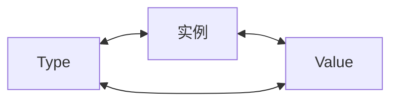

# 反射机制

## 什么是反射？

在计算机中，反射是指计算机程序在运行时（Run Time）可以访问、检测和修改程序本身的状态和行为的一种能力，简单的来说，反射其实就是程序在运行的时候，能够 “观察👀” 并且修改自己的行为。

## reflect包

`reflect` 包提供了运行时反射功能，允许程序在运行时检查和操作变量的类型、值、结构体字段等。它是 Go 语言实现动态行为的重要工具，常用于序列化、反序列化、ORM 框架等场景。

## Type & Value

`reflect.TypeOf()` 函数用于获取类型信息，返回 `Type` 类型；

```go
func TypeOf(i any) Type {...}
```

`reflect.ValueOf()` 函数用于获取值信息，返回 `Value` 类型。

```go
func ValueOf(i any) Value {...}
```

通过 `reflect.TypeOf()` 和 `reflect.ValueOf()` 函数，经过中间变量 `any` 把一个普通的变量转换为反射包中的类型 `Type` 和 `Value` 这两个类型的变量实例，然后再用 `reflect` 包中的方法进行操作。


示例：

```go
package main

import (
	"fmt"
	"reflect"
)

func main() {

	// 反射操作：通过反射，可以获取一个接口类型变量的类型和数值（也就是reflect.Type和reflect.Value）
	var x = 1.2345

	fmt.Println("type:", reflect.TypeOf(x))   // type: float64
	fmt.Println("value:", reflect.ValueOf(x)) // value: 1.2345

	fmt.Println("==========")
	// 根据反射的值，来获取对应的类型和数值
	v := reflect.ValueOf(x)
	fmt.Println("kind is float64:", v.Kind() == reflect.Float64)
	fmt.Println("type:", v.Type())
	fmt.Println("value:", v.Float())
}
```

输出结果：

```text
type: float64
value: 1.2345
==========
kind is float64: true
type: float64
value: 1.2345
```

示例说明：
- `reflect.TypeOf`：直接给到了我们想要的type类型，如float64、int、各种pointer、struct 等等真实的类型。
- `reflect.ValueOf`：1. 直接给到了我们想要的具体的值，如1.2345这个具体数值，或者类似&{1 "Allen.Wu" 25} 这样的结构体struct的值。
- 也就是说明反射可以将“接口类型变量”转换为“反射类型对象”，反射类型指的是reflect.Type和reflect.Value这两种。

Type 和 Value 都包含了大量的方法，其中第一个有用的方法应该是 Kind，这个方法返回该类型的具体信息：Uint、Float64 等。Value 类型还包含了一系列类型方法，比如 Int()，用于返回对应的值。以下是Kind的种类。

```go
// A Kind represents the specific kind of type that a [Type] represents.
// The zero Kind is not a valid kind.
type Kind uint

const (
	Invalid Kind = iota
	Bool
	Int
	Int8
	Int16
	Int32
	Int64
	Uint
	Uint8
	Uint16
	Uint32
	Uint64
	Uintptr
	Float32
	Float64
	Complex64
	Complex128
	Array
	Chan
	Func
	Interface
	Map
	Pointer
	Slice
	String
	Struct
	UnsafePointer
)
```

## 反射的规则

其实反射的操作步骤非常的简单，就是通过实体对象获取反射对象（Value、Type），然后操作相应的方法即可。

下图描述了实例、Value、Type 三者之间的转换关系：



反射 API 的分类总结如下：

**（1）从实例到 Value**

通过实例获取 Value 对象，直接使用 reflect.ValueOf() 函数。例如：

```go
func ValueOf(i interface{}) {...}
```

**（2）从实例到 Type**

通过实例获取反射对象的 Type，直接使用 reflect.TypeOf() 函数。例如：

```go
func TypeOf(i interface{}) Type {...}
```

**（3）从 Type 到 Value**

Type 里面只有类型信息，所以直接从一个 Type 接口变量里面是无法获得实例的 Value 的，但可以通过该 Type 构建一个新实例的 Value。reflect 包提供了两种方法，示例如下：

```go
//New 返回的是一个 Value，该 Value 的 type 为 PtrTo(typ)，即 Value 的 Type 是指定 typ 的指针类型
func New(typ Type) Value
//Zero 返回的是一个 typ 类型的零值，注意返回的 Value 不能寻址也不可改变
func Zero(typ Type) Value
```

如果知道一个类型值的底层存放地址，则还有一个函数是可以依据 type 和该地址值恢复出 Value 的。例如：

```go
func NewAt(typ Type, p unsafe.Pointer) Value
```

**（4）从 Value 到 Type**

从反射对象 Value 到 Type 可以直接调用 Value 的方法，因为 Value 内部存放着到 Type 类型的指针。例如：

```go
func (v Value) Type() Type
```

**（5）从 Value到实例**

Value 本身就包含类型和值信息，reflect 提供了丰富的方法来实现从 Value 到实例的转换。例如：

```go
//该方法最通用，用来将 Value 转换为空接口，该空接口内部存放具体类型实例
//可以使用接口类型查询去还原为具体的类型
func (v Value) Interface() （i interface{})

//Value 自身也提供丰富的方法，直接将 Value 转换为简单类型实例，如果类型不匹配，则直接引起 panic
func (v Value) Bool () bool
func (v Value) Float() float64
func (v Value) Int() int64
func (v Value) Uint() uint64
```

**（6）从 Value 的指针到值**

从一个指针类型的 Value 获得值类型 Value 有两种方法，示例如下：

```go
//如果 v 类型是接口，则 Elem() 返回接口绑定的实例的 Value，如果 v 类型是指针，则返回指针值的 Value，否则引起 panic
func (v Value) Elem() Value
//如果 v 是指针，则返回指针值的 Value，否则返回 v 自身，该函数不会引起 panic
func Indirect(v Value) Value
```

**（7）Type 指针和值的相互转换**

指针类型 Type 到值类型 Type。例如：

```go
//t 必须是 Array、Chan、Map、Ptr、Slice，否则会引起 panic
//Elem 返回的是其内部元素的 Type
t.Elem() Type
```

值类型 Type 到指针类型 Type。例如：

```go
//PtrTo 返回的是指向 t 的指针型 Type
func PtrTo(t Type) Type
```

**（8）Value 值的可修改性**

Value 值的修改涉及如下两个方法。

```go
//通过 CanSet 判断是否能修改
func (v Value ) CanSet() bool
//通过 Set 进行修改
func (v Value ) Set(x Value)
```

Value 值在什么情况下可以修改？我们知道实例对象传递给接口的是一个完全的值拷贝，如果调用反射的方法 reflect.ValueOf() 传进去的是一个值类型变量， 则获得的 Value 实际上是原对象的一个副本，这个 Value 是无论如何也不能被修改的。

**根据 Go 官方关于反射的博客，反射有三大定律**：

1. Reflection goes from interface value to reflection object.
2. Reflection goes from reflection object to interface value.
3. Reflection goes from reflection object to interface value.

**译文：**

1. 反射可以从接口值得到反射对象。
2. 反射可以从反射对象获得接口值。
3. 要修改反射对象，该值必须为可设置。

反射三大定律博客地址：[https://go.dev/blog/laws-of-reflection](https://go.dev/blog/laws-of-reflection)

## 反射获取接口变量信息

当执行 reflect.ValueOf(interface) 之后，就得到了一个类型为 “relfect.Value” 变量，可以通过它本身的 Interface() 方法获得接口变量的真实内容，然后可以通过类型判断进行转换，转换为原有真实类型。不过，我们可能是已知原有类型，也有可能是未知原有类型，因此，下面分两种情况进行说明。

**（1）已知原有类型**

已知类型后转换为其对应的类型的做法如下，直接通过 Interface 方法然后强制转换，如下：

```go
realValue := value.Interface().(已知的类型)
```

示例：

```go
package main

import (
	"fmt"
	"reflect"
)

func main() {
	var num = 1.2345678910

	pointer := reflect.ValueOf(&num) // 指向 num 的指针
	value := reflect.ValueOf(num)    // num 值的副本

	// 可以理解为“强制转换”，但是需要注意的时候，转换的时候，如果转换的类型不完全符合，则直接 panic
	// Golang 对类型要求非常严格，类型一定要完全符合
	// 如下两个，一个是 *float64，一个是 float64，如果弄混，则会 panic
	convertPointer := pointer.Interface().(*float64)
	convertValue := value.Interface().(float64)

	fmt.Println(convertPointer) // 指针存储的地址值
	fmt.Println(convertValue)   // 变量存储的数值副本
}
```

输出结果：

```text
0x1400000e0a0
1.234567891
```

示例说明：

1. 转换的时候，如果转换的类型不完全符合，则直接panic，类型要求非常严格！
2. 转换的时候，要区分是指针还是值。
3. 也就是说反射可以将“反射类型对象”再重新转换为“接口类型变量“。

**（2）未知原有类型**

很多情况下，我们可能并不知道其具体类型，那么这个时候，该如何做呢？需要我们进行遍历探测其 Filed 来得知。

示例：

```go
package main

import (
	"fmt"
	"reflect"
)

type Person struct {
	Name string
	Age  uint
	Sex  string
}

func (p Person) Say(msg string) {
	fmt.Println("hello, ", msg)
}

func (p Person) PrintInfo() {
	fmt.Printf("姓名: %s, 年龄: %d, 性别: %s\n", p.Name, p.Age, p.Sex)
}

func main() {
	p1 := Person{"Gopher", 18, "未知"}

	DoFileAndMethod(p1)
}

func DoFileAndMethod(input interface{}) {

	// 先获取 input 的类型
	getType := reflect.TypeOf(input)
	fmt.Println("get type is:", getType.Name()) // Person
	fmt.Println("get kind is:", getType.Kind()) // struct

	// 再获取 input 的值
	getValue := reflect.ValueOf(input)
	fmt.Println("get all Fields is:", getValue) // {Gopher 18 未知}

	// 获取字段
	// 1. 先获取 interface 的 reflect.Type，然后通过 NumField 进行遍历
	// 2. 再通过 reflect.Type 的 Field 获取其 Field
	// 3. 最后通过 Field 的 Interface() 得到对应的 value
	for i := 0; i < getType.NumField(); i++ {
		field := getType.Field(i)
		value := getValue.Field(i).Interface() //获取第 i 个值
		fmt.Printf("字段名称：%s，字段类型：%s，字段数值：%v\n", field.Name, field.Type, value)
	}

	// 操作方法
	// 1. 先获取 interface 的 reflect.Type，然后通过 .NumMethod 进行遍历
	// 2. 再通过 reflect.Type 的 Method 获取其 Method
	for i := 0; i < getType.NumMethod(); i++ {
		method := getType.Method(i)
		fmt.Printf("方法名称：%s，方法类型：%v\n", method.Name, method.Type)
	}
}
```

输出结果：

```text
get type is: Person
get kind is: struct
get all Fields is: {Gopher 18 未知}
字段名称：Name，字段类型：string，字段数值：Gopher
字段名称：Age，字段类型：uint，字段数值：18
字段名称：Sex，字段类型：string，字段数值：未知
方法名称：PrintInfo，方法类型：func(main.Person)
方法名称：Say，方法类型：func(main.Person, string)
```

示例说明：

通过运行结果可以得知获取未知类型的 interface 的具体变量及其类型的步骤为：

1. 先获取 interface 的 reflect.Type，然后通过 NumField 进行遍历。
2. 再通过 reflect.Type 的 Field 获取其 Field。
3. 最后通过 Field 的 Interface() 得到对应的 value。

通过运行结果可以得知获取未知类型的 interface 的所属方法（函数）的步骤为：

1. 先获取 interface 的 reflect.Type，然后通过 NumMethod 进行遍历。
2. 再分别通过 reflect.Type 的 Method 获取对应的真实的方法（函数）。
3. 最后对结果取其 Name 和 Type 得知具体的方法名。
4. 也就是说反射可以将“反射类型对象”再重新转换为“接口类型变量”。
5. struct 或者 struct 的嵌套都是一样的判断处理方式。

## 反射设置实际变量的值

reflect.Value 是通过 `reflect.ValueOf(X)` 获得的， 只有当 X 是指针的时候，才可以通过 reflec.Value 修改实际变量 X 的值，即：要修改反射类型的对象就一定要保证其值是 “addressable” 的。

也就是说：要想修改一个变量的值，那么必须通过该变量的指针地址。

通过 `refPtrVal := reflect.Valueof( &var )` 的方式获取指针类型，然后使用 `refPtrVal.Elem( ).Set(一个新的 reflect.Value)` 来进行更改，传递给 `Set()` 的值也必须是一个 `reflect.value`。

```go
// Elem returns the value that the interface v contains
// or that the pointer v points to.
// It panics if v's Kind is not [Interface] or [Pointer].
// It returns the zero Value if v is nil.

// Elem 返回接口 v 包含的值或者 v 指针指向的对象
// 如果 v 的类型不是 接口 或 Ptr，它会惊慌
// 如果 v 为 nil，则返回 0 值
func (v Value) Elem() Value {...}
```

如果你的变量是一个指针、map、slice、channel、Array。那么你可以使用 reflect.Typeof(v).Elem() 来确定包含的类型。

示例：

```go
package main

import (
	"fmt"
	"reflect"
)

func main() {
	var num = 1.23456
	fmt.Println("num的值:", num)

	// 需要操作指针
	// 通过 reflect.ValueOf 获取 num 中的 reflect.Value，注意，参数必须是指针才能修改其值
	numPointer := reflect.ValueOf(&num)
	elem := numPointer.Elem()
	fmt.Println("类型:", elem.Type())       // float64
	fmt.Println("是否可以修改:", elem.CanSet()) // true

	// 重新赋值
	elem.SetFloat(9.87654)
	fmt.Println("num的新值:", num)

	// 如果reflect.ValueOf的参数不是指针，会如何？

	// 参试直接修改
	//value := reflect.ValueOf(num)
	//value.SetFloat(4.5678) // panic: reflect: reflect.Value.SetFloat using unaddressable value
	//fmt.Println(value.CanSet()) // false

	//pointer := reflect.ValueOf(num)
	//elem := pointer.Elem() // 如果非指针，这里直接panic，“panic: reflect: call of reflect.Value.Elem on float64 Value”
}
```

输出结果：

```text
um的值: 1.23456
类型: float64
是否可以修改: true
num的新值: 9.87654
```

示例说明：

1. 需要传入的参数是* float64这个指针，然后可以通过pointer.Elem()去获取所指向的Value，**注意一定要是指针**。
2. 如果传入的参数不是指针，而是变量，那么
   - 通过Elem获取原始值对应的对象则直接panic
   - 通过CanSet方法查询是否可以设置返回false
3. newValue.CantSet()表示是否可以重新设置其值，如果输出的是true则可修改，否则不能修改，修改完之后再进行打印发现真的已经修改了。
4. reflect.Value.Elem() 表示获取原始值对应的反射对象，只有原始对象才能修改，当前反射对象是不能修改的
5. 也就是说如果要修改反射类型对象，其值必须是“addressable”【对应的要传入的是指针，同时要通过Elem方法获取原始值对应的反射对象】
6. struct 或者 struct 的嵌套都是一样的判断处理方式。

尝试修改结构体中的字段数值，示例：

```go
package main

import (
	"fmt"
	"reflect"
)

type Student struct {
	Name   string
	Age    int
	School string
}

func main() {
	// 通过反射，来更改对象的值，前提是数值可以被更改
	s1 := Student{"Gopher", 18, "XXX小学"}
	fmt.Printf("s1 类型：%T\n", s1)

	p1 := &s1
	fmt.Printf("p1 类型：%T\n", p1)
	fmt.Println("s1.Name:", s1.Name)
	fmt.Println("*p1.Name:", (*p1).Name)

	// 使用 reflect.ValueOf 取出值，注意传指针
	v1 := reflect.ValueOf(&s1)

	if v1.Kind() == reflect.Ptr {
		fmt.Println("v1.Elem 是否可以设置：", v1.Elem().CanSet())
		v1 = v1.Elem()
	}

	f1 := v1.FieldByName("Name")
	f1.SetString("MagicGopher")
	f2 := v1.FieldByName("Age")
	f2.SetInt(20)
	f3 := v1.FieldByName("School")
	f3.SetString("XXX学校")
	fmt.Println("s1:", s1)
}
```

输出结果：

```text
s1 类型：main.Student
p1 类型：*main.Student
s1.Name: Gopher
*p1.Name: Gopher
v1.Elem 是否可以设置： true
s1: {MagicGopher 20 XXX学校}
```

## 反射进行方法调用

这算是一个高级用法了，前面我们只说到对类型、变量的几种反射的用法，包括如何获取其值、其类型、以及如何重新设置新值。但是在项目应用中，另外一个常用并且属于高级的用法，就是通过 reflect 来进行「方法/函数」的调用。比如我们要做框架工程的时候，需要可以随意扩展方法，或者说用户可以自定义方法，那么我们通过什么手段来扩展让用户能够自定义呢？关键点在于用户的自定义方法是未可知的，因此我们可以通过 reflect 来搞定。

这里涉及到 reflect 包中一个非常重要的方法：

```go
// Call calls the function v with the input arguments in.
// For example, if len(in) == 3, v.Call(in) represents the Go call v(in[0], in[1], in[2]).
// Call panics if v's Kind is not [Func].
// It returns the output results as Values.
// As in Go, each input argument must be assignable to the
// type of the function's corresponding input parameter.
// If v is a variadic function, Call creates the variadic slice parameter
// itself, copying in the corresponding values.

// 调用函数 v 时，输入参数为 in
// 例如，if len(in) == 3, v.Call(in) 表示 Go 调用 v(in[0]， in[1]， in[2])
// 如果 v 的 Kind 不是 Func，则 panic
// 它以 Value[] 返回输出结果
// 与 Go 一样，每个输入参数必须可赋值给函数对应的输入参数的类型
// 如果 v 是一个可变参数函数，则调用自己创建可变参数切片形参，复制相应的值
func (v Value) Call(in []Value) []Value {...}
```

**（1）通过反射，调用方法**

示例：

```go
package main

import (
	"fmt"
	"reflect"
)

type Person struct {
	Name string
	Age  uint
	Sex  string
}

func (p Person) Say(msg string) {
	fmt.Println("hello, ", msg)
}

func (p Person) PrintInfo() {
	fmt.Printf("姓名: %s, 年龄: %d, 性别: %s\n", p.Name, p.Age, p.Sex)
}

func (p Person) TestPerson(i, j int, s string) {
	fmt.Println("Test:", i, j, s)
}

// 如何通过反射来进行方法的调用？
// 本来可以用结构体对象.方法名称()直接调用的，
// 但是如果要通过反射，
// 那么首先要将方法注册，也就是 MethodByName，然后通过反射调动 mv.Call
func main() {
	p1 := Person{"Gopher", 18, "男"}

	//1. 要通过反射来调用起对应的方法，必须要先通过 reflect.ValueOf(interface) 来获取到reflect.Value
	//   得到“反射类型对象”后才能做下一步处理
	getValue := reflect.ValueOf(p1)

	// 2. 一定要指定参数为正确的方法名
	// 2.1 先看看没有参数的调用方法
	methodValue1 := getValue.MethodByName("PrintInfo")
	fmt.Printf("PrintInfo ---> Kind: %s, Type: %s\n", methodValue1.Kind(), methodValue1.Type())
	methodValue1.Call(nil)            // 没有参数，直接写nil
	args1 := make([]reflect.Value, 0) //或者创建一个空的切片也可以
	methodValue1.Call(args1)

	// 2.2 有参数的方法调用
	methodValue2 := getValue.MethodByName("Say")
	fmt.Printf("Say ---> Kind : %s, Type : %s\n", methodValue2.Kind(), methodValue2.Type())
	args2 := []reflect.Value{reflect.ValueOf("反射机制")}
	methodValue2.Call(args2)

	methodValue3 := getValue.MethodByName("TestPerson")
	fmt.Printf("Test ---> Kind : %s, Type : %s\n", methodValue3.Kind(), methodValue3.Type())
	args3 := []reflect.Value{reflect.ValueOf(100), reflect.ValueOf(200), reflect.ValueOf("Hello")}
	methodValue3.Call(args3)
}
```

输出结果：

```text
PrintInfo ---> Kind: func, Type: func()
姓名: Gopher, 年龄: 18, 性别: 男
姓名: Gopher, 年龄: 18, 性别: 男
Say ---> Kind : func, Type : func(string)
hello,  反射机制
Test ---> Kind : func, Type : func(int, int, string)
Test: 100 200 Hello
```

**（2）通过反射，调用函数**

首先我们要先确认一点，函数像普通的变量一样，之前的章节中我们在讲到函数的本质的时候，是可以把函数作为一种变量类型的，而且是引用类型。如果说 Fun() 是一个函数，那么 f1 := Fun 也是可以的，那么 f1 也是一个函数，如果直接调用 f1()，那么运行的就是 Fun() 函数。

那么我们就先通过 ValueOf() 来获取函数的反射对象，可以判断它的 Kind，是一个 func，那么就可以执行 Call() 进行函数的调用。

示例：

```go
package main

import (
	"fmt"
	"reflect"
)

func main() {
	// 函数的反射
	f1 := fun1
	f1Value := reflect.ValueOf(f1)
	fmt.Printf("Kind: %s, Type: %s\n", f1Value.Kind(), f1Value.Type())

	f2 := fun2
	f2Value := reflect.ValueOf(f2)
	fmt.Printf("Kind: %s, Type: %s\n", f2Value.Kind(), f2Value.Type())

	// 通过反射调用函数
	f1Value.Call(nil) // 没有参数
	f2Value.Call([]reflect.Value{reflect.ValueOf(100), reflect.ValueOf("hello")})
}

func fun1() {
	fmt.Println("fun1()，没有参数.")
}

func fun2(i int, s string) {
	fmt.Println("fun2()，有参数.")
}
```

输出结果：

```text
Kind: func, Type: func()
Kind: func, Type: func(int, string)
fun1()，没有参数.
fun2()，有参数.
```

示例说明：

1. 要通过反射来调用起对应的方法，必须要先通过 `reflect.ValueOf(interface)` 来获取到 `reflect.Value` 得到“反射类型对象”后才能做下一步处理。
2. `reflect.Value.MethodByName` 这个 `MethodByName`，需要指定准确真实的方法名字，如果错误将直接 panic，`MethodByName` 返回一个函数值对应的 `reflect.Value` 方法的名字。
3. `[]reflect.Value` 这个是最终需要调用的方法的参数，可以没有或者一个或者多个，根据实际参数来定。
4. `reflect.Value` 的 `Call` 这个方法，这个方法将最终调用真实的方法，参数务必保持一致，如果 `reflect.Value.Kind` 不是一个方法，那么将直接 panic。
5. 本来可以用对象访问方法直接调用的，但是如果要通过反射，那么首先要将方法注册，也就是 `MethodByName`，然后通过反射调用 `methodValue.Call`。

## 参考资料

- [https://pkg.go.dev/reflect](https://pkg.go.dev/reflect)
- [https://hedon954.github.io/noteSite/](https://hedon954.github.io/noteSite/)