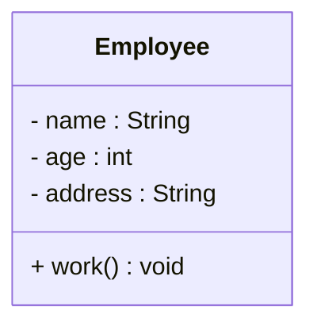
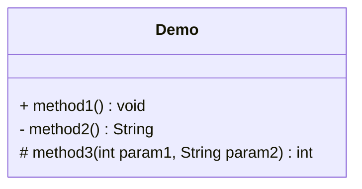
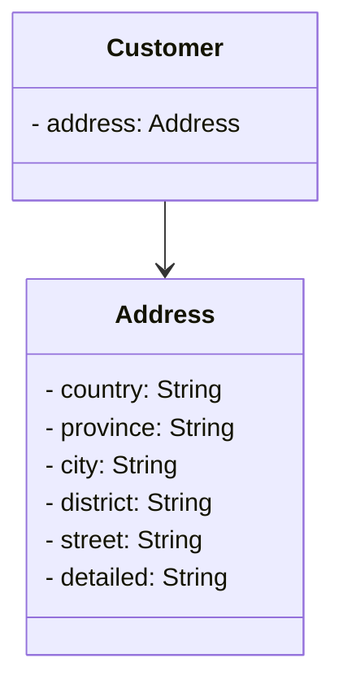
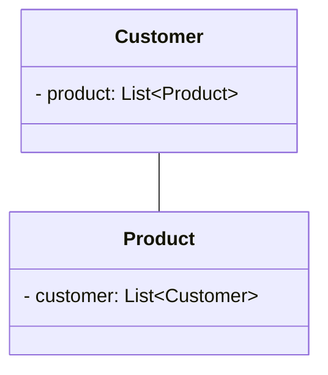
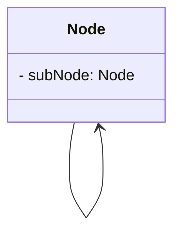
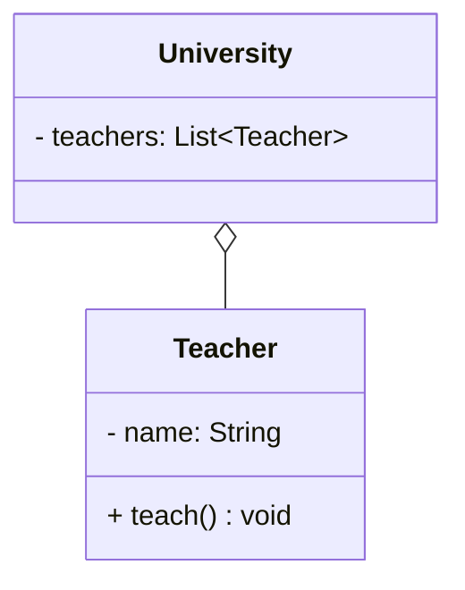
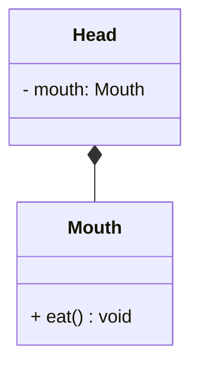
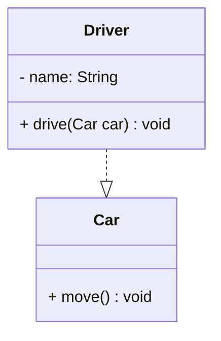
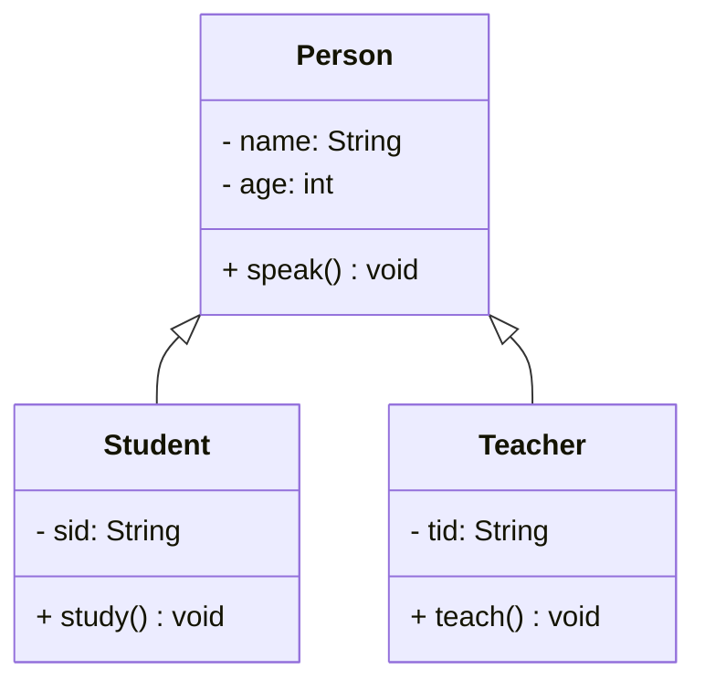
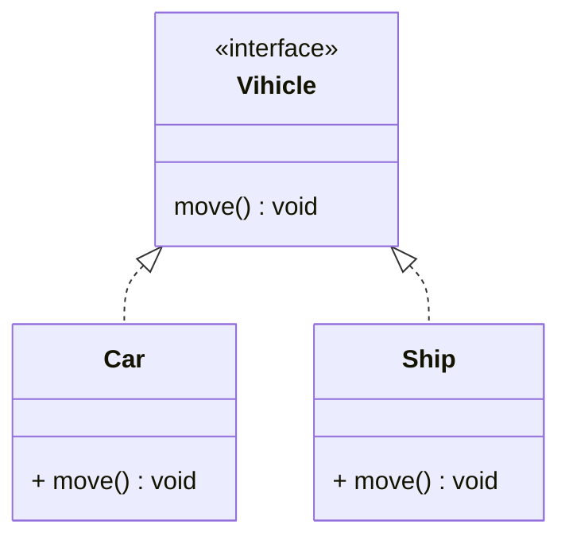

# 设计模式简介

## 设计模式的产生背景

“设计模式“ 最初并不是出现在软件设计中，而是被用于建筑领域的设计中。

1977年美国著名建筑大师、加利福尼亚大学伯克利分校环境结构中心主任克里斯托夫·亚历山大（Christopher Alexander）在他的著作《建筑模式语言：城镇、建筑、构造》中描述了一些常见的建筑设计问题，并提出了 253 种关于对城镇、邻里、住宅、花园和房间等进行设计的基本模式。

1990年软件工程界开始研讨设计模式的话题，后来召开了多次关于设计模式的研讨会。直到1995 年，艾瑞克·伽马（ErichGamma）、理査德·海尔姆（Richard Helm）、拉尔夫·约翰森（Ralph Johnson）、约翰·威利斯迪斯（John Vlissides）等 4 位作者合作出版了《设计模式：可复用面向对象软件的基础》一书，在此书中收录了 23 个设计模式，这是设计模式领域里程碑的事件，导致了软件设计模式的突破。这 4 位作者在软件开发领域里也以他们的“四人组”（Gang of Four，GoF）著称。

## 设计模式的概念

软件设计模式（Software Design Pattern）是一套被反复使用、经过分类和整理的、针对特定软件设计问题的可重用解决方案。它是软件工程中解决常见设计问题的最佳实践，旨在提高代码的可维护性、可扩展性、灵活性和复用性。

## 设计模式分类

- **创建型模式**

用于描述 “怎么样创建对象”，创建型设计模式主要特点是“将对象的创建与使用分离”。

- **结构型模式**

用于描述类和对象之间的组织结构，优化类或对象的组合方式。

- **行为型模式**

用于描述类或对象之间怎样相互协作共同完成单个对象无法单独完成的任务，以及怎样分配职责。

## UML

UML（Unified Modeling Language，统一建模语言）是一种标准化的图形化建模语言，用于软件系统的可视化、设计、描述和文档化。它是软件工程中用于系统分析和设计的工具，帮助开发者和利益相关者以直观的方式理解、沟通和规划软件系统的结构与行为。

### 类图

类图(Class diagram)是显示了模型的静态结构，特别是模型中存在的类、类的内部结构以及它们与其他类的关系等。类图不显示暂时性的信息。类图是面向对象建模的主要组成部分。

### 类图的作用

- 在软件工程中，类图是一种静态的结构图，描述了系统的类的集合，类的属性和类之间的关系，可以简化了人们对系统的理解。
- 类图是系统分析和设计阶段的重要产物，是系统编码和测试的重要模型。

### 类图表示法

在UML类图中，类使用包含类名、属性(field) 和方法(method) 且带有分割线的矩形来表示，比如下图表示一个Employee类，它包含name、age和address这3个属性，以及work()方法。 

属性/方法名称前加的加号和减号表示了这个属性/方法的可见性，UML类图中表示可见性的符号有三种：

- +：表示公有（public）属性或方法，可以在任何地方访问。
- -：表示私有（private）属性或方法，只能在类内部访问。
- #：表示受保护（protected）属性或方法，只能在类内部和子类内部访问。

属性的完整表示方式是： **可见性  名称 : 类型 [ = 缺省值]**  

方法的完整表示方式是： **可见性  名称(参数列表) [ : 返回类型]**

::: tip 提示
1. 中括号中的内容表示是可选的
2. 也有将类型放在变量名前面，返回值类型放在方法名前面
:::

**举个例子**：

上面的Demo类定义了三个方法：

- method1()方法：修饰符为public，没有参数，没有返回值。
- method2()方法：修饰符为private，没有参数，返回值为String。
- method3()方法：修饰符为protected，接收两个参数，第一个参数类型为int，第二个参数类型为String，返回值类型是int。

### 类与类之间关系的表示方式

#### 关联关系

关联关系是对象之间的一种引用关系，用于表示一类对象与另一类对象之间的联系，如老师和学生、师傅和徒弟、丈夫和妻子等。关联关系是类与类之间最常用的一种关系，分为一般关联关系、聚合关系和组合关系。我们先介绍一般关联。

关联又可以分为单向关联，双向关联，自关联。

**单向关联**

在UML类图中单向关联用一个带箭头的实线表示。上图表示每个顾客都有一个地址，这通过让 `Customer` 类（结构体）持有一个类型为 `Address` 的成员变量（字段）来实现。

**双向关联**

从上图中我们很容易看出，所谓的双向关联就是双方各自持有对方类型的成员变量。

在UML类图中，双向关联用一个不带箭头的直线表示。上图中在 `Customer` 类（结构体）中维护一个 `List<Product>` 表示一个顾客可以购买多个商品；在 `Product` 类（结构体）中维护一个 `Customer` 类型的成员变量（字段）表示这个产品被哪个顾客所购买。

**自关联**

自关联在UML类图中用一个带有箭头且指向自身的线表示。上图的意思就是 `Node` 类（结构体）包含类型为 `Node` 的成员变量（字段），也就是“自己包含自己”。

#### 聚合关系

聚合关系是关联关系的一种，是强关联关系，是整体和部分之间的关系。

聚合关系也是通过成员对象来实现的，其中成员对象是整体对象的一部分，但是成员对象可以脱离整体对象而独立存在。例如，学校与老师的关系，学校包含老师，但如果学校停办了，老师依然存在。

在 UML 类图中，聚合关系可以用带空心菱形的实线来表示，菱形指向整体。下图所示是大学和教师的关系图：

#### 组合关系

组合表示类之间的整体与部分的关系，但它是一种更强烈的聚合关系。

在组合关系中，整体对象可以控制部分对象的生命周期，一旦整体对象不存在，部分对象也将不存在，部分对象不能脱离整体对象而存在。例如，头和嘴的关系，没有了头，嘴也就不存在了。

在 UML 类图中，组合关系用带实心菱形的实线来表示，菱形指向整体。下图所示是头和嘴的关系图：

#### 依赖关系

依赖关系是一种使用关系，它是对象之间耦合度最弱的一种关联方式，是临时性的关联。在代码中，某个类的方法通过局部变量、方法的参数或者对静态方法的调用来访问另一个类（被依赖类）中的某些方法来完成一些职责。

在 UML 类图中，依赖关系使用带箭头的虚线来表示，箭头从使用类指向被依赖的类。下图所示是司机和汽车的关系图，司机驾驶汽车：

#### 继承关系

继承关系是对象之间耦合度最大的一种关系，表示一般与特殊的关系，是父类与子类之间的关系，是一种继承关系。

在 UML 类图中，泛化关系用带空心三角箭头的实线来表示，箭头从子类指向父类。在代码实现时，使用面向对象的继承机制来实现泛化关系。例如，Student 类和 Teacher 类都是 Person 类的子类，其类图如下图所示：

#### 实现关系

实现关系是接口与实现类之间的关系。在这种关系中，类实现了接口，类中的操作实现了接口中所声明的所有的抽象操作。

在 UML 类图中，实现关系使用带空心三角箭头的虚线来表示，箭头从实现类指向接口。例如，汽车和船实现了交通工具，其类图如图 9 所示。

## 软件设计原则

在软件开发中，为了提高软件系统的可维护性和可复用性，增加软件的可扩展性和灵活性，程序员要尽量根据6条原则来开发程序，从而提高软件开发效率、节约软件开发成本和维护成本。

### 单一职责原则

单一职责原则(Single Responsibility Principle, SRP) 是一种面向对象设计原则，它指出一个类或者模块应该有且只有一个引起它变化的原因。换句话说，一个类只负责一项职责或功能。这一原则旨在降低类的复杂性，提高可读性和可维护性，并增强代码的复用性。

### 里氏替换原则

里氏替换原则（Liskov Substitution Principle, LSP）是面向对象设计的五大原则（SOLID）之一。它由计算机科学家芭芭拉·利斯科夫（Barbara Liskov）在1987年提出。该原则定义了子类型（Subtype）和超类型（Supertype）之间的关系，确保了在程序中，子类的对象能够替换其父类的对象，而不会导致程序的行为发生任何非预期的改变。

通俗地讲，里氏替换原则的核心思想是：任何基类可以出现的地方，子类一定可以出现，并且替换后，程序的行为和正确性不应该有任何改变。

### 依赖倒转原则

依赖倒置原则（Dependency Inversion Principle，DIP）是面向对象设计中的一个重要原则，它强调高层模块不应该依赖于低层模块，两者都应该依赖于其抽象。抽象不应该依赖于细节，细节应该依赖于抽象。简单来说，就是对接口编程，不要对实现编程。

### 接口隔离原则

接口隔离原则(Interface Segregation Principle，简称ISP) 是面向对象设计中的一个重要原则，它强调客户端不应该依赖于它不需要的接口。简单来说，就是将大的、臃肿的接口拆分成更小、更具体的接口，使得客户端只依赖于它们需要的接口，而不依赖于那些与它们无关的接口。这样可以提高系统的灵活性、可维护性和可重用性。

### 合成/聚合复用原则

合成/聚合复用原则（Composite/Aggregate Reuse Principle, CARP）是一种软件设计原则，主张在新的对象中通过使用已有的对象，使之成为新对象的一部分，并通过“委派”的方式复用已有功能，而不是通过继承来实现代码复用。简单来说，就是优先使用组合或聚合，而不是继承。

### 迪米特法则

迪米特法则（Law of Demeter）又叫作最少知识原则（The Least Knowledge Principle），是指一个对象应该对其他对象有尽可能少的了解，只与直接朋友通信，不与陌生人说话。换句话说，一个类对于其他类知道的越少越好。

### 开闭原则

开闭原则（The Open/Closed Principle）也称为OCP原则，是面向对象设计中的一个重要原则，其核心思想是“对扩展开放，对修改关闭”。这意味着软件实体（类、模块、函数等）应该对扩展开放，允许新增功能，但对修改关闭，避免修改现有代码。这样做可以提高代码的可维护性和可复用性，降低维护成本。

## 参考资料

- [https://refactoringguru.cn](https://refactoringguru.cn)