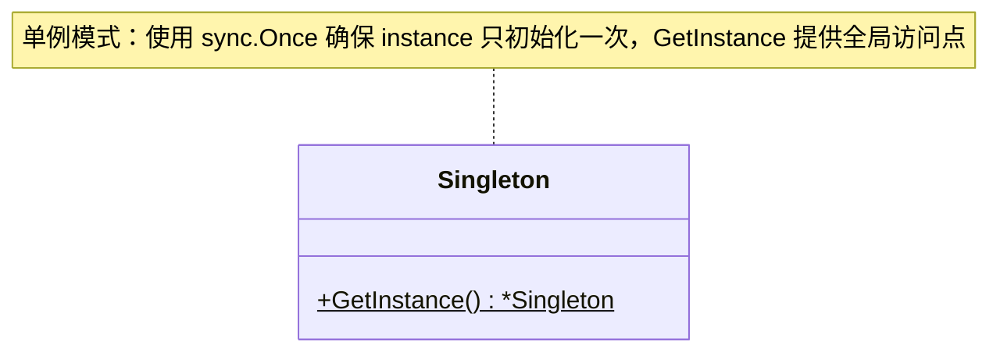

# 单例模式

## 概述

单例模式（Singleton Pattern）是一种创建型设计模式，确保一个类只有一个实例，并提供一个全局访问点。它适用于需要控制资源访问、确保唯一实例的场景，例如日志管理器、数据库连接池或配置文件管理。


## 模式结构

单例模式的主要有以下角色：

- 单例类：包含一个私有静态实例和一个公共静态方法，用于获取该实例。
- 私有构造函数：防止外部直接实例化。
- 全局访问点：通过静态方法提供对唯一实例的访问。

## 实现

单例模式的UML类图如下所示：



在 Go 语言中，单例模式通常通过sync.Once来确保线程安全的初始化。以下是单例模式的Go实现示例：

```go
package singleton

import (
	"sync"
)

// Singleton 是单例模式的结构体
type Singleton struct {
}

var (
	instance *Singleton // 单例结构体
	once     sync.Once // 确保 instance 只初始化一次
)

// GetInstance 获取单例实例
func GetInstance() *Singleton {
	once.Do(func() {
		instance = &Singleton{data: "Singleton Instance"}
	})
	return instance
}
```

代码说明：

- `sync.Once`：确保`instance`只被初始化一次，即使在并发环境下
- `GetInstance`：全局访问点，返回单例实例。
- 私有构造函数：Go中通过包级别控制访问，`instance`定义在包内部，避免外部直接修改。

## 使用场景

单例模式适用于以下场景：

- 资源共享：如数据库连接池、线程池，需确保全局唯一实例以避免资源浪费。
- 全局状态管理：如日志管理器、配置管理器，需统一访问点。
- 控制并发访问：如计数器或ID生成器，需确保数据一致性。

示例：日志管理器

```go
package main

import (
	"fmt"
	"sync"
)

// Logger 日志管理器
type Logger struct {
	logLevel string
}

var (
	loggerInstance *Logger // 日志管理器单例
	loggerOnce     sync.Once // 确保日志管理器只被初始化一次
)

// GetLogger 获取日志管理器单例
func GetLogger() *Logger {
	loggerOnce.Do(func() {
		loggerInstance = &Logger{logLevel: "INFO"}
	})
	return loggerInstance
}

// Log 记录日志
func (l *Logger) Log(message string) {
	fmt.Printf("[%s] %s\n", l.logLevel, message)
}

func main() {
	logger1 := GetLogger()
	logger2 := GetLogger()

	logger1.Log("This is a test log")
	logger2.Log("This is another test log")

	fmt.Println(logger1 == logger2) // true，证明是同一实例
}
```

## 优缺点

**优点**

- 控制实例数量：确保全局唯一实例，节省资源。
- 全局访问：提供统一访问点，便于管理。
- 延迟初始化：实例在首次使用时创建，优化性能。

**缺点**

- 全局状态问题：可能导致隐式耦合，难以测试和维护。
- 并发复杂性：需额外处理线程安全问题。
- 单一职责原则冲突：单例类可能承担过多职责。

## 注意事项

- 线程安全：在Go中，推荐使用sync.Once确保初始化安全。
- 测试困难：单例的全局状态可能影响单元测试，建议通过接口解耦。
- 避免滥用：仅在确实需要全局唯一实例时使用，避免不必要的复杂性。
