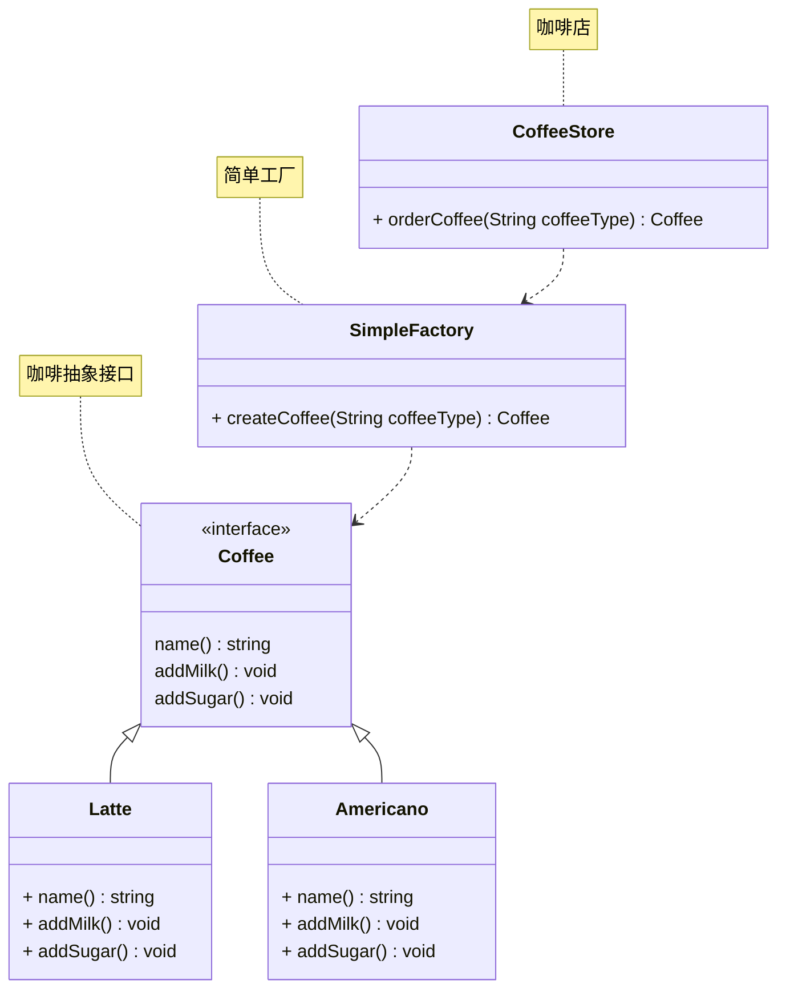

# 简单工厂

## 概述

简单工厂(Simple Factory) 通常不被认为是正式的设计模式，而更像是一种编程习惯或简单的创建对象的方式。它不是GOF (Gang of Four) 定义的23 种设计模式之一。

## 模式结构

简单工厂包含如下角色：

- 抽象产品：定义了产品的规范，描述了产品的主要特性和功能。
- 具体产品：实现了抽象产品的具体实现，提供了具体的产品对象。
- 具体工厂：提供了创建产品的方法，调用者通过该方法来获取产品。

## 实现

现在使用简单工厂对上面案例进行改进，类图如下：



接下来是简单工厂具体的实现代码，如下：

首先是 coffee.go 文件，定义了咖啡抽象接口和具体的咖啡类，如下所示：

```go
package simplefactory

import "fmt"

// 工厂生成的产品

// Coffee 咖啡接口
type coffee interface {
	name() string
	addMilk()
	addSugar()
}

// Latte 拿铁咖啡
type Latte struct {
}

func (l *Latte) name() string {
	return "拿铁咖啡"
}

func (l *Latte) addMilk() {
	fmt.Printf("给%s加牛奶\n", l.name())
}

func (l *Latte) addSugar() {
	fmt.Printf("给%s加糖\n", l.name())
}

// Americano 美式咖啡
type Americano struct {
}

func (a *Americano) name() string {
	return "美式咖啡"
}

func (a *Americano) addMilk() {
	fmt.Printf("给%s加牛奶\n", a.name())
}

func (a *Americano) addSugar() {
	fmt.Printf("给%s加糖\n", a.name())
}
```

接下来是 factory.go 文件，定义了简单工厂类，如下所示：

```go
package simplefactory

import "fmt"

// 生产产品的工厂

// SimpleFactory 简单工厂
type SimpleFactory struct {
}

// CreateCoffee 根据指定的类型创建咖啡
func (sf *SimpleFactory) CreateCoffee(coffeeType string) (coffee, error) {
	switch coffeeType {
	case "latte":
		return &Latte{}, nil
	case "Latte":
		return &Latte{}, nil
	case "americano":
		return &Americano{}, nil
	case "Americano":
		return &Americano{}, nil
	default:
		return nil, fmt.Errorf("不支持的咖啡类型: %s", coffeeType)
	}
}

// CoffeeStore 咖啡店
type CoffeeStore struct {
	factory *SimpleFactory
}

// NewCoffeeStore 创建一个新的咖啡店
func NewCoffeeStore(factory *SimpleFactory) *CoffeeStore {
	return &CoffeeStore{
		factory: factory,
	}
}

// OrderCoffee 顾客点单
func (cs *CoffeeStore) OrderCoffee(coffeeType string) (coffee, error) {
	coffee, err := cs.factory.CreateCoffee(coffeeType)
	if err != nil {
		return nil, err
	}

	// 可以在这里添加一些通用的准备步骤

	return coffee, nil
}
```

编写单元测试 factory_test.go，如下所示：

```go
package simplefactory

import (
	"fmt"
	"testing"
)

// TestCreateLatte 点单拿铁咖啡
func TestCreateLatte(t *testing.T) {
	// 创建咖啡店，并注入一个简单工厂实例
	coffeeStore := NewCoffeeStore(&SimpleFactory{})

	// 点一杯拿铁咖啡
	latte, err := coffeeStore.OrderCoffee("latte")
	if err != nil {
		t.Fatalf("订购拿铁失败: %v", err)
	}
	if latte.name() != "拿铁咖啡" {
		t.Errorf("期望的咖啡是 '拿铁咖啡', 但得到的是 '%s'", latte.name())
	}
	fmt.Printf("成功订购: %s\n", latte.name())
	latte.addMilk()
	latte.addSugar()
}

// TestCreateAmericano 点单美式咖啡
func TestCreateAmericano(t *testing.T) {
	// 创建咖啡店，并注入一个简单工厂实例
	coffeeStore := NewCoffeeStore(&SimpleFactory{})

	// 点一杯美式咖啡
	americano, err := coffeeStore.OrderCoffee("americano")
	if err != nil {
		t.Fatalf("订购美式失败: %v", err)
	}
	if americano.name() != "美式咖啡" {
		t.Errorf("期望的咖啡是 '美式咖啡', 但得到的是 '%s'", americano.name())
	}
	fmt.Printf("成功订购: %s\n", americano.name())
	americano.addMilk()
	americano.addSugar()
}

// TestCreateMocha 点单其他类型的咖啡
func TestCreateOtherTypeCoffee(t *testing.T) {
	// 创建咖啡店，并注入一个简单工厂实例
	coffeeStore := NewCoffeeStore(&SimpleFactory{})

	// 点一杯美式咖啡
	americano, err := coffeeStore.OrderCoffee("mocha")
	if err != nil {
		t.Fatalf("订购美式失败: %v", err)
	}
	if americano.name() != "美式咖啡" {
		t.Errorf("期望的咖啡是 '美式咖啡', 但得到的是 '%s'", americano.name())
	}
	fmt.Printf("成功订购: %s\n", americano.name())
	americano.addMilk()
	americano.addSugar()
}
```

工厂（factory）处理创建对象的细节，一旦有了SimpleCoffeeFactory，CoffeeStore类中的orderCoffee()就变成此对象的客户，后期如果需要Coffee对象直接从工厂中获取即可。这样也就解除了和Coffee实现类的耦合，同时又产生了新的耦合，CoffeeStore对象和SimpleCoffeeFactory工厂对象的耦合，工厂对象和商品对象的耦合。

后期如果再加新品种的咖啡，我们势必要需求修改SimpleCoffeeFactory的代码，违反了开闭原则。工厂类的客户端可能有很多，比如创建美团外卖等，这样只需要修改工厂类的代码，省去其他的修改操作。

## 优缺点

优点：封装了创建对象的过程，可以通过参数直接获取对象。把对象的创建和业务逻辑层分开，这样以后就避免了修改客户代码，如果要实现新产品直接修改工厂类，而不需要在原代码中修改，这样就降低了客户代码修改的可能性，更加容易扩展。

缺点：增加新产品时还是需要修改工厂类的代码，违背了“开闭原则”。

## 参考资料

- [https://lailin.xyz/post/go-design-pattern.html](https://lailin.xyz/post/go-design-pattern.html)
- [https://refactoringguru.cn](https://refactoringguru.cn)