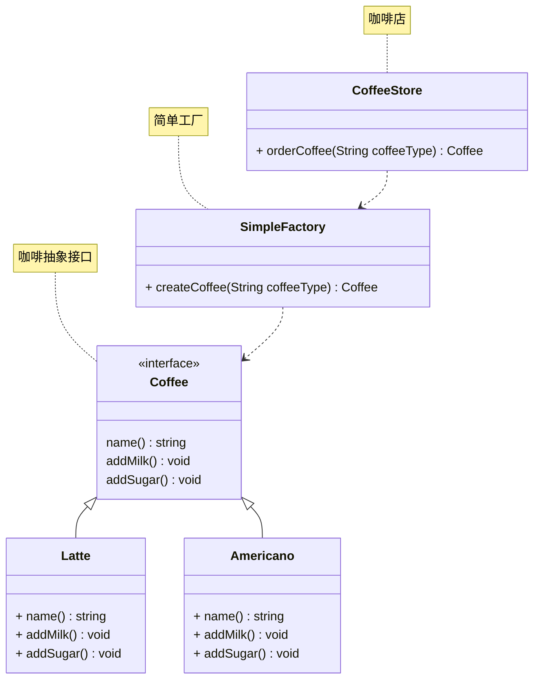

# 简单工厂

## 概述

简单工厂(Simple Factory) 通常不被认为是正式的设计模式，而更像是一种编程习惯或简单的创建对象的方式。它不是GOF (Gang of Four) 定义的23 种设计模式之一。

## 模式结构

简单工厂包含如下角色：

- 抽象产品：定义了产品的规范，描述了产品的主要特性和功能。
- 具体产品：实现了抽象产品的具体实现，提供了具体的产品对象。
- 具体工厂：提供了创建产品的方法，调用者通过该方法来获取产品。

## 实现

现在使用简单工厂对上面案例进行改进，类图如下：



接下来是简单工厂具体的实现代码，如下：

首先是 coffee.go 文件，定义了咖啡抽象接口和具体的咖啡类，如下所示：

```go
package simplefactory

import "fmt"

// 工厂生成的产品

// Coffee 咖啡接口
type coffee interface {
	name() string
	addMilk()
	addSugar()
}

// Latte 拿铁咖啡
type Latte struct {
}

func (l *Latte) name() string {
	return "拿铁"
}

func (l *Latte) addMilk() {
	fmt.Printf("%s咖啡加牛奶\n", l.name())
}

func (l *Latte) addSugar() {
	fmt.Printf("%s咖啡加糖\n", l.name())
}

// Americano 美式咖啡
type Americano struct {
}

func (a *Americano) name() string {
	return "美式"
}

func (a *Americano) addMilk() {
	fmt.Printf("%s咖啡加牛奶\n", a.name())
}

func (a *Americano) addSugar() {
	fmt.Printf("%s咖啡加糖\n", a.name())
}
```

接下来是 factory.go 文件，定义了简单工厂类，如下所示：

```go
package simplefactory

// 生产产品的工厂

type SimpleFactory struct {
}

func newSimpleFactory() *SimpleFactory {
	return &SimpleFactory{}
}

func (sf *SimpleFactory) createCoffee(coffeeType string) coffee {
	switch coffeeType {
	case "Americano":
		return &Americano{}
	case "americano":
		return &Americano{}
	case "latte":
		return &Latte{}
	case "Latte":
		return &Latte{}
	default:
		return nil
	}
}

type CoffeeStore struct {
}

func NewCoffeeStore() *CoffeeStore {
	return &CoffeeStore{}
}

func (cs CoffeeStore) orderCoffee(coffeeType string) coffee {
	sf := newSimpleFactory()
	coffee := sf.createCoffee(coffeeType)
	return coffee
}
```

::: tip 提示
文档正在更新中...
:::