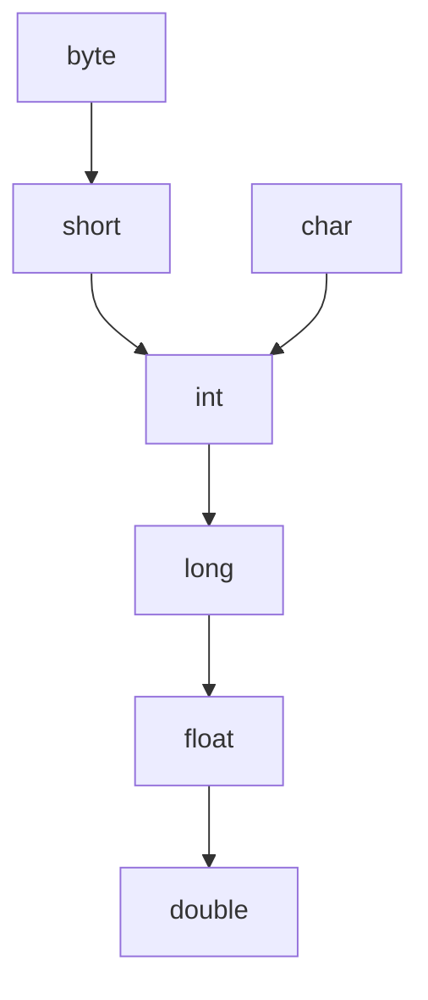

# 数据类型和运算符

## 数据类型

Java中的数据类型主要有以下两种：
- 基本数据类型：byte、short、int、long、float、double、char、boolean
- 引用数据类型：类、接口、数组（后续文档会详细介绍））

**简单记忆口诀：Java基本数据类型4类8种**

### 基本数据类型

#### 整数类型

| 类型 | 字节 | 取值范围 | 默认值 | 说明 |
|---|---|---|---|---|
| byte | 1 | -128 ~ 127 | 0 | 最小的整数类型，通常用于表示单个字节 |
| short | 2 | -32768 ~ 32767 | 0 | 用于表示较小的整数，如年龄 |
| int | 4 | -2147483648 ~ 2147483647 | 0 | 最常用的整数类型，用于表示大部分整数 |
| long | 8 | -9223372036854775808 ~ 9223372036854775807 | 0L | 用于表示较大整数，如人口数量 |

下面是整数类型的示例：

```java
public class Example01 {
    public static void main(String[] args) {
        // byte类型变量
        byte b = 100; // -128 ~ 127
        System.out.println(b);
        // short类型变量
        short s = 32767; // -32768 ~ 32767
        System.out.println(s);
        // int类型变量
        int i = 123456; // -2147483648 ~ 2147483647
        System.out.println(i);
        // long类型变量
        long l = 12345678910L; // -9223372036854775808 ~ 9223372036854775807
        System.out.println(l);
    }
}
```

#### 浮点类型

| 类型 | 字节 | 取值范围 | 默认值 | 说明 |
|---|---|---|---|---|
| float | 4 | -3.402823466E38 ~ 3.402823466E38 | 0.0f | 用于表示小数，通常用于表示浮点数 |
| double | 8 | -1.7976931348623157E308 ~ 1.7976931348623157E308 | 0.0 | 用于表示大数，通常用于表示浮点数 |

下面是浮点类型的示例：

```java
public class Example02 {
    public static void main(String[] args) {
        // float类型变量
        float f = 3.14159f; // -3.402823466E38 ~ 3.402823466E38
        System.out.println(f);
        // double类型变量
        double d = 3.14159; // -1.7976931348623157E308 ~ 1.7976931348623157E308
        System.out.println(d);
    }
}
```

#### 布尔类型

| 类型 | 字节 | 取值范围 | 默认值 | 说明 |
|---|---|---|---|---|
| boolean | 1 | true/false | false | 用于表示布尔值 |

下面是布尔类型的示例：

```java
public class Example03 {
    public static void main(String[] args) {
        // boolean类型变量
        boolean b = true;
        System.out.println(b);
    }
}
```

#### 字符类型

| 类型 | 字节 | 取值范围 | 默认值 | 说明 |
|---|---|---|---|---|
| char | 2 | 0 ~ 65535 | '\u0000' | 用于表示单个字符，通常用于表示文本 |

下面是字符类型的示例：

```java
public class Example04 {
    public static void main(String[] args) {
        // char类型变量
        char c = 'A'; // 0 ~ 65535
        System.out.println(c);
        System.out.println(c + 0); // 这样可以输出字符对应的ASCII码
    }
}
```

## 变量

什么是变量呢？变量其实就是计算机中的一小块内存，用于存储数据，在计算机程序运行的过程中，数据是可以改变的，这就是变量的意思。

以下是 Java 中的定义变量的方式：

::: code-group
```java [定义变量直接赋值]
public class Example05 {
    public static void main(String[] args) {
        // 定义变量直接赋值
        int i = 100;
        System.out.println("打印变量i的值:" + i);
    }
}
```

```java [先定义变量再赋值]
public class Example06 {
    public static void main(String[] args) {
        // 定义变量，再赋值
        int i;
        System.out.println("先定义变量");
        i = 100;
        System.out.println("打印变量i的值:" + i);
    }
}
```
:::

以下是变量的示例代码：

```java
public class Example07 {
    public static void main(String[] args) {
        // byte类型变量
        byte b = 127; // -128 ~ 127
        System.out.println(b);
        // short类型变量
        short s = 32767; // -32768 ~ 32767
        System.out.println(s);
        // int类型变量
        int i = 123456; // -2147483648 ~ 2147483647
        System.out.println(i);
        // long类型变量
        long l = 12345678910L; // -9223372036854775808 ~ 9223372036854775807
        System.out.println(l);

        // float类型变量
        float f = 3.14159f; // -3.402823466E38 ~ 3.402823466E38
        System.out.println(f);
        // double类型变量
        double d = 3.14159; // -1.7976931348623157E308 ~ 1.7976931348623157E308
        System.out.println(d);

        // boolean类型变量
        boolean b1 = true;
        System.out.println(b1);

        // char类型变量
        char c = 'A'; // 0 ~ 65535
        System.out.println(c);
        System.out.println(c + 0); // 这样可以输出字符对应的ASCII码
    }
}
```

## 常量

什么是常量呢？常量其实就是计算机中的一小块内存，用于存储数据，在计算机程序运行的过程中，数据是不可改变的，这就是常量的意思。

以下是 Java 中的定义常量的方式：

::: code-group
```java [定义常量直接赋值]
public class Example08 {
    public static void main(String[] args) {
        // 常量定义直接赋值的方式
        final int WEEK = 7;
        System.out.println("WEEK=" + WEEK);
    }
}
```

```java [先定义常量再赋值]
public class Example09 {
    public static void main(String[] args) {
        // 常量定义先定义再赋值的方式
        final int WEEK;
        System.out.println("先定义常量");
        WEEK = 7;
        System.out.println("WEEK=" + WEEK);
    }
}
```
:::

以下是常量的示例代码：

```java
public class Example10 {
    public static void main(String[] args) {
        // int类型常量
        final int MAX_VALUE = 100;
        // 双精度浮点类型常量
        final double PI = 3.14159;
        // 字符串类型常量
        final String GREETING = "Hello, world!";
        // 打印输出常量
        System.out.println("MAX_VALUE=" + MAX_VALUE);
        System.out.println("PI=" + PI);
        System.out.println("GREETING=" + GREETING);
    }
}
```

## 运算符

Java 中的运算符主要有以下几类：
- 算数运算符
- 位运算符
- 赋值运算符
- 关系运算符
- 逻辑运算符
- 条件运算符

### 算数运算符

表格中假设变量 `a` 的值为 10，变量 `b` 的值为 20。

| 运算符 | 描述 | 示例 |
|---|---|---|
| + | 加法 | `a + b` 等于 30 |
| - | 减法 | `a - b` 等于 -10 |
| * | 乘法 | `a * b` 等于 200 |
| / | 除法 | `b / a` 等于 2 |
| % | 取余（取模） | `b % a` 等于 0 |
| ++ | 前置自增<br>后置自增 | `++a`<br>`a++` |
| -- | 前置自减<br>后置自减 | `--a`<br>`a--` |

> 需要注意的是 `++` 和 `--` 的操作，要是 `++` 和 `--` 是独占一行，前置`++`【`--`】或者后置`++`【`--`】没有任何区别，也就是 `++x` 和 `x++` 是完成一样的。
>
> 在混合使用的时候，有重大区别，前置`++`【`--`】，那么会立即 `+1` 【`-1`】操作，然后拿着结果进行使用，先加【减】后用。
>
> 后置`++`【`--`】，那么首先使用原先的数据，然后在进行 `+1` 【`-1`】操作，先用后加【减】。

以下是算数运算符的示例代码：

::: code-group
```java [示例1]
public class Example11 {
    public static void main(String[] args) {
        // 定义三个变量
        int a, b, c;
        a = 10;
        b = 20;
        c = 3;
        // + ：加法运算
        System.out.println("a+b=" + (a + b)); // 30
        // - ：减法运算
        System.out.println("a-b=" + (a - b)); // -10
        // * ：乘法运算
        System.out.println("a*b=" + (a * b)); // 200
        // / ：除法运算
        System.out.println("b/a=" + (b / a)); // 2
        // %：取余运算
        System.out.println("a%c=" + (a % c)); // 1
    }
}
```

```java [示例2]
public class Example12 {
    public static void main(String[] args) {
        // 定义一个int类型变量
        int a = 10;
        a++; // 独占一行，前++和后++都是没有区别，执行到下一行都是进行加1操作，同理前--后后--也是一样
        ++a;
        System.out.println("a=" + a); // a=12

        // 混合操作时
        int b = 20;
        System.out.println(++b); // 和打印输出在一行，这是前++先加1，再使用，此时b=21【自减同理】
        System.out.println("b=" + b);

        int c = 21;
        System.out.println(c++); // 和打印输出在一行，这是后++先使用，再加1，此时c=21，执行到下一行时c=22【自减同理】
        System.out.println("c=" + c);
    }
}
```
:::

### 位运算符

表格中假设变量 `a` 的值为 1，变量 `b` 的值为 0，变量 `c` 的值为 20，变量 `d` 的值为 88。

| 运算符 | 描述 | 示例 |
|---|---|---|
| & | 按位与，只有当两个操作数的对应位都为 1 时，结果才为 1 | `a & b` 等于 0 |
| \| | 按位或，只有当两个操作数的对应位有一个为 1 时，结果才为 1 | `a \| b` 等于 1 |
| ^ | 按位异或，只有当两个操作数的对应位不同时，结果才为 1 | `a ^ b` 等于 1 |
| ~ | 按位取反，将操作数的每一位取反 | `~a` 等于 -2 |
| << | 左移，移动得到的空位以零填充 | `a << 4` 等于 16 |
| >> | 右移，移动得到的空位以零填充 | `c >> 2` 等于 5 |
| >>> | 无符号右移，移动得到的空位以零填充 | `d >>> 3` 等于 11 |

以下是位运算符的示例代码：

```java
public class Example13 {
    public static void main(String[] args) {
        // 定义两个变量
        int a = 10; // 00001010
        int b = 20; // 00010100
        // &：按位与
        // &：两个操作数的对应位都为 1 时，结果才为 1
        // a & b = 00001010 & 00010100 = 00000000 结果：0
        System.out.println("a&b=" + (a & b)); // 0
        // |：按位或
        // |：只有当两个操作数的对应位有一个为 1 时，结果才为 1
        // a | b = 00001010 | 00010100 = 00011110 结果：30
        System.out.println("a|b=" + (a | b)); // 30
        // ^：按位异或
        // ^：只有当两个操作数的对应位不同时，结果才为 1
        // a ^ b = 00001010 ^ 00010100 = 00011110 结果：30
        System.out.println("a^b=" + (a ^ b)); // 30
        // ~：按位取反
        // ~：将操作数的每一位取反
        // ~a = 00001010 ^ 11111111 = 11110101 结果：-11
        System.out.println("~a=" + (~a)); // -11
        // <<：左移
        // <<：移动得到的空位以零填充
        // a << 2 = 00001010 << 2 = 00101000 结果：40
        System.out.println("a<<2=" + (a << 2)); // 40
        // >>：右移
        // >>：移动得到的空位以零填充
        // a >> 2 = 00001010 >> 2 = 00000100 结果：2
        System.out.println("a>>2=" + (a >> 2)); // 2
        // >>>：无符号右移，移动得到的空位以零填充
        // a >>> 2 = 00001010 >>> 2 = 00000010 结果：2
        System.out.println("a>>>2=" + (a >>> 2)); // 2
    }
}
```

### 赋值运算符

| 运算符 | 描述 | 示例 |
|---|---|---|
| = | 赋值 | `a = 10` 将 10 赋值给变量 `a` |
| += | 加法赋值 | `a += 10` 等价于 `a = a + 10`，`a` 加 10 再赋值给变量 `a` |
| -= | 减法赋值 | `a -= 10` 等价于 `a = a - 10`，`a` 减 10 再赋值给变量 `a` |
| *= | 乘法赋值 | `a *= 10` 等价于 `a = a * 10`，`a` 乘 10 再赋值给变量 `a` |
| /= | 除法赋值 | `a /= 10` 等价于 `a = a / 10`，`a` 除 10 再赋值给变量 `a` |
| %= | 取余（取模）赋值 | `a %= 10` 等价于 `a = a % 10`，`a` 取余 10 再赋值给变量 `a` |
| <<= | 左移运算符 | `a <<= 2` 等价于 `a = a << 2`，`a` 左移 2 位再赋值给变量 `a` |
| >>= | 右移运算符 | `a >>= 2` 等价于 `a = a >> 2`，`a` 右移 2 位再赋值给变量 `a` |
| >>>= | 无符号右移运算符 | `a >>>= 2` 等价于 `a = a >>> 2`，`a` 无符号右移 2 位再赋值给变量 `a` |
| &= | 位与赋值 | `a &= 10` 等价于 `a = a & 10`，`a` 与 10 进行位与运算 |
| ^= | 位异或赋值 | `a ^= 10` 等价于 `a = a ^ 10`，`a` 与 10 进行位异或运算 |
| \|= | 位或赋值 | `a \|= 10` 等价于 `a = a \| 10`，`a` 与 10 进行位或运算 |

以下是赋值运算符的示例：

```java [示例1]
public class Example14 {
    public static void main(String[] args) {
        int a = 10;
        int b = 20;
        a += b; // 等价于 a = a + b
        System.out.println("a=" + a); // a=30

        a -= b; // 等价于 a = a - b
        System.out.println("a=" + a); // a=10

        a *= b; // 等价于 a = a * b
        System.out.println("a=" + a); // a=200

        a /= b; // 等价于 a = a / b
        System.out.println("a=" + a); // a=5

        a %= b; // 等价于 a = a % b
        System.out.println("a=" + a); // a=5

        a <<= 2; // 等价于 a = a << 2
        System.out.println("a=" + a); // a=20

        a >>= 2; // 等价于 a = a >> 2
        System.out.println("a=" + a); // a=5

        a >>>= 2; // 等价于 a = a >>> 2
        System.out.println("a=" + a); // a=1

        a &= 10; // 等价于 a = a & 10
        System.out.println("a=" + a); // a=0

        a ^= 10; // 等价于 a = a ^ 10
        System.out.println("a=" + a); // a=10

        a |= 10; // 等价于 a = a | 10
        System.out.println("a=" + a); // a=10
    }
}
```

### 关系运算符

| 运算符 | 描述 | 示例 |
|---|---|---|
| == | 等于 | `a == b` 等于 `b` |
| != | 不等于 | `a != b` 不等于 `b` |
| > | 大于 | `a > b` 大于 `b` |
| < | 小于 | `a < b` 小于 `b` |
| >= | 大于等于 | `a >= b` 大于等于 `b` |
| <= | 小于等于 | `a <= b` 小于等于 `b` |

关系运算符的结果为 `true` 或 `false`。

以下是关系运算符的示例：

```java
public class Example15 {
    public static void main(String[] args) {
        int a = 10;
        int b = 20;
        System.out.println("a==b:" + (a == b)); // a==b:false
        System.out.println("a!=b:" + (a != b)); // a!=b:true
        System.out.println("a>b:" + (a > b)); // a>b:false
        System.out.println("a<b:" + (a < b)); // a<b:true
        System.out.println("a>=b:" + (a >= b)); // a>=b:false
        System.out.println("a<=b:" + (a <= b)); // a<=b:true
    }
}
```

### 逻辑运算符

| 运算符 | 描述 | 示例 |
|---|---|---|
| && | 逻辑与 | `a && b` 如果 `a` 为 `false`，则 `b` 不会被计算 |
| || | 逻辑或 | `a || b` 如果 `a` 为 `true`，则 `b` 不会被计算 |
| ! | 逻辑非 | `!a` 如果 `a` 为 `true`，则 `!a` 为 `false` |

逻辑运算符的结果为 `true` 或 `false`。

以下是逻辑运算符的示例：

::: code-group
```java [示例1]
public class Example16 {
    public static void main(String[] args) {
        boolean a = true;
        boolean b = false;
        System.out.println("a&&b:" + (a && b)); // a&&b:false
        System.out.println("a||b:" + (a || b)); // a||b:true
        System.out.println("!a:" + (!a)); // !a:false
    }
}
```

```java [示例2]
public class Example17 {
    public static void main(String[] args) {
        // 逻辑与&&：只有当两个操作数都为true时，结果才为true。
        int a = 10;
        int b = 20;
        boolean result1 = (a > 5) && (b < 30); // result1为true
        System.out.println(result1);

        // 逻辑或||：只要有一个操作数为true，结果就为true。
        int x = 5;
        int y = 3;
        boolean result2 = (x == y) || (y < 10); // result2为true
        System.out.println(result2);

        // 逻辑非!：将操作数的真假取反。
        boolean isSunny = true;
        boolean result3 = !isSunny; // result3为false
        System.out.println(result3);
    }
}
```
:::

### 条件运算符

| 运算符 | 描述 | 示例 |
|---|---|---|
| ?: | 条件运算符 | `a ? b : c` 如果 `a` 为 `true`，则返回 `b`，否则返回 `c` |

条件运算符的格式为 `条件 ? 表达式1 : 表达式2`，如果条件为 `true`，则返回表达式1，否则返回表达式2。

以下是条件运算符的示例：

```java
public class Example18 {
    public static void main(String[] args) {
        int a = 10;
        int b = 20;
        int result = a > b ? a : b;
        System.out.println("result=" + result); // result=20
    }
}
```

## 数据类型转换

在 Java 语言中，数据类型转换是必不可少的，原因有很多，主要可以归纳为以下几点：

1. 运算的需要：

Java 是一种强类型语言，这意味着在进行算术运算、比较运算等操作时，要求操作数的数据类型必须一致。如果操作数类型不一致，就需要进行类型转换，将其转换为相同类型后再进行运算。
例如，一个 int 类型变量和一个 double 类型变量相加，Java 会自动将 int 类型转换为 double 类型，然后再进行加法运算，结果也是 double 类型。

2. 赋值的需要：

当要把一个值赋给一个变量时，如果值的类型与变量的类型不兼容，就需要进行类型转换。
例如，要把一个 long 类型的值赋给一个 int 类型变量，如果 long 类型的值在 int 类型的取值范围内，可以进行强制类型转换，否则会丢失精度或导致错误。

3. 数据表示范围的需要：

不同的数据类型有不同的取值范围。在某些情况下，需要使用更大范围的数据类型来存储数据，或者需要将数据转换为更小范围的类型以节省内存空间。
例如，如果一个数值可能会超出 int 类型的最大值，就需要使用 long 类型来存储，这时就需要进行类型转换。

4. 与其他系统或数据交互的需要：

在与数据库、网络等其他系统或数据进行交互时，数据的类型可能与 Java 的数据类型不完全一致，需要进行类型转换才能正确处理数据。

Java 中的数据类型转换分为两种：

自动类型转换（隐式转换）： 当将一个取值范围小的类型赋给取值范围大的类型时，Java 会自动进行类型转换，无需显式声明。**基本数据类型**的自动类型转换如下图所示：



自动类型转换（隐式转换）语法格式：

```java
大范围的数据类型声明 = 小范围的数据类型的数据;
```

以下是自动类型转换的示例：

```java
public class Example19 {
    public static void main(String[] args) {
        // 定义一个byte类型
        // 这个数值 10 默认是int类型，是这里并不需要显式的强制类型转换
        // 因为Java编译器会在编译时判断这个整数字面量（10）是否在byte类型的范围内（-128 到 127）
        byte b = 10;
        System.out.println(b);
        // 小范围到大范围的自动转换
        long l = 100; // int -> long
        System.out.println("int自动转成long类型:" + l);

        // char类型的自动转换
        char c = 'A';
        int charToInt = c; // char -> int
        System.out.println("字符'A'的ASCII值: " + charToInt);

        // 混合类型运算时的自动转换
        int num1 = 10;
        double num2 = 22.5;
        double res1 = num1 + num2; // 这里会将 num1 的数据类型提升为double类型再进行运算，也就是10.0 + 22.5
        System.out.println(res1);

        // 表达式中的自动类型提升
        byte b1 = 10;
        byte b2 = 20;
        // byte b3 = b1 + b2; // 对于 byte、short、char 这些小于 int 的基本数据类型，在进行算术运算时会自动提升为 int 类型
        int res2 = b1 + b2;
        System.out.println("两个byte相加: " + res2);
    }
}
```

强制类型转换（显式转换）： 当将一个取值范围大的类型赋给取值范围小的类型时，需要进行强制类型转换，需要使用强制类型转换运算符 ()。例如：double -> int，long -> int。需要注意的是，强制类型转换可能会导致数据丢失或精度损失。

强制类型转换（显式转换）语法格式：

```java
大范围的数据类型声明 = (大范围的数据类型) 小范围的数据类型的数据;
```

以下是强制类型转换的示例：

```java
public class Example20 {
    public static void main(String[] args) {
        int i1 = 130;
        byte b = (byte) i1; // 将 int 强制转换为 byte，结果 b 的值为 -126（发生了溢出）
        System.out.println(b);

        double d = 3.14159;
        int num = (int) d; // 将 double 强制转换为 int，结果 num 的值为 3（小数部分被截断）
        System.out.println(num);

        long l = 1234567890123L; // 注意 long 类型字面量需要加 L 或 l 后缀
        int i2 = (int) l;      // 将 long 强制转换为 int，可能导致数据丢失
        System.out.println(i2);
    }
}
```

## 参考资料

- [菜鸟教程](https://www.runoob.com/)