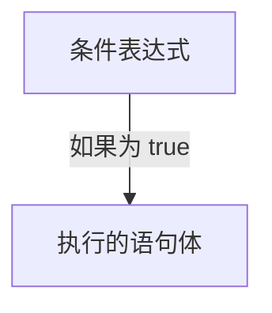
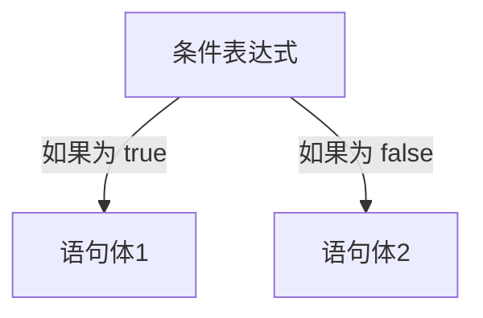
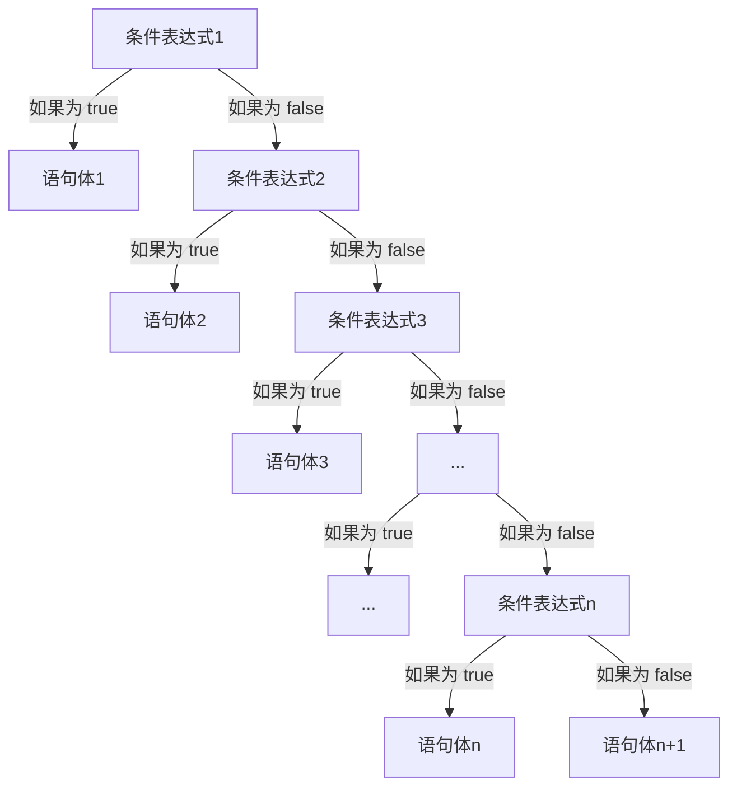
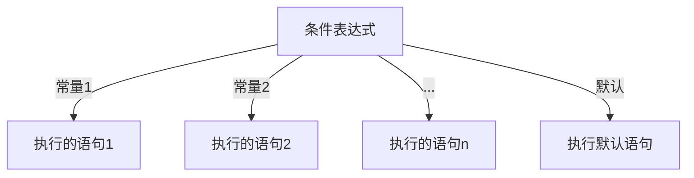

# 流程控制与数组

## 流程控制

什么是流程控制？在 Java 流程控制是指控制程序执行顺序的机制。它包顺序结构、选择【分支】结构、循环结构等。通过这些控制结构，程序可以根据不同的条件执行不同的代码块，从而实现复杂的逻辑和功能。

### 顺序结构

顺序结构指的是程序按照一定顺序执行的结构。Java程序的执行顺序是从上到下、语句从左向右执行、赋值从右向左。

以下是顺序结构的示例：

```java
public class Example01 {
    public static void main(String[] args) {
        // 代码执行顺序是从上到下，语句从左向右执行，赋值从右向左
        // 顺序结构
        int a = 1; // 定义变量a并赋值为1
        int b = 2; // 定义变量b并赋值为2
        int c = a + b; // 定义变量c并计算a+b
        System.out.println(c); // 打印变量c的值
    }
}
```

### 分支结构

#### if语句

`if` 语句的语法格式为：

```java
if (条件表达式) {
    // 如果条件表达式为true，执行的语句
}
```

`if` 语句执行流程图如下所示：



执行流程：
- 首先判断条件表达式的结果是 `true` 还是 `false`。
- 如果为 `true` 就执行 if 语句块中的语句。
- 如果为 `false` 就不执行 if 语句块中的语句，直接执行下一个语句，也就是 `if 大括号 {}` 后面的语句。

以下是 `if` 语句的示例：

```java
public class Example02 {
    public static void main(String[] args) {
        // if语句
        System.out.println("程序开始执行");
        // 定义一个变量
        int a = 5;
        if (a > 10) { // 条件不满足，不执行if代码块里的语句
            System.out.println("当变量a大于10执行，if代码块里的语句");
            System.out.println("你好, Java");
        }
        a *= 4; // 执行到这里变量a经过乘法运算就大于10了
        if (a > 10) { // 条件满足，执行if代码块里的语句
            System.out.println("当变量a大于10执行，if代码块里的语句");
            System.out.println("你好, Java");
        }
        System.out.println("程序执行完毕");
    }
}
```

`if-else` 语句的语法格式为：

```java
if (条件表达式) {
    // 如果条件表达式为true，执行的语句（语句体1）
} else {
    // 如果条件表达式为false，执行的语句（语句体2）
}
```

`if-else` 语句执行流程图如下所示：



执行流程：
- 首先判断条件表达式的结果是 `true` 还是 `false`。
- 如果为 `true` 就执行 if 语句块中的语句体1。
- 如果为 `false` 就执行 `else` 语句块中的语句体2。

以下是 `if-else` 语句的示例：

```java
public class Example03 {
    public static void main(String[] args) {
        System.out.println("程序开始执行");
        // 判断成绩是否及格
        double score = 59.5;
        if (score >= 60) {
            System.out.println("恭喜你，你的成绩及格");
        } else {
            System.out.println("很遗憾，你的成绩不及格");
        }
        System.out.println("程序执行完毕");
    }
}
```

`if-else-if-else` 语句的语法格式为：

```java
if (条件表达式1) {
    // 如果条件表达式1为true，执行的语句（语句体1）
} else if (条件表达式2) {
    // 如果条件表达式2为true，执行的语句（语句体2）
}
...
} else if (条件表达式n) {
    // 如果条件表达式n为true，执行的语句（语句体n）
} else {
    // 如果所有条件表达式都为false，执行的语句（语句体n+1）
}
```

`if-else-if-else`语句执行流程图如下所示：



执行流程：
- 首先判断条件表达式的结果是 `true` 还是 `false`。
- 如果为 `true` 就执行 if 语句块中的语句体1。
- 如果为 `false` 就继续判断下一个条件表达式的结果为 `true` 还是 `false`。
- 如果为 true 就执行 if 语句块中的语句体2。
- 如果为 `false` 就继续判断下一个条件表达式的结果为 `true` 还是 `false`。
- 如果为 `true` 就执行 if 语句块中的语句体3。
- ...以上的步骤以此类推。
- 如果没有匹配的条件表达式，就执行 `else` 语句块中的语句体n+1。

以下是 `if-else-if-else` 语句的示例：

```java
public class Example04 {
    public static void main(String[] args) {
        System.out.println("程序开始执行");
        // if-else-if-else语句
        int a = 10;
        if (a > 5) {
            System.out.println("a大于5");
        } else if (a == 5) {
            System.out.println("a等于5");
        } else {
            System.out.println("a小于5");
        }
        System.out.println("程序执行完毕");
    }
}
```

#### switch语句

`switch` 语句的语法格式为：

```java
// 条件表达式支持的数据类型有：基本类型、包装类型、字符串、枚举类型
switch (条件表达式) {
    case 常量1:
        // 如果表达式的值为常量1，执行的语句
        break;
    case 常量2:
        // 如果表达式的值为常量2，执行的语句
        break;
    ...
    case 常量n:
        // 如果表达式的值为常量n，执行的语句
        break;
    default:
        // 如果表达式的值不是上述的任何常量，执行的语句
}
```

`switch` 语句执行流程图如下所示：



执行流程：
- 首先计算条件表达式的值。
- 根据表达式的值，检查各个 `case` 常量。
  - 如果值匹配常量1，则执行相应的语句，然后 `break` 退出 `switch` 语句。
  - 如果值匹配常量2，则执行相应的语句，然后 `break` 退出 `switch` 语句。
  - 依此类推，直到常量n。
- 如果表达式的值与任何常量都不匹配，则执行 `default` 语句。

以下是 `switch` 语句的示例：

```java
public class Example05 {
    public static void main(String[] args) {
        // 根据数值判断是星期几
        int day = 3;
        switch (day) {
            case 1:
                System.out.println("星期一");
                break;
            case 2:
                System.out.println("星期二");
                break;
            case 3:
                System.out.println("星期三");
                break;
            case 4:
                System.out.println("星期四");
                break;
            case 5:
                System.out.println("星期五");
                break;
            case 6:
                System.out.println("星期六");
                break;
            case 7:
                System.out.println("星期日");
                break;
            default:
                System.out.println("输入错误");
        }
    }
}
```

在 Java 的 `switch` 语句中，如果一个 `case` 标签没有被 `break` 语句终止，那么程序会继续执行下一个 `case` 标签的语句，直到遇到 `break` 语句或 `switch` 语句的末尾。这种现象被称为 `case` 穿透。

以下是 `case` 穿透的示例：

```java
public class Example06 {
    public static void main(String[] args) {
        // 根据数值判断是星期几
        int day = 3;
        switch (day) {
            case 1:
                System.out.println("星期一");
            case 2:
                System.out.println("星期二");
            case 3:
                System.out.println("星期三");
            case 4:
                System.out.println("星期四");
            case 5:
                System.out.println("星期五");
            case 6:
                System.out.println("星期六");
            case 7:
                System.out.println("星期日");
            default:
                System.out.println("输入错误");
        }
    }
}
```

运行结果：

```log
星期三
星期四
星期五
星期六
星期日
输入错误
```

### 循环结构

在 Java 中循环结构的语法有三种，分别是 `for`、`while` 和 `do-while`。

#### while 循环

`while` 语句的语法格式为：

```java
// 执行顺序：条件表达式判断 -> 循环体语句
// 条件表达式的结果只有 true 和 false
// 结束循环的条件是：条件表达式为 false
while (条件表达式) {
    // 循环体语句
}
```

以下是 `while` 语句的示例：

```java
public class Example07 {
    public static void main(String[] args) {
        // 这是一个计数器，当 count 大于等于 10 时，退出循环
        int count = 0;
        while (count <= 10) {
            System.out.println("Count is: " + count);
            count++;
        }
    }
}
```

#### do-while 循环

`do-while` 语句的语法格式为：

```java
// 执行顺序：循环体语句 -> 条件表达式判断
// 条件表达式的结果只有 true 和 false
// 结束循环的条件是：条件表达式为 false
do {
    // 循环体语句
} while (条件表达式);
```

以下是 `do-while` 语句的示例：

::: code-group
```java [示例1]
public class Example08 {
    public static void main(String[] args) {
        System.out.println("程序开始执行");
        // 这是一个计数器，当 count 大于等于 10 时，退出循环
        int count = 5;
        do {
            System.out.println("Count is: " + (count++)); // 这里自增操作有和打印操作一起，后++ 先使用原来的数值，再加1操作
        } while (count <= 10);
        System.out.println("程序执行结束");
    }
}
```

```java [示例2]
public class Example09 {
    public static void main(String[] args) {
        System.out.println("程序开始执行");
        // do-while语句当条件不满足时，至少执行一次
        int flag = 0;
        do {
            System.out.println("这是循环体...");
        } while (flag > 1);
        System.out.println("程序执行结束");
    }
}
```
:::

#### for 循环

```java
// 执行顺序：初始化表达式 -> 条件表达式判断 -> 循环体语句 -> 更新表达式
for (初始化表达式; 条件表达式; 更新表达式) {
    // 循环体语句
}
```

for循环执行过程是：
- 初始化表达式
  - 在循环开始前，执行一次初始化语句。
  - 通常用来定义循环变量并赋予初始值。
  - 这个变量会在每次循环迭代后被更新。
- 条件表达式判断
  - 在每次循环开始前，都会判断条件表达式是否为 `true`。
  - 如果为 `true`，则执行循环体；否则，退出循环。
- 循环体语句
  - 如果条件判断为 `true`，则执行循环体中的代码。
  - 循环体中的代码会重复执行，直到条件判断为 `false`。
- 更新表达式
  - 在执行完循环体后，执行更新表达式。
  - 通常用来更新循环变量的值，为下一次循环做准备。
- 重复
  - 循环从步骤2开始重复，直到条件判断为 `false`。

以下是 `for` 语句的示例：

```java
public class Example10 {
    public static void main(String[] args) {
        // 打印 10 次 "Hello, World!"
        for (int i = 1; i <= 10; i++) {
            System.out.println("Hello, World!");
        }
    }
}
```

嵌套 `for` 循环语法格式：

```java
// 执行顺序：
for (初始化表达式1; 条件表达式1; 更新表达式1) {
    for (初始化表达式2; 条件表达式2; 更新表达式2) {
        // 循环体语句
    }
}
```

嵌套 `for` 循环执行过程：
- 外层循环开始，执行初始化表达式1。
- 判断外层循环的条件表达式1，若为 `true`，则进入内层循环。
- 内层循环开始，执行初始化表达式2。
- 判断内层循环的条件表达式2，若为 `true`，则执行嵌套循环体。
- 执行内层循环的更新表达式2。
- 返回步骤4，继续判断内层循环的条件表达式2。
- 当内层循环的条件表达式2为 `false` 时，退出内层循环。
- 执行外层循环的更新表达式1。
- 返回步骤2，继续判断外层循环的条件表达式1。
- 当外层循环的条件表达式1为 `false` 时，退出整个嵌套循环。

以下是嵌套 `for` 循环的示例：

```java
public class Example11 {
    public static void main(String[] args) {
        for (int i = 1; i <= 9; i++) {
            for (int j = 1; j <= i; j++) {
                System.out.print(i + "*" + j + "=" + i * j + "\t");
            }
            System.out.println();
        }
    }
}
```

### break关键字

`break` 关键字 是Java中用于终止循环或 `switch` 语句的一种控制流语句。当程序执行到 `break `语句时，会立即跳出当前的循环或 `switch` 语句，并继续执行紧随其后的语句。

以下是 `break` 关键字的示例：

::: code-group
```java [示例1]
public class Example12 {
    public static void main(String[] args) {
        // break关键字在switch语句中使用
        int day = 3;
        switch (day) {
            case 1:
                System.out.println("One");
                break;
            case 2:
                System.out.println("Two");
                break;
            case 3:
                System.out.println("Three");
            default:
                System.out.println("Zero");
        }
    }
}
```


```java [示例2]
public class Example13 {
    public static void main(String[] args) {
        // break跳出单层循环
        for (int i = 1; i <= 10; i++) {
            if (i == 5) {
                break;
            }
            System.out.println(i);
        }
        System.out.println("=====");
        // 跳出多层循环（使用标签）
        outerloop:
        for (int i = 1; i <= 3; i++) {
            for (int j = 1; j <= 3; j++) {
                if (i == 2 && j == 2) {
                    break outerloop; // 跳出所有循环，包括外层和内层
                }
                System.out.print(i * j + " ");
            }
            System.out.println();
        }
    }
}
```

```java [示例3]
public class Example14 {
    public static void main(String[] args) {
        // while循环示例
        int i = 1;
        while (i <= 10) {
            System.out.println(i);
            if (i == 5) {
                break;
            }
            i++;
        }
    }
}
```

```java [示例4]
public class Example15 {
    public static void main(String[] args) {
        // do-while循环示例
        int j = 1;
        do {
            System.out.println(j);
            j++;
        } while (j <= 5 && j != 3); // 当j为3时，break跳出循环
    }
}
```
:::

### continue关键字

`continue` 关键字是 Java 中用于跳过当前循环的一种控制流语句。当程序执行到 `continue` 语句时，跳过当前循环的剩余部分，直接进入下一次循环。

以下是 `continue`关键字的示例：

```java
public class Example16 {
    public static void main(String[] args) {
        // 打印输出10以内的奇数
        for (int i = 1; i <= 10; i++) {
            // 跳过偶数
            if (i % 2 == 0) {
                continue;
            }
            System.out.println(i); // 输出奇数
        }
    }
}
```

### outerloop标签

在 Java 中 outerloop 标签是一种机制，用于在嵌套循环中更方便地控制循环的跳出和继续。它本质上是一个标识符，可以放在一个循环语句之前，然后在内部循环中使用带有标签的 `break` 语句来跳出该标签所标识的循环，或使用带有标签的 `continue` 语句来跳到该标签所标识的循环的下一次迭代。

`outerloop` 标签的语法格式为：

::: code-group
```java [break label]
标签名称:
    for (初始化表达式; 条件表达式; 更新表达式) {
        // 循环体语句
        for (初始化表达式; 条件表达式; 更新表达式) {
            // 在多层循环中当满足条件时使用 break outerloop 标签
            // 可以直接跳出内、外层循环
            if(某个条件) {
                break outerloop;
            }
        }
    }
```

```java [continue label]
标签名称:
    for (初始化表达式; 条件表达式; 更新表达式) {
        // 循环体语句
        for (初始化表达式; 条件表达式; 更新表达式) {
            // 在多层循环中当满足条件时使用 continue outerloop 标签，会跳过内层循环剩余迭代和外层循环剩余代码，直接进入外层循环的下一次迭代
            if(某个条件) {
                continue outerloop;
            }
        }
    }
```
:::

以下是 `outerloop` 标签的示例：

::: code-group
```java [示例1]
public class Example18 {
    public static void main(String[] args) {
        outerLoop:
        for (int i = 0; i < 3; i++) {
            for (int j = 0; j < 3; j++) {
                if (i == 1 && j == 1) {
                    break outerLoop; // 跳出外部循环
                }
                // 打印变量i和变量j的值
                System.out.println("i: " + i + ", j: " + j);
            }
        }
    }
}
```

```java [示例2]
public class Example19 {
    public static void main(String[] args) {
        outerLoop:
        for (int i = 0; i < 3; i++) {
            for (int j = 0; j < 3; j++) {
                if (i == 1 && j == 1) {
                    continue outerLoop; // 跳过外部循环的当前迭代
                }
                // 打印变量i和变量j的值
                System.out.println("i: " + i + ", j: " + j);
            }
        }
    }
}
```
:::

运行结果：

::: code-group
```txt [示例1]
i: 0, j: 0
i: 0, j: 1
i: 0, j: 2
i: 1, j: 0
```

```txt [示例2]
i: 0, j: 0
i: 0, j: 1
i: 0, j: 2
i: 1, j: 0
i: 2, j: 0
i: 2, j: 1
i: 2, j: 2
```
:::

## 数组

数组是一种数据结构，用于存储同一类型数据的有序集合。它提供了一种高效的方式来管理大量相同类型的数据，可以数组理解为一个固定长度的容器，用于存储一组相同的数据类型的容器。

数组的特点：
- 固定长度：一旦创建数组，其长度就是固定的，不能动态改变。
- 元素类型相同：数组中的所有元素必须是同一类型。
- 索引：每个元素都有一个唯一的索引，从0开始。通过索引可以访问和修改数组元素。
- 存储方式：数组在内存中是一块连续的存储空间，元素按顺序存储。
- 元素默认值：数组中的元素默认值取决于元素类型的默认值，例如整数类型的默认值为0，浮点类型的默认值为0.0，字符类型的默认值为'\0'，布尔类型的默认值为false。

### 创建数组

数组的定义语法格式如下：

::: code-group
```java [方式1]
数据类型[] 数组名;
数组名 = new 数据类型[数组长度];
```

```java [方式2]
数据类型[] 数组名 = new 数据类型[数组长度];
```

```java [方式3]
数据类型[] 数组名 = {元素1, 元素2, ..., 元素n};
```

```java [方式4]
数据类型[] 数组名 = new 数据类型[]{元素1, 元素2, ..., 元素n};
```
:::

以下是创建数组的示例：

```java
public class Example20 {
    public static void main(String[] args) {
        // 长度为10的int类型的数组
        int[] intArray;
        intArray = new int[10];
        System.out.println(intArray);
        // 长度为2的布尔类型的数组
        boolean[] flagArray = new boolean[2];
        System.out.println(flagArray);
        // 创建一个长度为3的int类型数组，初始值为100,200,300
        int[] int2Array = {100, 200, 300};
        System.out.println(int2Array);
        // 创建长度为5的int类型的数组，初始值为1,2,3,4,5
        int[] int3Array = new int[]{1, 2, 3, 4, 5};
        System.out.println(int3Array);
    }
}
```

### 数组基本操作

数组是通过数组下标来访问元素的，下标是从0开始的。

下面是添加元素的示例：

```java
public class Example21 {
    public static void main(String[] args) {
        // 定义一个char类型的数组
        char[] chars = new char[5];
        // 通过数据名[下标]的方式给数组添加数据
        chars[0] = 'H';
        chars[1] = 'E';
        chars[2] = 'L';
        chars[3] = 'L';
        chars[4] = 'O';
        // 通过数据名[下标]的方式来访问数组中的元素
        System.out.println("chars[0]索引下存储的元素是:" + chars[0]);
        System.out.println("chars[4]索引下存储的元素是:" + chars[4]);
        // 替换原来存储的元素
        chars[0] = 'h';
        // 访问不存在的下标会出现ArrayIndexOutOfBoundsException 数组索引越界异常
        // System.out.println(chars[6]);
        System.out.println("chars[0]索引下存储的元素是:" + chars[0]);
    }
}
```

可以通过 `数组名.length` 来获取数组的长度。

下面是获取数组长度的示例：

```java
public class Example22 {
    public static void main(String[] args) {
        // 创建一个长度为10的int类型数组
        int[] nums = new int[10];
        // 获取数组的长度
        System.out.println(nums.length);
    }
}
```

接下来就是数组的遍历了，可以通过循环语句来遍历数组，下面是一个简单的示例：

::: code-group
```java [示例1]
public class Example23 {
    public static void main(String[] args) {
        // 定义一个字符类型的数组
        char[] chars = new char[11];
        // 通过数据名[下标]的方式给数组添加数据
        chars[0] = 'H';
        chars[1] = 'E';
        chars[2] = 'L';
        chars[3] = 'L';
        chars[4] = 'O';
        chars[5] = ',';
        chars[6] = ',';
        chars[7] = 'J';
        chars[8] = 'A';
        chars[9] = 'V';
        chars[10] = 'A';
        // 通过循环遍历数组
        int index = 0; // 从索引0开始
        while (chars.length > index) { // 满足的条件是当数组的长度大于index
            System.out.println("chars[" + index + "]的元素是:" + chars[index]);
            index++; // 索引自增
        }
    }
}
```

```java [示例2]
public class Example24 {
    public static void main(String[] args) {
        // 定义一个字符类型的数组
        char[] chars = new char[11];
        // 通过数据名[下标]的方式给数组添加数据
        chars[0] = 'H';
        chars[1] = 'E';
        chars[2] = 'L';
        chars[3] = 'L';
        chars[4] = 'O';
        chars[5] = ',';
        chars[6] = ',';
        chars[7] = 'J';
        chars[8] = 'A';
        chars[9] = 'V';
        chars[10] = 'A';
        // 通过循环遍历数组
        for (int i = 0; i < chars.length; i++) {
            System.out.println("chars[" + i + "]的元素是:" + chars[i]);
        }
    }
}
```
:::

### 数组内存原理图

示例定义一个长度为3的int类型的数组：

```java
public class Example25 {
    public static void main(String[] args) {
        // 长度为3的int类型的数组
        int[] ints = new int[3];
        System.out.println(ints); // [I@a09ee92
    }
}
```

以上示例代码执行，输出结果为：`[I@a09ee92`，这是个什么呢？这是数组在内存中的地址，这个地址由Java虚拟机来分配，`new` 关键字创建出来的东西，都是引用数据类型，以下就是案例的内存原理图：


### 数组操作常见的异常

在访问数组不存在的下标的时候，会抛出数组越界异常 `ArrayIndexOutOfBoundsException` ，下面是一个简单的示例：

```java
public class Example26 {
    public static void main(String[] args) {
        // 创建一个长度为3的int类型的数组
        int[] arr1 = new int[3];
        // 给数组添加元素
        arr1[0] = 11;
        arr1[1] = 22;
        arr1[2] = 33;
        // 遍历数组的元素
        for (int i = 0; i < arr1.length; i++) {
            System.out.println("arr[" + i + "]的值是:" + arr1[i]);
        }
        // 获取数组第一个元素：下标索引为0
        System.out.println("arr1数组第一个元素的值是:" + arr1[0]);
        // 获取数组最后一个元素：下标索引为数组的长度 - 1
        System.out.println("arr1数组的最后一个元素的值是:" + arr1[arr1.length - 1]);
        // 获取不存在的下标索引值
        System.out.println("访问arr[5]的值:" + arr1[5]);
    }
}
```

运行结果如下：


数组是引用数据类型，在指向堆内存的地址不存在时，会出现空指针异常 `NullPointerException`，下面是一个简单的示例：

```java
public class Example27 {
    public static void main(String[] args) {
        // 创建一个长度为3的int类型的数组
        int[] arr1 = {100, 200, 400};
        System.out.println(arr1[1]);
        // 将arr1赋值为null
        arr1 = null;
        // 由于arr1赋值null，这就意味着指向堆内存的地址是为null就是什么都没有
        System.out.println(arr1[1]); // arr1[1]获取元素也就是 NullPointerException
    }
}
```

运行结果如下：


## 多维数组

多维数组可以理解为数组的数组。就像二维数组就是一个包含一维数组的数组，三维数组就是包含二维数组的数组，以此类推。多维数组在表示表格、矩阵等数据结构时非常有用。

创建多维数组的语法格式如下：

::: code-group
```java [声明]
数据类型[][] 数组名;  // 二维数组
数据类型[][][] 数组名; // 三维数组
```

```java [静态初始化]
int[][] array = {{1, 2, 3}, {4, 5, 6}};
```

```java [动态初始化]
int[][] array = new int[2][3]; // 创建一个2行3列的二维数组
```
:::

怎么去理解 Java 多维数组，举个栗子：`int[][] array = new int[2][3]` 这里有两个 `[][]` 说明这个是一个二维数组，然后 `int[2][3]` 说明这个二维数组有两行，每行有三个元素。可以将其想象为一个Excel表格这个表格有两行，每行有三个单元格，每个单元格里面都是一个int类型的数据，那么这个二维数组就是一个Excel表格，要是多维，那么它有很多行和很多列，每个单元格里都有一个值。多维数组就像是一个数字表格，我们可以用它来存储和组织大量的数据。

以下是多维数组的示例：

```java
public class Example28 {
    public static void main(String[] args) {
        // int[2][3] 是一个二维数组，有两个一维数组，每个一维数组有三个元素
        int[][] ints = new int[2][3];
        ints[0][0] = 1;
        ints[0][1] = 2;
        ints[0][2] = 3;
        ints[1][0] = 4;
        ints[1][1] = 5;
        ints[1][2] = 6;
        
        // 遍历二维数组
        for (int i = 0; i < ints.length; i++) {
            for (int j = 0; j < ints[i].length; j++) {
                System.out.print(ints[i][j] + " ");
            }
            System.out.println();
        }
    }
}
```

## 参考资料

- [Java 语言参考手册](https://docs.oracle.com/javase/8/docs/api/index.html)
- [菜鸟教程](https://www.runoob.com)